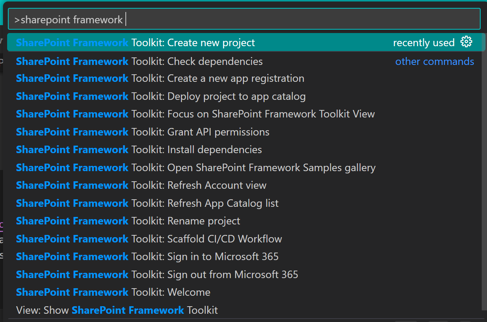
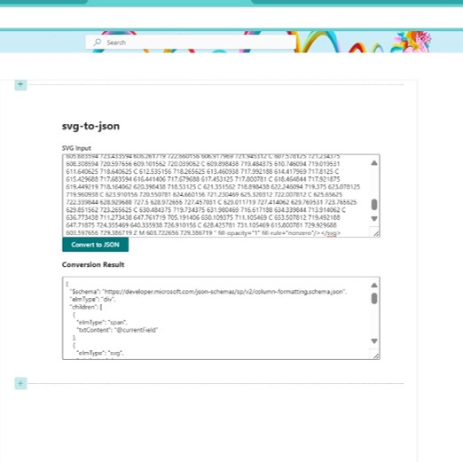
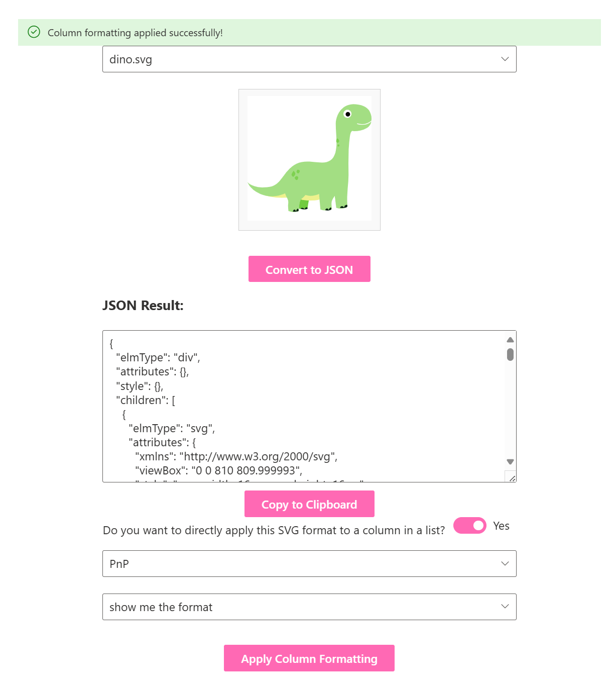
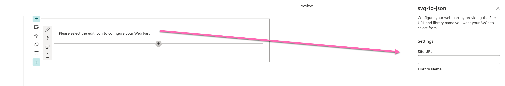

I’ll walk you through how I transformed my standalone [JavaScript web tool](https://www.m365princess.com/blogs/svg-to-json/) into a SharePoint Web Part using [SharePoint Framework (SPFx) Toolkit](https://github.com/pnp/vscode-viva). My original web tool was pretty straightforward. It allowed users to paste in SVG code, click a **Convert and copy to clipboard** button, and get JSON output formatted for use in SharePoint list column formatting. But it was standalone - it wasn’t integrated into SharePoint itself, which meant users still had to copy the output manually and paste it into SharePoint.

> Why not create a SharePoint Web Part that does all of this automatically and integrates with SharePoint’s own UI?

💡 This blog post is part of a series:

* 📌 you are here: [Building my first SharePoint Web Part with SPFx Toolkit- From Web App to Web Part](https://m365princess.com/blog/spfx-1)
* Improving the Web Part with PnP.js - *to be published soon*
* Making a Web Part ready for the Sample Solution Gallery - *to be published soon*

## Setting Up SharePoint Framework Toolkit

I chose the **SharePoint Framework Toolkit**, which is a modern approach to setting up SPFx projects. With the toolkit, everything is more streamlined - it eases a lot of tasks ands it was an easy way for me to get used to SPFx development:

- No need to take care of any npm packages/dependencies (other than setting the right node version - I use [nvm](https://github.com/nvm-sh/nvm) for that)
- also no need to create all the files that are needed
- samples where you can ~steal~ get inspired how others solved something
- nifty commands available with `CTRL` + `SHIFT` + `P` - type in `SharePoint Framework` (or the first letters) and it will give you all the options



Here’s how I got started:

* Install the SharePoint Framework Toolkit by hitting the **Install** button in the [VS Code Markeplace Site](https://marketplace.visualstudio.com/items?itemName=m365pnp.viva-connections-toolkit)
* I created a new project, specifying the Web Part’s name (`SvgToJson`) and the framework (`React`) and the toolkit did the entire scaffolding for me.
* I familiarized myself with the projects folders:
   * `src/webparts/`: This is where all your Web Part code goes
   * `components/`: Inside the Web Part folder, this is where React components live
   * `styles/`: Where your custom styles are written (in my case, this means #ff69b4 --> that's hot-pink all the way)

So far, so easy.

## Moving the Web Tool to SPFx

My next task was to move the existing functionality from the web tool into the newly created SPFx project. This involved a couple of things:

* JavaScript to TypeScript: SharePoint Framework uses TypeScript, which is JavaScript with type-checking. Lucky me writes TS for her PCF components since quite a while, that helped a lot!
* React Component: The web tool was just Vanilla JavaScript 🍦 - so I needed to make some big adjustments here - but totally worth it! In React, everything is a component, meaning that each piece of UI is isolated and reusable. Instead of using DOM manipulation directly (e.g., `document.getElementById`), I used React’s `useState` hook to manage the SVG content, the JSON result, and UI feedback (messages, dropdown selections). Not gonna lie, GitHub Copilot helped me here. But after two examples, I got the hang of it and used my digital dev-friend only for debugging (still that dude wasn't exactly totally unemployed 😇)

My very first draft looked like this (please don't judge me!)



If you want to view your result in the browser, you will need to run `gulp build` - which will first build your web part (🤞🤞) - or give you errors that you first need to fix and then run `gulp serve` - it will display a URL for your workbench - make sure you open this in the browser profile that points to your dev tenant :-). From now on, you can see all the changes you make directly in the browser, just like having a liveserver. Trust me, the first time it actually builds is magic! ✨

## Adding Interactivity and SharePoint Integration

Now, I wanted to add some features that would make it easy for users to apply the format directly to a column of their choice:

* Select a SharePoint list from a dropdown
* Select a specific column where the SVG formatting would be applied
* Apply the SVG format to the column right from the Web Part

Here’s how I made it happen:

### Fetching SharePoint Lists

To allow the user to select a SharePoint list, we need to interact with the SharePoint REST API and fetch the available lists:

```ts
const fetchLists = async (): Promise<void> => {
  const response = await fetch('/_api/web/lists?$filter=Hidden eq false');
  const data = await response.json();
  const listOptions = data.value.map((list: any) => ({
    key: list.Id,
    text: list.Title,
  }));
  setLists(listOptions);
};
```

This populates my Fluent UI dropdown with the lists.

### Fetching the columns

Once a list is selected, the user can choose which column to apply the formatting to. Again, we use the SharePoint REST API to get the available columns for the selected list:

```ts
const fetchColumns = async (listId: string): Promise<void> => {
  const response = await fetch(`/_api/web/lists(guid'${listId}')/fields`);
  const data = await response.json();
  const columnOptions = data.value.map((field: any) => ({
    key: field.InternalName,
    text: field.Title,
  }));
  setColumns(columnOptions);
};
```

### Applying the SVG Format to the Column

Once the user has selected both the list and column, they can apply the generated SVG format directly to the column using another API call:

```ts
const applyColumnFormatting = async (): Promise<void> => {
  const response = await fetch(`/_api/web/lists(guid'${selectedList}')/fields/getbyinternalnameortitle('${selectedColumn}')`, {
    method: 'POST',
    headers: {
      'X-HTTP-Method': 'MERGE',
      'IF-MATCH': '*',
    },
    body: JSON.stringify({
      CustomFormatter: jsonResult,
    }),
  });
  
  if (response.ok) {
    alert('Column formatting applied successfully!');
  }
};
```

Also, we open the selected list in a new tab for them. This is how it looks like:



After that, I got the very valid feedback that I should introduce the property pane so that users can decide where the SVGs come from and let them configure the Web Part with a `siteURL` and a `libraryName`.

```typescript
protected getPropertyPaneConfiguration(): IPropertyPaneConfiguration {
    return {
      pages: [
        {
          header: {
            description: "Configure your web part by providing the Site URL and library name you want your SVGs to select from."
          },
          groups: [
            {
              groupName: "Settings",
              groupFields: [
                PropertyPaneTextField('siteUrl', {
                  label: "Site URL"
                }),
                PropertyPaneTextField('libraryName', {
                  label: "Library Name"
                })
              ]
            }
          ]
        }
      ]
    };
  }
```

I also added a message to the Web Part before configuration has happened: 

```typescript

export default class SvgToJsonWebPart extends BaseClientSideWebPart<ISvgToJsonWebPartProps> {
  public render(): void {
    if (!this.properties.siteUrl || !this.properties.libraryName) {
      this.domElement.innerHTML = `
        <div>
          Please select the edit icon to configure your Web Part.
        </div>`;
      return;
    }
```

which will then look like this:



This makes this Web Part already so much more flexible! Quite happy with this first milestone, but will make sure to improve the Web Part, documenting becoming better at SPFx is a process.

[You can find the code in here](https://github.com/LuiseFreese/sp-dev-fx-webparts/tree/main/samples/react-svg-to-json-converter) => PR tp PnP will be on the way as soon as I am ready for it (and the Web Part is good enough) ✨

Speaking of which: Here is the start of the list that I want to work on:

- Using PnPjs
- Splitting up my extra-long `.tsx` file in several smaller components
- Maybe even make this a Teams app

### Conclusion

It's not much, but it's honest work (Insert the gif that comes to mind here). Some habits, that I already quite adopted, helped me here the most:

* Only make small changes at a time
* Read error messages carefully

Now stay tuned for the next part :-)
