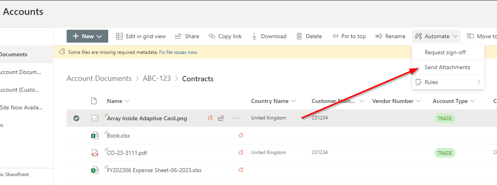
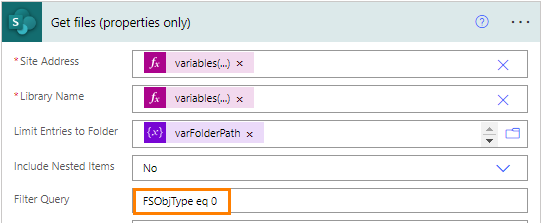
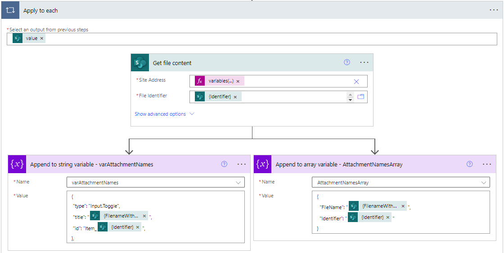
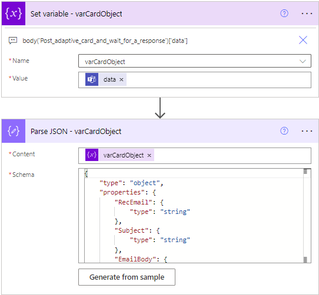
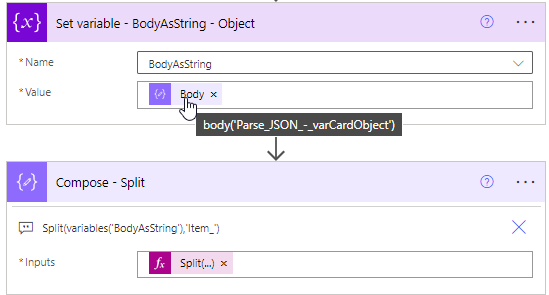
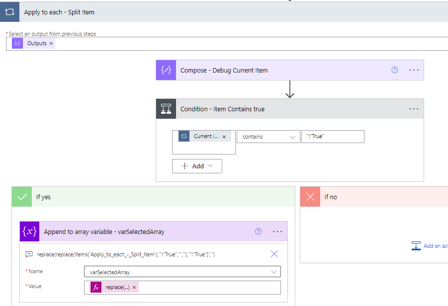
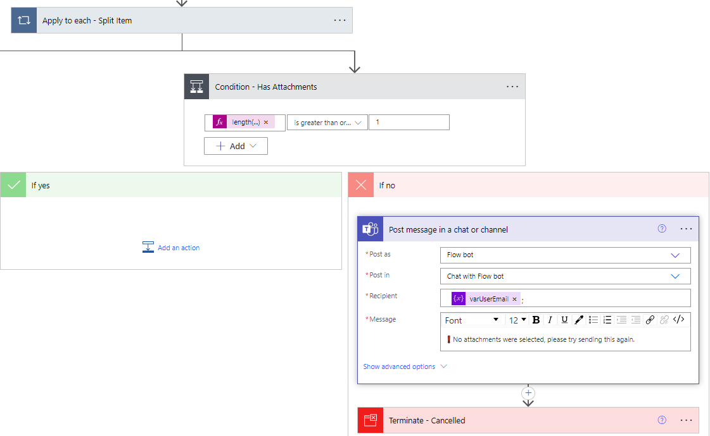
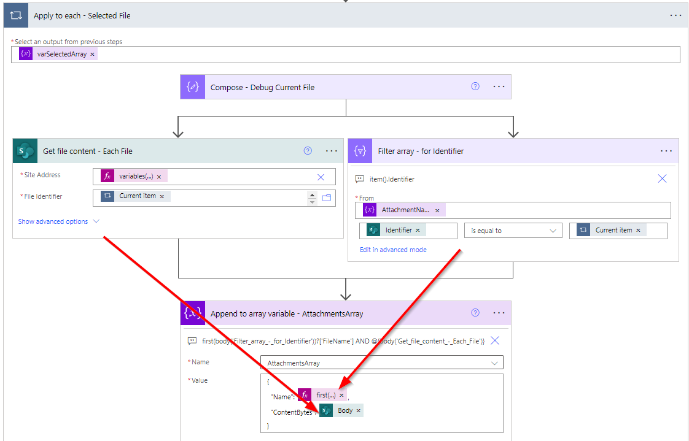
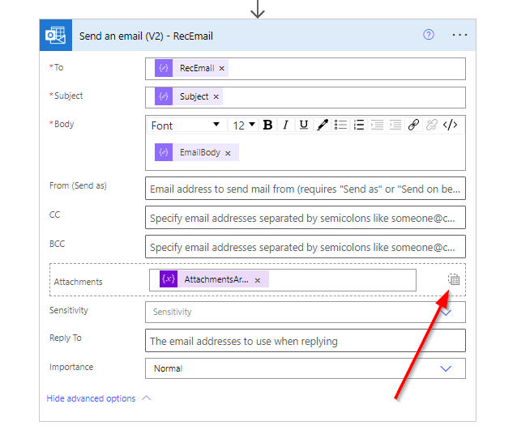

Have you ever needed to email multiple specific files as attachments from a SharePoint Document Library? There is documentation on how to send ALL the files in a given folder (https://learn.microsoft.com/en-us/microsoft-365/community/power-automate-send-sharepoint-files-as-attachments), but here we'd like to have some control over which files we want to email as attachments without having download the files beforehand.

## User interaction

The previously mentioned documentation provides us with a good Power Automate solution to build from, but how do we include the interaction that allows the user to see the available files to pick from and to select just the files they'd like to email? Well, that's where Adaptive Cards for Teams comes in. Adaptive Cards let us build an interactive and dynamic structure for a user interface for the actions of a Power Automate Flow.

NOTE: I'd love to develop a way to open up a new email tab with Outlook for the Web to do this, or even a PWA that's opens up in the SharePoint Sidebar... maybe one day.

## The Power Automate process in summary

1. Flow is triggered by the "For a selected file" trigger.
2. Flow will locate the parent folder
3. Flow will collect all the files
4. Flow will add the files to an attachment names string
5. An Adaptive Card will be sent to the user that Triggered the Flow
6. The Adaptive Card will replicate the layout of an email, with Sent To, Subject, Body and a pick list using the attachments array
7. The user fills out the fields, selects the files and clicks send.
8. For each of the selected files the Flow will retrieve the file content and Append to an Array.
9. Email is sent with selected Attachments


# How the flow works 

1. The user can trigger the Flow by selecting a single file in a SharePoint Document Library and clicking on **Automate > Send Attachments** 


2. They are then then asked to **\"Run Flow\"** 

3. An Adaptive Card is sent to them via the Microsoft Teams Flow Bot where the user can input the **Recipient Email** (with Regex Validation), **Subject**, **Body** and a Dynamic Picklist of all the other files in the chosen folder. 😃 

4. Once the user clicks **\"Send\"** the flow will verify that they actually selected any attachments and if so, send the email with the selected attachments via email from the user's mailbox.

# How it is Built

## Variables to Initialise
 - varUserEmail
 - varFolderPath 
 - varAttachmentNames 
 - varAttachmentNamesArray  
 - varSelectedArray
 - BodyAsString
 - varCardObject

**varSiteLibrary** is an Object where I have set up the SharePoint Site and Document Library

    {
        "Site": "<SharePoint Site>",
        "Library": "<Document Library>"
    }

We can retrieve these in our various actions just by referencing **variables('varSiteLibrary')['Site']** or **variables('varSiteLibrary')['Site']**

## Get parent the folder's path
 

Here's the expression used to return the Folder Path without the '/' at the end, so we can use it in the next action.

```
substring(
    outputs('Get_file_properties_-_Folder')?['body/{Path}']
    ,0
    ,sub(
        length(outputs('Get_file_properties_-_Folder')?['body/{Path}']))
    ,1
)
```

## Get an Array of all the available files in this folder
Using \"Get files (properties only)\" and the Filter Query: **FSObjType eq 0** to return just the files and not folders. 


Now we use \"Apply to Each\" for each value (file) found.
 

Each value is run through the "Get File Content" action to then append it's File name with extension and a unique Identifier.
Adaptive cards need to have a unique ID for each property, so I have used the Identifier property.

### Append to String varAttachmentNames schema:

```json
{
    "type": "Input.Toggle",
    "title": "@{items('Apply_to_each')?['{FilenameWithExtension}']}",
    "id": "Item_@{items('Apply_to_each')?['{Identifier}']}",
},
```

### In Parallel Append to String **varAttachmentNamesArray** schema (we will need this later to get the File Names):

```json
{
  "FileName": "@{items('Apply_to_each')?['{FilenameWithExtension}']}",
  "Identifier": "@{items('Apply_to_each')?['{Identifier}']}"
}
```

## Post adaptive card and wait for a response
The full build of the Adaptive card is [here] (https://github.com/madmat01/blog/tree/main/content/Adaptive_Card.json), but the key bit here is to include the varAttachments as a dynamic repeatable item within the Card. To do this we can place varAttachments inside of **"items": [ ]** , so that each filename is shown with it's own Input Toggle.


We replace this with our varAttachmentNames String
```json
{
    "type": "Container",
    "items": [
               @{variables('varAttachmentNames')}
            ]
}
```

## Parse the Adaptive Card response

Now the fun part, doing something with all the data we've gathered.
To do this we need to Parse the JSON from the \"Data\" Property of the Adaptive Card Body.

The Card body used here is in the form of this expression. We will set this as **varCardObject**
```
body('Post_adaptive_card_and_wait_for_a_response')['data']
```

We will set this as **\"varCardObject\"** and use is in the Content for the Parse JSON action.
 

**JSON Schema used**
```json
{
    "type": "object",
    "properties": {
        "RecEmail": {
            "type": "string"
        },
        "Subject": {
            "type": "string"
        },
        "EmailBody": {
            "type": "string"
        },
        "Item_": {
            "type": "string"
        }
    }
}
```


Parsing this Data Object will allow us to extract the **RecEmail**, **Subject** and **EmailBody** for use in the Send Email Action later.

### Extracting the selected files
A challenging part of this process is extracting the list of just the Selected Files from the Adaptive Card. We only want to get the ones that have the Toggle set to \"True\".

To do this we'll need to convert the **varCardObject** in to a String so that we can split it using an expression.

Set the **\"BodyAsString\"** variable the the **\"Parse JSON Body\"**.

Then bring that into a Compose action to use a **Split** expression.
 

### Compose - Split
We will split the string at each **_item** 
```
Split(variables('BodyAsString'),'Item_')
```

### Apply to Each Split Item
In order to return just the selected (True) files we need to do an Apply to Each on the Output of **Compose - Split** 

 

### Condition 
**CurrentItem** Contains:
```
":"True"   
```

### Append to array variable - varSelectedArray
With each Current Item that matches the Condition we will Append it to our **varSelectedArray** and apply an expression to just give us just the File Identifier that we need. To do that we will use the expression: 
```
replace(
    replace(
        items('Apply_to_each_-_Split_Item'),
        '":"True","',''
        )
        ,'":"True"}',''
    )
```

## Failover - No Attachments have been selected


In case the user forgets to actually select any attachments we can add a failover that checks the number of attachments 
```
length(variables('varSelectedArray'))
```
is or greater than 1. If the Condition is not matched, then we will send the User a Teams message \"No attachments were selected, please try sending this again\". Then the Flow will be Terminated

## Get the File Content and prepare attachments for each of the files


### Apply to Each - Selected File

To give us an Array of Attachments that Outlook can send in an email we need to find two things for each selected file: The File Name with Extension and the ContentBytes.

To acheive this we can run two actions in Parallel for each item from the **varSelectedArray** which has a list of file identifiers.


### Filter array - for Identifier
From: **varAttachmentNamesArray**
**item().Identifier** is equal to **Current Item**

*Advanced mode:*
```
@equals(item().Identifier, items('Apply_to_each_-_Selected_File'))
```
Using the expression below this can return us the matching FileName for the File Identifier
```
first(body('Filter_array_-_for_Identifier'))?['FileName']
```

### Get file content - Each File
Search the Site Address for the Current Item (file identifier) to return the File Content.
```
@{body('Get_file_content_-_Each_File')}
```
### Append to array variable - AttachmentsArray
So, to join these two together we Append each of these to the **AttachmentsArray** variable like this:
``` json
{
  "Name": @{first(body('Filter_array_-_for_Identifier'))?['FileName']},
  "ContentBytes": @{body('Get_file_content_-_Each_File')}
}
```
## Send an email
We can now use the data we've gathered above to compose and send an email.

An important point to mention is that to add the AttachmentsArray we need to select the **\"Switch to input entire array\"** toggle so that we can insert the combined Name and Content that we put together in **AttachmentsArray**


 


