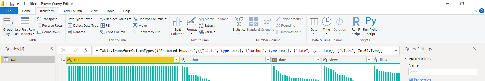

Garbage in, garbage out. This phrase conveys that incorrect or poor data quality will produce faulty and bad output. Thus, ETL is necessary for this very reason.

ETL means Extract, Transform, and Load. These three steps are the foundation of any data analytics and machine learning project, especially if you want promising findings. And I bet you do. The ETL process also acts as a form of a data pipeline, especially when integrating data from various data sources.

Microsoft Excel and Power BI have an ETL tool and many more tools in them. However, today we are focusing on this ETL tool: Power Query.

## What is ETL?

ETL is an acronym for extract, transform, and load.

- Extract: Data is extracted from legacy applications and various data sources.
- Transform: Data is cleaned and transformed into a more useable form. Duplicates are removed, new columns are formed or split, and much more transformation happens.
- Load: The data is loaded into the target database or analytic software.

## What is Power Query?

Power Query is a data preparation and transformation ETL engine that lets you connect to various data sources. Power Query is available in Microsoft Excel, Power BI, Power BI dataflow, Azure data factory wrangling dataflows, SQL Server Analysis Services, and much more. 

The good news is that Power Query is the same across all platforms, so if you learn it on one, you can use it on the others. Now that's simplicity and ease!

In Power Query,

- You can use the visual editor, interactive components, and ribbons to carry out over 350 data transformations like splitting, grouping, or removing duplicates.
- You could write out your transformation in Power Query's native language: the M language.
- You can also merge and combine data tables, or queries, as Power Query calls them.
- You can write Python or R scripts.
- You can carry out some AL insights like text analysis on your data using Azure Machine Learning and Cognitive Services.

### Extract in Power Query

Data is extracted and imported into Power Query from various data sources. At the moment, Power Query has over 200 connectors, ranging from simple fiat files, webpages, and databases to social media platforms and enterprise applications.

### Transform in Power Query

The data is cleaned and undergoes some transformation. You can do transformations by writing R or Python scripts, M-language, or one of Power Query's 350+ pre-built data transformation buttons.

A few of these transformation operations are:
- Checking for missing or duplicates.
- Removing and keeping rows and columns.
- Splitting columns.
- Grouping.
- Changing data types.
- Merging and appending queries.
- Text analytics.

- Pivot and unpivot.
- Find and replace.
- Extracting characters.
- Formating.
- Running R and Python Scripts.

- Validating to ensure data quality.
- Creating conditional columns.
- Machine learning capabilities and much more.

### Load in Power Query

Here, the transformed data is loaded into a data warehouse or an analytic tool in the case of Power BI and Excel.

## Why do I love Power Query?

- The user-friendly UI.
- Ease of use.
- The fact that I can get data from just about anywhere.
- It's a low-code or no-code transformation engine with pre-built transformation functions.
- Automate data cleaning process and use it as a pipeline. 

## How to get started with Power Query

As much as I would love to write about how to use it, I would rather just show you instead. 

A few weeks ago, maybe a month ago, I presented at the [Microsoft Power BI UK](https://www.meetup.com/microsoft-power-bi-uk/events/286388659/) and [Power BI Learning Community, Lagos](https://www.meetup.com/Power-BI-Learning-Community/events/rgfmrsydchblb/) meetup, and showcased a few of Power Query's capabilities. You can watch these presentation video recording [here](https://www.youtube.com/watch?v=gbvSqYLe5Hc) and [here](https://www.youtube.com/watch?v=H_poqUidbo0).

## Conclusion

This short post has introduced you to the ETL capabilities of Power Query.

If you have any questions, feel free to reach out to me on [Twitter](https://twitter.com/Bennykillua) or [LinkedIn](https://www.linkedin.com/in/ifeanyi-iheagwara/). You can also leave a comment below.
