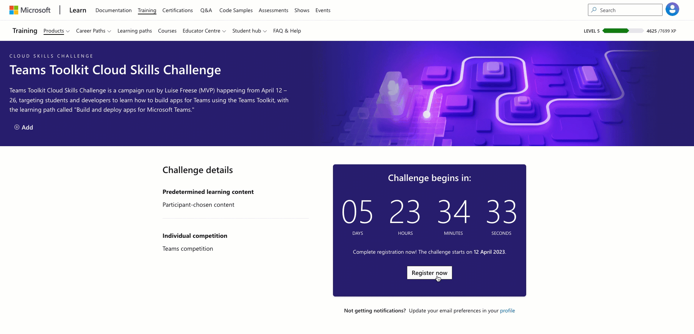

👋 Hey, fellow developers!

You like to #NeverStopLearning and feel that #SharingIsCaring? Then this here is exactly for you! Today, I have the great honor to announce the Teams Toolkit Cloud Skills challenge, which I host for you.

It is an amazing opportunity to take your app development skills to the next level!

## Join us!

- Join us from April 12 to April 26 and participate in the challenge to complete the learn path [aka.ms/LearnTeamsToolkit](https://aka.ms/LearnTeamsToolkit).

Not only will you enhance your skills to develop apps for Teams, but you will also be eligible to win fab prizes. The following prizes will be awarded: Ten (10) Grand Prize winners. Each winner will receive the choice of either a $100 digital gift card or $100 Azure credits. Approximate Retail Value (ARV) $1000.

By completing the learn path, you will learn how to leverage Teams Toolkit, a Visual Studio Code extension to build apps for Teams, covered by five modules:

- [Get started building apps for Microsoft Teams by using Teams Toolkit for Visual Studio Code](https://learn.microsoft.com/training/modules/teams-toolkit-vsc-introduction/)
- [Build a bot by using Teams Toolkit for Visual Studio Code](https://learn.microsoft.com/training/modules/teams-toolkit-vsc-create-bot/)
- [Build a Microsoft Teams tab app by using Teams Toolkit for Visual Studio Code](https://learn.microsoft.com/training/modules/teams-toolkit-vsc-tab-app/)
- [Add chat to a Microsoft Teams app by using the Teams JavaScript client library](https://learn.microsoft.com/training/modules/teams-toolkit-vsc-integrate-chat/)
- [Deploy a Microsoft Teams app to Azure by using Teams Toolkit for Visual Studio Code](https://learn.microsoft.com/training/modules/teams-toolkit-vsc-deploy-apps/)

With that, they provide a comprehensive and in-depth experience that covers everything you need to know to get started building apps for Teams.

With Teams Toolkit, you can streamline the app development process and make the most of the platform's features, including creating bots that can automate tasks, developing tabs that can display information from external services, and building message extensions that enable users to interact with external services from within Teams.

## Contributing

What's more, once you completed the challenge, you will have the opportunity to contribute to the community by creating samples and getting featured on [adoption.microsoft.com](https://adoption.microsoft.com/sample-solution-gallery/). This way, you can showcase your skills, help others, and become a recognized member of the community.

Don't miss this incredible opportunity to enhance your skills and join the Teams Toolkit Cloud Skills Challenge.

I can't wait to see what you create! 

## How to get started

- Register for the challenge and complete the learn path [aka.ms/LearnTeamsToolkit](https://aka.ms/LearnTeamsToolkit)
- Post on Twitter or LinkedIn about it using the hashtag #LearnTeamsToolkit
- Tag me [Luise Freese](https://twitter.com/LuiseFreese) | @LuiseFreese

## Registration house-keeping

When you register make sure to check **the official rules** link, and take the survey. This will make you compliant for winning prizes. Once the survey form is filled out, select the check box to agree to the rules and proceed to register by selecting the **Continue** button.

## Learn more

- [Teams Toolkit Overview](https://learn.microsoft.com/microsoftteams/platform/toolkit/teams-toolkit-fundamentals?pivots=visual-studio-code)
- [Teams Toolkit on VS Code Marketplace](https://marketplace.visualstudio.com/items?itemName=TeamsDevApp.ms-teams-vscode-extension)
