---
# this is the title
title: "Unlocking Design Freedom in SharePoint: Introducing Flexible Sections"
# this is the publishing date of your article, usually this should match "now"
date: 2025-08-01T09:49:36
# This is your name
author: "Gourav Bagora"
# This is your GitHub name
githubname: GouravBagora
# Don't change
categories: ["Community post"]
# Link to the thumbnail image for the post
images:
- images/Thumbnail.png
# don't change
tags: []
# don't change
type: "regular"
---

## Introduction

In early 2025, Microsoft introduced one of the most impactful enhancements to SharePoint page design in recent years — **Flexible Sections**. This new feature redefines how content creators build and structure SharePoint pages, offering a level of design freedom that was previously only possible through custom development.

In this blog, we’ll explore what Flexible Sections are, how they differ from traditional layouts, and how you can use them to create modern, responsive, and engaging SharePoint experiences.

---

## The Evolution of SharePoint Page Design

Before diving into Flexible Sections, it’s important to understand how SharePoint page design has evolved:

###  Classic Pages
Classic SharePoint pages were functional but rigid. They relied on fixed templates and master pages, offering limited customization and a less intuitive editing experience.

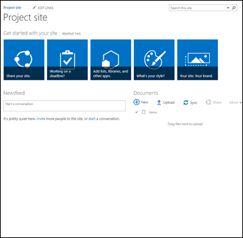  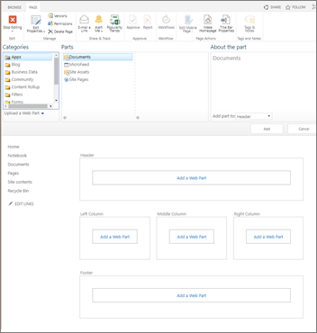

###  Modern Pages
Modern pages brought a much-needed refresh. With responsive design, modern web parts, and a better editing interface, they significantly improved usability. However, layout flexibility remained somewhat constrained due to the 1–3 column structure.

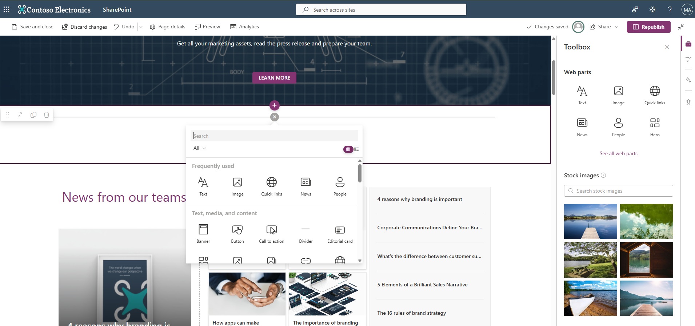

---

## What Are Flexible Sections?

**Flexible Sections** introduce a **freeform two-dimensional grid** layout, allowing content authors to place and arrange web parts with far greater precision and creativity. This removes the limitations of fixed columns and opens the door to visually rich, dynamic, and responsive designs.

Whether you're building a sleek landing page, a news post, or a dashboard, Flexible Sections empower you to craft experiences that are both functional and visually engaging — without compromising usability or structure.

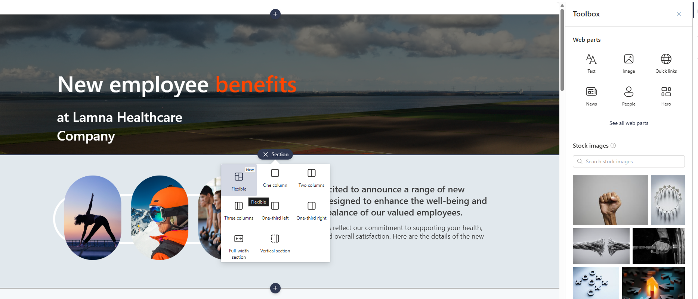

---

## Key Features of Flexible Sections

Here’s what makes Flexible Sections a powerful addition to your SharePoint toolkit:

### Freeform Grid Placement
- Web parts can be positioned anywhere on a 2D grid.
- Visual cues like drop hints and alignment guides assist with precise placement.

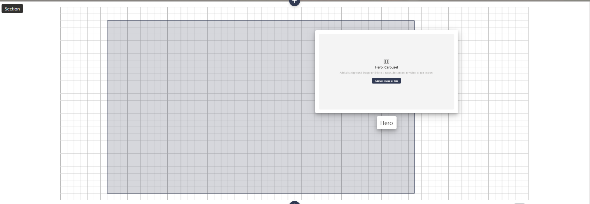

### Dynamic Resizing
- Drag handles allow granular resizing of web parts.
- Card-based and non-card web parts support flexible width options.
- Snap-to-grid ensures clean, consistent layouts.

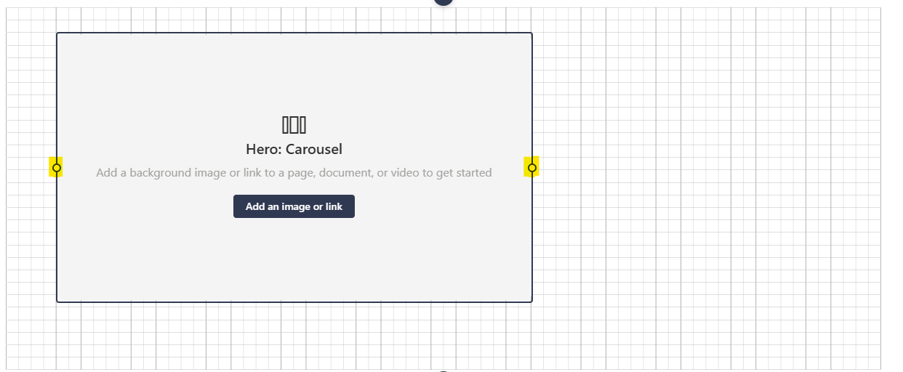

### Layered Design
- Web parts can overlap to create collage-style layouts.
- Arrangement controls manage front/back order, similar to PowerPoint layers.

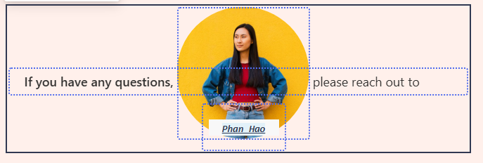

### Grouping Web Parts
- Group multiple web parts into a single unit for easier movement and resizing.
- Grouping persists across sessions and adapts well to mobile views.

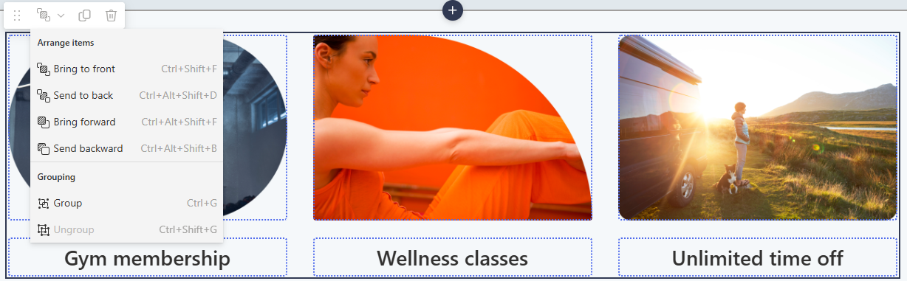

### Multi-Select & Batch Actions
- Use CTRL+click or marquee-select to rearrange or group multiple web parts quickly.

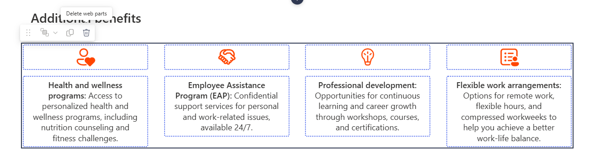

### Section Templates
- Pre-built templates combine flexible and classic sections.
- Include sample content like banners and quick links to speed up design.

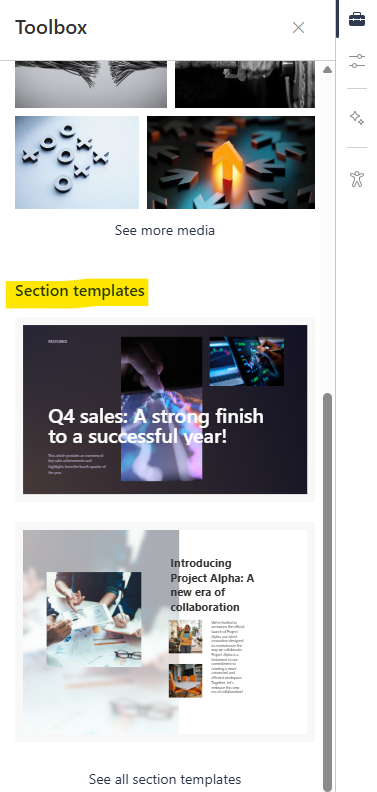  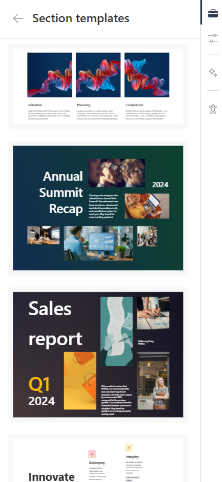

---

## Best Practices for Using Flexible Sections

To get the most out of Flexible Sections, consider the following best practices:

| **Category**              | **Best Practice**                                                                 |
|---------------------------|------------------------------------------------------------------------------------|
| Alignment                 | Use snap-to-grid and alignment guides for clean, professional layouts.            |
| Layout Planning           | Sketch complex layouts in advance and use templates to streamline design.         |
| Mobile Responsiveness     | Always preview on mobile/tablet and adjust reflow settings as needed.             |
| Design Balance            | Use layering creatively but maintain readability and contrast.                    |
| Training & Communication  | Educate contributors and encourage safe experimentation.                          |
| Future Enhancements       | Stay updated via the [Microsoft 365 Roadmap](https://www.microsoft.com/microsoft-365/roadmap?featureid=395213). |

---

## Why It Matters

Flexible Sections are more than just a layout tool — they represent a shift toward **design empowerment** in SharePoint. They allow site owners and content creators to:

- Break free from rigid templates.
- Highlight key content more effectively.
- Deliver modern, engaging intranet experiences.
- Maintain structure and accessibility across devices.

---

## Final Thoughts

Flexible Sections unlock a new level of creativity and control in SharePoint page design. Whether you're a developer, site owner, or content author, this feature gives you the flexibility to build pages that are not only functional but also visually compelling.

If you haven’t explored Flexible Sections yet, now is a great time to start experimenting and reimagining your SharePoint layouts.

