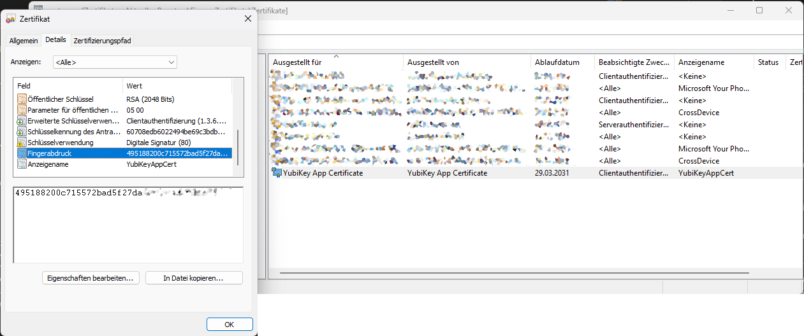
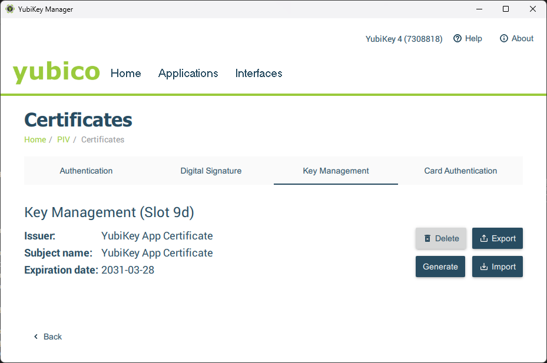

**Why I protect admin scripts more deliberately than everyday workflows—and
why hardware-bound certificates feel like the logical next step.**

## Strengthening Script Security

### Possession as the Missing Factor

For years, most of my Microsoft 365 admin scripts authenticated in a
knowledge-based way. A secret sat in a vault. The script proved it “knew” the
value. That was convenient, and it avoided using a human admin account for
automation.

Interactive admin sign-ins have gone the other way. They increasingly require
proof beyond a password: a compliant device, a stronger authenticator, and a
session that is harder to reuse elsewhere. The message is simple: privileged
work should not rely on knowledge alone.

My change in mind did not come from one event. It came from noticing a gap.
Many admin scripts can change tenant settings, permissions, and
compliance-relevant data at scale. In effect, they act like a privileged identity.
And honestly: who has not stored a login password as a SecureString at least once?
If I would not protect an admin account with “password only”, why would I accept
the script equivalent?

### Positioning App Secrets—Useful, but Context-Free

An app registration separates humans from automation. Permissions
become explicit. Shared Secret rotation becomes a defined process. In many tenants, that alone
removes a lot of hidden risk. But even Microsoft recommends using certificates
instead of client secrets before moving an application to production.

Still, a shared secret of an app registration is copyable. If it leaks through
a pipeline variable, a backup, a log file, or a quick export, nothing in the
platform can tell a legitimate run from a replay somewhere else. The main
controls then are discovery, rotation, and cleanup. That is response,
not prevention.

For low-impact automations, that may be acceptable. If the job reads data or
writes to a narrow scope, permissions can keep the blast radius small.

For privileged admin scripts, it feels different. The more tenant-wide the
impact, the less satisfying it is to rely on a single copyable value. The issue
is that they carry almost no context.

### A Change of Perspective: Scripts as Identities

My “admin scripts” do more than save time. They create SharePoint structures,
apply settings across sites, change permissions, and generate audit evidence.
Some are run during maintenance. Others are used in response to issues. Either
way, they touch core configuration.

That is close to what a privileged admin account can do. The difference is
scale and repeatability. A script can apply the same change across a tenant
in seconds. That is why we trust it operationally. It is also why we should
treat it as an identity, not just a tool.

Once you accept “script = identity”, the security bar follows. Privileged
identities deserve stronger authentication and clearer boundaries because
compromise has outsized consequences. Protecting a high-privilege script
with a secret starts to resemble protecting a privileged user with a password.

This is not about distrust. It is about consistency. If we demand stronger
proof for privileged portals, it is reasonable to demand stronger proof
for privileged scripts as well.

### Possession as the Logical Completion of the Model

Knowledge-based authentication asks: “Do you know the secret?” Possession-based
authentication asks: “Do you have the key?” For privileged access, possession
matters because it makes simple copying and replay harder.

Most admin scripts only use knowledge. A vault secret is still knowledge.
Even a certificate becomes transferable if the private key is exported and
moved. The missing piece is an element that stays inside its boundary.

That is why hardware-bound certificates are so appealing. If the private key
is non-exportable, stealing a file is no longer enough. Whether the boundary
is a device TPM or a hardware token such as a YubiKey is an implementation
choice. The architectural point is the same: the key must be physically present.

### TPM or YubiKey

For admin scripting, it is mainly a question of design: where
should this identity live, and what should it be tied to?

A TPM ties the key to one device. That fits when the privileged boundary is
a dedicated admin workstation: managed, monitored, and treated as the place
where high-impact changes happen.

A hardware token ties the key to the admin who holds it. That fits when I
may need to run the same script from different machines, but still want a
physical control that travels with the operator. The device remains relevant,
but it is not the anchor.

## Using PnP.PowerShell

PnP.PowerShell is helpful here because it supports **certificate-based sign-in**
for Microsoft 365 administration. For this you need a certificate pair. To create
a self-signed certificate I don't use the PnP cmdlet **New-PnPAzureCertificate**
as this creates an exportable private certificate. The concept is the key: I want
a private key that cannot be copied out of its boundary.

The following parameter blocks show what that looks like when the certificate is
created inside a TPM or inside a YubiKey-backed provider.

### TPM-backed certificate (non-exportable key):

```Powershell
$params = @{
    Subject           = "CN=TPM App Certificate"
    KeyAlgorithm      = 'RSA'
    KeyLength         = 2048
    Provider          = 'Microsoft Platform Crypto Provider'
    KeyExportPolicy   = 'NonExportable'
    CertStoreLocation = 'Cert:\CurrentUser\My'
    Type              = 'SSLServerAuthentication'
    KeyUsage          = 'DigitalSignature'
    FriendlyName      = 'TPMAppCert'
    NotAfter          = (Get-Date).AddYears(5)
    HashAlgorithm     = 'SHA256'
    TextExtension     = @(
        '2.5.29.37={text}1.3.6.1.5.5.7.3.2'
    )
}

# Create cert
$cert = New-SelfSignedCertificate @params

# Export public cert
Export-Certificate -Cert $cert -FilePath .\entra_AppRegTPMCert.cer
```

#### Params

- **Subject:** The certificate subject name. In app registrations, this is mainly a label for admins; the thumbprint is what you end up trusting.
- **KeyAlgorithm / KeyLength:** Defines the key type and size. RSA 2048 is widely compatible for app auth.
- **Provider:** Selects where the private key is generated and stored. Microsoft Platform Crypto Provider points to TPM-backed key storage on the device.
- **KeyExportPolicy:** NonExportable prevents exporting the private key. This is the core control: the certificate can be used, but the key cannot be copied.
- **CertStoreLocation:** Where Windows stores the certificate (here: current user’s personal store). This affects who can access and use it.
- **Type:** The template intent for the self-signed certificate. It influences defaults and compatibility; the goal is a certificate that works for client-auth style flows.
- **KeyUsage:** Allowed cryptographic use. DigitalSignature is what you need for signing the token request.
- **FriendlyName:** A local display name to make the cert easier to identify in the store.
- **NotAfter:** Expiry date. Long validity reduces admin overhead, but increases the time window if the boundary is ever weakened. Choose deliberately.
- **HashAlgorithm:** Hash used in the certificate signature (e.g., SHA256).
- **TextExtension:** Adds extensions. The shown OID (2.5.29.37) sets an EKU; the value 1.3.6.1.5.5.7.3.2 indicates Client Authentication, which matches the intended use.
- **Export-Certificate:** Exports the public certificate (.cer). This is what you upload to the app registration. The private key stays in the TPM.


### YubiKey-backed certificate (non-exportable key):

If you're using or creating the certificate for a YubiKey, change the params as following:

```Powershell
$params = @{
    Subject           = "CN=YubiKey App Certificate"
    KeyAlgorithm      = "RSA"
    KeyLength         = 2048
    Provider          = "Microsoft Smart Card Key Storage Provider"
    KeyExportPolicy   = "NonExportable"
    CertStoreLocation = "Cert:\CurrentUser\My"
    Type              = "SSLServerAuthentication"
    KeyUsage          = "DigitalSignature"
    FriendlyName      = "YubiKeyAppCert"
    NotAfter          = (Get-Date).AddYears(5)
    HashAlgorithm     = "SHA256"
    TextExtension     = @(
        "2.5.29.37={text}1.3.6.1.5.5.7.3.2"
   )
}
```

The parameter set is almost identical. The main architectural change is Provider:
the **smart card provider** routes key generation and signing operations to the
external token. The private key stays on the YubiKey, and the certificate in the
Windows store is effectively a handle to that key. In other words, the “possession”
boundary moves from a specific device (TPM) to a removable object.

The security outcome depends on where you anchor the key, who can trigger the script,
and how you design permissions and audit.



When you move the YubiKey to another PC, you must install the public certificate
in the Windows Certificate Manager once.



> You might need to install the smart card drivers on your PC. In any case, I
> recommend installing the YubiKey Manager. This makes it easier to export
> the public certificate from the YubbiKey.
> [Yubico Tools and Apps Downloads](https://www.yubico.com/support/download/)

### Limits of This Approach

Hardware-bound certificates fit best for interactive admin scripts. They are not
a universal answer for fully unattended runs. If nobody is present,
possession has to be represented by the runtime environment. That is where Managed
Identity or OIDC-based workload identity can be the better fit, because they tie
identity to where the code runs, not to a person holding a key.

There is no single best method. The right method is the one that matches your
actual boundary and your expected failure modes.

## Conclusion—Consistency Instead of Absolutes

App secrets were, a sensible step. They separate automation
from human accounts and keep permissions explicit. For low-impact tasks, they
were the simplest acceptable option.

For privileged admin scripts, I do not find them anymore sufficient. A script that
can change core tenant settings deserves more than a copyable value. Hardware-bound
certificates are a logical next step because they add possession and reduce simple
replay. That is not a rule for everyone. It is a way to make the authentication
method match the level of privilege and the boundary I want to enforce.
