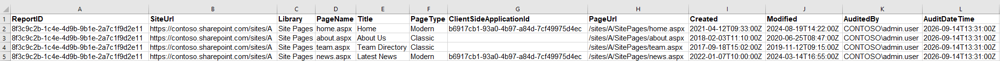

When Microsoft announced the phased retirement of classic SharePoint components, it wasn't just another roadmap update - it was a wake up call. Many of us still have pockets of classic SharePoint quietly powering business critical processes. HR onboarding pages, finance workflows, legacy approval steps, intranet content - all built years ago, still running, still relied upon. And now, they're heading toward read only status.

That's exactly why I needed a reliable way to audit our classic pages. Not a full modernization tool, not a migration engine - just a clear, accurate inventory of what still exists.

## Why This Became a Priority

Microsoft's retirement timeline is straightforward:

- **March 1, 2027:** No new classic publishing sites or pages. Custom script disabled for new tenants.
- **October 1, 2028:** All remaining tenants lose the ability to create or edit classic pages. Custom script enforcement becomes universal.

The important part: **existing classic pages aren't deleted**, but they *do* become read only.

For organisations with older sites still in active use, that's a real risk. Classic pages often contain embedded JavaScript, custom layouts, or legacy add ins that modern SharePoint simply doesn't replicate. Before planning modernization, I needed visibility - which sites still had classic pages, how many, and how recently they were modified.

## How the Solution Took Shape

The requirement was simple: scan a site's page library and classify each ASPX file as modern or classic. PnP PowerShell was the obvious choice, especially with certificate based authentication making it automation friendly.

The script grew into a lightweight audit tool that:

- Connects securely to a site
- Validates the correct page library
- Reads all ASPX pages
- Classifies each page based on the `ClientSideApplicationId`
- Outputs a timestamped CSV and transcript log
- Provides a summary of modern vs classic pages

It's now part of our standard pre modernization checks.

## What the Script Produces

The CSV report includes:

- Page name and URL
- Modern or classic classification
- Created/modified dates
- Page library
- Site URL
- Audit metadata (Report ID, run time, audited by)

This gives us a clean, sortable dataset that feeds nicely into Power BI or governance dashboards.

Screenshot of sample CSV:

## Technical Details Worth Calling Out

A few implementation choices make this script practical:

- **Certificate based authentication** keeps it secure and suitable for scheduled runs.
- **Library validation** helps avoid confusion between "Site Pages" and "Pages," especially on older publishing sites.
- **ClientSideApplicationId** checks provide a reliable way to distinguish modern pages (`b6917cb1 93a0 4b97 a84d 7cf49975d4ec`) from classic ones.
- **Transcript logging** makes troubleshooting easier when running this across multiple sites.

This isn't a tutorial, but the script is readable enough that anyone familiar with PnP PowerShell can follow the flow.

## The Script

- The full script is available on GitHub here: **[https://pnp.github.io/script-samples/spo-aspx-page-type-audit/README.html?tabs=pnpps](https://pnp.github.io/script-samples/spo-aspx-page-type-audit/README.html?tabs=pnpps)**

### Resources

- **[https://learn.microsoft.com/en-us/sharepoint/classic-user-created-page-deprecation](https://learn.microsoft.com/en-us/sharepoint/classic-user-created-page-deprecation)**
- **[https://learn.microsoft.com/en-us/sharepoint/dev/transform/modernize-classic-sites](https://learn.microsoft.com/en-us/sharepoint/dev/transform/modernize-classic-sites)**
- **[https://learn.microsoft.com/en-us/sharepoint/dev/transform/modernize-userinterface-site-pages](https://learn.microsoft.com/en-us/sharepoint/dev/transform/modernize-userinterface-site-pages)**
- **[https://learn.microsoft.com/en-us/sharepoint/dev/transform/modernize-userinterface-site-pages-powershell](https://learn.microsoft.com/en-us/sharepoint/dev/transform/modernize-userinterface-site-pages-powershell)**

## Impact So Far

Running this audit has already helped us:

- Identify legacy pages supporting critical workflows
- Prioritise modernization based on real usage
- Reduce the risk of last minute breakage
- Improve conversations with site owners
- Build a modernization roadmap aligned with Microsoft's retirement phases

It's a small tool, but it gives clarity at a time when clarity matters.

## Future Improvements

A few enhancements are on the table:

- Detecting embedded JavaScript or custom master page references
- Adding optional checks for classic alerts or add ins
- Integrating results into a tenant wide Power BI governance dashboard
- Mapping page dependencies to Power Automate or legacy workflows

These are ideas - not implemented features.

## Community Discussion

- How are you preparing for the retirement of classic SharePoint components?
- Are you auditing, modernizing, or still discovering what's out there?

I'd be interested to hear how others are approaching this transition.
