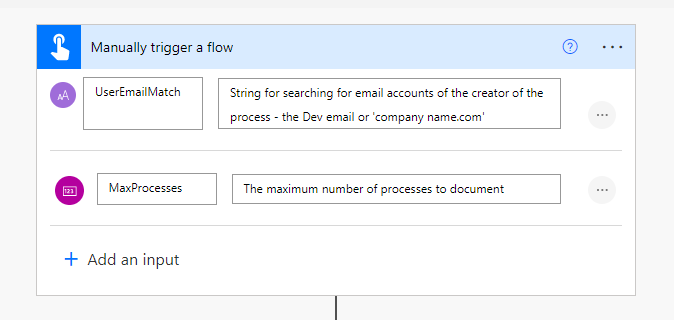

## TL;DR
How often do you find yourself writing documentation for Dynamics 365 Power Automate Flows and Business Rules? And on a large project, how do you to keep track of all the Dynamics 365 Power Automate Flows, Workflows, Business Rules, etc. and get an overview of what they relate to and what they do? This post shows how a Power Automate Cloud Flow can be used to produce documentation from Process Descriptions and link them to Azure DevOps work items.


The files created by the flow are Markdown files, the common format for Wiki pages, including those in Azure DevOps Wikis. 

---

## Contents

- [TL;DR](#tldr)
- [Contents](#contents)
- [Dataverse Processes](#dataverse-processes)
- [Process Documentation Cloud Flow](#process-documentation-cloud-flow)
  - [Trigger](#trigger)
  - [List Processes for Documentation](#list-processes-for-documentation)
  - [Variables](#variables)
  - [Apply to each Process](#apply-to-each-process)
  - [Compose steps for the Markdown content](#compose-steps-for-the-markdown-content)
  - [Save Content to OneDrive](#save-content-to-onedrive)
- [Outputs](#outputs)
  - [Business Rules](#business-rules)
  - [Flows](#flows)
- [Taking it further - Azure DevOps Wiki and Work Items](#taking-it-further---azure-devops-wiki-and-work-items)
  - [Advantages](#advantages)
- [Solution and Visio](#solution-and-visio)
- [Acknowledgements](#acknowledgements)

---

## Dataverse Processes

Flows, Workflows and Business Rules are all stored on the Process table in Dataverse. The Category choice column (option set attribute) distinguishes the different types:

| Value|	Type|
|--|--|
|0|Workflow|
|1|	Dialog	|
|2|Business Rule|
|3|Action|
|4|Business Process Flow|
|5|Modern Flow|
|6|Desktop Flow|

The other key column on the Process table is the Description column and can be seen in Power Automate Cloud Flows:


And Business Rules:


---

## Process Documentation Cloud Flow

The Process table can be used in a Power Automate Flow to generate documentation from the descriptions and other columns.

The top-level view of the flow is:


### Trigger

The trigger is manual, so it can be run as desired, and uses two parameters:

- **UserEmailMatch**: String for matching against the CRM user email address of the user who created the process. The Dev user email address, or the tenant name could be used.
- **MaxProcesses** (integer): the maximum number of processes to include in the documentation.



### List Processes for Documentation

The key element of the flow is getting the details of the processes that match the trigger parameters:


The main filter selects just the workflows, business rules, actions, business process flows, and modern flows (Power Automate cloud flows):  

``` xml
    <filter>
      <condition attribute='category' operator='ne' value='1' />
      <condition attribute='category' operator='ne' value='6' />
      <condition attribute='category' operator='ne' value='9000' />
      <condition attribute='type' operator='eq' value='1' />
      <condition attribute='rendererobjecttypecode' operator='null' />
    </filter>
```

The user who created the process is used in the linked filter condition on the User table:

``` xml
    <link-entity name='systemuser' from='systemuserid' to='createdby'>
      <filter>
        <condition attribute='internalemailaddress' operator='like' value='%@{triggerBody()['text_1']}%' />
      </filter>
    </link-entity>
```

And the outputs are sorted into the order the documentation will be generated in, firstly by the process's primary entity, then by category, and then by name:

``` xml
    <order attribute='primaryentity' />
    <order attribute='category' />
    <order attribute='name' />
```

### Variables

The variables that will contain the Markdown are initialised to include the Table of Contents and the formatted Date/Time. The Table of Contents is an Azure DevOps specific extension to Markdown, and can be removed for other systems. There are separate variables for the:

- **Table related processes** - Business Rules, Business Process Flows, and Workflows
- **Non-Table related processes** - Actions and Flows
- **Draft processes** - these are included in a simple table for reference


### Apply to each Process

The flow then loops through the processes to generate the documentation. 


The **Apply to each** has too many Condition and Switch steps to explain in detail. The key elements are:


- Separate branches for the table related processes, non-table related processes, and draft processes
- Adding headings to structure the contents
- Switch steps with branches for the individual process categories so that category specific content can be included - for example, if workflow logging is on
- Conditions for different situations, such as if there isn't a description, so that this can be highlighted
- For Business Rules, getting the name of the Entity Form the rules applies to (note: this can't use expand query in original list as the Form Id isn't valid for FetchXML)
- Adding details of the process, such as creation date
- Providing warnings where appropriate

The full detail of the logic is available in the flow, which includes notes on the Flow steps, and the Visio which was generated using the Flow Visio Builder by Carl Cookson (see [Solution and Visio](#solution-and-visio) below).

### Compose steps for the Markdown content

After the end of the **Apply to each** loop, there are separate compose steps so that the contents are available should the output to OneDrive fail.  

### Save Content to OneDrive

Finally, the Markdown contents is written to OneDrive. This could be replaced with SharePoint or alternative if desired.


---

## Outputs

Examples of the outputs are:

### Business Rules


### Flows


---

## Taking it further - Azure DevOps Wiki and Work Items

The flow on its own gives significant benefits for documenting and understanding the processes across Dataverse, particularly on a large project.


Taking advantage of further features of DevOps Wikis gives additional benefits, particularly by **including DevOps Work Item references to Descriptions** using '#{_Work Item Number_}', such as #12345 to reference Work Item 12345.


When the output Markdown is saved as an Azure DevOps Wiki page, this gives the icon, work item name and status:


### Advantages

This has significant advantages:

- The User Stories, Features and other Azure DevOps Work Items can be referenced in the respective process descriptions
- The documentation for the individual processes will contain links that can be selected to open the work item
- Wiki search can be used to find all automation linked to an individual work item

---

## Solution and Visio

The solution and the Visio of the flow are available on GitHub - https://github.com/alex-mcla/ProcessDocumentationFlow.

The solution is unmanaged so that it can be adjusted to your needs.

---

## Acknowledgements

[Carl Cookson](https://twitter.com/LinkeD365) for encouraging me to write this blog post and providing his set of [documentation tools on the XrmToolBox](https://linked365.blog/tags/my-tools/).

PnP for hosting this (Markdown-based) blog platform.
