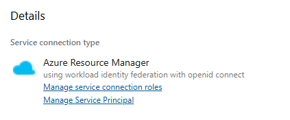
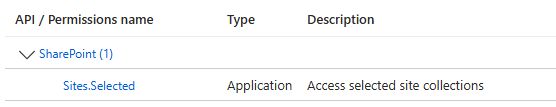
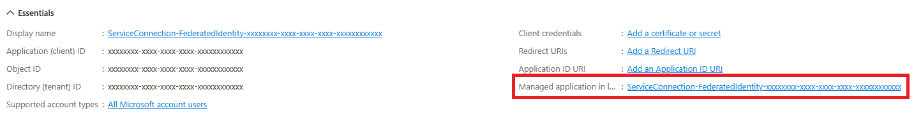
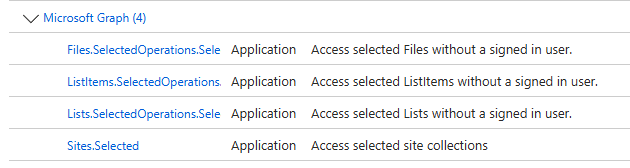

> This article is based on the [Azure DevOps Pipeline with Workload Identity Federation Series](https://dev.to/kkazala/series/26443)' Articles

In October 2023, Azure DevOps introduced a new option for creating Service Connections: [Workload Identity federation](https://learn.microsoft.com/en-us/entra/workload-id/workload-identity-federation).

This feature allows pipelines to access Microsoft Entra protected resources (such as Azure, Microsoft Graph, Microsoft 3655) without requiring client secrets or certificates, **eliminating the need for certificate or secret rotation**.

## Configuration

**Service connections using workload identity federation** authenticate with Microsoft Entra-protected resources using context of a Service Principal in your Azure AD (Microsoft Entra).

The Service Principal must first be **authorized** to access the necessary resources. It can be done using the usual methods, such as the Azure Portal, Microsoft CLI, PowerShell, or PnP PowerShell.

Click the **"Manage Service Principal"** link on the Service Connection page to navigate to the **App Registration** page in Azure. Here, you can find all the necessary details to grant the Service Principal access to APIs.



Depending on the actions you intend to execute, you'll need to assign different API permissions to different resources.
If you want to use your pipeline to deploy SPFx solution, the **minimum required permission** level is `Sites.Selected` **Application** permissions for SharePoint API.



In this case, you will also need to grant `FullControl` to the AppCatalog site, using the client Id and display name of the Service Principal.
To access the **properties of the Service Principal** use the **"Managed application in local directory"** link on the Application Registration page.


Once you obtained the client id and display name, use the `Grant-PnPAzureADAppSitePermission` script or other method of your choice to grant the service principal necessary permissions:

```powershell
Grant-PnPAzureADAppSitePermission -AppId $clientId -DisplayName $clientDisplayName -Permissions FullControl
```

Make sure you always grant the minimum required permissions. For accessing existing resources within a SharePoint site (e.g. publish change log), consider using the new `*.SelectedOperations.*` scopes, if possible.



See [Overview of Selected permissions in OneDrive and SharePoint](https://learn.microsoft.com/en-us/graph/permissions-selected-overview?tabs=http).

## Deploying SPFx solutions to tenant-level app catalog

Now that your pipeline is using Service Connection with Managed Identity Federation, you are ready to update your deployment scripts and stop using secrets or certificates.

You will need to make a few small changes in your script:

-   change your tasks to use AzurePowerShell instead of PowerShell/bash
-   obtain Access Token and use it when establishing connections

> [!IMPORTANT]
> When using `Connect-PnPOnline -AccessToken`, PnP PowerShell will not acquire tokens dynamically and if the token expires (typically after 1 hour) cmdlets will fail to work using this method.

```yaml
variables:
    - name: tenantName
      value: "contoso" #update with your tenant name
    - name: siteName
      value: "AppCatalog"
    - name: spfxPackage
      value: "spfx/spfx-solution.sppkg" #update with a path to your package

steps:
    - task: AzurePowerShell@5
      name: DeploySPFx
      inputs:
          azureSubscription: DEV_Connection
          azurePowerShellVersion: latestVersion
          ScriptType: InlineScript
          Inline: |
              Write-Host "##[group]Install PS modules"
              ############## If you are using ubuntu-latest, you may need to uncomment the following lines to avoid the
              # 'The term 'Install-Module' is not recognized as a name of a cmdlet, function, script file, or executable program.' error.
              # See https://dev.to/kkazala/azure-devops-and-the-term-install-module-is-not-recognized-issue-30ck
              ##############
              # Write-Host "##[command] Get Module PowerShellGet"
              # Get-Module -Name PowerShellGet -ListAvailable
              # Write-Host "##[command] Get Module PowerShellGet"
              # Get-Module -Name Microsoft.PowerShell.PSResourceGet -ListAvailable
              Write-Host "##[command] Install PnP.PowerShell"
              Install-Module -Name PnP.PowerShell -Scope CurrentUser -SkipPublisherCheck -Force
              Write-Host "##[endgroup]"

              ############## You may use the following section to retrieve details of the account used to execute the pipeline
              # You probably won't use it productively :)
              ##############
              # Write-Host "##[group]Who am I"
              # $azContext = (Get-AzContext).Account.Id
              # $sp = Get-AzADServicePrincipal -ApplicationId $azContext
              # Write-Host "##[debug] ServicePrincipal: $($sp.Id)"
              # Write-Host "##[endgroup]"

              $url = "https://$(tenantName).sharepoint.com"
              $path="$(Build.SourcesDirectory)/$(spfxPackage)"

              try {
                  $azAccessToken = Get-AzAccessToken -ResourceUrl $url
                  $conn = Connect-PnPOnline -Url "$url/sites/$(siteName)" -AccessToken $azAccessToken.Token -ReturnConnection
                  Write-Host "##[debug] Get-PnPConnection $($conn.Url)

                  $packageInSite = Add-PnPApp -Path $path -Overwrite  -Publish -SkipFeatureDeployment  -Connection $conn
              }
              catch {
                  Write-Host "##[error]$($_.Exception.Message)"
              }
      displayName: Deploy spfx
```

> Why the `Get-Module -Name PowerShellGet -ListAvailable`?
>
> If you are using **ubuntu-latest** image, which comes with **PowerShell 7.4.3**, it will include **Microsoft.PowerShell.PSResourceGet** installed side-by-side with **PowerShellGet** v2.2.5 and **PackageManagement** v1.4.8.1. This somehow lead to `"The term 'Install-Module' is not recognized"` errors appearing **randomly**.
> These extra `Get-Module` calls appear to solve the issue.

## Resources

-   [Connect-PnPOnline -AccessToken](https://pnp.github.io/powershell/cmdlets/Connect-PnPOnline.html#example-14)
-   Create an Azure Resource Manager service connection that uses workload identity federation
    -   [Create a service connection with workload identity federation (automatic)](https://learn.microsoft.com/en-us/azure/devops/pipelines/library/connect-to-azure?view=azure-devops#create-a-service-connection-with-workload-identity-federation-automatic)
    -   [Create service connection with workload identity federation (manual)](https://learn.microsoft.com/en-us/azure/devops/pipelines/library/connect-to-azure?view=azure-devops#create-service-connection-with-workload-identity-federation-manual)
    -   [Convert an existing Azure Resource Manager service connection to use workload identity federation](https://learn.microsoft.com/en-us/azure/devops/pipelines/library/connect-to-azure?view=azure-devops#convert-an-existing-azure-resource-manager-service-connection-to-use-workload-identity-federation)
-   [Azure DevOps and "The term 'Install-Module' is not recognized" issue](https://dev.to/kkazala/azure-devops-and-the-term-install-module-is-not-recognized-issue-30ck)
