## Introduction

Client secrets have traditionally been the go-to method for deploying Power Platform solutions from Azure DevOps, utilizing app registrations from the Azure platform. However, my personal experience has shown that this approach can be problematic, especially when you are not an application admin. It often involves wasting time figuring out why deployments have failed due to expired or missing client secrets. Even when reaching out to someone with application admin rights, they might generate a new client secret but forget to update the service connections for each service connection within Azure Dev Ops or the application admin does not have access requiring to reach out to someone else who have access, causing further disruptions.

Moving to "Federated Credentials" from client secrets/certificates has the following benefits

1. Less administrative burden to update expired secrets/certificates
2. Less risk of credential leaks
3. No disruption to the flow of work which may result from expired secrets/certificates
4. Saves time
5. Happy Devs, Administrators and end users with a smoother process

You might relate to the frustration of repeatedly generating and updating client secrets to maintain the deployment process. Fortunately, there is an alternative: "Workload Identity Federation" for Power Platform service connections. Although still in Preview as of January 2025, this method offers a more secure and robust way to manage Power Platform pipelines. It alleviates the burden on both application administrators and Azure DevOps administrators by eliminating the need to constantly update client secrets.

Federated identity credentials offer a more secure deployment option than using client secrets or certificates to connect to Azure or Microsoft Graph. For more details, view the [Overview of federated identity credentials in Microsoft Entra ID](https://learn.microsoft.com/en-us/graph/api/resources/federatedidentitycredentials-overview?view=graph-rest-1.0&?wt.mc_id=MVP_308367). They do not expire like secrets or certificates and can't be leaked or stolen.

There are many blog posts describing the setup, and you can follow the same prerequisites instructions mentioned in Luise Freese's blog post [How to get from Dev? Ooops! 🤭 to proper (Azure) DevOps for Power Platform](https://www.m365princess.com/blogs/alm-power-platform-azure-devops/) related to environments, authentication, creating app registrations, creating application users, and creating service connections in Azure DevOps.

The only difference is within the steps for creating service connections in Azure DevOps and creating app registrations to enable **Workload Identity Federation**.

If you have a classic CI/CD Power Platform setup, you may follow the instructions from [Converting to Modern YAML Pipeline: Application Lifecycle Management in Azure DevOps for Power Platform](https://reshmeeauckloo.com/posts/powerplatform-convert-classic-pipeline-to-modern-pipeline/) to have a fully modern deployment.

## Add Federated Credentials to the App Registration

1. Navigate to the Azure Portal and go to **App registrations** and create an app registration.
2. Select **Certificates and Secrets** from the left-hand side navigation.
3. Select the **Federated credentials** tab, then select **Add credential**.

4. Select the credential scenario "Other issuer," and set the Issuer and Subject identifier fields for your Azure DevOps Service Connection.
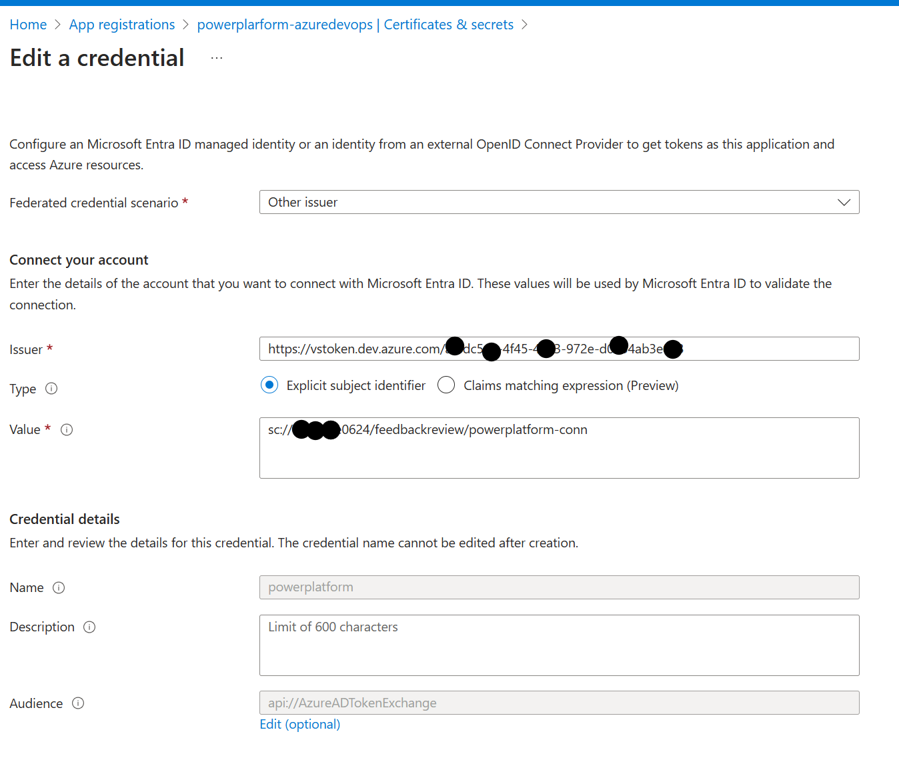

The Issuer field must be `https://vstoken.dev.azure.com/[AzureDevOpsOrganizationID]`. Follow the instructions in [Get list of organizations backed by Microsoft Entra ID](https://learn.microsoft.com/en-us/azure/devops/organizations/accounts/get-list-of-organizations-connected-to-azure-active-directory?view=azure-devops&tabs=browser) to find the organization ID of the organization within Azure DevOps.

The Subject identifier field must be in the format `sc://[AzureDevOpsOrganizationName]/[AzureDevOpsProjectName]/[AzureDevOpsServiceConnectionName]`.

5. Click on **Add**, and the federated credentials will be shown within the app.
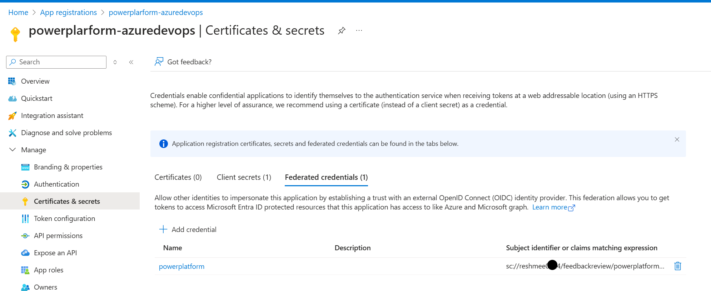

If these values are missing or misconfigured, running any of the Power Platform Build Tools tasks with a misconfigured Workload identity will output the expected values to the Pipeline logs.

[error]failed: The Service Principal's Federated Credentials may be misconfigured in the Azure Portal. The Issuer field should be set to [***], and the Subject Identifier field should be set to [***].

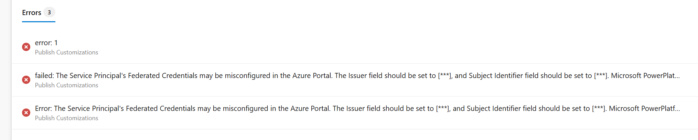

## Grant the App Registration as a Service Principal to the Power Platform Environment

Navigate to each Power Platform environment and grant the app registration as an application user.

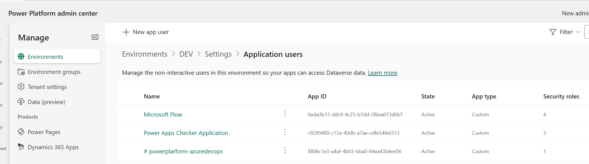

## Create Service Connection within Azure DevOps with Workload Identity Federation

1. Navigate to the Azure DevOps organization, go to Project Settings, and click Service Connections.
2. Click on **New Service Connection**. Search for **Power Platform** under "Search a service or connection type". If Power Platform does not come up, install it from [Power Platform Build Tools](https://marketplace.visualstudio.com/items?itemName=microsoft-IsvExpTools.PowerPlatform-BuildTools) and try again.
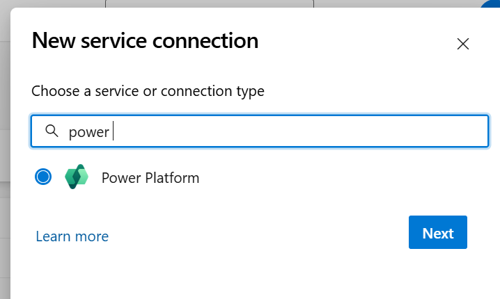

3. Select the option **Workload Identity federation (preview)**.
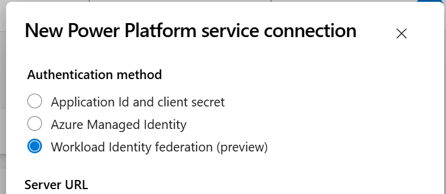

4. Fill in the fields:
   - **Server URL**: Fill in the URL of the Power Platform environment. Navigate to the Power Platform Admin Center > Manage > Environments > Click on the Environment and copy the environment URL.
   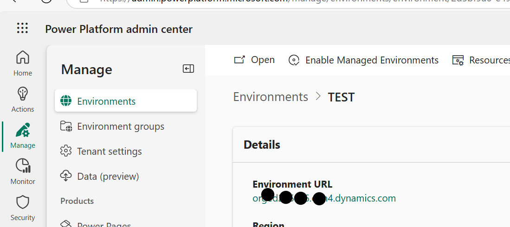
   - **Service Principal Id**: Navigate to Azure Portal > App registrations > Search and click on the app registration.
   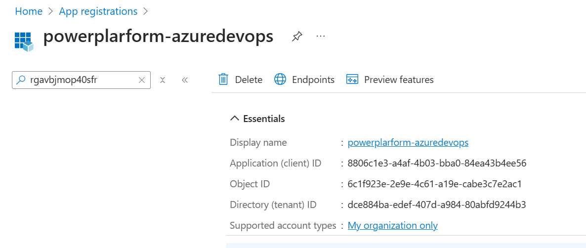
   - **Tenant ID**: Navigate to Azure Portal > Microsoft Entra ID to find the tenant ID.
   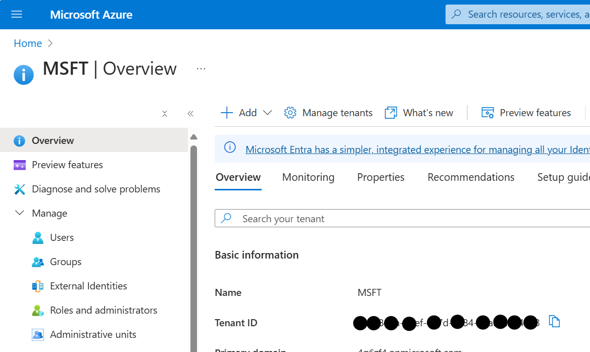
   - **Service connection name**: Enter a name that demonstrates the intent of the service connection.
   - Check **Grant access permission to all pipelines**, otherwise, you will have to authorize the service connection the first time it is being used in a new pipeline.

## Reference the Service Connection within the CI/CD Pipeline

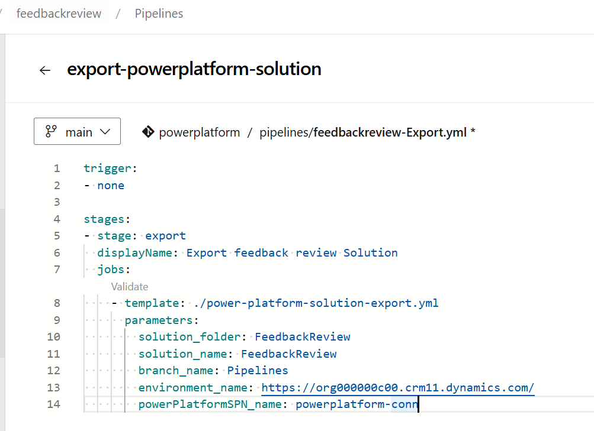

This is a YAML template to export a Power Platform solution referenced in the pipeline above.

```yml
parameters:
  - name: 'solution_folder'
    type: string
  - name: 'solution_name'
    type: string
  - name: 'branch_name'
    type: string
  - name: 'environment_name'
    type: string
  - name: 'powerPlatformSPN_name'
    type: string
jobs:
- job: Export
  pool:
    name: Azure Pipelines

  steps:
  - task: DeleteFiles@1
    displayName: 'Delete files from $(Build.SourcesDirectory)/${{ parameters.solution_folder }}'
    inputs:
      SourceFolder: '$(Build.SourcesDirectory)/${{ parameters.solution_folder }}'
      Contents: '**/*'

  - task: PowerPlatformToolInstaller@2
    displayName: 'Power Platform Tool Installer'

  - task: PowerPlatformPublishCustomizations@2
    displayName: 'Publish Customizations'
    inputs:
      authenticationType: PowerPlatformSPN
      PowerPlatformSPN: ${{ parameters.powerPlatformSPN_name }}

  - task: PowerPlatformExportSolution@2
    displayName: 'Power Platform Export Unmanaged Solution'
    inputs:
      authenticationType: PowerPlatformSPN
      PowerPlatformSPN: ${{ parameters.powerPlatformSPN_name }}
      Environment: ${{ parameters.environment_name }}
      SolutionName: ${{ parameters.solution_name }}
      SolutionOutputFile: '$(Build.ArtifactStagingDirectory)/${{ parameters.solution_folder }}/${{ parameters.solution_name }}.zip'

  - task: PowerPlatformExportSolution@2
    displayName: 'Power Platform Export Managed Solution'
    inputs:
      authenticationType: PowerPlatformSPN
      PowerPlatformSPN: ${{ parameters.powerPlatformSPN_name }}
      Environment: ${{ parameters.environment_name }}
      SolutionName: ${{ parameters.solution_name }}
      SolutionOutputFile: '$(Build.ArtifactStagingDirectory)/${{ parameters.solution_folder }}/${{ parameters.solution_name }}_managed.zip'
      Managed: true

  - task: PowerPlatformUnpackSolution@2
    displayName: 'Power Platform Unpack Unmanaged Solution '
    inputs:
      SolutionInputFile: '$(Build.ArtifactStagingDirectory)/${{ parameters.solution_folder }}/${{ parameters.solution_name }}.zip'
      SolutionTargetFolder: '$(Build.SourcesDirectory)/${{ parameters.solution_folder }}'

  - script: |
      echo Commit Solution into GIT Branch ${{ parameters.branch_name }}
      git config user.email pipeline.automation@4g6zf4.co.uk
      git config user.name "Pipeline Automation"
      
      git switch --force-create ${{ parameters.branch_name }}
      
      git -c http.extraheader="AUTHORIZATION: bearer $(System.AccessToken)" pull origin ${{ parameters.branch_name }} --no-rebase
      
      echo Adding all files to ${{ parameters.branch_name }}
      git add --all
      git commit -m "Checked in by Power Platform Release"
      
      echo Pushing solution components to ${{ parameters.branch_name }}
      git -c http.extraheader="AUTHORIZATION: bearer $(System.AccessToken)" push origin HEAD:${{ parameters.branch_name }} --force
    displayName: 'Check In Solution'

  - task: PublishPipelineArtifact@1
    displayName: 'Publish Pipeline Artifact'
    inputs:
      targetPath: '$(Build.ArtifactStagingDirectory)/${{ parameters.solution_folder }}/${{ parameters.solution_name }}_managed.zip'
      artifact: drop
```

The pipeline is successful with the federated identity:
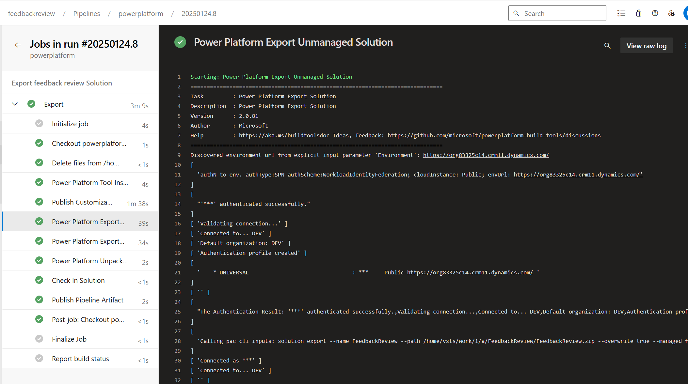

Check from the repository whether the export is successful:
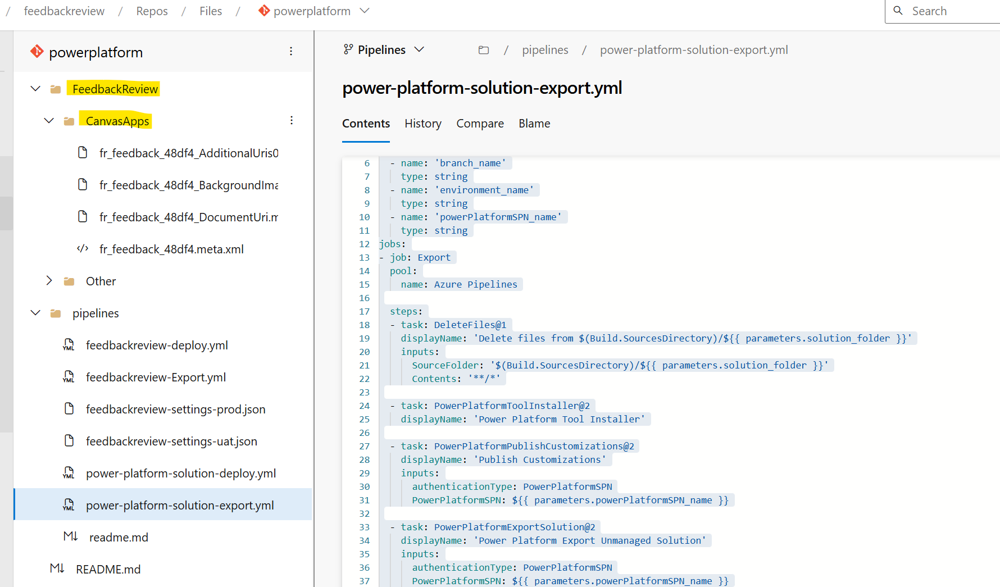

## References

[Troubleshoot an Azure Resource Manager workload identity service connection](https://learn.microsoft.com/en-us/azure/devops/pipelines/release/troubleshoot-workload-identity?view=azure-devops&wt.mc_id=MVP_308367)

[Manually set an Azure Resource Manager workload identity service connection](https://learn.microsoft.com/en-us/azure/devops/pipelines/release/configure-workload-identity?view=azure-devops&tabs=managed-identity&wt.mc_id=MVP_308367)

[Get list of organizations backed by Microsoft Entra ID](https://learn.microsoft.com/en-us/azure/devops/organizations/accounts/get-list-of-organizations-connected-to-azure-active-directory?view=azure-devops&tabs=browser&wt.mc_id=MVP_308367)

[Overview of federated identity credentials in Microsoft Entra ID](https://learn.microsoft.com/en-us/graph/api/resources/federatedidentitycredentials-overview?view=graph-rest-1.0&wt.mc_id=MVP_308367)
