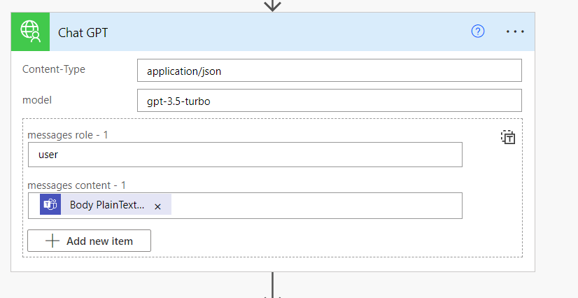

---
# this is the title
title: "Boosting productivity combining ChatGPT in MS Teams"
# this is the publishing date of your article, usually this should match "now"
date: 2023-08-14T06:00:00-04:00
# This is your name
author: "Sohil Bhalla"
# This is your GitHub name
githubname: sohilbhalla
# Don't change
categories: ["Community post"]
# Link to the thumbnail image for the post
images:
- images/Teams-ChatGPT-integration.jpg
# don't change
tags: ["Power Automate","ChatGPT","Custom Connector", "Microsoft365","OpenAI","MSTeams"]
# don't change
type: "regular"
---

## Overview

ChatGPT is a form of generative AI — a tool that lets users enter prompts to receive humanlike images, text or videos that are created by AI.

ChatGPT is similar to the automated chat services found on customer service websites, as people can ask it questions or request clarification to ChatGPT’s replies.

ChatGPT is a very powerful tool which can help an individual or an organization to boost their productivity.

In this blog I am going to talk about how can we bring ChatGPT in our daily conversations in MS Teams without loosing the context and be more productive.

## Components

Below are the components that are involved in bridging ChatGPT and MS Teams.

1. MS Teams
2. Power Automate
3. Custom Connector to ChatGPT

## Implementation

## ChatGPT Custom Connector

In order to bridge the gap between MS Teams and ChatGPT, we will build a Power Automate which will get triggered from the MS Teams based on some action and which further will call ChatGPT api using custom connector to fetch the response and post it back to teams.

Let’s start with creating a custom connector for Power Automate which connects to ChatGPT.

I am going to use the below ChatGPT api to connect from my power automate-

https://platform.openai.com/docs/api-reference/chat/create

In order to use this API, we need to register in the Open AI platform for developers and get the API key which will be used in the Power Automate to authenticate the API and make the service calls.

The keys can be generated from your profile page – https://platform.openai.com/account/api-keys

Once we have API key with us, let’s create the custom connector.

Here are few screenshots for my custom connector


Host – api.openai.com


In security I have provided as the API key which I will use to establish the connection to the ChatGPT.


I have configured the definition as stated above and also my body parameter is set according to the sample response from the ChatGPT API.

I have set the default value for model and role as


Now if I test my connector by typing hello in the content, I get the response as

```json
{
"id": "chatcmpl-7my3s1oFOVcYR96wCMb8NOyNq9S7J",
"object": "chat.completion",
"created": 1691904976,
"model": "gpt-3.5-turbo-0613",
"choices": [
{
"index": 0,
"message": {
"role": "assistant",
"content": "Hi there! How can I assist you today?"
},
"finish_reason": "stop"
}
],
"usage": {
"prompt_tokens": 8,
"completion_tokens": 10,
"total_tokens": 18
}
}
```
The content in the response is what we are going to use in the power automate.

## Power Automate

I am using a trigger in the power automate as “When keywords are mentioned”.

Here is my trigger.


As it states, if @ChatGPT is mentioned in the conversation inside the channel WebHookTest, it will trigger this power automate.

Next step is to capture the Message ID and Parent Message ID in the variables which will used to post back the response to MS Teams Channel Message.


Get the Message details from these parameters


The above will give us the exact message reference where the keyword is used for ChatGPT.

We will call the custom connector for ChatGPT which the message posted in Teams and Send the response back to MS Teams.



Body Plain Text is – outputs(‘Get_message_details’)?[‘body/body/plainTextContent’]

Finally, we will post the response back to Teams message.


content in the Message is the response from ChatGPT connector.

Now lets see how it is working.

## Demo

Let’ say a team of people are working towards a report and their senior have asked them to check the calculation of the interest rate, which there are not fully aware of.


