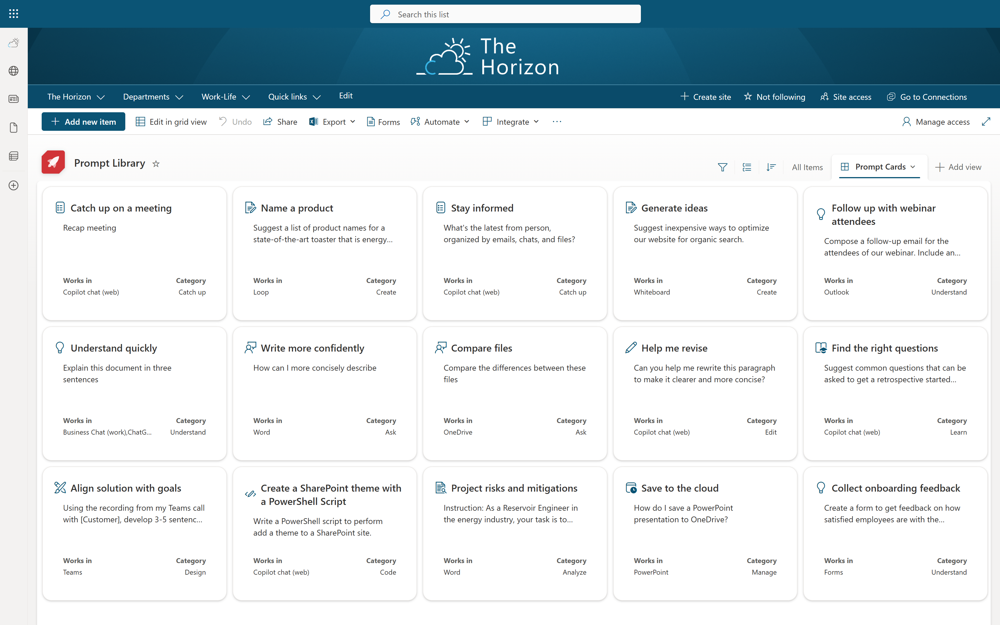
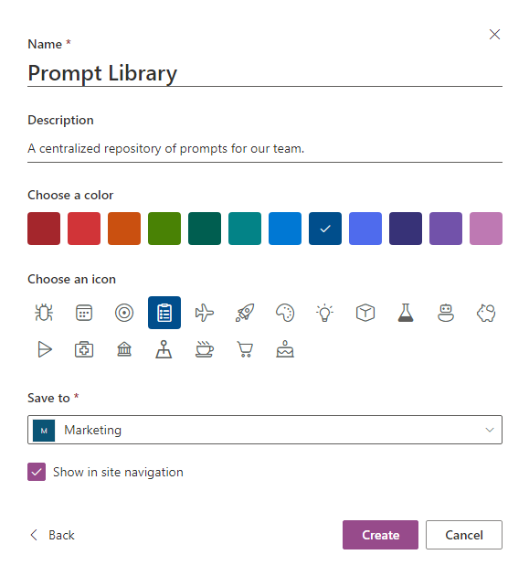
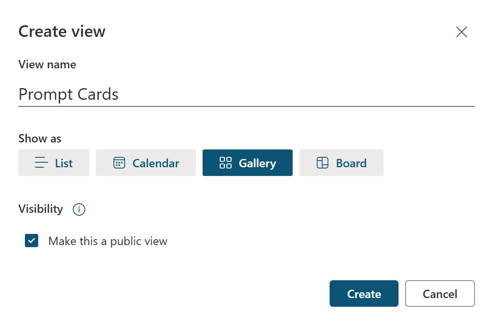
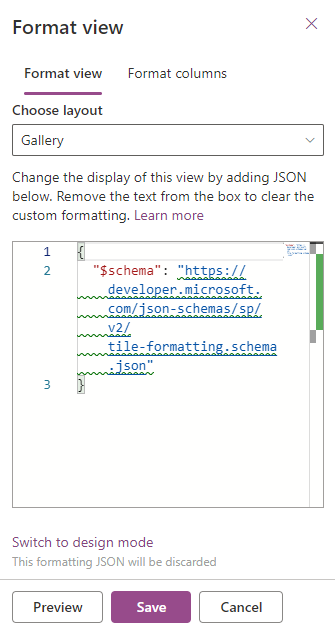
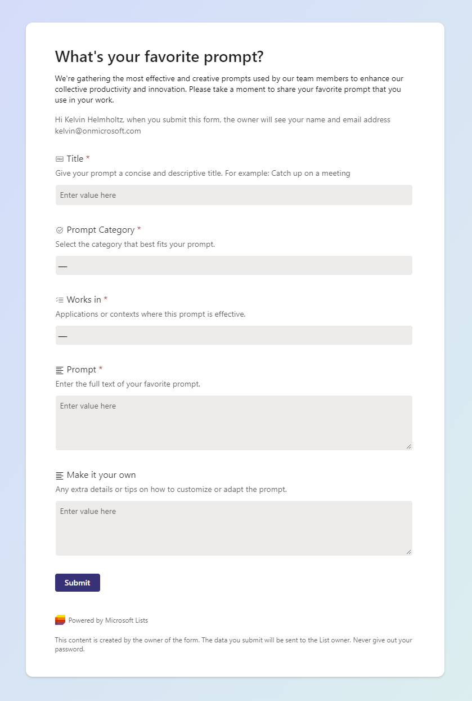
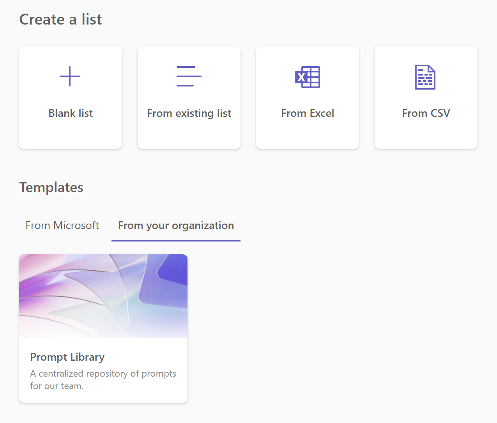

### Enhance your organization’s productivity by creating centralized Prompt repositories

As teams adopt **Microsoft Copilot** and AI tools, quick access to a shared prompt repository, like a **Microsoft Lists Prompt Library**, boosts efficiency and consistency. Whether you're working in content creation, coding, design, or project management, a well-organized **Prompt Library** serves as a valuable resource for teams.

The **Prompt Cards** design in this guide comes from the [Copilot Lab](https://copilot.cloud.microsoft/en-US/prompts?WT.mc_id=MVP_400145), which visually organizes and displays prompts.

### Creating a Microsoft Lists Prompt Library

Building a **Prompt Library** with **Microsoft Lists** involves creating a new list, adding columns, and customizing the view.

#### Setting Up the List

Navigate to **Microsoft Lists** and create a new list. Name it **"Prompt Library"** and add a description like, "A central repository of prompts for our team."

Save the list on a **SharePoint** site your team can access for collaboration.

### Adding Essential Columns

Define the key information for each prompt by adding these columns:

- **Title** (Single line of text): A concise name for the prompt.
- **Prompt** (Multiple lines of text): The full text of the prompt.
- **Prompt Category** (Choice): Categorize prompts for easy filtering. Use categories like "Understand," "Create," "Catch up," and "Analyze."
- **Works in** (Choice with multiple selections): Specify the apps or contexts where the prompt is effective (e.g., Word, Excel, Teams).
- **Make it your own** (Multiple lines of text): Additional tips or details on how to customize the prompt.
- **Icon** (Calculated Column): Automatically assigns an icon based on the **Prompt Category** for visual recognition in the list. Fluent UI icons are used for consistency. For more icons, visit [flicon.io](https://flicon.io).

For detailed instructions and the formula for the **Icon** column, see the [PnP List View Formatting Samples – Prompt Cards repository](https://github.com/pnp/List-Formatting/tree/master/view-samples/prompt-cards).

### Enhancing Your Microsoft Lists Prompt Library with View Formatting

A **Prompt Library** is functional, but [custom formatting](https://learn.microsoft.com/en-us/sharepoint/dev/declarative-customization/view-formatting?WT.mc_id=MVP_400145) makes it visually engaging.

#### Applying the Formatting

Create a new view. Name it **"Prompt Cards"** and select **Gallery** under the **Show as** section to display the prompts as cards. Once ready, click **Create**.

Next, open the **View Formatting** pane by selecting the view name and clicking **Format current view**. Switch to **Advanced mode** to apply the **JSON** code.

Head over to my [Prompt Cards List View Formatting Sample](https://adoption.microsoft.com/en-us/sample-solution-gallery/sample/pnp-list-formatting-prompt-cards/?WT.mc_id=MVP_400145) on GitHub, copy the **JSON** code, paste it into the **SharePoint JSON editor**, and save the changes. The **Prompt Library** will now display visually appealing cards.

### Crowdsourcing Prompts for Your Microsoft Lists Prompt Library

The **Prompt Library** becomes more valuable when filled with diverse, real-world prompts from your team. Use **Microsoft Lists Forms** to gather prompts easily.

#### Gathering Prompts

Click the **Forms** button and select **New form**. Title the form **"What’s your favorite prompt?"** and add a description like:

> "We’re gathering the most effective and creative prompts used by our team to enhance productivity. Please share your favorite prompt."

Arrange the columns logically so it's easy for users to submit prompts. For example, make sure **Title**, **Prompt**, and **Prompt Category** are clearly labeled.

Once the form is ready, click **Send form** to copy the link and share it with your team.

### Crowdsourcing Without Oversharing

Using **Microsoft Lists Forms** lets you gather prompts without oversharing the full list. This keeps the list private while allowing submissions. To moderate entries, set up an approval workflow with **Power Automate**. Only approved prompts will be published to the **Prompt Library**, ensuring high-quality content.

Additionally, you can use the [Add-SPOListDesign](https://learn.microsoft.com/en-us/powershell/module/sharepoint-online/add-spolistdesign?view=sharepoint-ps&WT.mc_id=MVP_400145) PowerShell command to turn the **Prompt Library** into a reusable template across your organization. Teams can create their own prompt libraries from the **Microsoft Lists** app, **SharePoint**, or **Office.com**, enabling collaboration across departments.

This guide gives you a structured, easy-to-use **Prompt Library** for managing and sharing prompts across your organization. By centralizing prompt management, you'll boost productivity and foster collaboration.