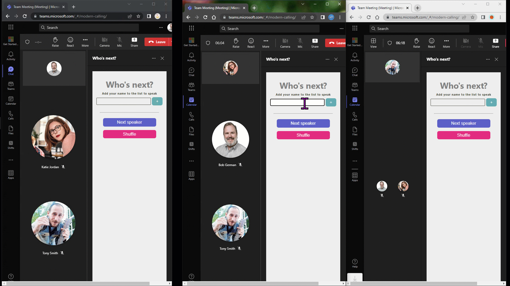
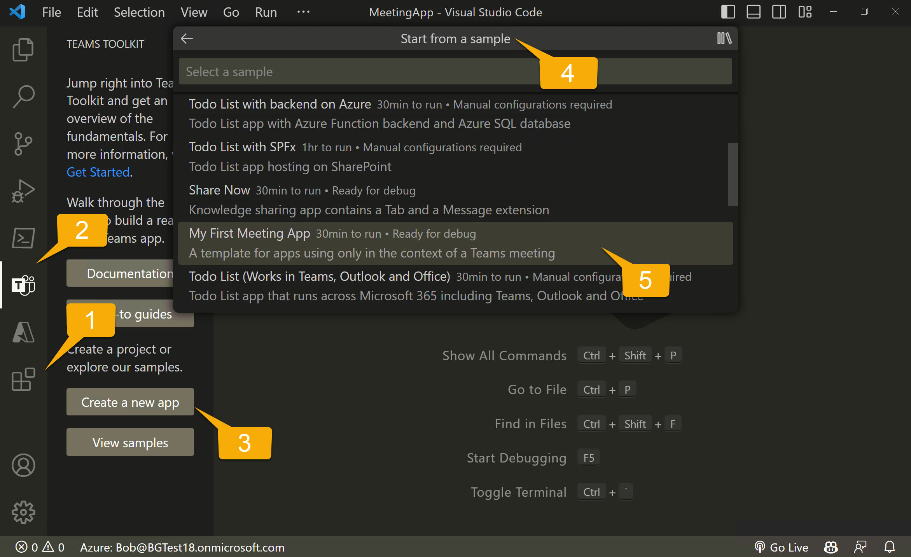

## Build a "Who's Next" Teams meeting app with Fluid Framework and Live Share SDK

It all started in our weekly team meeting, which is mostly a stand-up though we're often working on different projects. Since the team is scattered around the globe, we always meet in Microsoft Teams.

Even though it's super friendly, it seems like nobody wants to go first - or next - and there are a lot of awkward silences. One day someone said, "there ought to be an app for this" and the idea for Who's Next was born. [Rabia Williams](https://rabiawilliams.com/) and I decided to build it as a "Fix Hack Learn week" project, and this is the result.



Teams meeting apps can run before, during, or after a meeting and this absolutely was for use by the whole group during the meeting. It runs in the meeting side panel so we use it while still seeing cameras and any screen sharing that's going on. Anyone who wishes to speak can enter their name to be added to the queue of speakers, which is displayed to everyone. Buttons are provided to advance to the next speaker, remove a speaker who had to leave the meeting, or mix it up with a "shuffle".

Now everybody knows when it will be their turn, and there are no more awkward silences!

### Making it collaborative

Displaying an app "in meeting" is nice, but it's a lot more useful if people can work together in the app while they're interacting in Teams. Who's Next is a super-simple example; there is a shared list of names and everyone can view and edit it simultaneously.

This ends up being pretty simple due to the [Fluid Framework](https://fluidframework.com/) which allows any web page (including a Teams tab) to easily synchronize with other users in real time. Each user's tab maintains a local array of names, and the Fluid Framework keeps them in sync. Screen sharing is purely a spectator sport; Fluid apps allow everyone to participate.

The Fluid Framework organizes shared data in [containers](https://fluidframework.com/docs/build/containers/); the easiest way to get a Fluid container in a Teams meeting app is using the [Live Share SDK](https://learn.microsoft.com/microsoftteams/platform/apps-in-teams-meetings/teams-live-share-overview?WT.mc_id=m365-82480-cxa). The Live Share SDK will hand you a Fluid container that's hosted in Microsoft 365 and secured to allow access by the meeting attendees.

### Building the meeting app

The meeting app was created in [Teams Toolkit](https://learn.microsoft.com/microsoftteams/platform/toolkit/teams-toolkit-fundamentals?WT.mc_id=m365-82480-cxa) using the sample "My First Meeting App".



It's pretty easy; in Visual Studio Code:

  1. Install the "Teams Toolkit" extension
  1. Open "Teams Toolkit"
  1. Click "Create a new app"
  1. Click "Start from a sample"
  1. Select "My First Meeting App"

For details [check the Teams Toolkit documentation](https://learn.microsoft.com/en-us/microsoftteams/platform/toolkit/create-new-project?pivots=visual-studio-code).

### It's a React app

A Teams tab is just a web page displayed in an IFrame, whether it's used in a meeting or elsewhere in Teams. Teams toolkit generates [a React app using react-scripts](https://create-react-app.dev/) to provide the tab's web page as well as other pages such as a configuration page, privacy declaration page, and terms of use page.

A new React component, [WhosNext.jsx](https://github.com/OfficeDev/TeamsFx-Samples/blob/dev/whos-next-meeting-app/tabs/src/components/WhosNext.jsx), serves as the app's main user interface. It displays the list of names, which it obtains from a module [fluidLiveShare.js](https://github.com/OfficeDev/TeamsFx-Samples/blob/dev/whos-next-meeting-app/tabs/src/services/fluidLiveShare.js). This module exports a singleton service, `FluidService`, which handles the shared data.

In the React compnent's `componentDidMount()` function, it connects to the Fluid service, obtains the current list of names, and sets up a small event handler to update the UI:

```javascript
await FluidService.connect();
const people = await FluidService.getPersonList();
// ...

// Register an event handler to update state
// when the Fluid data changes
FluidService.onNewData((people) => {
  this.setState({
    ready: true,
    people: people,
    message: ""
  });
});

```

It's notable that the array of people (the `people` state property) is only updated when changes are reflected in the Fluid service. For example if Alice adds her name it doesn't appear on the list until it's been added to the Fluid service and the change comes back from there, indicating that her name was shared with everyone.

### The configuration page

All tabs in Microsoft Teams meetings are "configurable" tabs; this is also true of other shared tabs such as tabs in Teams channels or group conversations. This allows one user to configure the tab to show information that's relevant to the whole group. However there's really nothing to configure here, so the required [configuration page](https://github.com/OfficeDev/TeamsFx-Samples/blob/dev/whos-next-meeting-app/tabs/src/components/WhosNextConfig.jsx) doesn't really do anything other than the required Teams JavaScript SDK calls.

The configuration page URL is placed in the Teams app manifest so Teams knows what to show when someone adds the app to a meeting. The configuration page code uses the Teams JavaScript SDK to save the URL of the tab itself again so Teams knows what to show when someone clicks the tab.

```javascript
await pages.config.setConfig({
  suggestedDisplayName: "Who's next?",
  entityId: "WhosNext",
  contentUrl: baseUrl + "/index.html#/tab",
  websiteUrl: baseUrl + "/index.html#/tab",
});
```

### Writing the Fluid code

All interaction with the Live Share SDK and Fluid Framework is contained in a client-side service in [fluidLiveShare.js](https://github.com/OfficeDev/TeamsFx-Samples/blob/dev/whos-next-meeting-app/tabs/src/services/fluidLiveShare.js). If this project was written in TypeScript, the service interface would look like this:

```typescript
interface IFluidService {
  // Connect to the Fluid service
  connect: () => void;
  // Add a person to the list
  addPerson: (name: string) => Promise<void>;
  // Remove a person from the list
  removePerson: (name: string) => Promise<void>;
  // Go to next person
  nextPerson: () => Promise<void>;
  // Shuffle the list of speakers
  shuffle: () => Promise<void>;
  // Get the current person list
  getPersonList: () => Promise<string[]>;
  // Register an event handler to be callsed
  // when the person array is updated
  onNewData: (handler: (personList: string[]) => void) => void;
}
```

To connect to the Fluid Framework, the code must

 * Obtain a LiveShareHost from the Teams JavaScript SDK. This binds the LiveShare services to the current Teams meeting
 * Obtain a LiveShareClient from the LiveShareHost using the LiveShare SDK
 * Obtain a Fluid container from the LiveShareClient; this is an instance of the Fluid Relay Service hosted in Microsoft Teams and secured to the attendees of the current meeting

~~~javascript
  const liveShareHost = LiveShareHost.create();

  const liveShareClient = new LiveShareClient(liveShareHost);
  const { container } = await liveShareClient.joinContainer(
      // Container schema
      {
          initialObjects: { personMap: SharedMap }
      });
~~~

Notice that the `joinContainer()` function is passed a schema for our [distributed data structures](https://fluidframework.com/docs/build/dds/) in the form of a JavaScript object. In this case, we're using a [shared map](https://fluidframework.com/docs/data-structures/map/), which is a set of key-value pairs, and we're saving the array of names in JSON in one of the values.

This is a super-simple approach but of course there is a race condition, as one user's change might overwrite another's depending on the order they're processed in the Fluid Relay service. We considered using a [sequence](https://fluidframework.com/docs/data-structures/sequences/) but sequences only store immutable data, so for example there would be no way to shuffle the names or remove one from the middle. The mitigation strategy for this is to only show users the data after it's returned from the Fluid container; if an update is overwritten, we depend on the user to notice their change didn't work and try again.

Once the connection is set up, the service reads the container and stores a local copy. This is important because the container may not be empty when someone opens the tab.

~~~javascript
const json = this.#container.initialObjects.personMap.get(this.#PERSON_VALUE_KEY) || "[]";
this.#people = JSON.parse(json);
~~~

Next, the code registers to receive updates should the data change; when this happens it will call the event handler(s) from React components with the new list of names.

~~~javascript
// Register a function to update the app when data in the Fluid Relay changes
this.#container.initialObjects.personMap.on("valueChanged", async () => {
    const json = this.#container.initialObjects.personMap.get(this.#PERSON_VALUE_KEY);
    this.#people = JSON.parse(json);
    for (let handler of this.#registeredEventHandlers) {
        await handler(this.#people);
    }
});
~~~

When the user makes a change locally, such as adding a name or shuffling the list, the change is made to the local array of names and then it's sent to the Fluid Relay service using this small function:

~~~javascript
// Private function to update the Fluid relay from the local array of people
#updateFluid = async () => {
    const json = JSON.stringify(this.#people);
    this.#container.initialObjects.personMap.set(this.#PERSON_VALUE_KEY, json);
}
~~~

### Try it out

[Please do try the sample!](https://aka.ms/who-is-next) It includes step-by-step instructions. Because it's so simple, this app doesn't require a lot of permission or administrative consent; if you have permission to upload an app, you can use Who's Next.

### Hosting the Fluid Relay service in Azure

If you want to use the Fluid Framework outside of Teams, or for some reason want to host the service in your own Azure instance, the sample includes instructions and code changes [here](https://github.com/OfficeDev/TeamsFx-Samples/tree/dev/whos-next-meeting-app/alt-tabs-azure).

## References

Here are some initial references to get started building Teams meeting apps with the LiveShare SDK:

- Teams Meeting Apps - <https://learn.microsoft.com/microsoftteams/platform/apps-in-teams-meetings/teams-apps-in-meetings?WT.mc_id=m365-82480-cxa>
- Teams Toolkit - <https://learn.microsoft.com/microsoftteams/platform/toolkit/teams-toolkit-fundamentals?WT.mc_id=m365-82480-cxa>
- Who's Next sample code - <https://aka.ms/who-is-next>
- Live Share SDK - <https://learn.microsoft.com/microsoftteams/platform/apps-in-teams-meetings/teams-live-share-overview?WT.mc_id=m365-82480-cxa>
- Fluid Framework - <https://fluidframework.com/docs/>
