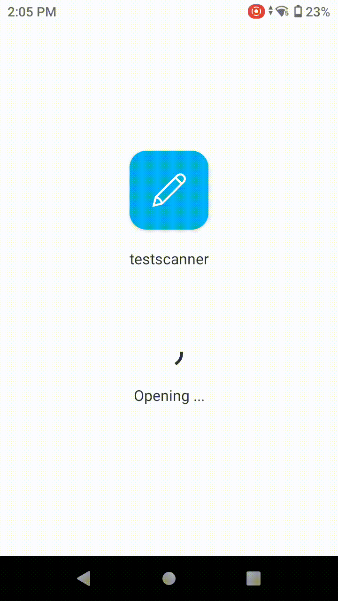

## Introduction

In this blog, we’ll explore how you can use PowerApps to create apps that interact with scanners (QR Code and Barcode), making tasks like inventory management, tracking, and data collection easier than ever before. The Power apps will make use of the inbuild scanning capability of the device to scan the codes and act accordingly.

## Business Scenario

The company decides to implement a new inventory management system that leverages QR code scanning technology. The plan is to equip warehouse staff with handheld devices equipped with native scanners specifically designed for scanning QR codes.

Furthermore, the existing barcode scanning system, which relies on mobile phone cameras, is not reliable in the warehouse environment due to poor lighting conditions and the need for manual focusing.

Here in this blog I am taking the example of the Zebra scanner TC 26.

## Implementation

We all know that power apps have in build control to perform the QR code scanning which internally uses the device camera to scan the QR codes. This has its own limitation as

The process is slow
    1. It takes clicks to proceed further
    2. Chances of error are high
    3. In order to overcome these issues, we build the app that uses the native external scanners of the Zebra TC 26 device.

## Current Challenges

To integrate the external scanners in power apps the basic approach is as follows

  1. Create a screen with a textbox
  2. Set the focus on the textbox
  3. Scan the QR Code from the scanner to receive the value on the textbox
  4. Write the logic on the OnChange event of the textbox to handle the scanned value
  5. The biggest challenge with this approach is that as soon as you focus on the textbox to receive the value of the scanner, the native keyboard of the device pops out and kills the overall experience of the app.

## Solution

In order to overcome the challenges, we need to configure the Zebra scanner with following configuration.

[ZebraConfiguration](https://sohilblogs.wordpress.com/wp-content/uploads/2024/05/setup-zebra-scanner-overview-1.pdf)

**This is the onetime setup on the zebra scanner to configure the behavior of the scanner only for Power Apps.**

### Summary of Configuration

  1. Create a new profile in zebra scanner for power apps
  2. Configure the profile to have a TAB event being sent before and after the scanned value
  3. Set a delay of 500ms between the events

The above configuration will help us to handle the scanned value inside the power apps.

## Power Apps Development

1. Create a screen in power app canvas app and add a text box, a timer control and a button on the screen as shown below. Make sure to add the textbox below the button or possibly the last control on the screen. This is how the screen looks with all the controls visible.

2. Set the Tab index of the textbox as 1 and the Tab Index of Button as -1 and Tab index of the timer control as 0. If you have any other controls on the screen, make sure all of them has set a tab index as -1. The only control which will have a positive tab index on the screen will be a textbox which will receive the scanned value from the scanner.

3. Set timer to autostart as True and set the duration as 1 second and on TimerEnd Set the focus to the button control.

4. Add a rectangle covering the entire screen and make it white and push the textbox, button and timer behind the rectangle. Now the screen looks like this.

5. Write your logic on the OnChange event of the textbox and further set the focus back to the button and reset the textbox. In my case I am setting a context variable scanntext with the scanned value which I can use anywhere in the current screen.

**Key point to remember here – The button has to be placed above the textbox because the tab works top to bottom and when the first scan is completed the focus is set back to the button so that user can scan again if needed.**

Now the screen is ready to accept the scan value from the external scanner without showing keyboard and gives an experience of native integration with the scanner.

### Logical flow of Scanning

When the user is on this screen and scans a QR code with the external scanner using side buttons or the scanning gun, following things happen

  1. As we have configured a Tab event before the scanned value in the scanner configuration above, it sets the focus on the Textbox as it has the tab index as 1
  2. It inserts the scanned value inside the textbox
  3. It tabs out of the textbox as we also have configured a Tab event after the scanned value
  4. OnChange event of the textbox is fired which give the scanned value as Self.Text
  5. Inside OnChange event we clear the textbox value after receiving it and set the focus back to the button above to be ready for the next scan
  6. All these events happen so fast that the device OS cannot open keyboard as the focus is already moved out of the textbox.

  ## Demo

  The demo scans QR codes using the side buttons of the scanner, it scans the first QR code and then on the same screen without any action it scans another QR code. (You can see the device footer arrow movement up and down when the scan happens)

  
