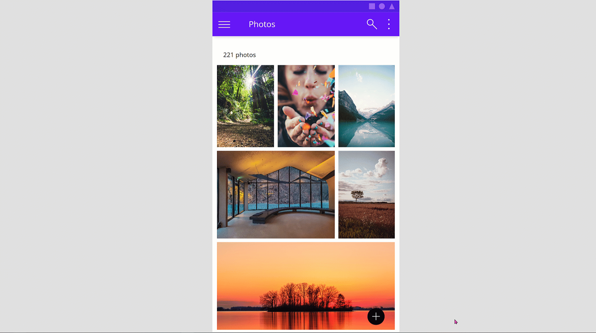
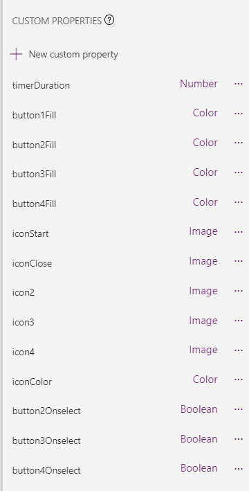
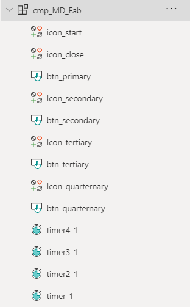
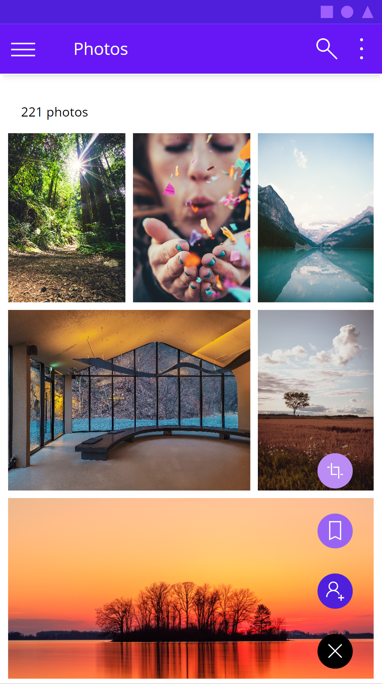

One of my most important goals when developing Power Apps is good design. But for me,

> Design is not just pretty looks or some stunning effects, but it is how things *work*.

This means that a well designed app makes people feel related, understood, comfortable and easily experienced. People will want to use the app again and again.

Looking at the typical look of Power Apps, I don't feel that these are well-designed in term of increasing usability, being visually appealing, or blending into the context they probably live in. This highly functional look shall convey the message, that people will get something working without putting too much effort into it. And that then leads to that perception, that low-code equals low standards in terms of design.

This is the first part of a little series that illustrates, how we can develop Power Apps, that don't look like Power Apps. I will use [Google's Material design](https://material.io/design/introduction) system to showcase this. If you are looking into some Microsoft Fluent UI guidance - I blogged about [good looking apps for Teams here](https://www.m365princess.com/blogs/2022-07-06-how-to-enhance-maker-experience-with-a-custom-theme-for-teams-apps-in-power-apps-studio/).

## Floating Action Button (FAB)

The [Floating Action Button (FAB)](https://material.io/components/buttons-floating-action-button#:~:text=A%20floating%20action%20button%20(FAB)%20performs%20the%20primary%2C%20or,regular%2C%20mini%2C%20and%20extended.) is a design concept, that we can find in all kinds of mobile apps, for example Twitter mobile app, Outlook mobile app, and mny, many more. We say its floating, as it doesn't sit in a dedicated navigation area, but *floats* right on top of most probably scrolling content. Once that FAB is selected, it show some more related buttons that allows users to perform related actions.

## How to build a FAB in Power Apps

To make this FAB as flexible and reusable as possible, we will create a canvas component `cmp_MD_Fab`. Set its **Width** to `100` and its **Height** to `380`. Our Fab will consist of

### Overview

1. 1 button `btn_primary` with two icons `icon_start` and `icon_close`
2. 3 `btn_secondary`, `btn_tertiary`, `btn_quarternary` with 3 corresponding icons `icon_secondary`, `icon_tertiary`, `icon_quarternary`
3. 4 timers `timer1`, `timer2`, `timer3`, `timer4`

Add these to your component - we will style them in a few.

### Custom properties

We will create the following custom properties

1. **timerDuration** (Number), defaults to `300`, determines the **Duration** of all timers
2. **button1Fill** (Color), defaults to `Black`, determines **Fill** of `btn_primary`
3. **button2Fill** (Color), defaults to `ColorValue("#4F1FDC")`, determines **Fill** of `btn_secondary`
4. **button3Fill** (Color), defaults to `ColorValue("#9964f4")`, determines **Fill** of `btn_tertiary`
5. **button4Fill** (Color), defaults to `ColorValue("#BB8cF4")`, determines **Fill** of `btn_quarternary`
6. **iconStart** (Image), defaults to `Icon.Add`, determines the **Icon** of `icon_Start`
7. **iconClose** (Image), defaults to `Icon.Cancel`, determines the **Icon** of `icon_Close`
8. **icon2** (Image), defaults to `Icon.People`, determines the **Icon** of `icon_secondary`
9. **icon3** (Image), defaults to `Icon.Bookmark`, determines the **Icon** of `icon_tertiary`
10. **icon4** (Image), defaults to `Icon.Crop`, determines the **Icon** of `icon_quarternary`
11. **iconColor** (Color), defaults to `White`, determines the **Color** of all icons
12. **button2OnSelect** (Behavior, boolean), defaults to `true`, determines the **OnSelect** of `btn_secondary`
13. **button3OnSelect** (Behavior, boolean), defaults to `true`, determines the **OnSelect** of `btn_tertiary`
14. **button4OnSelect** (Behavior, boolean), defaults to `true`, determines the **OnSelect** of `btn_quarternary`

and assign them as stated above. Example: Select all timers, select the **Duration** property for them, set it to `cmp_MD_FAB.timerDuration`. Proceed with all other custom properties like that.

### The buttons

We will now take care of the buttons. Select all of them and set their

1. **Width** to `56`, **Height** to `Self.Width` and `Radius` to `Self.Width`. - We now have circle buttons!
2. **BorderColor**, **HoverBorderColor**, **PressedBorderColor**, **HoverFill** to `Self.Fill`
3. **Text** to `""`

Now only select the `btn_primary` and set its **X** to `(Parent.Width-Self.Width)/2` and its **Y** to `Parent.Height-Self.Height-10`. After that is done, select all *other* buttons and set their **X** to `btn_primary.X`.

### The Icons

Set **Width** of all icons to `32` and **Height** to `Self.Width`
Set **X** of all icons to `btn_primary.X+ (btn_primary.Width-Self.Width)/2`
Set **Y** of `btn_secondary` to `btn_secondary.Y+ (btn_secondary.Height-Self.Height)/2`
Set **Y** of `btn_tertiary` to `btn_tertiary.Y+ (btn_tertiary.Height-Self.Height)/2`
Set **Y** of `btn_quarternary` to `btn_quarternary.Y+ (btn_quarternary.Height-Self.Height)/2`

Make sure that all controls sit in the correct order as they overlap:

### The Timers

Now we will take care of the logic.

1. In the **OnSelect** of the `icon_Start` we want to extract all buttons and handle which icon appears : `Set(start1, true); Set(start4, false); Set(isCloseVisible, true); Set(isStartVisible, false);`
2. In the **OnSelect** of `icon_Close` we want to collapse all buttons and handle which icon appears: `Set(isCloseVisible, false); Set(isStartVisible, true); Set(start1, false); Set(start2, false); Set(start3, false); Set(start4, true);`
3. Set the **Visible** of `icon_Close` to `isCloseVisible`, the **Visible** of `icon_Start` to `isStartVisible`
4. Set the **Start** of `timer1` to `start1`, and the `OnTimerEnd` of `timer1` to `Set(start2, true)` - which means that at the end of the first timer, we kick off the second timer.
5. Set the **Start** of `timer2` to `start2`, and the `OnTimerEnd` of `timer2` to `Set(start3, true)`
6. Set the **Start** of `timer3` to `start3` - please note that at this point we don't want to kick off another timer - all buttons are expanded and we only want to collapse them when our user selects the `icon_Close`.

Let's now hook the **Y** property of `btn_secondary`, `btn_tertiary`, `btn_quarternary` to the timers so that the buttons nicely float to their final position:

1. Set the **Y** of `btn_secondary` to `If(!start4,  btn_primary.Y-100*(timer1.Value/timer1.Duration),btn_primary.Y)`
2. Set the **Y** of `btn_tertiary` to `If(!start4, btn_primary.Y-200*(timer2.Value/timer2.Duration), btn_primary.Y)`
3. Set the **Y** of `btn_quarternary` to `If(!start4,btn_primary.Y-300*(timer3.Value/timer3.Duration),btn_primary.Y)`

Add your component to a screen and don't forget to now assign actions to the buttons :-)

## Feedback and what's next?

That's it!

a few buttons, icons and 4 timers are enough to create some advanced UI that you'd usually not find in a Power Apps. Next blog post is about how to create such beautiful photo galleries, that don't look like default Power Apps experience. Let me know what you think on twitter or in the comments below.

