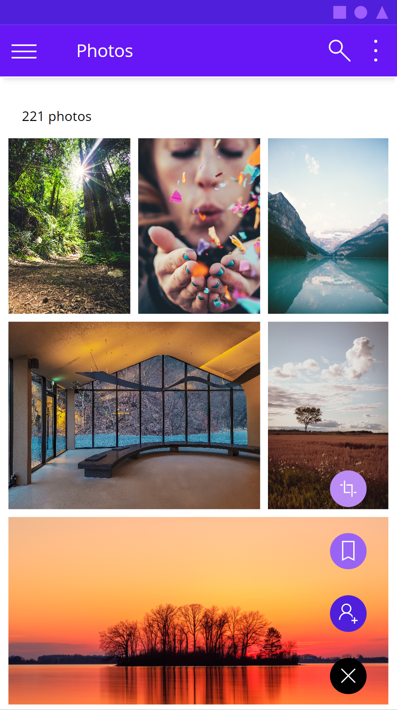
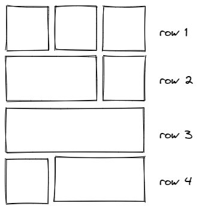

For real, your low code apps don't need to look like as if design wasn't important. I hear lots of people say, that they *suck at design* or don't have an eye for good UX. But a visually appealing UI is not the cherry on the cake but one of the core tasks of everyone who builds apps. Let me guide you step by step how you can improve your design skills - we will be again leveraging Google's Material Design system. This is part 2 of How to build Power Apps - that don't like Power Apps. If you didn't read [part 1](https://www.m365princess.com/blogs/powerapps-material-design-1/) yet, this is your chance to catch up :-) 

Why do we use Material Design? It's

- goodlooking
- well documented
- widely used

Also: If we can build Google/Android look-a-like apps with Microsoft Power Apps, we can build everything :-) 

This blog post focuses on how to create those beautiful Material Design [quilted image lists](https://material.io/components/image-lists#usage) in Power Apps galleries.



This is the schema that we are aiming for: it consists of 4 types of rows which hold different amount of images in different widths and x positions. After these 4 rows, we continue this pattern.



## Create a component

Let's do this properly and create a canvas component `cmp_MD_Gallery` with the following custom properties:

- **singleImageWidth**:  `200`
- **imagePadding**: `10`

Now let's take care of how to feed our gallery. Create an additional custom property `galleryContent` in the component of type **Table**:

```
Table(
    //row 1, 3 images
    {
        id: 1,
        image: "<link to your image goes here>",
        width: cmp_MD_Gallery.singleImageWidth
    },
    {
        id: 2,
        image:"<link to your image goes here>",
        width: cmp_MD_Gallery.singleImageWidth
    },
    {
        id: 3,
        image:"<link to your image goes here>",
        width: cmp_MD_Gallery.singleImageWidth
    },
    // row 2, 2 images (1st 2/3, 2nd 1/3)
    {
        id: 4,
        image: "<link to your image goes here>",
        width: 2 * (cmp_MD_Gallery.singleImageWidth) + cmp_MD_Gallery.imagePadding
    },
    {id: 5},
    {
        id: 5,
        image: "<link to your image goes here>",
        width: cmp_MD_Gallery.singleImageWidth
    },
    //3rd row - 1 image
    {
        id: 6,
        image: "<link to your image goes here>",
        width: 3 * (cmp_MD_Gallery.singleImageWidth) + 2 * ( cmp_MD_Gallery.imagePadding)
    },
    {id: 7},
    {id: 8},
    //4th row - 2 images (1st 1/3, 2nd 2/3)
    {
        id: 7,
        image: "<link to your image goes here>",
        width: cmp_MD_Gallery.singleImageWidth
    },
    {
        id: 8,
        image: "<link to your image goes here>",
        width: 2 * (cmp_MD_Gallery.singleImageWidth) + cmp_MD_Gallery.imagePadding
    },
    {id: 9},
    //5th row - 3 images
    {
        id: 9,
        image: "<link to your image goes here>",
        width: cmp_MD_Gallery.singleImageWidth
    },
    {
        id: 10,
        image: "<link to your image goes here>",
        width: cmp_MD_Gallery.singleImageWidth
    },
    {
        id: 11,
        image: "<link to your image goes here>",
        width: cmp_MD_Gallery.singleImageWidth
    },
    //6th row -rest
    {
        id: 12,
        image: "<link to your image goes here>",
        width: cmp_MD_Gallery.singleImageWidth
    },
    {
        id: 13,
        image: "<link to your image goes here>",
        width: 2 * (cmp_MD_Gallery.singleImageWidth) + cmp_MD_Gallery.imagePadding
    }
)
```

As you notice, we leave some items blank to make room for items that span the width of two items.

## Create a gallery

1. Create a vertical gallery, set its **Width** to `Parent.Width`, its **Height** to `1000`, its **TemplateSize** to `300`
2. Set the the **Items** to `cmp_MD_Gallery.galleryContent`
3. Insert an image into the gallery, set its **Height** to `Parent.TemplateHeight`
4. Set the **Image** property of the image to `ThisItem.image`
5. Set the **Width** property of the image to `ThisItem.width`

## Create the invisible scrollbar

If you want to create an invisible scrollbar

1. Add a vertical slider on top of the gallery, set its **Max** to `0` and its **Min** to `-1000`, and its **Height** to `Gallery1.Height`
2. Set *all* its colors to `Transparent` to make it disappear, but don't set **Visible** to `false` (Users can't interact with a control that has that setting)
3. Set the **Y** of the Image to `Slider1.Value` - boom, done 🚀

You can set the **Width** of the slider and the Size of the Handle to the Width of the gallery if users shall use the entire gallery width to scroll or you can limit this and give them a visual cue (a button, circle, etc) so that they know that they can scroll here.

## Feedback and what's next

As you can see, its relatively easy to create an engaging UX in Power Apps. When discussing this with the Math & SVG magician [Robin Rosengrün](https://twitter.com/power_r2), he found an even more elegant way to calculate widths and x positions of each image, hope he records a video on that soon - #TeamWorkMakesTheDreamWork

Would you try this gallery in your Power Apps? Let me know what you think on twitter or in the comments below. Next blog post in this series is how to create basic UI elements that you will love.
