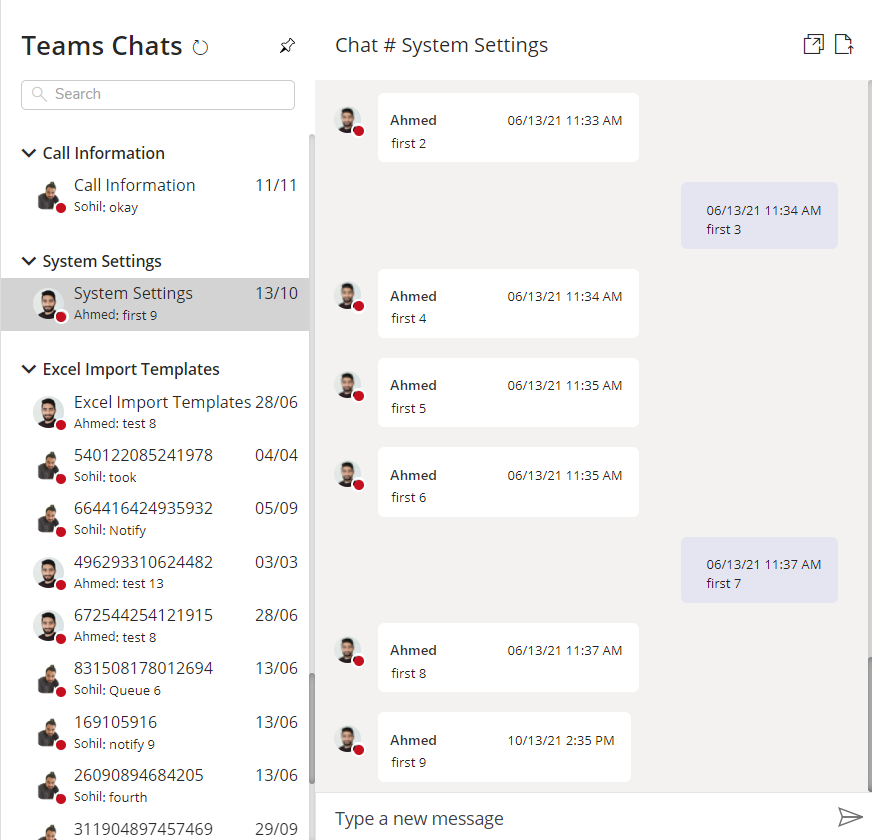
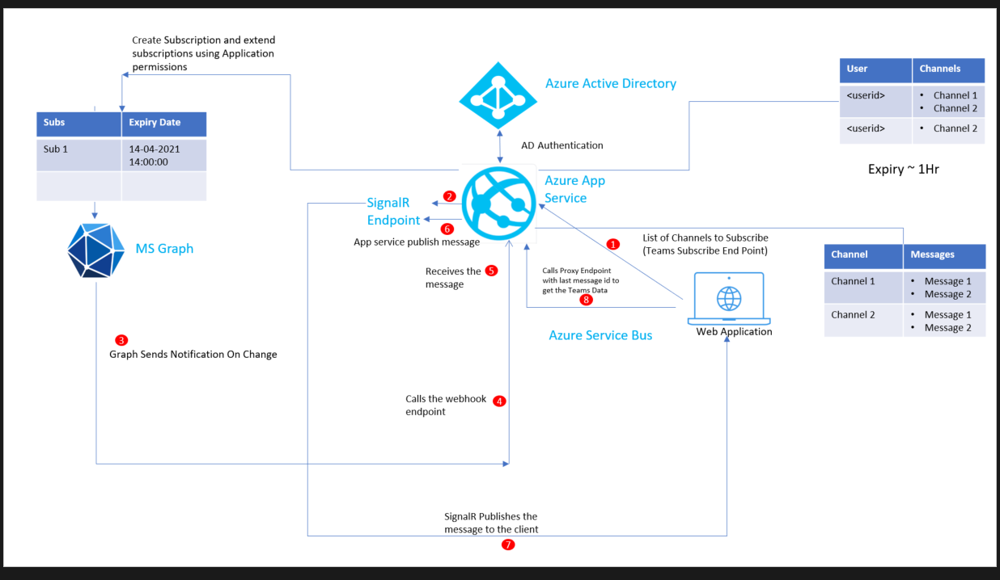
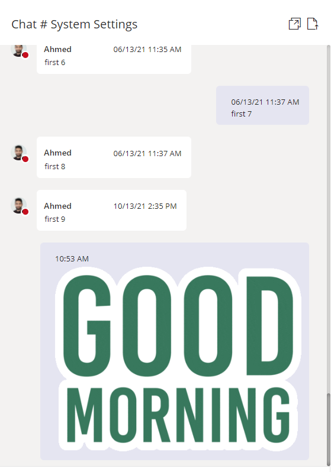
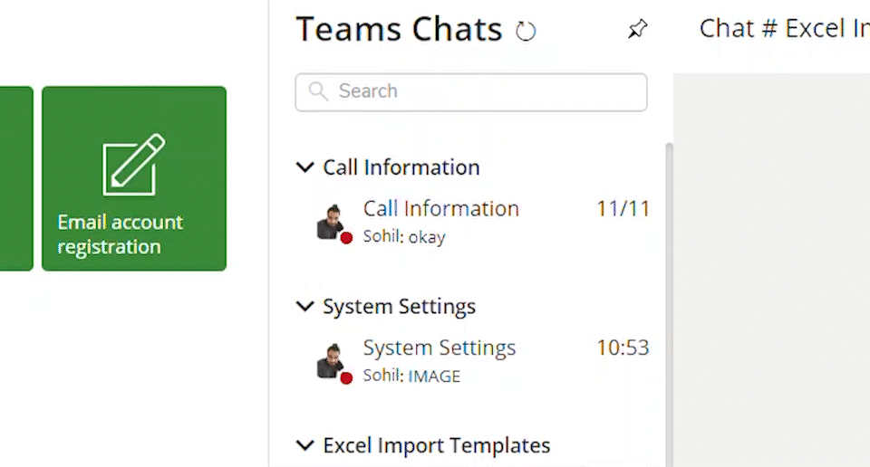

## Business Case

Teams chat is a great communication tool that is adopted worldwide. Our customers use it extensively, so we decided to integrate it in our [Codeless](https://codeless.com/) ERP software platform.

Build your own Microsoft Teams in React Typescript and integrated with a web application using web components. The teams functionality should include

* Sending messages from web app and posting in MS Teams
* Receiving messages in web app when new message is posted in teams
* Get notified in web app when someone post a message in teams
* Show emojis in web app when reactions happen in teams

Before we go through the technical details of the implementation, here how custom teams chat looks today in the web application.



## List of components included

### Front End

1. Microsoft Graph Toolkit
2. React Typescript 16.13.1
3. Web Pack 4.4.0
4. babel 8.2.2
5. jest – unit testing (Will Cover in another Blog)

### Back End

1. .NET 5.0 ( CORE )
2. Graph Change Subscriptions
3. SignalR
4. Kubernetes / Docker / Helm (Optional)(Will Cover in another Blog)

## Architecture



## Microsoft Graph Toolkit

The Microsoft Graph Toolkit is a collection of reusable, framework-agnostic components and authentication providers for accessing and working with Microsoft Graph. The components are fully functional right of out of the box, with built in providers that authenticate with and fetch data from Microsoft Graph.

### MGT-GET

You can use mgt-get to make any GET query from Microsoft Graph directly in your HTML. The component does not provide a default UI and requires that you write a template.
Before we talk about sub components of the teams chat . For every Microsoft Graph toolkit component to work it needs a provider.
The Microsoft Graph Toolkit providers enable your application to authenticate with Microsoft Identity and access Microsoft Graph in only few lines of code. Each provider handles user authentication and acquiring the access tokens to call Microsoft Graph APIs, so that you don’t have to write this code yourself.
In this case I am using a proxy provider which will redirect all the request from the Graph toolkit components to my custom .NET Core API. This gives lot of flexibility of managing the request and overcoming any thresholds imposed by Microsoft Graph.
You can read more about proxy provider [here](https://docs.microsoft.com/en-us/graph/toolkit/providers/proxy)

### Initialize Proxy Provider

Since my .NET Core API is authenticated against Azure AD , so I am passing and additional header for the authorization carrying Bearer token from client. More details on the authentication can be found [here](https://github.com/Azure-Samples/ms-identity-javascript-angular-tutorial/tree/main/3-Authorization-II/1-call-api)

```typescript
Providers.globalProvider = new ProxyProvider(`${notificationAPIURL}`,
 async () => {
          return {
            "Content-Type" : "application/json",
            "Authorization" : "Bearer <token>"+
          };
        }
        );
```

## Left and Right side screen Components

The left and right hand side of the screen components are multiple MGT-GET components templatized as below.


### LastMessageComponent

```typescript
<Get cacheEnabled={true}
cacheInvalidationPeriod={36000}
maxPages={1}
version="beta"
resource={"teams/<TeamID>/channels/<ChannelID>/messages/<MessageID>/replies?$top=1"}>
        <LastMessageItem template="value" />
        <LoadingTemplate template="loading" />
</Get>
```

In the above component we have 2 sub components having their own templates. The LastMessageItem component loads when the data is received from the API and LoadingTemplate component loads when the call is happening to the backend service. The loading template is used to show the progress or loading behavior. In my case I am showing shimmers from [Fluent UI Controls](https://developer.microsoft.com/en-us/fluentui#/controls/web).

### LoadingTemplate

```typescript
const shimmerWithElementThirdRow = [
    { type: ShimmerElementType.circle, height: 24 },
    { type: ShimmerElementType.gap, width: '30%' },
    { type: ShimmerElementType.line, height: 16, width: '20%' },
    { type: ShimmerElementType.gap, width: '5%' }
];
/**
 * This components provides the loading effect as in when the graph calls happens
 * @param props
 */
export function LoadingTemplate(props: MgtTemplateProps) {
    return (<div><Shimmer shimmerElements={shimmerWithElementThirdRow} />
        <Shimmer shimmerElements={shimmerWithElementThirdRow} /></div>);
}
```

### LastMessageItem

```typescript
export const LastMessageItem = (props: any) => {

    return (
    <div className="teams-chat-last-message-container">
        <div className="teams-chat-last-message-container-block">
             <div className="teams-chat-conversation-message">
                <Person line1Property={"givenName"} fetchImage={true}
                        userId={props.dataContext.from.user.id}
                        showPresence={true} personCardInteraction={1}
                        view={PersonViewType.oneline}>
                </Person>
                <div data-testid="content" className={`teams-chat-last-message-content>
                    {content}
                </div>
            </div>
        </div>
        <div className={`teams-chat-last-message-time`}>
            <created date time>
        </div>
    </div>);
}
```



The right side is another MGT-GET component but for demo purpose I am sharing the pure MGT-GET instead on MGT react as demoed for the left side.

```typescript
<mgt-get cache-enabled={true}
    cache-invalidation-period={36000}
     id="messagesGet"
    version="beta"
    resource={"teams/<TeamID>/channels/<ChannelID>/messages/<MessageID>/replies"}>
    <template data-type="value"
        <Inside the template based on the graph response , rendering can happen like
        emojis , logged in user message UI and other users message UI as shown above
    </template>
 </mgt-get>
 ```

### Back End Implementation ( .NET 5 )

The backend implementation involves development of .NET core API, which manages following

1) User Authentication

2) Graph Change Subscription

3) SignalR management with groups

4) Respond to all the graph calls ( acting as a provider in the Microsoft Graph toolkit proxy provider )

### User Authentication

All the calls to the .NET core API are authenticated against Azure AD except the receiver for the change notification which I will cover below in this blog as well.

Using dependency injection following authentication is injected in the .NET core API to validate all the requests against Azure AD app.

```cs
// The below configuration is done to read Azure AD configuration from Helm
            // Direct section bind doesnt work with AddMicrosoftIdentityWebApi and environment variables.

            services.AddAuthentication(JwtBearerDefaults.AuthenticationScheme)
                .AddMicrosoftIdentityWebApi(options => { }, options => {
                    options.Instance = azureAD.Instance != null ? azureAD.Instance
: "https://login.microsoftonline.com/"; // default value
      options.Domain = <Domain>;
           options.TenantId = <Tenant ID>;
           options.ClientId = <Client ID>;
                   options.CallbackPath = <Callback Path>;
                    options.ClientSecret = <Client Scecret>;
                }).EnableTokenAcquisitionToCallDownstreamApi(confidentialClientApplicationOptions =>
                {
              confidentialClientApplicationOptions.Instance = <Instance>;
               confidentialClientApplicationOptions.TenantId = <Tenant ID>;
               confidentialClientApplicationOptions.ClientId = <Client ID>;
                     confidentialClientApplicationOptions.ClientSecret = <Client Secret>;
                })
                .AddInMemoryTokenCaches();
```

Also, we need to inject GraphServiceClient to call the graph APIs from the .net core api. The below function needs to called in your startup.cs.

```cs
public static void AddMicrosoftGraph(this IServiceCollection services,
                                             IEnumerable<string> initialScopes, string graphBaseUrl
                                             )
        {
            services.AddTokenAcquisition(true);

            services.AddSingleton<GraphServiceClient, GraphServiceClient>(serviceProvider =>
            {
                ITokenAcquisition? tokenAquisitionService = serviceProvider.GetService<ITokenAcquisition>();
                GraphServiceClient client = string.IsNullOrWhiteSpace(graphBaseUrl) ?

            new GraphServiceClient(new TokenAcquisitionCredentialProvider(tokenAquisitionService,
                                      initialScopes)) :
                             new GraphServiceClient(graphBaseUrl,
            new TokenAcquisitionCredentialProvider(tokenAquisitionService, initialScopes));

                return client;
            });
        }
```

## Graph Change Subscription

A subscription allows a client app to receive change notifications about changes to data in Microsoft Graph.
Please refer the below article for the details of the change subscription
https://docs.microsoft.com/en-us/graph/api/subscription-post-subscriptions?view=graph-rest-1.0&tabs=http
In this case a change subscription is created for the channel to receive the notifications for the messages posted , updated or deleted from the channel.

## Sample Request to Graph

`https://graph.microsoft.com/v1.0/subscriptions`

```
{
    "changeType": "created,updated,deleted",
    "notificationUrl": "<API Endpoint URL>",
    "resource": "teams/<teamid>/channels/<channelid>",
    "expirationDateTime": "2021-06-24T12:45:45.9356913Z",
    "clientState": "Y29kZWxlc3M=",
    "latestSupportedTlsVersion": "v1_2"
}
```

**Please note that all the subscriptions have the expiry period, so managing the subscriptions and keeping it alive should be taken care as part of the implementation.**
See below article for the expiry details for each subscription type.

[Maximum length of subscription per resource type](https://docs.microsoft.com/graph/api/resources/subscription?view=graph-rest-1.0#maximum-length-of-subscription-per-resource-type)

## SignalR Implementation

In order to send out the notifications to client for any new messages posted on the Microsoft Teams channel SignalR is used.



First we need to inject the SignalR in .NET core API using dependency injection. Update the startup.cs file of the API and add the following.3

```cs
services.AddSingleton<ISignalRManager, SignalRManager>();
services.AddSignalR();
```

Below is the implementation for the SignalRManager class.

```cs
public class SignalRManager : ISignalRManager
    {
        private readonly IHubContext<NotificationHub, IHubClient> hubContext;
        private readonly NotificationHub hub;
        public SignalRManager(IHubContext<NotificationHub, IHubClient> hubContext,
                              NotificationHub hub)
        {
            this.hubContext = hubContext ??
                            throw new ArgumentNullException(nameof(hubContext));
            this.hub = hub ?? throw new ArgumentNullException(nameof(hub));
        }
        public void AddClientToSignalRGroup(string groupName)
        {
            if (hub.Context != null)
            {
                string connectionID = hub.Context.ConnectionId;
                hubContext.Groups.AddToGroupAsync(connectionID, groupName).Wait();
            }
        }

        public void SendSignalRMessage(string groupName,Notification signalRMessage)
        {
            hubContext.Clients.Group(groupName).BroadcastMessage(signalRMessage);
        }
    }
```

When a new message is received from the graph change notification, signalR SendSignalRMessage method is called to push the notification to the signal R groups containing all the clients connected.

The client has to implement the following code in order connect to the SignalR endpoint to receive the SignalR messages.

```typescript
const newConnection = new HubConnectionBuilder()
          .configureLogging(signalR.LogLevel.Information)
          .withUrl(endpoint, {
            skipNegotiation: true,
            transport: signalR.HttpTransportType.WebSockets,
          }).build();

        // start the connection
        newConnection
          .start()
          .then(() => {
            resolve(true);
          })
          .catch(_ => {
            console.log('Error while establishing connection :(' + endpoint);
            });
```
## Respond to All Graph Calls ( Proxy Provider )

The backend API will expose an endpoint which responds to all the Graph calls from the client. This includes

1) Get new messages

2) Profile information (Including profile card)

3) Presence Indicator

```cs
[HttpGet]
        [Route("{version}/teams/{teamId}/channels/{channelId}/messages/{conversationId}/replies")]
        public async Task<IActionResult> GetAsync(string version, string teamId,
                                                  string channelId, string conversationId)
        {
            bool needsUpdate = false;
            ChannelConversationReplies? finalCollectionPage = null;
            string? userID = GetCurrentUserID();
            var teamMessagesInput = new TeamMessagesInput()
            {
                ChannelID = channelId,
                ConversationID = conversationId,
                TeamID = teamId
            };
            if (userID != null && notificationService.ValidateUserForChannelAccess(userID, channelId, teamId))
            {
                lockManager.LockReadMode(() =>
            {
                needsUpdate = cacheHelper.
GetCache(CacheKeys.ChannelConversationMessages + teamMessagesInput.ConversationID) == null;
            });
                if (needsUpdate)
                {
                    await lockManager.LockWriteMode(async () =>
                      {
 needsUpdate = cacheHelper.GetCache(CacheKeys.ChannelConversationMessages + teamMessagesInput.ConversationID) == null;
                          if (needsUpdate)
                          {
                              //write your code to get data from teams using Graph API
                          }
                           else
                          {
                            // Serve from Cache
                          }


                      });
                }
                else
                {
                    finalCollectionPage =
       (ChannelConversationReplies)cacheHelper.
GetCache(CacheKeys.ChannelConversationMessages + teamMessagesInput.ConversationID);
                }

                return Ok(finalCollectionPage);
            }
            else
            {
                return Unauthorized();
            }
        }
```

Please not I am using LockManager here, this is required to streamline the requests to get the data from teams. As when the new message is posted on teams, signalR will notify all the clients simultaneously to get the data from Teams, so lockmanager will allow the first request to go and get the data from teams while other requests wait, once the first request releases the lock, all other clients will be served from the cache.

## Client Side Changes to Get latest messages from Teams

Now we have the backend API ready to serve the client requests. So what will happen in the client when the signalR sends a message saying a new message is posted on teams.

Once the client receives a message from signalR, the MGT Get component will refresh the data, just by calling the refresh method of the MGT component.

```typescript
newConnection.on('BroadcastMessage', (message:Notification) => {
          if(message.resource.includes("/replies("))
          {
              //refresh the MGT Get components to pull the latest changes
               var mgtElement = document.getElementById("<mgt parent identifier").getElementsByTagName('mgt-get') as MgtGet
      mgtElement.refresh(false);
          }
          else
          {
              //Ignore the Notification
          }
```

Refresh method is the key here as when it is called the mgt component will make a call to the proxy provider (.NET API) which gives the latest data from Teams and the MGT component will be refreshed with the latest message.

https://docs.microsoft.com/en-us/graph/toolkit/components/get#methods


So, above components are involved in making a stable version of your own teams chat. Below are few optional things added on bundling the project and creating a web component.

### Webpack Config

```typescript
const path = require('path');
const MiniCssExtractPlugin = require("mini-css-extract-plugin");
module.exports = {
    entry: "./src/components/teamscontainer/teamscontainer.tsx",
    module: {
        rules: [{
            test: /\.(ts|js)x?$/,
            exclude: /node_modules/,
            use: {
                loader: "babel-loader",
                options: {
                    presets: [
                        "@babel/preset-env",
                        "@babel/preset-react",
                        "@babel/preset-typescript"
                    ],
                },
            },
        },
        {
            test: /\.(css|scss)$/,
            // use: ["style-loader", "css-loader"],
            use: ["style-loader", "css-loader", "sass-loader"],
        },
        { // config for fonts
            test: /\.(woff|woff2|eot|ttf|otf)$/,
            use: [{
                loader: 'file-loader',
                options: {
                    outputPath: 'fonts',
                }
            }],
        }
        ],
    },
    resolve: {
        extensions: [".tsx", ".ts", ".js"],
    },
    output: {
        path: path.resolve(__dirname, "build"),
        filename: "cln.teams-chat-ui.js",
    },
    mode: "development",
    entry: {
        app: "./src/components/teamscontainer/teamscontainer.tsx"
    },
    devServer: {
        contentBase: path.join(__dirname, './'), // where dev server will look for static files, not compiled
        publicPath: '/', //relative path to output path where  devserver will look for compiled files
        port: 4000
    },
    //devtool: 'inline-source-map' // this will be required for the debugging and testing purpose
};
```

## React to Web Component

react-to-webcomponent converts React components to custom elements! It lets you share react components as native elements that don’t require mounted being through React. The custom element acts as a wrapper for the underlying react component. Use these custom elements in any framework (vue, svelte, angular, ember, canjs) the same way you would use standard HTML elements.

https://www.npmjs.com/package/react-to-webcomponent

In my main component tsx file I have added below to create a web component element for my react components.

```typescript
import reactToWebComponent from "react-to-webcomponent";

customElements.define("cln-teams-chat-element", reactToWebComponent(TeamsContainer, React, ReactDOM));
```

This will define a custom html tag for my react application which can be used in any javascript/html based application

## Usage

```<cln-teams-chat-element></cln-teams-chat-element>```

So here you have it: a fully integrated Teamschat…

I’ve received so much help from the Microsoft community, that I hope by writing this article I can give something back.

If you have any questions/clarifications please post it in the comments, I’m more than happy to help you out.

THANK YOU….
