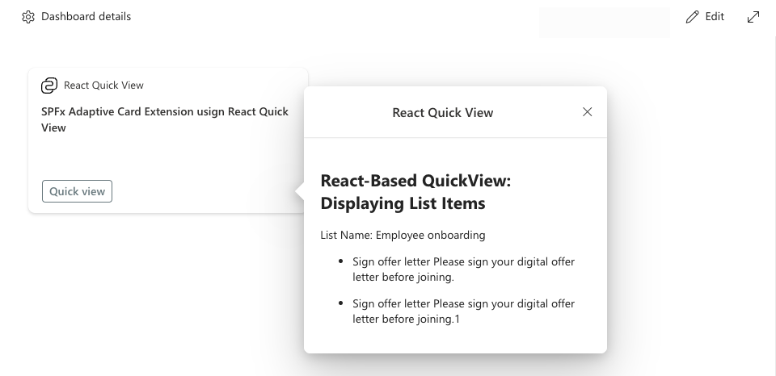

## Introduction

With the release of **SPFx 1.20**, developers now have greater flexibility when building Quick Views in Adaptive Card Extensions (ACE). The new update allows you to use **HTML**, **React**, or **any** **front-end framework** of your choice, moving beyond the limitations of the previous Adaptive Card-based approach. This opens up new possibilities for customization and control over the user interface. This guide will walk you through the steps to convert a basic Adaptive Card Quick View into a fully functional **React-based Quick View**.

[Solution Sample: BasicCard-React-QuickView](https://github.com/ahmad-jad-alhak/BasicCard-React-QuickView) 



### **Creating a React-based Qick View**

#### **Step 1: Set Up Your SPFx Project**

Start by creating a new SPFx project using the Yeoman generator:

```bash
yo @microsoft/sharepoint
```

When prompted, choose the **Adaptive Card Extension** template and follow the on-screen instructions to provide project details such as the name and description.

Enter the following values (*select the default option for all prompts omitted below*):

* **Do you want to allow tenant admin the choice of deploying the solution to all sites immediately without running any feature deployment or adding apps in sites?** Yes
    
* **Which type of client-side component to create?** Adaptive Card Extension
    
* **Which template do you want to use?** Generic Card Template
    
* **What is your Adaptive Card Extension name?** ReactQuickView
    

Once your project is created, open it in **Visual Studio Code**:

```bash
code .
```

#### **Step 2: Convert the Adaptive Card Quick View to React**

We will convert the **Adaptive Card-based Quick View** into a **React-based Quick View** by replacing the Adaptive Card template with a React component.

Here is the initial Adaptive Card-based Quick View:

```typescript
import { ISPFxAdaptiveCard, BaseAdaptiveCardQuickView } from '@microsoft/sp-adaptive-card-extension-base';
import * as strings from 'ReactQuickViewAdaptiveCardExtensionStrings';
import {
  IReactQuickViewAdaptiveCardExtensionProps,
  IReactQuickViewAdaptiveCardExtensionState
} from '../ReactQuickViewAdaptiveCardExtension';

export interface IQuickViewData {
  subTitle: string;
  title: string;
}

export class QuickView extends BaseAdaptiveCardQuickView<
  IReactQuickViewAdaptiveCardExtensionProps,
  IReactQuickViewAdaptiveCardExtensionState,
  IQuickViewData
> {
  public get data(): IQuickViewData {
    return {
      subTitle: strings.SubTitle,
      title: strings.Title
    };
  }

  public get template(): ISPFxAdaptiveCard {
    return require('./template/QuickViewTemplate.json');
  }
}
```

Now, let's **convert it into React**:

1. Open `QuickView.ts` file
    
    Navigate to `src/adaptiveCardExtensions/reactQuickView/quickView/QuickView.ts` in your project and open the file for editing.
    
2. Repalce the first import line as follows:
    
    The orginal line before change
    

```typescript
import { ISPFxAdaptiveCard, BaseAdaptiveCardQuickView } from '@microsoft/sp-adaptive-card-extension-base';
```

* `ISPFxAdaptiveCard`: This was used for Adaptive Cards, specifically to define the structure and content of Adaptive Card templates in JSON format.
    
* `BaseAdaptiveCardQuickView`: This is a class that extends functionality to create Quick Views using Adaptive Cards.
    

Since we're moving away from **Adaptive Cards** to **React-based rendering**, both of these imports are no longer needed, so they are removed.

3. Add the Import for `BaseWebQuickView`
    
    New Line:
    
    ```typescript
    import { BaseWebQuickView } from '@microsoft/sp-adaptive-card-extension-base';
    ```
    
    * `BaseWebQuickView`: This is the new class you are using for your **React-based Quick View**. It replaces `BaseAdaptiveCardQuickView` and is designed to allow more flexible, HTML and React-based rendering, instead of using JSON-based Adaptive Cards.
        
4. Replace `BaseAdaptiveCardQuickView` with `BaseWebQuickView` in the class declaration (line 15), change the base class from `**BaseAdaptiveCardQuickView**` to `**BaseWebQuickView**`.
    
5. **Change the base class** from `BaseAdaptiveCardQuickView` to `BaseWebQuickView` which supports HTML and React rendering.
    
6. Remove `IQuickViewData` interface (line 16)
    
7. Remove both the `template()` method entirly, as it is related to **Adaptive Cards** and is no longer needed in the **React-based** version.
    

Delete the following lines:

```typescript
public get template(): ISPFxAdaptiveCard {
  return require('./template/QuickViewTemplate.json');
}
```

8. Add a render() method
    
    Since you're now using **React** for rendering, add the `render()` method to your class. This method will throw an error for now, indicating the method is not yet implemented.


After impelemeting inherited abstrct class

```typescript
import { BaseWebQuickView} from '@microsoft/sp-adaptive-card-extension-base';
import * as strings from 'ReactQuickViewAdaptiveCardExtensionStrings';
import {
  IReactQuickViewAdaptiveCardExtensionProps,
  IReactQuickViewAdaptiveCardExtensionState
} from '../ReactQuickViewAdaptiveCardExtension';


export interface IQuickViewData {
  subTitle: string;
  title: string;
}

export class QuickView extends BaseWebQuickView<
  IReactQuickViewAdaptiveCardExtensionProps,
  IReactQuickViewAdaptiveCardExtensionState
> {
  render(): void {
    throw new Error('Method not implemented.');
  }

  public get data(): IQuickViewData {
    return {
      subTitle: strings.SubTitle,
      title: strings.Title
    };
  }
}
```

**Optionally:** you can remove the `data()` method, if you don’t want t to use it.

9. Run `npm install react@17.0.1 react-dom@17.0.1 --save` to install the dependencies.
    
10. **Render a React component** instead of an Adaptive Card template. You can repalce the “ throw new Error('Method not implemented.');” with following render method.
    
    ```typescript
      public render(): void {
        if (this.domElement) {
          const element = React.createElement(QuickViewComponent, {
            context: this.context,        // Pass SharePoint context
            listName: "myList",           // Example data passed as props
          });
    
          ReactDOM.render(element, this.domElement); // Render the React component in the DOM
        } else {
          console.error("domElement is undefined");
        }
      }
    }
    ```
    
11. In your `QuickView.ts` file, import both **React** and **ReactDOM**.
    

```typescript
import * as React from "react";
import * as ReactDOM from "react-dom";
```

Here is the updated code:

```typescript
import { BaseWebQuickView } from '@microsoft/sp-adaptive-card-extension-base';
import {
  IReactQuickViewAdaptiveCardExtensionProps,
  IReactQuickViewAdaptiveCardExtensionState
} from '../ReactQuickViewAdaptiveCardExtension';
import * as React from "react";
import * as ReactDOM from "react-dom";
import QuickViewComponent from './components/QuickViewComponent'; // Import the React component

export class QuickView extends BaseWebQuickView<
  IReactQuickViewAdaptiveCardExtensionProps,
  IReactQuickViewAdaptiveCardExtensionState
> {
  public render(): void {
    if (this.domElement) {
      const element = React.createElement(QuickViewComponent, {
        context: this.context, // Pass SharePoint context
        listName: this.properties.listName // Example data passed as props
      });

      ReactDOM.render(element, this.domElement); // Render the React component in the DOM
    } else {
      console.error("domElement is undefined");
    }
  }
}
```

#### **Step 3: Create the React Component for Rendering**

Next, create the actual **React component** that will render the Quick View content.

1. Inside `src/adaptiveCardExtensions/reactQuickView/quickView/`, create a new folder called `components/`.

```typescript
project_root/
├── src/
│   ├── adaptiveCardExtensions/
│   │   ├── reactQuickView/
│   │   │   ├── quickView/
│   │   │   │   ├── components/
│   │   │   │   │   ├── QuickViewComponent.tsx  // New React component
```

2. In this folder, create a new file named `QuickViewComponent.tsx`:
    

```typescript
import * as React from 'react';

interface IQuickViewComponentProps {
  context: any;    // SharePoint context passed from the Quick View
  listName: string; // Example prop
}

const QuickViewComponent: React.FC<IQuickViewComponentProps> = (props) => {
  return (
    <div>
      <h2>Quick View: {props.listName}</h2>
      <p>This is content fetched from the list: {props.listName}</p>
    </div>
  );
};

export default QuickViewComponent;
```

#### **Step 4: Add Custom Styles with Office UI Fabric and SASS**

To make your React Quick View look more polished, you can use **Office UI Fabric** (Fluent UI) styles and customize the component using **SASS**.

1. Install the **Office UI Fabric** core styles:
    

```typescript
npm install @microsoft/sp-office-ui-fabric-core --save-prod --save-exact
```

2. Create a **SASS module** file for your component's styles. In `src/adaptiveCardExtensions/reactQuickView/quickView/`, create a file named `QuickView.module.scss`:
    

```scss
@import '~@microsoft/sp-office-ui-fabric-core/dist/sass/SPFabricCore.scss';

.Container {
  padding: 20px;
}

.links {
  a {
    text-decoration: none;
    color: "[theme:link, default:#03787c]";
    color: var(--link);

    &:hover {
      text-decoration: underline;
      color: "[theme:linkHovered, default: #014446]";
      color: var(--linkHovered);
    }
  }
}
```

3. Now, in your `QuickViewComponent.tsx`, make sure the styles are applied:
    
    ```typescript
    import * as React from 'react';
    import styles from '../QuickView.module.scss';
    // Import custom SASS styles
    
    interface IQuickViewComponentProps {
      context: any;    
      listName: string; 
      properties: any;  
    }
    
    const QuickViewComponent: React.FC<IQuickViewComponentProps> = (props) => {
      return (
        <div className={styles.container}>
          <h2>Quick View: {props.listName}</h2>
          <p>This is content fetched from the list: {props.listName}</p>
        </div>
      );
    };
    
    export default QuickViewComponent;
    ```
    

The React component is now fully prepared and ready to be rendered.

#### **Step 5: Test and Deploy the Solution**

Test your project locally using the following commands:

```bash
gulp build
gulp serve
```

Open the **SharePoint workbench** (`https://{tenant}.`[`sharepoint.com/_layouts/15/workbench.aspx`](http://sharepoint.com/_layouts/15/workbench.aspx)) and test your Quick View.

To deploy the solution:

```bash
gulp bundle --ship
gulp package-solution --ship
```

Upload the `.sppkg` package to your SharePoint **App Catalog** and deploy it.

### **Folder Structure Before and After the Transformation**

```typescript
REACTQUICKVIEW/
├── .vscode/                          // Settings for Visual Studio Code (optional)
├── config/                           // Configuration files for the project build process
├── node_modules/                     // Dependencies installed via npm
├── src/                              // Main source code for the project
│   ├── adaptiveCardExtensions/
│   │   ├── reactQuickView/           // Your Adaptive Card Extension (ACE) specific folder
│   │   │   ├── assets/               // Place for images, fonts, and other assets
│   │   │   ├── cardView/             // Contains logic for rendering the card view (ACE front view)
│   │   │   ├── loc/                  // Localization (multilingual support) files
│   │   │   ├── quickView/            // Contains Quick View-specific files
│   │   │   │   ├── template/         // Templates, such as JSON for Adaptive Cards (before React conversion)
│   │   │   │   ├── QuickView.ts      // Main TypeScript file for Quick View logic (will change when converting to React)
│   │   │   ├── ReactQuickViewAdaptiveCardExtension.manifest.json  // Manifest for ACE registration
│   │   │   ├── ReactQuickViewAdaptiveCardExtension.ts // Main ACE logic
│   │   │   ├── ReactQuickViewPropertyPane.ts  // Property pane logic for configuring the ACE
├── .eslintrc.js                      // ESLint configuration file for linting TypeScript and JavaScript
├── .gitignore                        // Files and folders to ignore in Git version control
├── .npmignore                        // Files and folders to ignore when publishing to npm
├── .yo-rc.json                       // Yeoman generator configuration
├── gulpfile.js                       // Gulp task runner configuration
├── package-lock.json                 // NPM lock file for managing dependencies
├── package.json                      // Project's package configuration (dependencies, scripts, etc.)
├── README.md                         // Project documentation
├── tsconfig.json                     // TypeScript configuration file
```

After

```markdown
REACTQUICKVIEW/
├── .vscode/                          // Settings for Visual Studio Code (optional)
├── config/                           // Configuration files for the project build process
├── node_modules/                     // Dependencies installed via npm
├── src/                              // Main source code for the project
│   ├── adaptiveCardExtensions/
│   │   ├── reactQuickView/           // Your Adaptive Card Extension (ACE) specific folder
│   │   │   ├── assets/               // Place for images, fonts, and other assets
│   │   │   ├── cardView/             // Contains logic for rendering the card view (ACE front view)
│   │   │   ├── loc/                  // Localization (multilingual support) files
│   │   │   ├── quickView/            // Contains Quick View-specific files
│   │   │   │   ├── **components/**       // 🟢 New folder for React components
│   │   │   │   │   ├── **QuickViewComponent.tsx**  // 🟢 New React component for the Quick View
│   │   │   │   ├── **QuickView.module.scss** // 🟢 New SASS file for styling the Quick View React component
│   │   │   ├── ReactQuickViewAdaptiveCardExtension.manifest.json  // Manifest for ACE registration
│   │   ├── ReactQuickViewAdaptiveCardExtension.ts // Main ACE logic
│   │   ├── ReactQuickViewPropertyPane.ts  // Property pane logic for configuring the ACE
├── .eslintrc.js                      // ESLint configuration file for linting TypeScript and JavaScript
├── .gitignore                        // Files and folders to ignore in Git version control
├── .npmignore                        // Files and folders to ignore when publishing to npm
├── .yo-rc.json                       // Yeoman generator configuration
├── gulpfile.js                       // Gulp task runner configuration
├── package-lock.json                 // NPM lock file for managing dependencies
├── package.json                      // Project
```

### Bonus: Adding PnPjs to Your React Component for SharePoint Data Fetching

**Step 1: Install PnPjs in Your Project** To get started, install PnPjs using npm:

```bash
npm install @pnp/sp @pnp/logging @pnp/common @pnp/odata
```

**Step 2:** Import Necessary Modules in the Component

```typescript
import * as React from 'react';
import styles from '../QuickView.module.scss';
import { ISPFXContext, SPFI, spfi } from '@pnp/sp';  // Import PnPjs modules
import { SPFx } from '@pnp/sp';         // Import SPFx to bind context
import "@pnp/sp/webs";                  // Import additional SharePoint functionality
import "@pnp/sp/items";
import "@pnp/sp/lists";
```

**Step 3: Define the Props Interface**

In the props interface, ensure that you pass the SharePoint context (`ISPFXContext`) and the list name as strings, so the component can fetch items from the specified SharePoint list.

```typescript
interface IQuickViewComponentProps {
  context: ISPFXContext;  // SharePoint context passed to PnPjs
  listName: string;       // The name of the SharePoint list to fetch data from
}
```

**Step 4: Initialize PnPjs in the Component**

Inside the `QuickViewComponent`, initialize **PnPjs** by binding it with the SPFx context (`props.context`). This ensures that all PnPjs calls use the correct SharePoint context for fetching data.

```typescript
const sp: SPFI = spfi().using(SPFx(props.context));
```

**Step 5: Fetch List Items Using PnPjs**

In the `useEffect` hook, use **PnPjs** to fetch list items when the component mounts or when the `listName` prop changes. This makes the API call to retrieve the data from the specified SharePoint list.

```typescript
React.useEffect(() => {
  const fetchListItems = async () => {
    try {
      const items = await sp.web.lists.getByTitle(props.listName).items();  // Fetch the list items
      setListItems(items);  // Update the state with the fetched items
    } catch (error) {
      console.error('Error fetching list items:', error);  // Handle errors
    } finally {
      setLoading(false);  // Set loading to false after fetching is complete
    }
  };

  fetchListItems();  // Call the function to fetch items
}, [props.listName]);
```

**Final Full Component**

Here is the complete implementation of the `QuickViewComponent` that uses PnPjs to fetch data from a SharePoint list and render it:

```typescript
import * as React from 'react';
import styles from '../QuickView.module.scss';
import { ISPFXContext, SPFI, spfi } from '@pnp/sp';  // Import PnPjs
import { SPFx } from '@pnp/sp';  // Import SPFx for context binding
import "@pnp/sp/webs";  // Import the necessary PnPjs modules
import "@pnp/sp/items";
import "@pnp/sp/lists";

interface IQuickViewComponentProps {
  context: ISPFXContext;  // SharePoint context passed to the component
  listName: string;  // List name to fetch items from
}

const QuickViewComponent: React.FC<IQuickViewComponentProps> = (props) => {
  const [listItems, setListItems] = React.useState<any[]>([]);  // State for list items
  const [loading, setLoading] = React.useState<boolean>(true);  // State for loading status

  // Initialize PnPjs using the SPFx context
  const sp: SPFI = spfi().using(SPFx(props.context));

  // Fetch the list items when the component mounts
  React.useEffect(() => {
    const fetchListItems = async () => {
      try {
        const items = await sp.web.lists.getByTitle(props.listName).items();  // Fetch list items
        setListItems(items);  // Update state with fetched items
      } catch (error) {
        console.error('Error fetching list items:', error);
      } finally {
        setLoading(false);  // Set loading to false after data is fetched
      }
    };

    fetchListItems();
  }, [props.listName]);  // Re-fetch data if the list name changes

  return (
    <div className={styles.container}>
      <h2>React-Based QuickView: Displaying List Items</h2>
      <p>List Name: {props.listName}</p>

      {loading ? (
        <p>Loading items...</p>  // Display a loading message while fetching data
      ) : (
        <ul>
          {listItems.length > 0 ? (
            listItems.map((item) => (
              <li key={item.Id}>
                <p>{item.Title}</p>  {/* Assuming the list contains a Title field */}
              </li>
            ))
          ) : (
            <p>No items found in the list.</p>  // Display a message if no items are found
          )}
        </ul>
      )}
    </div>
  );
};

export default QuickViewComponent;
```

### **Helpful Resources and Getting Started Guides**

To help you dive deeper into **SPFx**, **React-based Quick Views**, and **Adaptive Cards**, here are some useful links and resources:

[**SPFx 1.20 Release Notes**](https://learn.microsoft.com/en-us/sharepoint/dev/spfx/release-1.20-release-notes): A detailed overview of all the new features and fixes in SPFx 1.20.
    
[**Getting Started with SPFx**](https://learn.microsoft.com/en-us/sharepoint/dev/spfx/set-up-your-development-environment): Step-by-step guide to set up your development environment for SharePoint Framework.
    
[**Using React with SPFx**](https://learn.microsoft.com/en-us/sharepoint/dev/spfx/web-parts/get-started/using-react): A guide that explains how to build SPFx web parts using React.
    
[**Introduction to Adaptive Cards in SPFx**](https://learn.microsoft.com/en-us/sharepoint/dev/spfx/adaptive-cards/sharepoint-framework-extensions-with-adaptive-cards): A complete guide on creating and using Adaptive Cards within SharePoint Framework extensions.
    
[**Fluent UI for SPFx**](https://developer.microsoft.com/en-us/fluentui#/get-started/web): Learn how to use Fluent UI (formerly Office UI Fabric) to create modern and accessible web experiences in SPFx.
    
[**SASS in SPFx**](https://learn.microsoft.com/en-us/sharepoint/dev/spfx/web-parts/get-started/build-a-hello-world-web-part-using-sass): Learn how to apply SASS for custom styling in SPFx projects.
    
[**SPFx GitHub Repository**](https://github.com/SharePoint/sp-dev-docs): The official GitHub repo for SPFx documentation and code samples.
    
[**SPFx Community Samples**](https://github.com/pnp/sp-dev-fx-webparts): Explore a wide range of community-contributed SPFx samples for inspiration.