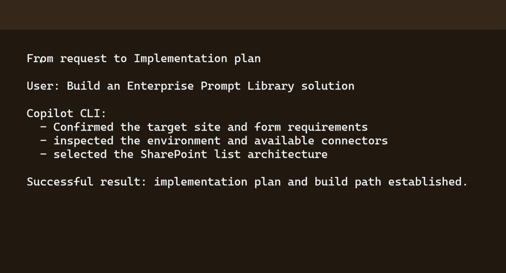
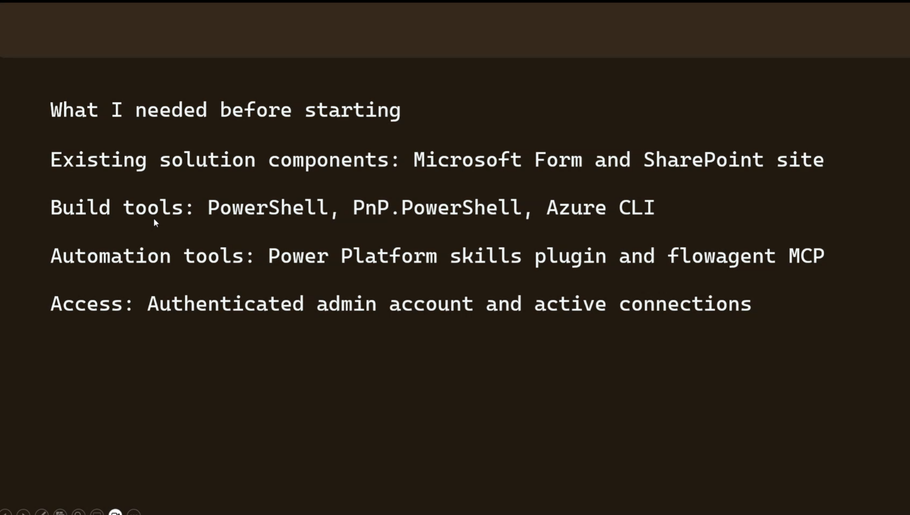
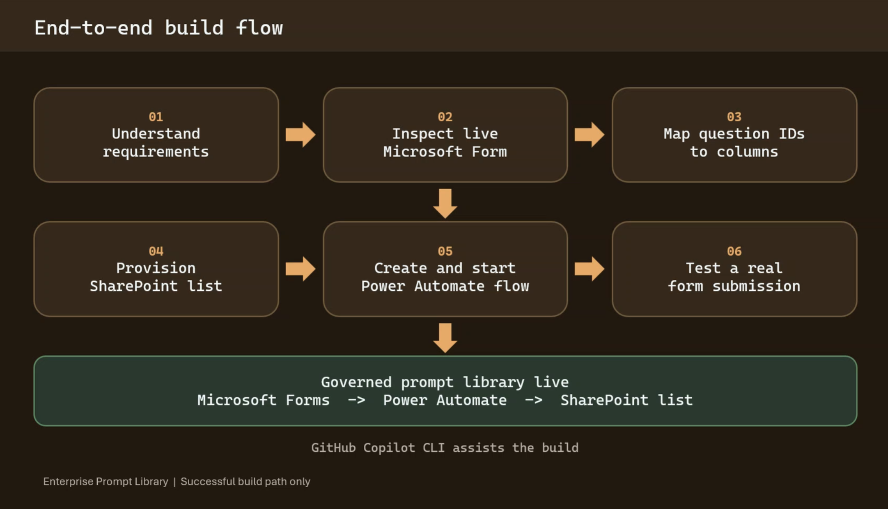
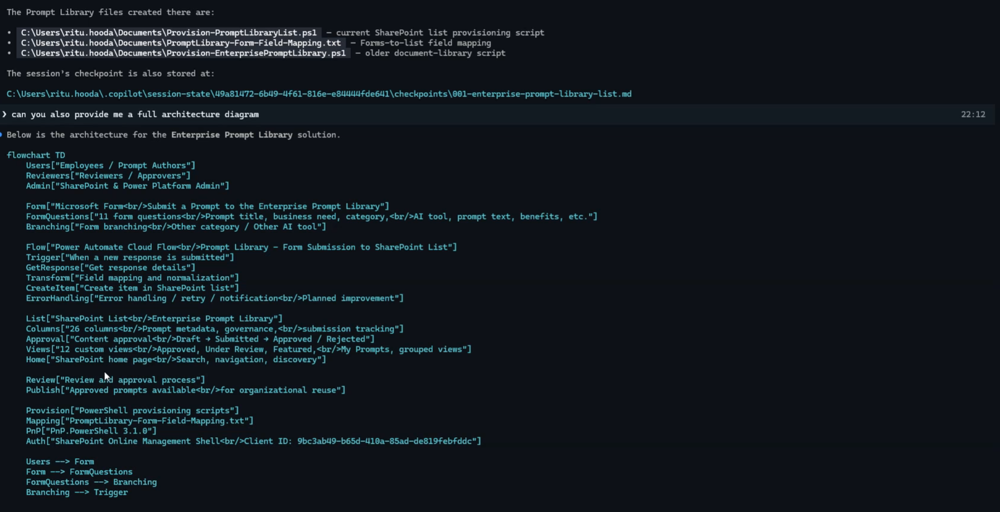
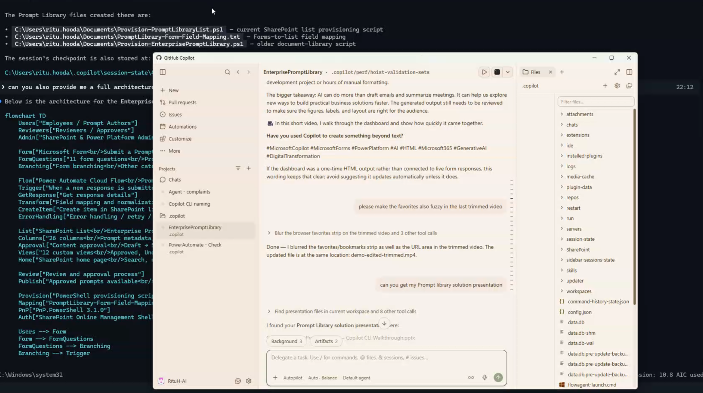
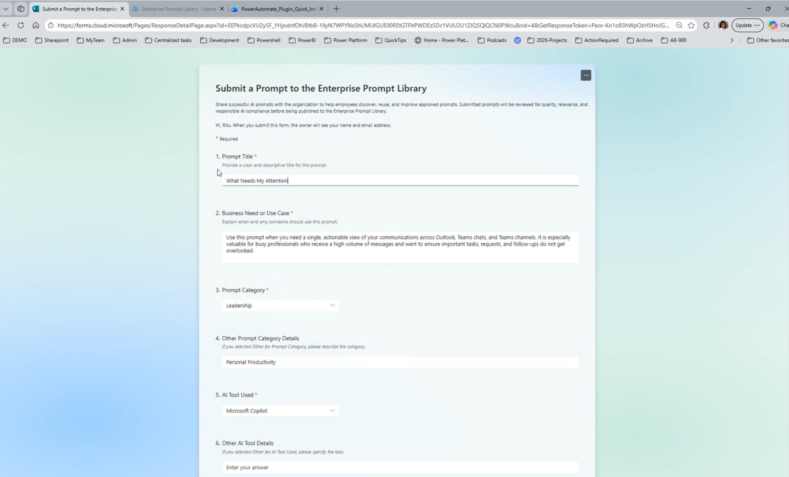
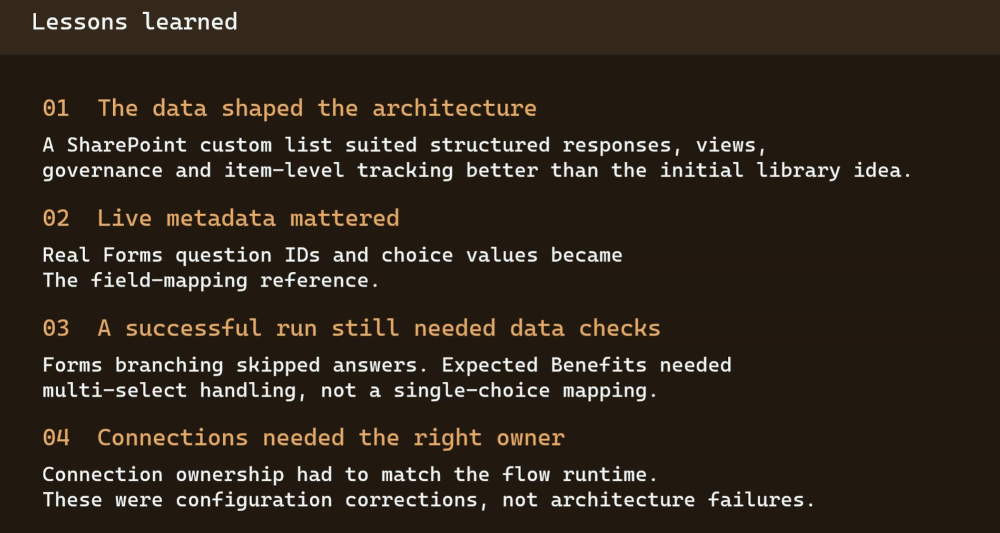
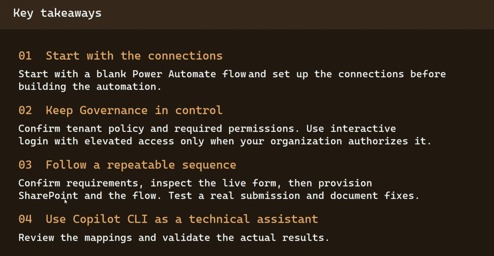

## Introduction

At the Microsoft 365 General Dev community call on 8 October 2026, a presentation by Ritu Hooda explored building an enterprise prompt library using GitHub Copilot CLI. What caught my attention was not simply the use of Copilot CLI, but the way it was used to help build a solution from existing Microsoft 365 and Power Platform components.

The proposed solution pattern connected Microsoft Forms, Power Automate and SharePoint, with Copilot CLI assisting the implementation. It is an example of AI-assisted development sitting alongside familiar administration and existing automation tooling.

## The Challenge: Turning Prompts Into Something Manageable

The challenge was to build an Enterprise Prompt Library solution around an existing Microsoft Form and SharePoint site. Rather than treating the request as an isolated development task, the approach first established what already existed.

That matters in an enterprise setting. The starting point was not a blank canvas. The solution needed to understand the existing form, map its questions to SharePoint columns, provision the required list, and create the automation connecting the pieces.

## Starting With What Already Exists

The presentation began with practical prerequisites: an existing Microsoft Form and SharePoint site, PowerShell, PnP.PowerShell and Azure CLI, plus the Power Platform skills plugin and flowagent MCP automation tools.

The build also required an authenticated administrator account and active connections.

## Copilot CLI As Part Of The Build Process

The presentation described a defined build path. First, the requirements were understood and the live Microsoft Form was inspected. The question IDs were then mapped to columns. A SharePoint list was provisioned, followed by creation and starting of a Power Automate flow. Finally, a real form submission was used to test the result.

GitHub Copilot CLI assisted with this process. Given the request to build an Enterprise Prompt Library, it confirmed the target site and form requirements, inspected the environment and available connectors, and selected the SharePoint list architecture.

## From Microsoft Forms to SharePoint

The resulting architecture was straightforward: Microsoft Forms -> Power Automate -> SharePoint list.

What makes the example interesting is less the individual components and more how they were brought together. The build used existing Microsoft services, with automation connecting the form submission and SharePoint-based library.

## What Caught My Attention

For me, that combination is worth exploring. It makes the enterprise demonstration feel grounded in practice.

There is no suggestion that Copilot CLI replaced the underlying services or removed the need for administrative access. Instead, it helped navigate the implementation: understanding the request, inspecting the environment, and establishing a practical route from requirements to a working solution.

That distinction is important. The value here is less about generating code for its own sake and more about using an assistant within an existing Microsoft ecosystem.

## Questions For The Enterprise

The presentation leaves useful questions for an IT team. How should an enterprise prompt library be governed as it grows? Who owns the SharePoint content and automation? How should changes be administered and supported?

The reliance on an authenticated administrator account and active connections also makes access and operational ownership relevant areas to examine.

## Community Discussion

- How are you currently storing and governing prompts across Power Platform or Microsoft 365?
- Where could AI-assisted tooling help with implementation without taking ownership away from administrators?
- What governance model would you use for a shared enterprise prompt library?
