The chatbot component in powerapps using Copilot Studio is a powerful tool that allows developers and citizen developers to integrate chat functionality into their Power Apps. This component enables users to engage in real-time conversations with virtual agents, providing a seamless and interactive experience.

With this chatbot component, users can easily communicate with the virtual agents, ask questions, and receive automated responses. It enhances the overall user experience by providing personalized and relevant information based on the user's queries.

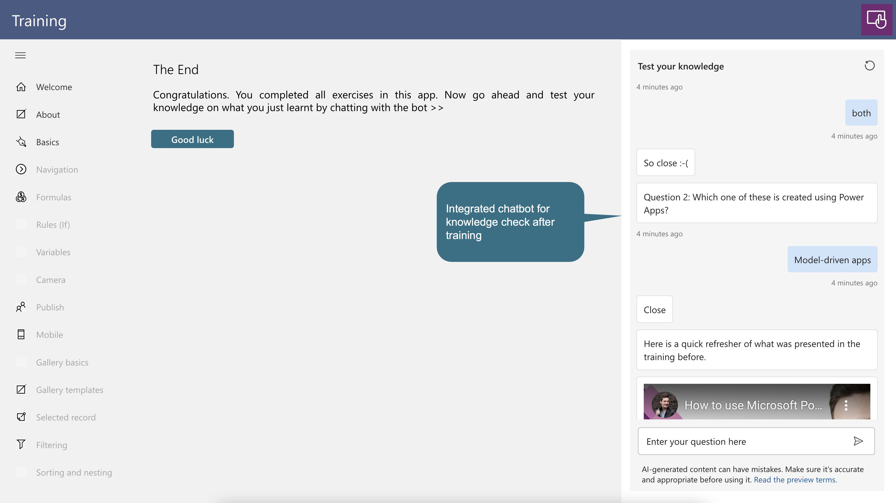
 
## Overview of steps

To create a Power App using the chatbot component using Copilot studio, follow these steps:

1. Open Power Apps and create a new canvas app.
2. Choose a layout and design for your app.
3. Add the chatbot component to your app by selecting it from the available components.
4. Configure the chat component by connecting it to your Copilot studio instance.
5. Create and build the chatbot in the Copilot studio authoring interface (see illustrations below)
6. Customize the chatbot component settings in PowerApps, such as appearance, and behavior.
7. Build other app functionalities around the chat component, such as data retrieval or form submission.
8. Test your app to ensure that the chat functionality is working correctly.
9. Publish and share your Power App with users.

## Illustrations for the scenario

A training app in PowerApps so users test their knowledge in a conversational experience without leaving the app.

Add the Chatbot component to your PowerApp.
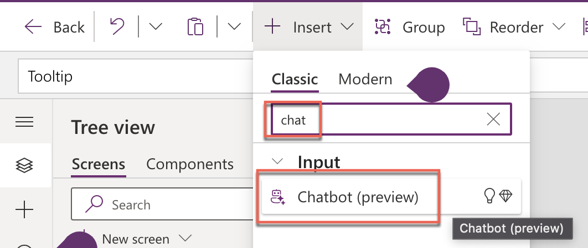

Create the chatbot
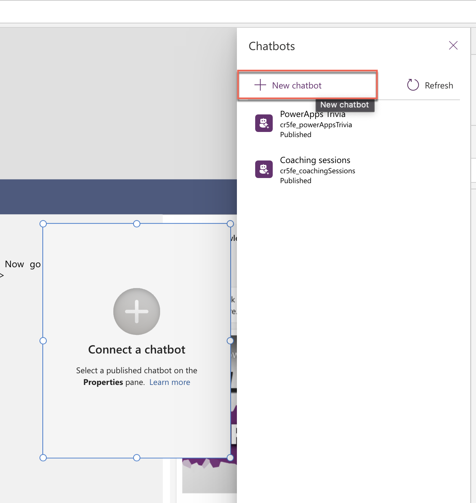
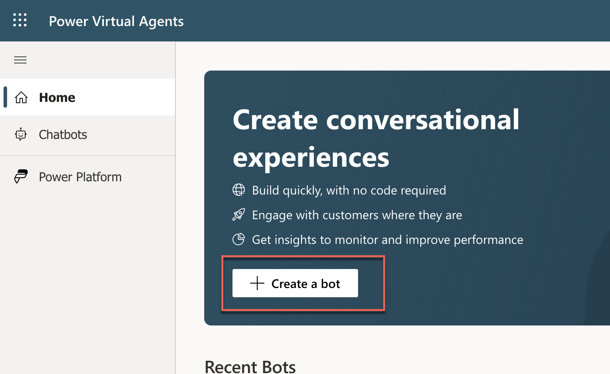

Create the topic(s) needed for your scenario.
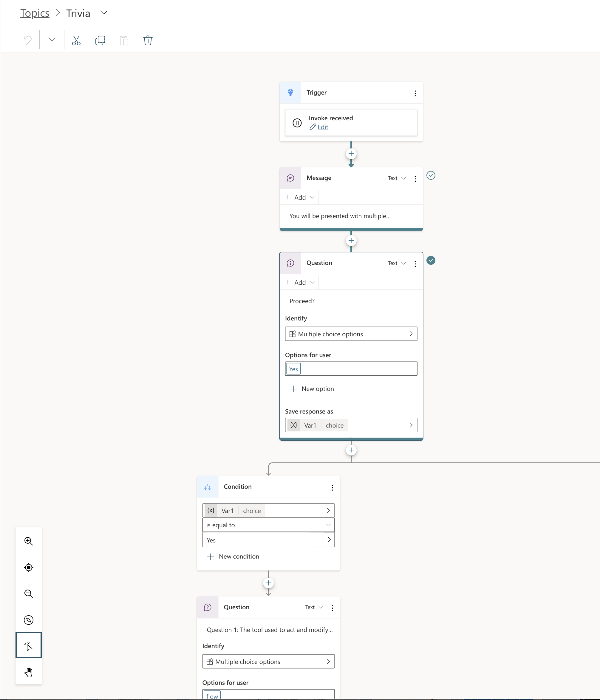

Add images and videos as needed for your scenario
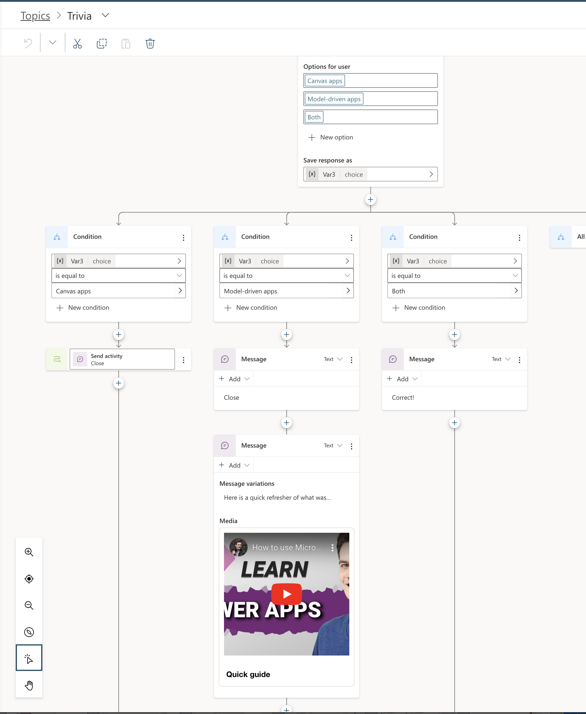

Edit the Conversation start system topic your scenario needs.
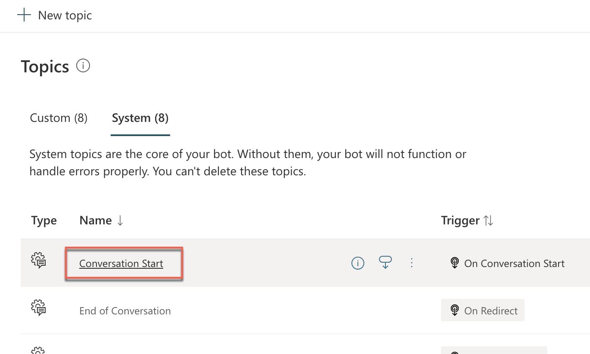
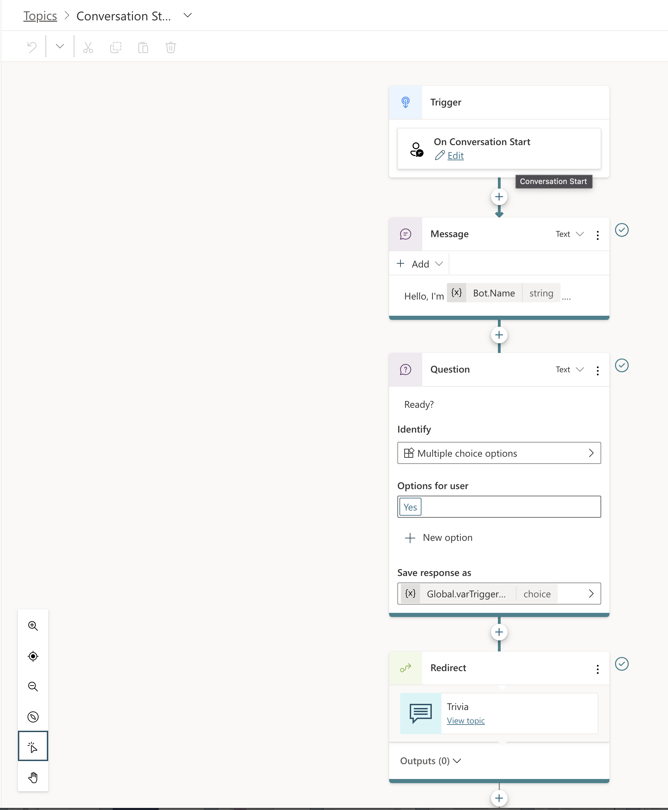

Test and publish the bot when ready.
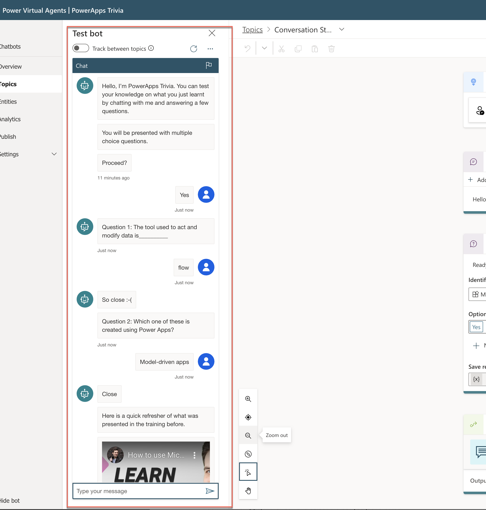
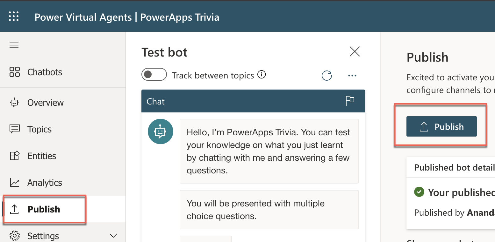

Back in PowerApps, hit refresh and select the bot you just created.
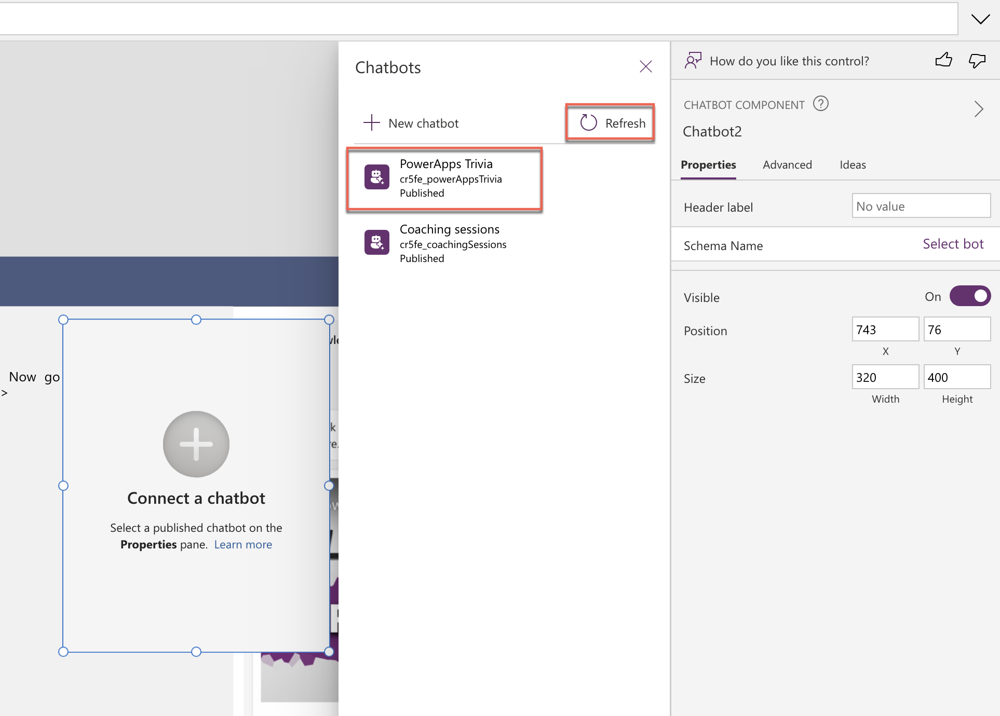

Finish the PowerApp and share with your users.

By following these steps, you can create a Power App with integrated chat functionality, providing a seamless and interactive experience for your app users.

By leveraging the chat-component-powerapps-using-power-virtual-agent, organizations can automate customer support, provide self-service options, and streamline various processes. This not only improves customer satisfaction but also increases efficiency by reducing manual interactions and response times.
