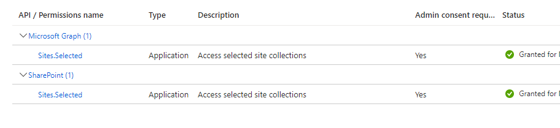

## How it all began

Gather around, my dear readers, for I have a saga to tell. A tale of brave warriors who embarked on a journey to conquer the treacherous land of CI/CD for SPFx deployment. This is a story of how they harnessed the power of M365 CLI and Azure DevOps to emerge victorious.

## My story

The project requirements were simple. The developers needed to automate the deployment of their SPFx solution to a SharePoint environment. They wanted to be able to deploy their solution with a single click, without having to perform any manual steps.

At first it seemed like a simple task. But as i began to dig deeper, i realized that there were many moving parts to the deployment process.

Over th internet i found many articles and blog posts that described the deployment process. But none of them provided a complete solution. Until i asked amazing community at Discord server: [CLI for Microsoft 365](https://lnkd.in/ehRDFGqb)

 Special thanks to the following individuals for their support

  - Arjun Menon 👨‍💻 [@arjunumenon](https://github.com/arjunumenon) - For providing the most complete and up to date article on this topic, which was especially helpful for my scenario. Check it out here: https://arjunumenon.com/ci-cd-spfx-deployment-azure-devops-m365-cli/ 📖

  - Adam Wójcik 👨‍💻 [@Adam-it](https://github.com/Adam-it) - For sharing multiple tips and tricks as well as resources that made this project possible. Here are some of the Github Marketplace actions that Adam shared:
    - [CLI for Microsoft 365 - Deploy App](https://github.com/marketplace/actions/cli-for-microsoft-365-deploy-app) 💻
    - [CLI for Microsoft 365 - Login](https://github.com/marketplace/actions/cli-for-microsoft-365-login) 🔑
    - [CLI for Microsoft 365 - Run Script](https://github.com/marketplace/actions/cli-for-microsoft-365-run-script) 📜
    - [TilesLinksForSPOnline](https://github.com/Adam-it/TilesLinksForSPOnline/actions/runs/671871098/workflow) 🧱

  - Garry Trinder 👨‍💻 [@garrytrinder](https://github.com/garrytrinder) - For sharing multiple tips and tricks as well as resources that made this project possible. Check out the user guide for Github Actions with M365 CLI by Garry here: https://pnp.github.io/cli-microsoft365/user-guide/github-actions/ 📖

  - Milan Holemans 👨‍💻 [@milanholemans](https://github.com/milanholemans) - For providing the last missing piece of the puzzle. Your contribution was greatly appreciated! 💯

 ```powershell
   # added line right after m365 login
      m365 spo set --url https://tenant.sharepoint.com/sites/sitecollection
   ```

Thank you all for your contributions to my success 😃
  

> Scripts and project structure is same as in [Arjun's article](https://arjunumenon.com/ci-cd-spfx-deployment-azure-devops-m365-cli/) . I only added some extra steps to make it more complete. At least for my scenario. For initial setup and project structure please refer to [Arjun's article](https://arjunumenon.com/ci-cd-spfx-deployment-azure-devops-m365-cli/).
{: .prompt-info }

 
## Solution requirements

The solution needed to meet the following requirements: 
- Build and package the SPFx solution in Azure DevOps
- Deploy the packaged solution to a SharePoint environment using M365 CLI
- Authentication should be handled using certificate
- CI/CD Solution should require minimal permission posable on the SharePoint environment and tenant

## Step 1: Variable groups in Azure DevOps

  -  Global Deployment setting 
  his is a variable group for holding global deployment settings
    
  
  -  Deployment - SharePoint Environment
  This is a variable group where the settings of SharePoint deployments is given
    

## Step 2: Create certificate for authentication to M365 cli

Script to create certificate

```powershell
.\Create-SelfSignedCertificate.ps1 -CommonName "SPFx CI-CD Deployment App Certificate" -StartDate "2022-02-02"  -EndDate "2023-10-02" -Password "yourPassword"
```

```powershell
    <#
.SYNOPSIS
Creates a Self Signed Certificate for use in server to server authentication
.DESCRIPTION
.EXAMPLE
.\Create-SelfSignedCertificate.ps1 -CommonName "MyCert" -StartDate 2015-11-21 -EndDate 2017-11-21
This will create a new self signed certificate with the common name "CN=MyCert". During creation you will be asked to provide a password to protect the private key.
.EXAMPLE
.\Create-SelfSignedCertificate.ps1 -CommonName "MyCert" -StartDate 2015-11-21 -EndDate 2017-11-21 -Password "MyPassword"
This will create a new self signed certificate with the common name "CN=MyCert". The password as specified in the Password parameter will be used to protect the private key
#>
Param(

   [Parameter(Mandatory=$true)]
   [string]$CommonName,

   [Parameter(Mandatory=$true)]
   [DateTime]$StartDate,

   [Parameter(Mandatory=$true)]
   [DateTime]$EndDate,

   [Parameter(Mandatory=$true)]
   [string]$Password
)


function CreateSelfSignedCertificate{

    $cert = New-SelfSignedCertificate -Subject "CN=$CommonName" -FriendlyName $CommonName -NotBefore $StartDate -NotAfter $EndDate  -CertStoreLocation "Cert:\CurrentUser\My" -KeyExportPolicy Exportable -KeySpec Signature -KeyLength 2048 -KeyAlgorithm RSA -HashAlgorithm SHA256

    # Export Certificate from Variable to cert file to the location where script is executed
    Export-Certificate -Cert $cert -FilePath ".\$CommonName.cer"

    # Secure the file with password for enhanced security
    $mypwd = ConvertTo-SecureString -String "$Password" -Force -AsPlainText

    # Exporting the file to PFX file with Password
    Export-PfxCertificate -Cert $cert -FilePath ".\$CommonName.pfx" -Password $mypwd
}
$CommonName= "SPFx CI-CD Deployment App Certificate"
$StartDate= "2023-02-02"
$EndDate= "2045-12-31"
$Password = "yourPassword"
CreateSelfSignedCertificate -CommonName $CommonName -StartDate $StartDate -EndDate $EndDate -Password $Password
#.\Create-SelfSignedCertificate.ps1 -CommonName "SPFx CI-CD Deployment App Certificate" -StartDate "2022-02-02"  -EndDate "2023-10-02" -Password "yourPassword"
```

## Step 3: Create Azure Active Directory app - AAD app

  This step in [Arjun's article](https://arjunumenon.com/ci-cd-spfx-deployment-azure-devops-m365-cli/) done using scripts i also added here but for my scenario i could not use adminautoconsent option i also coul not use permission scopes:

  ```
  Sharepoint application permissions
  Sites.FullControl.All

  Graph application permissions
  Sites.Read.All
  ```

  For my scenario i needed to use application permissions:

  ```
  Sharepoint application permissions
  Sites.Selected

  Graph application permissions
  Sites.Selected
  ```
  

So i created APP manually and added required API permissions. 



After permissions consented by tenant admin i needed to do following addition steps:

  ```powershell
  $site = "https://yourtenant.sharepoint.com/sites/yoursite"
  Connect-PnPOnline $site -Interactive
  Grant-PnPAzureADAppSitePermission -AppId "app id from azure (Client ID)" -DisplayName "PDPApp CI-CD Deployment App" -Site $site  -Permissions FullControl 
  ```
  Big thanks to video from @paolo Pialorsi 
  [https://www.youtube.com/watch?v=SNIF3zCYNUk](https://www.youtube.com/watch?v=SNIF3zCYNUk)


If you don't have issues with permissions you can use script to create AAD app, usually it is not recommended way to give such broad permissions.

```powershell
.\aad-app-add-aadapp.ps1 -AppName "PDPApp CI-CD Deployment App"  -CertificatePath ".\SPFx CI-CD Deployment App Certificate.pfx" -CertificatePassword "yourPassword" -AutoAdminConsent
```

```powershell
<#
.SYNOPSIS
Create Azure AD App Registration
.DESCRIPTION
.EXAMPLE
.\aad-app-add-aadapp.ps1 -AppName "PDPApp CI-CD Deployment App"
Create AAD App without Certificate and Admin Consent
.EXAMPLE
.\aad-app-add-aadapp.ps1 -AppName "PDPApp CI-CD Deployment App"  -CertificatePath ".\SPFx CI-CD Deployment App Certificate.pfx" -CertificatePassword "yourPassword" -AutoAdminConsent
Create AAD App WITH Certificate and Admin Consent
#>
Param(
    [Parameter(Mandatory = $true)]
    [string]$AppName,
    [Parameter(Mandatory = $false)]
    [string]$APIPermissionList = "https://microsoft.sharepoint-df.com/Sites.FullControl.All, https://graph.microsoft.com/Sites.Read.All",
    [Parameter(Mandatory = $false)]
    [switch]$AutoAdminConsent = $false,
    [Parameter(Mandatory = $false)]
    [string]$CertificatePath
)

function executeAADAppCreation {

    # Checking Login status and initiate login if not logged
    $LoginStatus = m365 status
    if ($LoginStatus -eq "Logged out") {
        Write-Host "Not logged in. Initiating Login process"
        m365 login
    }

    $AddedApp = $null

    # Get the Certificate String from PFX File
    # It will prompt for the password and you will have to enter the same password which was given while generation
    $EncodedCertificateString = [System.Convert]::ToBase64String((
            Get-PfxCertificate -FilePath $CertificatePath).GetRawCertData())

    if ($AutoAdminConsent) {
        $AddedApp = (m365 aad app add --name $AppName --apisApplication $APIPermissionList  --redirectUris "https://login.microsoftonline.com/common/oauth2/nativeclient" --platform publicClient --certificateBase64Encoded $EncodedCertificateString --grantAdminConsent --output json) | ConvertFrom-Json
        Write-Host "AAD App Created with details. App ID : $($AddedApp.appId). Object ID : $($AddedApp.objectId). Tenant ID : $($AddedApp.tenantId)"
    }
    else {
        $AddedApp = (m365 aad app add --name $AppName --apisApplication $APIPermissionList  --redirectUris "https://login.microsoftonline.com/common/oauth2/nativeclient" --platform publicClient --certificateBase64Encoded $EncodedCertificateString --output json) | ConvertFrom-Json
        Write-Host "AAD App Created with details. App ID : $($AddedApp.appId). Object ID : $($AddedApp.objectId). Tenant ID : $($AddedApp.tenantId)"
        # Manually Opening the URL with the browser
        Write-Host "Open this URL for consenting the permission - https://login.microsoftonline.com/$($AddedApp.tenantId)/v2.0/adminconsent?client_id=$($AddedApp.appId)&scope=.default"
    }
}

executeAADAppCreation
```

## Step 4: Create Azure DevOps Pipeline

  My pipeline steps are:
    1. Trigger on main branch
    2. Use Variable Group 'Deployment - SharePoint Environment' which contains all variables
    3. Install Node 14.15.0
    4. npm install
    5. SPFx - Bundle Solution
    6. SPFx - Package Solution
    7. Copy files to Azure File Share - spfx package
    8. Copy files to Azure File Share - powershell scripts for release

  Full yaml template for pipeline is here:

```yaml
trigger:
  branches:
    include:
    - main
  paths:
    exclude:
    - /CI-CD-Setup
name: $(Date:yyyyMMdd)$(Rev:.r)_
variables:
- group: Deployment - SharePoint Environment
jobs:
- job: Job_1
  displayName: SPFx Package Building Agent
  pool:
    vmImage: ubuntu-20.04
  steps:
  - checkout: self
  - task: NodeTool@0
    displayName: Install Node 14.15.0
    inputs:
      versionSpec: 14.15.0
  - task: Npm@1
    displayName: npm install
    inputs:
      workingDir: PDPApp
      verbose: false
  - task: gulp@0
    displayName: SPFx - Bundle Solution
    inputs:
      gulpFile: $(ProjectFolder)/gulpfile.js
      targets: bundle
      arguments: --ship
      cwd: $(ProjectFolder)
  - task: gulp@0
    displayName: SPFx - Ship the solution
    inputs:
      gulpFile: $(ProjectFolder)/gulpfile.js
      targets: package-solution
      arguments: --ship
      cwd: $(ProjectFolder)
  - task: CopyFiles@2
    displayName: 'Copy Files to: $(build.artifactstagingdirectory)/$(ProjectFolder)/drop'
    inputs:
      SourceFolder: $(ProjectFolder)
      Contents: $(SolutionPackageLocation)/$(PackageName)
      TargetFolder: $(build.artifactstagingdirectory)/$(ProjectFolder)/drop
  - task: CopyFiles@2
    displayName: 'Copy Script Files to: $(build.artifactstagingdirectory)/$(ProjectFolder)/drop'
    inputs:
      SourceFolder: CI-CD-Setup/scripts-powershell
      Contents: '*'
      TargetFolder: $(build.artifactstagingdirectory)/$(ProjectFolder)/drop
  - task: PublishBuildArtifacts@1
    displayName: 'Publish Artifact: drop'
    inputs:
      PathtoPublish: $(Build.ArtifactStagingDirectory)/$(ProjectFolder)/drop
```

## Step 5 : Create Azure DevOps Release Pipeline

  Release pipeline should look like this after setup:
  

In release variable tabs link both groups created in earlier step


### Agent

I have used ubuntu-20.04 agent for this release pipeline. You can use any agent which has powershell installed.


### Use Node 14.15.0

This task is used to install node 14.15.0 on agent machine.


```yaml
    steps:
    - task: NodeTool@0
      displayName: 'Use Node 14.15.0'
      inputs:
        versionSpec: 14.15.0
```
### Install M365 CLI
  
This task is used to install M365 CLI on agent machine.


  
```yaml
      steps:
      - task: Npm@1
        displayName: 'Install CLI for Microsoft 365'
        inputs:
          command: custom
          verbose: false
          customCommand: 'install -g @pnp/cli-microsoft365'
```
### Download secure file

This task is used to download secure file which contains certificate file.


```yaml
    steps:
    - task: DownloadSecureFile@1
      displayName: ' Download secure file'
      inputs:
        secureFile: 'SPFx CI-CD Deployment App Certificate.pfx'
```
### M365 login SPO powershell task

This task is used to login to SPO using M365 CLI.


  > Note: Errors in yaml are show as it cannot see variable required in script function, but should work if powershell files are copied in previous step.
  {: .prompt-info }

```yaml
      #Your build pipeline references an undefined variable named ‘mycert.secureFilePath’. Create or edit the build pipeline for this YAML file, define the variable on the Variables tab. See https://go.microsoft.com/fwlink/?linkid=865972
        #Your build pipeline references an undefined variable named ‘CertificatePassword’. Create or edit the build pipeline for this YAML file, define the variable on the Variables tab. See https://go.microsoft.com/fwlink/?linkid=865972
        #Your build pipeline references an undefined variable named ‘AppId’. Create or edit the build pipeline for this YAML file, define the variable on the Variables tab. See https://go.microsoft.com/fwlink/?linkid=865972
        #Your build pipeline references an undefined variable named ‘TenantId’. Create or edit the build pipeline for this YAML file, define the variable on the Variables tab. See https://go.microsoft.com/fwlink/?linkid=865972
        #Your build pipeline references an undefined variable named ‘SiteCollection’. Create or edit the build pipeline for this YAML file, define the variable on the Variables tab. See https://go.microsoft.com/fwlink/?linkid=865972

    steps:
    - task: PowerShell@2
      displayName: 'M365 CLI - Login to SPO'
      inputs:
        targetType: filePath
        filePath: './$(System.DefaultWorkingDirectory)/PDPApp/drop/m365-spo-login.ps1'
        arguments: ' -certificateFile "$(mycert.secureFilePath)" -password "$(CertificatePassword)" -appId "$(AppId)" -TenantId "$(TenantId)" -SiteUrl "$(SiteCollection)"'
```

  ### SPFx package add, deploy and install

This task is used to add, deploy and install SPFx package to SPO site.


  > Note: Errors in yaml are show as it cannot see variable required in script function, but should work if powershell files are copied in previous step.
  {: .prompt-info }

```yaml
    #Your build pipeline references an undefined variable named ‘ProjectFolder’. Create or edit the build pipeline for this YAML file, define the variable on the Variables tab. See https://go.microsoft.com/fwlink/?linkid=865972
    #Your build pipeline references an undefined variable named ‘ProjectFolder’. Create or edit the build pipeline for this YAML file, define the variable on the Variables tab. See https://go.microsoft.com/fwlink/?linkid=865972
    #Your build pipeline references an undefined variable named ‘SolutionPackageLocation’. Create or edit the build pipeline for this YAML file, define the variable on the Variables tab. See https://go.microsoft.com/fwlink/?linkid=865972
    #Your build pipeline references an undefined variable named ‘PackageName’. Create or edit the build pipeline for this YAML file, define the variable on the Variables tab. See https://go.microsoft.com/fwlink/?linkid=865972
    #Your build pipeline references an undefined variable named ‘SiteCollection’. Create or edit the build pipeline for this YAML file, define the variable on the Variables tab. See https://go.microsoft.com/fwlink/?linkid=865972

    steps:
    - task: PowerShell@2
      displayName: 'SP Package, Add, Deploy, Install'
      inputs:
        targetType: filePath
        filePath: './$(System.DefaultWorkingDirectory)/$(ProjectFolder)/drop/spo-app-add.ps1'
        arguments: ' -PackageFolder "$(System.DefaultWorkingDirectory)/$(ProjectFolder)/drop/$(SolutionPackageLocation)" -packageName "$(PackageName)" -URL "$(SiteCollection)"'
```

## Project Folder Structure and scripts used in pipeline

[https://github.com/ValerasNarbutas/PDPApp](https://github.com/ValerasNarbutas/PDPApp)

View in devops


## End of the journey

And that, my dear readers, is the saga of CI/CD for SPFx deployment in Azure DevOps using M365 CLI. May it inspire you to embark on your own journey of discovery and innovation. For who knows what treasures await those who dare to explore the depths of the technological landscape.

If you have any questions or would like to share your own experiences with CI/CD, Azure DevOps, or M365 CLI, please feel free to leave a comment below. We welcome your feedback and hope that this article has provided some valuable insights and inspiration for your own journey of exploration

## More Resources

* [M365 dev Insights blog](https://valerasnarbutas.github.io/posts/ci-cd-spfx-deployment-azure-devops-m365-cli)
* [Arjun's article](https://arjunumenon.com/ci-cd-spfx-deployment-azure-devops-m365-cli/)
* [CLI for Microsoft 365 - Deploy App](https://github.com/marketplace/actions/cli-for-microsoft-365-deploy-app) 💻
* [CLI for Microsoft 365 - Login](https://github.com/marketplace/actions/cli-for-microsoft-365-login) 🔑
* [CLI for Microsoft 365 - Run Script](https://github.com/marketplace/actions/cli-for-microsoft-365-run-script) 📜
* [TilesLinksForSPOnline](https://github.com/Adam-it/TilesLinksForSPOnline/actions/runs/671871098/workflow) 🧱
