## Intro

Did you ever need to write a script that was using [CLI for Microsoft 365](https://pnp.github.io/cli-microsoft365/) or [PnP PowerShell](https://pnp.github.io/powershell/index.html) and you got to the point where you were constantly switching between VS Code and the web browser to lookup a command or check the docs or look for a sample which would allow you not to write everything from scratch?

If the answer was: "OMG totally" (or something similar 😉) then I got a surprise for you 😊.

Luckily for you in the VS Code marketplace, you will find a [CLI for Microsoft 365](https://marketplace.visualstudio.com/items?itemName=adamwojcikit.cli-for-microsoft-365-extension) and [PnP PowerShell](https://marketplace.visualstudio.com/items?itemName=adamwojcikit.pnp-powershell-extension) extension 🤩. Both of them have very similar functionalities and both aim to boost your productivity in writing scripts using either CLI for Microsoft365 or PnP PowerShell 👍.

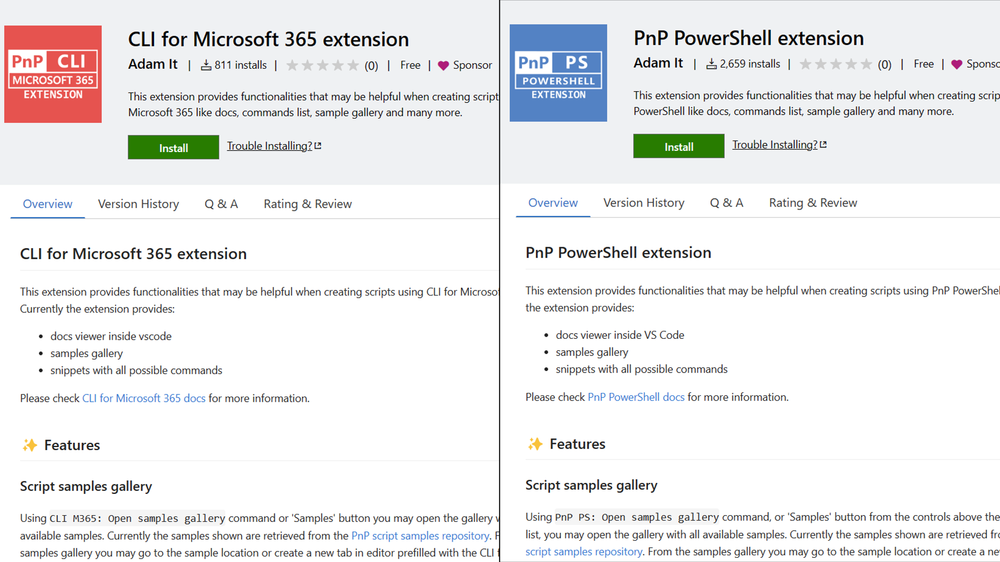

## 📄 Docs in flow of your work

If you ever worked on a single screen you might notice that switching context between multiple apps is a distraction that takes a lot of time 🤦‍♂️. VS Code is a perfect place for you to write and test your script on the fly but it does not provide the required documentation that is essential when creating scripts using either CLI for Microsoft 365 or PnP PowerShell. Fortunately, both of those extensions provide an additional view in the actions bar where you may find a full list of commands. You may search for the command you are looking for and clicking on it will open the command documentation in a separate tab. Thanks to that you have all the required documentation right along your work 😎. Usually in docs, you may find the command description, examples, and (in the case of CLI for Microsoft 365) also an example of the command output.

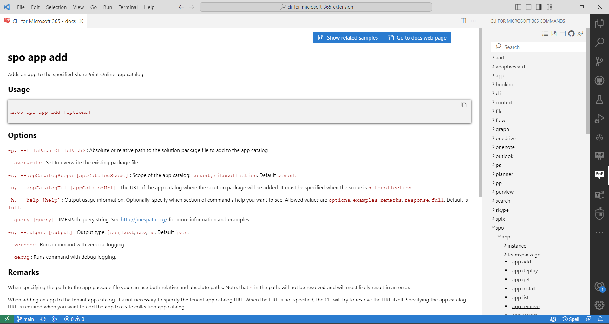

Finally, using one of the buttons at the top you may either see all script samples that are using this command (more about that later 💡) or open the original docs in the web browser.

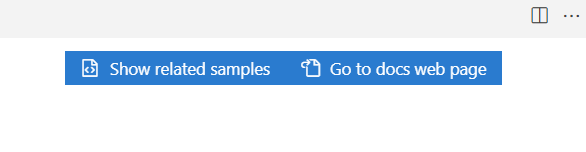

You may also open the command docs directly when writing code using the VS Code commands. Just hit the command bar and start with either "CLI M365" or "PnP PS" to get all of the possible commands those extensions provide. The "Open docs for command" will open an additional step in which you may provide the command you are interested or if you would run it having a command selected in code then this will be automatically prefilled for you. Hit enter to go to the docs.

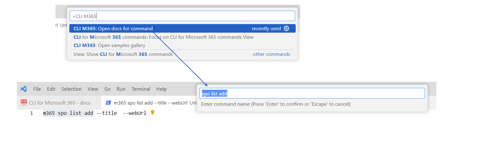

Before we jump to the next feature let’s have another look at the command list view. In Both extensions, by default, it is a flat list of commands but using one of the actions at the top (above the search bar) you may change the view to "tree view". Now this view looks differently for each of the extensions. For PnP PowerShell it groups the commands by the verb, putting all "Add", "Clear", "Get", "Install" etc. commands in groups.

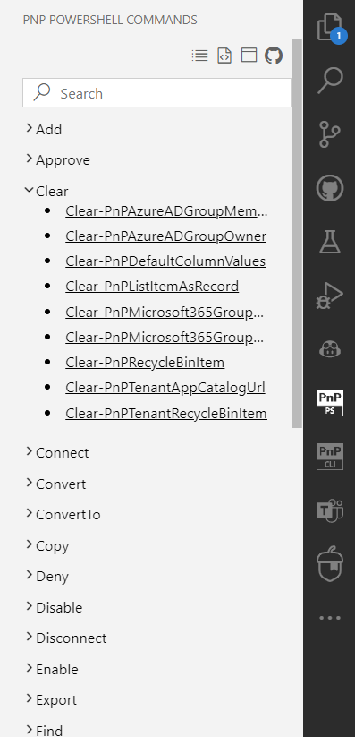

In the case of CLI for Microsoft 365 it indeed is a full tree view in which you may expand each level of the command, starting from picking the area of Microsoft 365 you are interested in (like SharePoint) and finishing on the verb (action) you want to do.

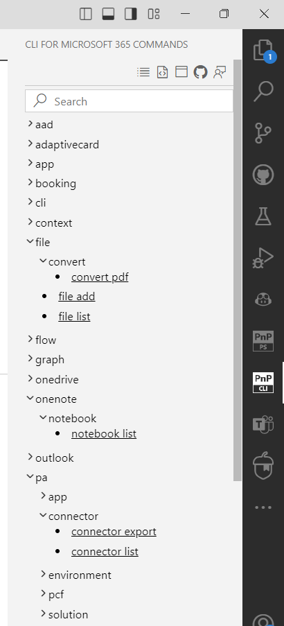

## 🚀 Don’t start from scratch

I am pretty sure that, at least once, you started browsing the web in search of a script that does the thing you wanted to do or at least something very similar 😉. That’s natural and totally fine. We all don’t like to reinvent the wheel and if there is some Open Source done by someone else which will give us a kick start then why not use it to boost your work👍. Those extensions will help you with that as well. You may open the samples gallery either by using a dedicated VS Code command or by using the second action above the commands list view (described in the previous chapter).

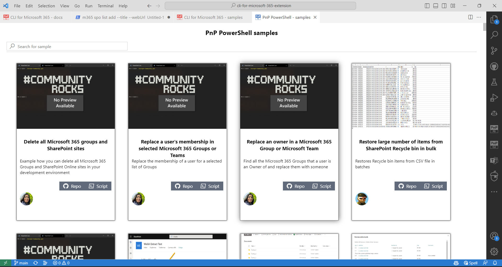

This will open a dedicated view showing all script samples either for CLI for Microsoft 365 or for PnP PowerShell. The samples are taken from the PnP script samples repository, so this feature would not have been possible without the awesome work done by the community 🤩. In the case of CLI for Microsoft 365 the extension also presents additional samples coming directly from CLI for Microsoft 365 repository. At the top of the samples gallery view, we may see a search bar that allows you to search for a sample by title, author, or (what is very cool) by the CLI for Microsoft 365 or PnP PowerShell command 🤯.

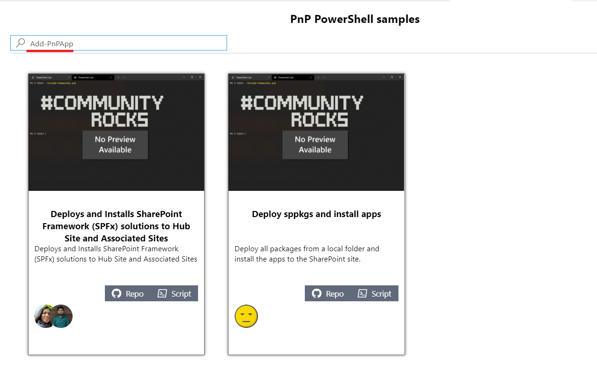

So when being in command docs tab you would select the button from the top "Show related samples" you will end up in the sample gallery view with the search bar prefilled with the command 😎.

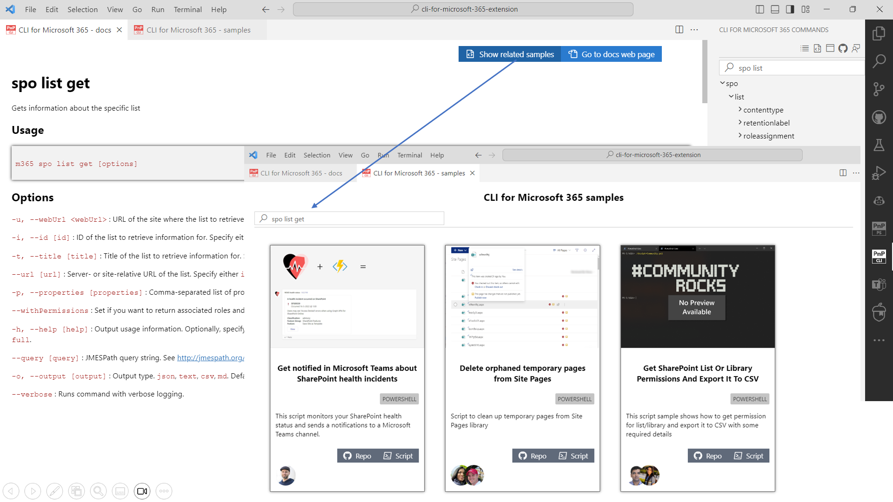

Using the buttons in each presented sample allows you to either go to the sample original location (which usually is the sample page in the PnP script sample repo) or (what is way cooler 😎) create a new tab in VS Code prefilled with sample contents.

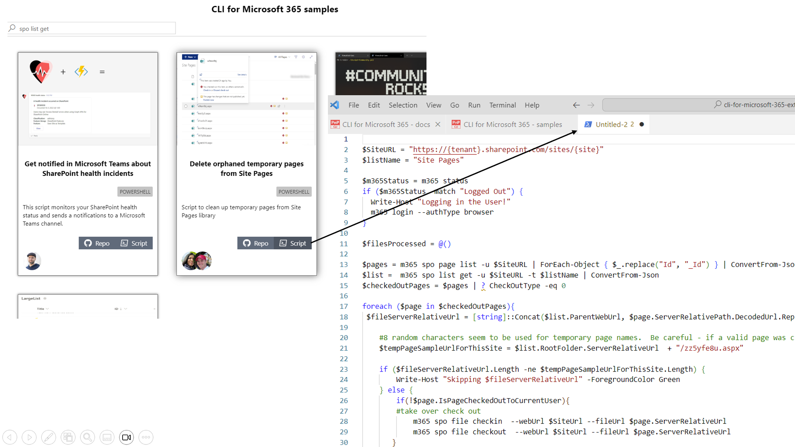

This feature may be a game changer when it comes to starting a new script as it allows you to find a sample that will have what you are looking for and even kick start a new script file based on it with a single click 🚀.

## 👨‍💻 Boost your coding

Of course, when it comes to creating scripts it is all about writing code. Nowadays code suggestion given by Intellisense or AI copilots is a standard thing. The problem is most of them lack the knowledge coming from the docs so the suggestion given only by the context itself may result in proposing a command which does not exist. In the case of PnP PowerShell, we may just use the standard PowerShell extension for VS Code which will do perfectly in suggesting the command, but is it possible to do a bit better than that? Well, what do you think? Both of the extensions provide the full list of snippets for every CLI for Microsoft 365 or PnP PowerShell command. Along with the suggestion you get a short description of the command.

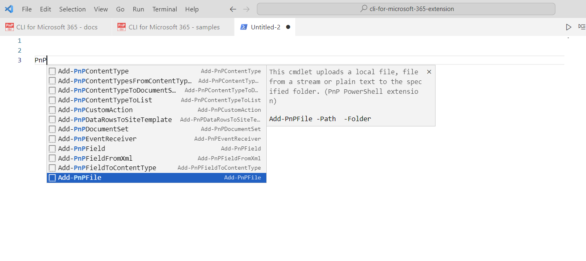

What is even better is that each command is added to the script along with all required options and you may use the Tab key on your keyboard to jump them 😎.

## 🙋‍♂️ Helpful links in a single place

The extensions also provide additional links to the documentation web page or GitHub repo right above the commands list next to the sample gallery button. In the case of CLI for Microsoft 365 you also get a link to the CLI Discord server where you may engage with the community for support or the latest information about CLI for Microsoft 365.

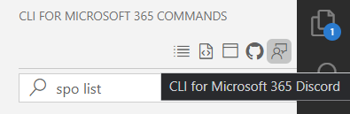

## 👍 Summary and special thanks to the community

Sometimes proper tooling may be a game changer especially when it comes to writing code. The CLI for Microsoft 365 and PnP PowerShell are the VS Code extensions you need when it comes to writing scripts using those tools. Doesn’t matter if you need help in looking up a command, writing code, or starting a new script, those extensions got you covered, so be sure to give them a try.

👉Feedback is more than welcome. If you would like to contribute to the extensions then check out the issue lists and do not hesitate to engage and start a conversation 👍.

I would also like to thank anyone who contributed a sample to the [PnP script sample repository](https://pnp.github.io/script-samples/). Those extensions would not have been so cool without your awesome work. You all rock 🤩.

## 🛣️ Roadmap

When it comes to future plans for the extensions:

- One of the main features I am planning to add to both of them is giving the possibility to present a kind of UI for a command which will allow the user to fill all the options and copy the prepared command to the clipboard. A similar feature may already be found for any PowerShell module using Windows PowerShell ISE.
- As for the [CLI for Microsoft 365](https://pnp.github.io/cli-microsoft365/) you might have noticed the latest changes done in the documentation web page with new AI-powered search thanks to integration with [Mendable](https://www.mendable.ai/) 🤯. The idea is to have the same capability in the VS Code extension to improve the way we may find the correct documentation.

If you are interested in more check out the issue list for CLI for Microsoft 365 or PnP PowerShell extensions to get more details on what’s coming up 😎.

## 🔗 Resources

- [CLI for Microsoft 365 extension in marketplace](https://marketplace.visualstudio.com/items?itemName=adamwojcikit.cli-for-microsoft-365-extension)
- [PnP PowerShell extension in marketplace](https://marketplace.visualstudio.com/items?itemName=adamwojcikit.pnp-powershell-extension)
- [CLI for Microsoft 365](https://pnp.github.io/cli-microsoft365/)
- [CLI for Microsoft 365 repo](https://github.com/pnp/cli-microsoft365)
- [PnP PowerShell](https://pnp.github.io/powershell/index.html)
- [PnP PowerShell repo](https://github.com/pnp/powershell)
- 📽️[Introduction to CLI for Microsoft 365 and PnP PowerShell VS Code extensions](https://www.youtube.com/watch?v=kTnlgESTas0)
- [PnP Script Samples](https://pnp.github.io/script-samples/)
- [PnP Community](https://pnp.github.io/)