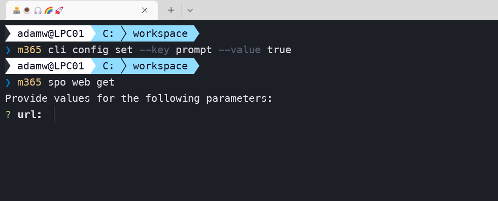

Are you regularly using CLI for Microsoft 365 and looking for a way to be more productive? Or is this totally new for you and you are looking for something 'special' which will make CLI for M365 stand out when compared with other command line tools? Well, you are in the right place. In this post I will show you possible settings that may be configured in CLI for Microsoft 365.

## 🤔 But first of all what is CLI for Microsoft 365? Quick intro 

If you already know what CLI for M365 is then I suppose you may skip this part😀. CLI for Microsoft 365 is a cross platform command line tool based on Node.js that helps you manage many things around Microsoft 365 and your SPFx projects (yes, that as well 🤩. rename, upgrade ... you name it). To name a few, you may manage OneDrive, Planner, Power Apps and Automate, Teams, Yammer, SharePoint (of course). The list keeps on growing and growing, [check out the CLI for Microsoft 365](https://pnp.github.io/cli-microsoft365/). But it's not only about managing Microsoft 365. The CLI helps you also manage your own SPFx environment (check out the [doctor](https://pnp.github.io/cli-microsoft365/cmd/spfx/spfx-doctor/)) or projects (rename, upgrade etc.). This is very unique that many similar command line tools don't have. Some commands do simple things but some actually are ready to use scenarios all done under a single command. Check out the full list of [commands](https://pnp.github.io/cli-microsoft365/cmd/login/#usage)


## ⚙️ Configure CLI for Microsoft 365 the way you need

Did you know that you can configure CLI for Microsoft 365 in a few different ways? Thats right, CLI gives you the opportunity to adjust the way it will behave to meet your personalized needs or specific scenario. 

Ok, so where is that config.json file I need to modify to change the settings? Well, at start there is none 😅, and it's not the way we should actually modify CLI settings. Instead there are ready to use `m365 cli config` commands which will help you configure CLI for Microsoft 365 properly. There are three commands which will allow us to manage CLI settings: `get`, `set` and `reset`. Let's check them out. 

The first one is the `m365 cli config get` command, which will show you the specified setting. For example we may check what is the default output format for a command:

```sh
m365 cli config get --key output
```

If the output of the above command is empty, then it means that the setting has no custom value and therefore the default value is used. CLI provides the following settings along with their default values: 

Setting key | Definition | Default value
-------------|------------|--------------
autoOpenBrowserOnLogin | Automatically open the browser to the Azure AD login page after running `m365 login` command in device code mode. This setting will be replaced by `autoOpenLinksInBrowser` in the next major release. | false
autoOpenLinksInBrowser | Automatically open the browser for all commands which return an URL and expect the user to copy paste this into the browser. For example when logging in, using `m365 login` in device code mode. This setting will replace autoOpenBrowserOnLogin in the next major release. | false
copyDeviceCodeToClipboard | Automatically copy the device code to the clipboard when running `m365 login` command in device code mode | false
csvEscape | Single character used for escaping; only apply to characters matching the quote and the escape options | "
csvHeader | Display the column names on the first line | true
csvQuote | The quote characters surrounding a field. An empty quote value will preserve the original field, whether it contains quotation marks or not. | 
csvQuoted | Quote all the non-empty fields even if not required | false
csvQuotedEmpty | Quote empty strings and overrides quoted_string on empty strings when defined | false
errorOutput | Defines if errors should be written to stdout or stderr | stderr
output | Defines the default output when issuing a command | JSON
printErrorsAsPlainText | When output mode is set to JSON, print error messages as plain text rather than JSON | true
prompt | Prompts for missing values in required options | false
showHelpOnFailure | Automatically display help when executing a command failed | true

In order to change a config value, let's say the command output format, you can use:

```sh
m365 cli config set --key output --value text
```

Now we changed the default output format for every CLI command from `json` to `text`.

So we changed something, it got saved, but where? Well, the answer is, it depends, as always 😉. The moment we change some default setting, a new cli-m365-config.json file is created and its location depends from the OS we are using. On Windows the config file may be found in folder '%HOMEPATH%\.config\configstore\' and for macOS it's '/Users/\<YouUserHere\>/.config/configstore'. 

If you've played too much with changing settings and you would like to reset it back to the default settings, you can use `m365 cli config reset` to restore all settings to their default values.

For more information about configuring the CLI check [CLI for Microsoft 365 docs configuration page](https://pnp.github.io/cli-microsoft365/user-guide/configuring-cli/). Everything is always in the docs, but instead you may follow along this article and let me guide you through each setting in a bit more detail and (I hope) funny way 😉, as work and knowledge should always be a bit of fun 👍. 

## ✂️ AutoOpen & autoCopy

Remember the first time you ran `m365 login` command and you had to copy past the URL and the device code to authenticate? CLI provides config setting which will improve and speed up that process. 

First let's set:

```sh
m365 cli config set --key autoOpenBrowserOnLogin --value true
```

Which will automatically open the login page in your default browser after running the `m365 login` command. Now let's set:

```sh
m365 cli config set --key copyDeviceCodeToClipboard --value true
```

By setting this, your autogenerated device code used for login will be automatically copied to the clipboard. 

How cool is that 😎? If only there was a setting which will do the full login for you right 😜.
 
👉 One thing that is important to mention is that we have a similar setting `autoOpenLinksInBrowser` which will open any URL output from any command your preferred browser, not only the login URL. This setting for example might be useful for the `m365 app open` command to automatically open the link to the Azure Portal in the browser from the .m365rc.json file for our current app. 

Even more worth mentioning is the setting `autoOpenBrowserOnLogin` and will be removed in the next major release (v6) and replaced by `autoOpenLinksInBrowser`. For more info please check the related issue [Remove the setting autoOpenBrowserOnLogin to follow new settings autoOpenLinksInBrowser](https://github.com/pnp/cli-microsoft365/issues/3163)

## 📅 Csv master

So how many times have you created a script to make a small report with some exported data from SharePoint Online? I bet that at least more than once 😉. Usually first we need to retrieve the data to some object and then parse it to, usually, a CSV file. Adding headers, handling type of quotes, escaping special characters, etc. What if I told you that all that may be done with a single line of code for any command in CLI for Microsoft 365? Pretty cool huh 😎? Lets have a deeper look on how we may do that and what are the CLI settings that support this feature. 

First of all, lets see how is it possible to output the command in CSV format. Well it's as easy as adding `--output csv` to the command 🙂. So if we would like to have a simple list of SharePoint lists from a site we may just run:

```sh
m365 spo list list --webUrl https://awesome.sharepoint.com/sites/bestSiteEver --output csv
```

Of course you don't always need to provide the `--output` if most of the times you will be using `csv` you may just set it as default output format as mentioned in previous chapter. 

So the output of the above command will be something like:

```sh
Title,Url,Id
appdata,/sites/hr-life/_catalogs/appdata,6532cc54-75fe-416e-803a-6bb46b1e38cc
appfiles,/sites/hr-life/_catalogs/appfiles,34752b0f-1b4d-450d-8c90-92895624c2aa
breakInheritance,/sites/hr-life/Lists/breakInheritance,fd1d9343-9a3a-476d-b722-7ae1679aa10b
breakPermissionTest,/sites/hr-life/Lists/breakPermissionTest,dd683d61-9c44-4a24-a500-409eddac7212
....
```

Would you rather have a file instead of plain output in your console window? No problem, we may simply add `> C:\some\path\to\file.csv` to the end of the command.

```sh
m365 spo list list --webUrl https://awesome.sharepoint.com/sites/bestSiteEver --output csv > C:\some\path\to\file.csv
```

Ok quite cool right? A simple report ready with a single line of code. Ok but usually we don't just want the full list. Usually we want to filter out some items or add sorting. CLI for Microsoft 365 got you covered here as well. Each command supports filtering data using JMESPath queries 😮. Interested in more info about JMESPath queries? I will try to get in more details next time but meanwhile checkout the awesome blog written by [Albert-Jan Schot](https://github.com/appieschot) 👉[MESPath queries for CLI for Microsoft 365](https://www.cloudappie.nl/jmespath-queries-cli-microsoft365/) or check the [docs](https://pnp.github.io/cli-microsoft365/user-guide/filter-cli-data/).

So lets check what are the CLI settings that we may use to customize this output mode. First of all you may have noticed that headers are included by default in the output. We of course may change that by setting:

```sh
m365 cli config set --key csvHeader --value false
```

Sometimes we need to add quotes to the values. For example if we have some value with a comma in it. We may want to have the comma in the CSV file as a comma and not to as a column separator. In that case we may turn quotes on by setting:

```sh
m365 cli config set --key csvQuoted --value true
```

There are times we want to change the quotes from double to single. This may be also done by setting:

```sh
m365 cli config set --key csvQuote --value "'"
```

By default there are no quotes around empty values. If we would like to change this behavior we have a setting for that as well:

```sh
m365 cli config set --key csvQuotedEmpty --value true
```

Last but not least we may also have quotes in values which we want to preserve. If so we need to escape them and we may do that by setting the types of character that may be used for escaping. Lets say we want to use `'` then we may set it using:

```sh
m365 cli config set --key csvEscape --value "'"
```

So to sum up. We may export to CSV file with additional filtering and sorting in a single line, and we may change the behavior of headers, quotes, empty values, escaping and quoting characters. How cool is that 😎?

## 🐞 Error handling

When it comes to writting scripts the way we handle errors is very important and CLI for Microsoft 365 of course has additional support in that area as well 💪. 

First of all we have a `showHelpOnFailure` setting which may not seem like anything special when it comes to error handling. This setting determines whether the command docs are printed when the command fails. This might be very helpful when executing command by command but when we have a script file and we log output from every command to some log file then this additional information might not be very useful. In order to disable it we may set:

```sh
m365 cli config set --key showHelpOnFailure --value false
```

Usually we want the error to be printed in console as plain text and that is what is set by default in setting `printErrorsAsPlainText`. But let's think of a scenario we have a script with output mode set to `json`. In that case it might be easier to have an error as a JSON object in order to check if the output of the command has an error property. In that case we may do that by setting:

```sh
m365 cli config set --key printErrorsAsPlainText --value false
```

One last setting that we may use is the `errorOutput` which allows us to define if error messages should be written to standard output or error. By default it is `stderr` and TBH this actually is the best way to do that, but if by preference you would like to change this behavior it is also possible 😉.

## 📎 Don't miss that required option ever again

Ever executed some command and forgot to specify that required option and got the help response together with the failure message? No ... WoW😮... well I did (and I still do 😅), lucky for me, there is a CLI config property we may set which will help me not to forget about that required option ever again 😉. When setting `prompt` to `true`, CLI will ask for missing values for required options before executing a command. I know, pretty sweet 😎.



👉 One thing that is important to mention is that CLI for Microsoft 365 will not prompt for options where at least one is required. So for example in `m365 spo list get` command we may either use `--id` or `--title` to specify which list we want and we need to specify at least one of them. Currently CLI for Microsoft 365 will not prompt for neither of them and at the time of writing this article this feature is still open and waiting to be implemented.

## 🤷 Is that all? 

I hope this article explained everything you were looking regarding CLI for Microsoft 365 settings and now you will use them freely in order to adjust the CLI to your needs and your projects. If you haven't already, make sure you give [CLI for Microsoft 365](https://pnp.github.io/cli-microsoft365/) a try 👍.

## 🙋 Wanna help out?

CLI for Microsoft 365 is a great tool to use and also great place to learn GIT best practices, how to use SharePoint, Graph or other APIs. This tool is constantly improving and we are always open for contributors like you to make this tool even better 💪. Don't worry if you don't know how to start or what you could do. Just check out the [contributing guide](https://github.com/pnp/cli-microsoft365/blob/main/CONTRIBUTING.md) and [issues list](https://github.com/pnp/cli-microsoft365/issues) and give it a shot. If I still didn't convince you, check out the the [7 reasons to contribute to the community](https://pnp.github.io/blog/post/7-reasons-to-contribute-to-the-community/) by [Martin Lingstuyl](https://github.com/martinlingstuyl/). I will be waiting for your PRs. Let me know if you need any help to get started 👍.
