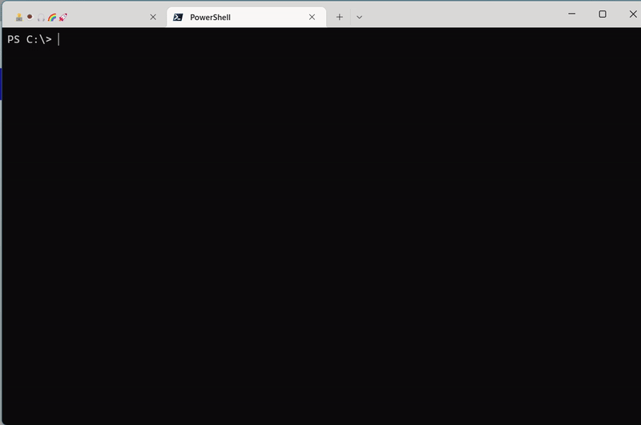
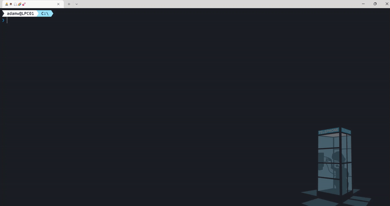

Are you regularly using CLI for Microsoft 365 and looking for a way to be more productive? Or is this totally new for you and you are looking for something 'special' which will make CLI for M365 stand out when compared with other command line tools? Well, you are in the right place. In this post I will show you some tips and tricks which may improve your experience with CLI for Microsoft 365.

## 🤔 But first of all what is CLI for Microsoft 365? Quick intro

If your already know what CLI for M365 is then I suppose you may skip this part😀. CLI for Microsoft 365 is a cross platform command line tool based on Node.js that helps you manage many things around Microsoft 365 and your SPFx project (yes, that as well 🤩. rename, upgrade ... you name it). To name a few, you may manage OneDrive, Planner, Power Apps and Automate, Teams, Yammer, SharePoint (of course). The list keeps on growing and growing, [check out the CLI for Microsoft 365](https://pnp.github.io/cli-microsoft365/). But it's not only about managing Microsoft 365. The CLI helps you also manage your own SPFx environment (check out the [doctor](https://pnp.github.io/cli-microsoft365/cmd/spfx/spfx-doctor/)) or projects (rename, upgrade etc.). This is very unique that many similar command line tools don't have. Some commands do simple things but some actually are ready to use scenarios all done under a single command. Check out the full list of [commands](https://pnp.github.io/cli-microsoft365/cmd/login/#usage)

## 🧠 How on earth am I supposed to remember all of those commands?

That's easy, you don't 😉. CLI got this covered for you 👍. The tool offers command completion for cmder, zsh, bash, fish, PowerShell ... gotta catch em all 🙂. Lets go over step by step setup for PowerShell. I suppose you already have CLI for Microsoft 365 installed. If not then lets quickly install it using the following command:

```powershell
npm i -g @pnp/cli-microsoft365
```

Now we need to generate the command.json file which will have the list of all available commands and options. In order to do that lets just run:

```powershell
m365 cli completion pwsh setup --profile $profile
```

Now lets restart the PowerShell console and lets type `m365` hit TAB ... wow 🤯. It's that easy.



How cool is that ?! 😎

For more information check out [Command completion docs](https://pnp.github.io/cli-microsoft365/user-guide/completion/).

## ✂️ Use only server-relative URL

Wait what was that in the last chapter. In the `--webUrl` option you only used relative part of the url? ... yeah I did 🙂. As any command line tool that is suppose to manage Microsoft 365 the majority of commands will focus on SharePoint Online. That means working with lot of web, subweb urls. Well CLI for Microsoft 365 got you covered here as well. When logged in to your tenant (`m365 login` command) all you need is execute a command like 

```powershell
m365 spo site list
```

After that CLI will remember SPO url for you and after that you may just use server-relative part. In order to check what is the current SPO url saved use:

```powershell
m365 spo get
```

In order to set the url explicitly use:

```powershell
m365 spo set --url https://contoso.sharepoint.com
```

How cool is that ?! 😎

For more information check out [Working with SharePoint URLs in spo commands docs](https://pnp.github.io/cli-microsoft365/user-guide/using-cli/#working-with-sharepoint-urls-in-spo-commands).

## 💬 Missed that required option? No problem

Ever executed a command in CLI for Microsoft 365 and got an error that you missed some required option? Well, CLI for Microsoft 365 got you covered here as well. CLI for Microsoft 365 has config that when enabled (by default it is disabled) it will start asking (prompting) for missing required options. Whaaaat 🤯. Lets give it a check. In order to do that lets first run:

```powershell
m365 cli config set --key prompt --value true
```

You may check the current config using:

```powershell
m365 cli config get --key prompt
```

Now if we try to execute a command and we will forget about specifying some required option we will be asked to provide it. 



How cool is that ?! 😎

One thing that is important to mention is that CLI for Microsoft 365 will not prompt for options where at least one is required. So for example in `m365 spo list get` command we may either use `--id` or `--title` to specify which list we want and we need to specify at least one of them. Currently CLI for Microsoft 365 will not prompt for neither of them and at the time of writing this article this feature is still open and waiting to be implemented.

I hope you are now wondering what other cool setting CLI for Microsoft 365 might have 😉. I will try to go over all of them next time but till then for more information check out [Configure CLI for Microsoft 365](https://pnp.github.io/cli-microsoft365/user-guide/configuring-cli/).

## 👉☝️👆👈 her, him, who? me? @me ... @meId, @meUserName 🤩

I hope you are sitting as this will blow your mind 😉. Remember back in the days you wanted to run some command passing the current user id or email as a parameter and you needed to remember it or look it up in the script first? Well those days are gone as now you can use `@meId` or `@meUserName` tokens. Lets give it a check. Try running 

```powershell
m365 aad user get --id "@meId"
```

or 

```powershell
m365 aad user get --userName "@meUserName"
```

And checkout what happens. 
Who did the command return ? Well what did you know 😉. How easy and cool is that ?! 😎

for more information check out [@meId and @meUserName tokens](https://pnp.github.io/cli-microsoft365/user-guide/using-cli/#meid-and-meusername-tokens).

## 🤷 Is that all? 

As you probably see CLI has it's cool features one might not notice at first glance but it is for sure good to know them. This of course is only a part of them and we could go over many more like: did you know you may use CLI for Microsoft 365 not only in command line but also when building your software 🤯. Yes, if you are building apps in Node.js you may reference CLI for Microsoft 365 as a library and use it in your code as any other API 🙂. Interested? I will try to write something more about this topic in another blog post 👍 

I hope this article was helpful for you and also pointed out some nice features which will make you give [CLI for Microsoft 365](https://pnp.github.io/cli-microsoft365/) a try 👍

## 🙋 Wanna help out?

CLI for Microsoft 365 is a great tool to use and also great place to learn git best practices, how to use SharePoint or Graph or other APIs. We are constantly improving and are always opened for any contributions that want to help out 💪. Don't worry if you don't know how to start or what you could do. Just check out the [contributing guide](https://github.com/pnp/cli-microsoft365/blob/main/CONTRIBUTING.md) and [issues list](https://github.com/pnp/cli-microsoft365/issues) and give it a shot. If I still didn't convince you, check out the the [7 reasons to contribute to the community](https://pnp.github.io/blog/post/7-reasons-to-contribute-to-the-community/) by [Martin Lingstuyl](https://github.com/martinlingstuyl/). I will be waiting for your PRs. Let me know if you need any help to start 👍
