---
# this is the title
title: "Connect Power Virtual Agents Teams Bot with Azure DevOps"
# this is the publishing date of your article, usually this should match "now"
date: 2023-04-13T06:00:00-04:00
# This is your name
author: "Sohil Bhalla"
# This is your GitHub name
githubname: sohilbhalla
# Don't change
categories: ["Community post"]
# Link to the thumbnail image for the post
images:
- images/thumbnail.png
# don't change
tags: ["Power Virtual Agents","Azure DevOps","Power Automate", "Azure DevOps API","Microsoft Graph"]
# don't change
type: "regular"
---

## Overview

Power Virtual Agents lets you create powerful AI-powered chatbots for a range of requests—from providing simple answers to common questions to resolving issues requiring complex conversations. Engage with customers and employees in multiple languages across websites, mobile apps, Facebook, Microsoft Teams, or any channel supported by the Azure Bot Framework.

On the other hand, we have Azure DevOps where all the source code is uploaded, have automated CI/CD pipelines and informative wiki pages describing features and components.

Sometimes end users want to know about the features that are documented in the Azure DevOps wiki pages or ask the bot to perform an operation that requires pipelines to be executed in the background.

This requires Power Virtual Agents to talk to Azure DevOps to perform these operations.

## Power Virtual Agent Setup

To start with Power Virtual Agent, we need to define the Trigger phrases in order for the bot to look for the details based on the question asked.

I have one of my trigger phrases as shown below –

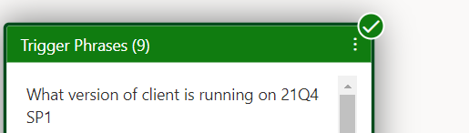

In the above trigger phrase the **client** and **21Q4 SP1** are treated as custom defined entities, that would be used to make relevant calls to the Azure DevOps to extract the data.

The two entities used above are defined as follows:

As we can see that Client is one of the entities. (referred as entity 1 in the blog)

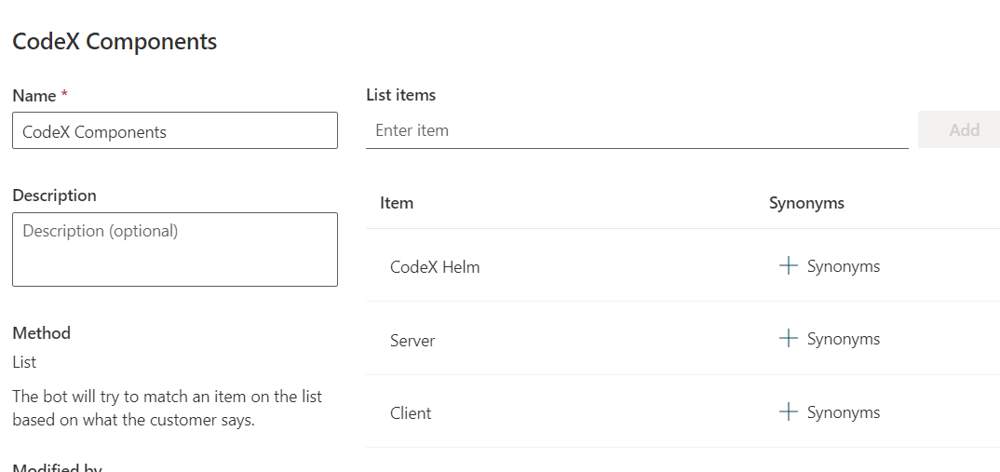

The second entity for the version like 21Q4 SP1 is defined as (referred as entity 2 in blog)

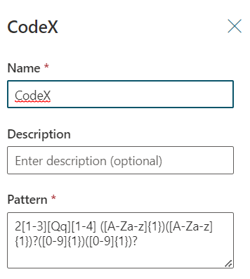

The above entity is defined as a regular expression through which any part of the message posted by the user matching this regular expression will be extracted and treated as an entity and would get stored in the entity value.

The pattern can be designed based on the individual needs and is very powerful to extract key things from the conversation that are dynamic in nature.

As we have the entities and trigger phrases setup now, we can start adding steps to the Power Virtual Agent.

## Steps in Power Virtual Agent

As a first step, if the user has not provided the details about the entity 1 and entity 2 in the initial conversation, then a follow up question will be asked as “Which component version you are looking for ? ” with the options listed.

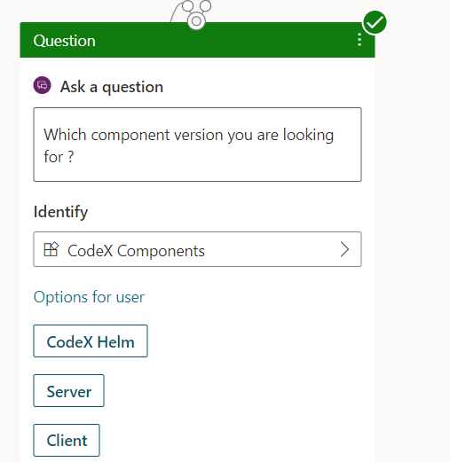

The value of the above response will be saved in a variable of type entity 1

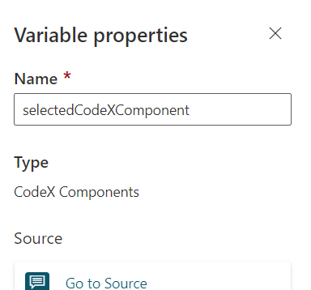

Similarly for Entity 2, there will another follow up question as –

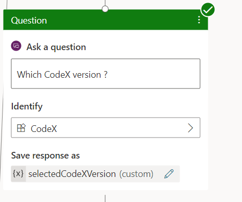

For the above question, user will type in the response that will be matched against the regular expression defined earlier ( Identify field in the screenshot above) to extract the entity value.

Now we have then entity values with us, it is time to configure a power automate which will make a call to the Azure DevOps using Azure DevOps APIs

Next step is to make a call to the power automate with the entity values

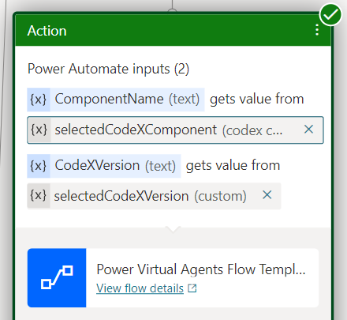

## Setup Power Automate

Power Automate will accept the 2 parameters from the Power Virtual Agent which are the 2 entity values extracted from the user conversation

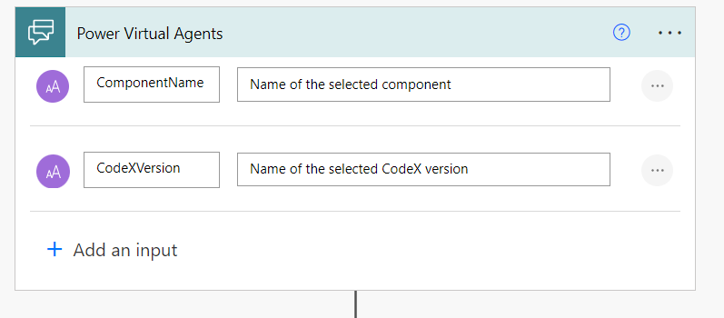

I have a file uploaded in the Azure DevOps repos that contains the component version mapped against the component name.

So I will make a Http call using Azure DevOps api to get the contents of the file and get the version of the component based on the component name

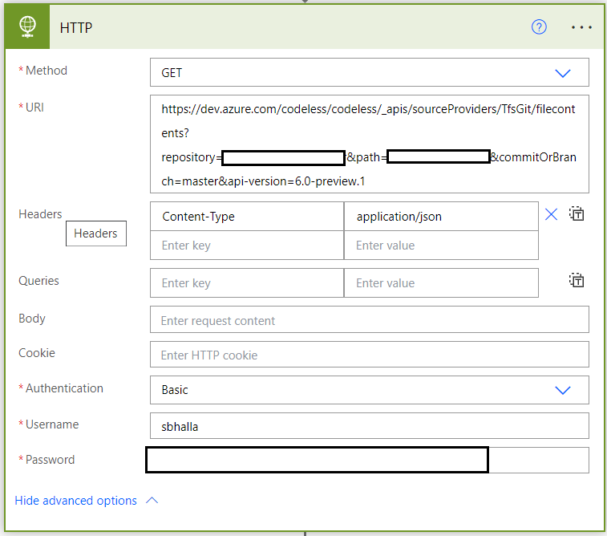

The above call will be done using the PAT token ( Personal Access Token ) used as Password which is generated from the DevOps and can be used to make the DevOps API calls. For more information on PAT Tokens, please refer [here](https://learn.microsoft.com/azure/devops/organizations/accounts/use-personal-access-tokens-to-authenticate?view=azure-devops&tabs=Windows)

Once we get the response from the dev ops API, we will use the filter array method to filter the response for the component version based on the component name passed as the input.

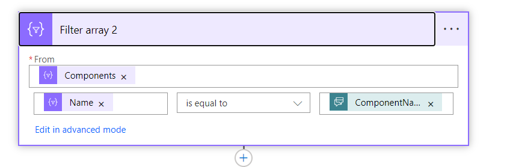

Similarly, there will be another call to the Azure Dev Ops to get the wiki page details based on the entity 2 value(CodeXVersion passed from Power Virtual Agent).

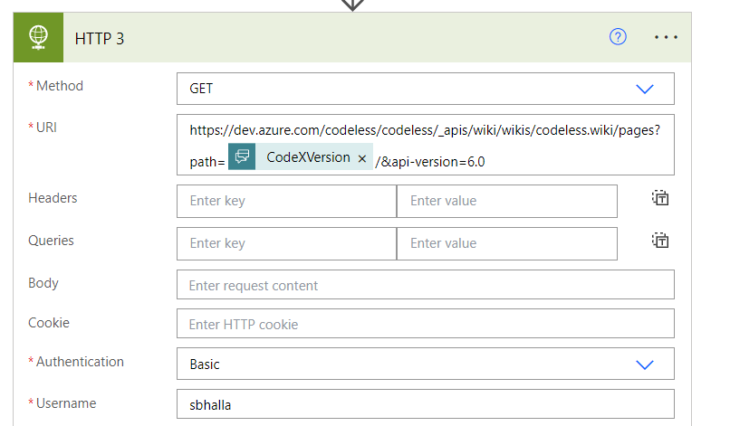

Finally the values extracted from the DevOps API are stored in the variables and returned back to the power virtual agent

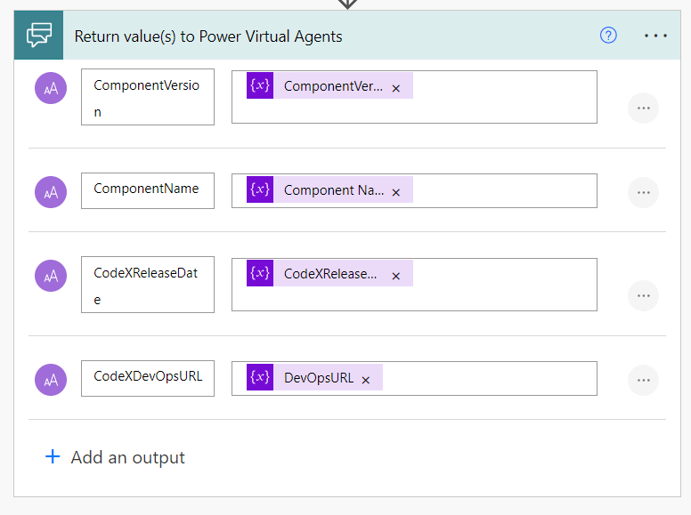

Power Virtual Agent responds back to the user with the details as shown below:

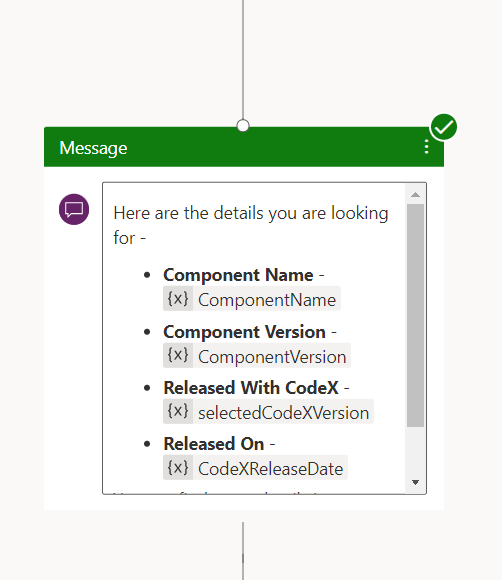

## Demo

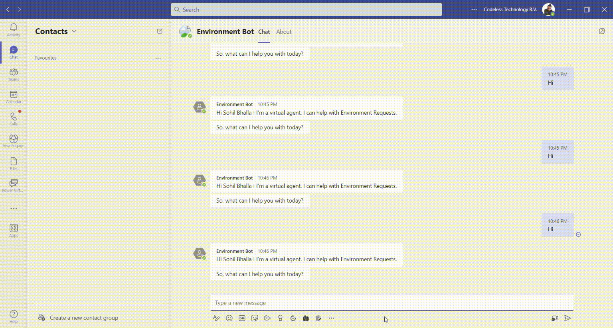
