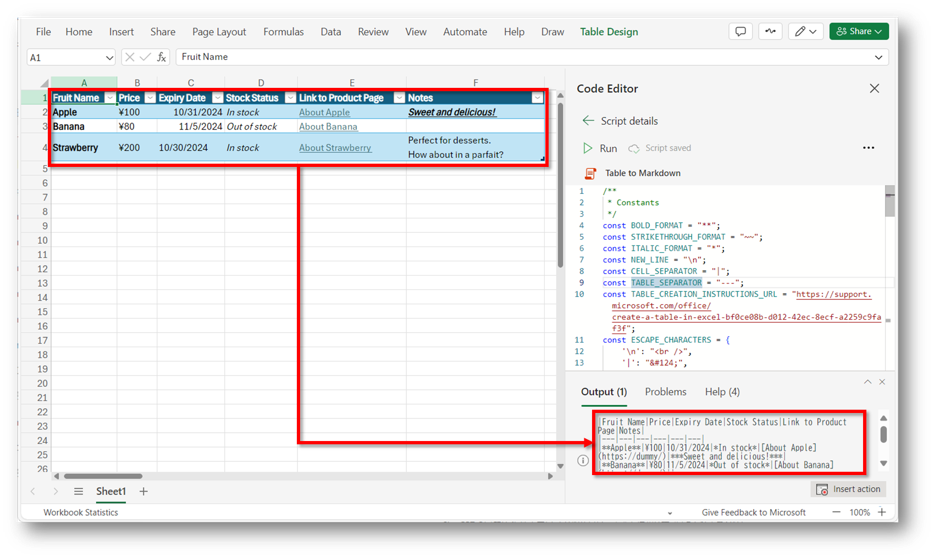
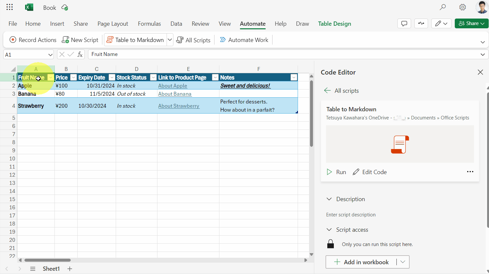
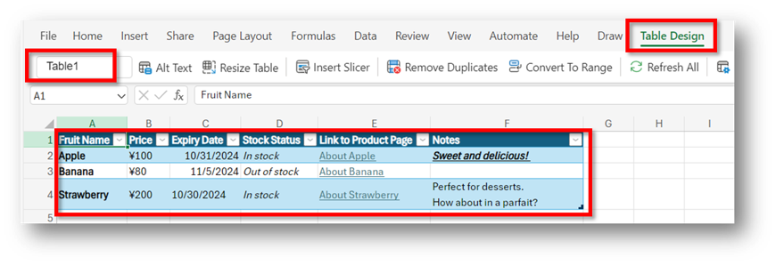
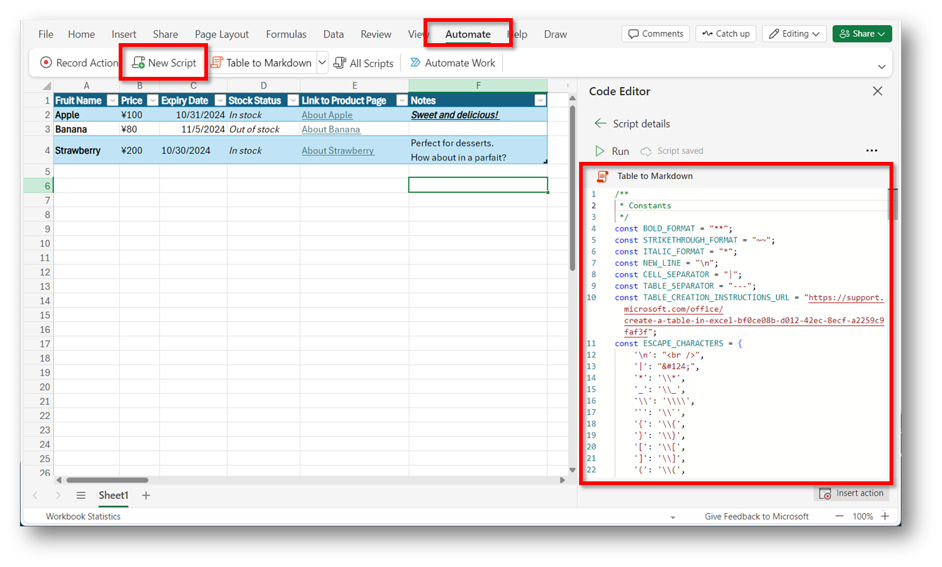
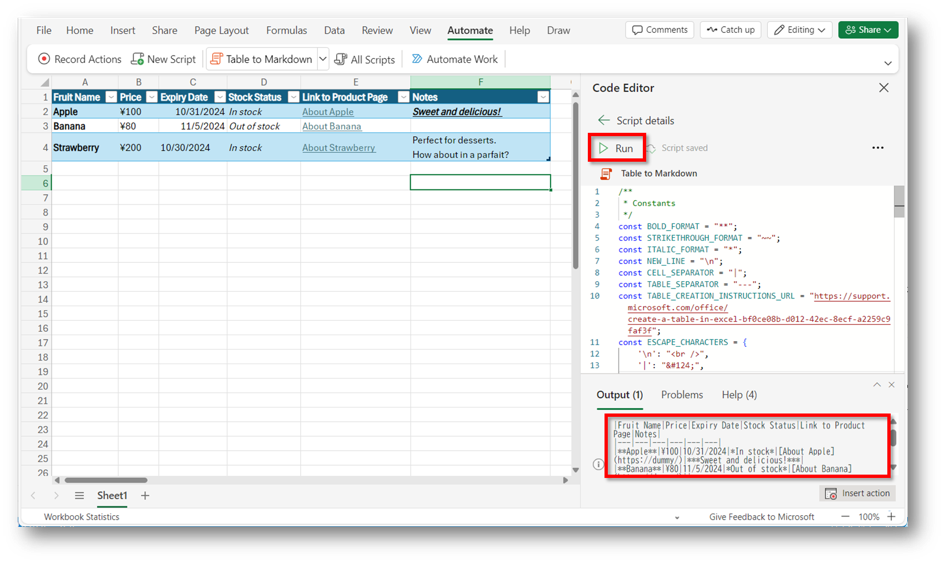

---
# this is the title
title: "Office Scripts: Convert Excel Tables to Markdown Text"

# this is the publishing date of your article, usually this should match "now"
date: 2024-10-17T00:00:00-00:00

# This is your name
author: "Tetsuya Kawahara"

# This is your GitHub name
githubname: tecchan1107

# Don't change
categories: ["Community post"]

# Link to the thumbnail image for the post
images:
  - images/thumbnail.png

# don't change
tags: []

# don't change
type: "regular"
---

## Introduction

While using GitHub, Azure DevOps, etc., I have the opportunity to write markdown text. However, I am not very good at writing markdown formatted tables, and it can take me a long time to write them.

On the other hand, I am used to creating tables in Excel. So, using [Office Scripts](https://learn.microsoft.com/office/dev/scripts/), I have created a script to convert the contents of an Excel table into markdown text.



Below, I will explain the details of the script I created and how to use it.

## Overview of the Script

When you run the script, it converts the content of the table in the currently open Excel sheet into markdown format, and the result is displayed in the console log.



Here’s an example of markdown generated by the script:

``` markdown
|Fruit Name|Price|Expiry Date|Stock Status|Link to Product Page|Notes|
|---|---|---|---|---|---|
|**Apple**|¥100|10/31/2024|*In stock*|[About Apple](https://dummy/)|***Sweet and delicious!***|
|**Banana**|¥80|11/5/2024|*Out of stock*|[About Banana](https://dummy/)||
|**Strawberry**|¥200|10/30/2024|*In stock*|[About Strawberry](https://dummy/)|Perfect for desserts.<br />How about in a parfait?|
```

## The Script

Below is the script I created:

``` typescript
/**
 * Constants
 */
const BOLD_FORMAT = "**";
const STRIKETHROUGH_FORMAT = "~~";
const ITALIC_FORMAT = "*";
const NEW_LINE = "\n";
const CELL_SEPARATOR = "|";
const TABLE_SEPARATOR = "---";
const TABLE_CREATION_INSTRUCTIONS_URL = "https://support.microsoft.com/office/create-a-table-in-excel-bf0ce08b-d012-42ec-8ecf-a2259c9faf3f";
const ESCAPE_CHARACTERS = {
    '\n': "<br />",
    '|': "&#124;",
    '*': '\\*',
    '_': '\\_',
    '\\': '\\\\',
    '`': '\\`',
    '{': '\\{',
    '}': '\\}',
    '[': '\\[',
    ']': '\\]',
    '(': '\\(',
    ')': '\\)',
    '>': '\\>',
    '#': '\\#',
    '+': '\\+',
    '-': '\\-'
};

/**
 * Main function that converts Excel tables to markdown text and outputs to console
 */
function main(workbook: ExcelScript.Workbook): string[] {
    const tables = workbook.getActiveWorksheet().getTables();

    if (tables.length === 0) {
        console.log(`The markdown table could not be created because there was no table. Please see the following link for instructions on how to create the table: ${TABLE_CREATION_INSTRUCTIONS_URL}`);
        return [];
    }

    const markdownTables: string[] = [];

    for (const table of tables) {
        const columns = table.getColumns();

        let markdownTable = createHeaderRow(columns);
        markdownTable += createSeparatorRow(columns);
        markdownTable += createDataRows(table, columns);

        markdownTables.push(markdownTable);
    }

    console.log(markdownTables.join(NEW_LINE));
    return markdownTables;
}

/**
 * Creates the header row of a markdown table
 */
function createHeaderRow(columns: ExcelScript.TableColumn[]): string {
    return CELL_SEPARATOR + columns.map(column => {
        // Check if the column is hidden
        if (column.getRange().getHidden()) {
            return '';
        }

        return escapeMarkdownSpecialChars(column.getName()) + CELL_SEPARATOR;
    }).join('') + NEW_LINE;
}

/**
 * Creates the separator row of a markdown table
 */
function createSeparatorRow(columns: ExcelScript.TableColumn[]): string {
    return CELL_SEPARATOR + columns.map(column => {
        // Check if the column is hidden
        if (column.getRange().getHidden()) {
            return '';
        }

        return TABLE_SEPARATOR + CELL_SEPARATOR;
    }).join('') + NEW_LINE;
}

/**
 * Creates data rows of a markdown table from an Excel table
 */
function createDataRows(table: ExcelScript.Table, columns: ExcelScript.TableColumn[]): string {
    const dataRows: string[] = [];
    const rowCount = table.getRowCount();

    // The first row of the table contains column names, so start from the second row.
    for (let i = 1; i <= rowCount; i++) {
        // Skip hidden rows
        if (table.getRange().getRow(i).getHidden()) {
            continue; 
        }

        const rowData: string[] = [];
        for (let j = 0; j < columns.length; j++) {
            const cell = table.getRange().getCell(i, j);

            // Check if the cell is hidden
            if (cell.getHidden()) {
                continue;
            }

            rowData.push(createCellText(cell));
        }

        if (rowData.length > 0) {
            dataRows.push(CELL_SEPARATOR + rowData.join(CELL_SEPARATOR) + CELL_SEPARATOR + NEW_LINE);
        }
    }

    return dataRows.join('');
}

/**
 * Creates Markdown-formatted text for a given Excel cell
 */
function createCellText(cell: ExcelScript.Range): string {
    const cellValue = cell.getTexts()[0][0].trim();
    const hyperlink = cell.getHyperlink();
    const format = cell.getFormat().getFont();
    let cellText = escapeMarkdownSpecialChars(cellValue);

    if (cellText) {
        if (format.getBold()) {
            cellText = `${BOLD_FORMAT}${cellText}${BOLD_FORMAT}`;
        }
        if (format.getStrikethrough()) {
            cellText = `${STRIKETHROUGH_FORMAT}${cellText}${STRIKETHROUGH_FORMAT}`;
        }
        if (format.getItalic()) {
            cellText = `${ITALIC_FORMAT}${cellText}${ITALIC_FORMAT}`;
        }
    }

    return hyperlink ? `[${cellText}](${hyperlink.address})` : cellText;
}

/**
 * Escapes special characters within markdown cells
 */
function escapeMarkdownSpecialChars(text: string): string {
    return text.replace(/[\n|*_\\`{}[\]()<>#+\-]/g, match => ESCAPE_CHARACTERS[match]);
}
```

## How to Use the Script

### Step 1: Create a Table in Excel

First, [create a table in Excel](https://support.microsoft.com/office/create-a-table-in-excel-bf0ce08b-d012-42ec-8ecf-a2259c9faf3f).



### Step 2: Register and Save the Script

Next, [register and save the script](https://support.microsoft.com/office/introduction-to-office-scripts-in-excel-9fbe283d-adb8-4f13-a75b-a81c6baf163a) above.



### Step 3: Run the Script

Once the script is saved, run it. After execution, the content of the table in the currently open sheet will be output as markdown text in the console log.



## Additional Notes

- The formatting applied to the cells (bold, italic, underline) will also be reflected in the markdown text output. However, other decorations like font color or background color will not be reflected.
- The alignment of text (left, center, right) won’t be preserved in the markdown. You may need to adjust the alignment manually after generating the markdown. For tips on formatting markdown tables, check out [this guide]((https://docs.github.com/en/get-started/writing-on-github/working-with-advanced-formatting/organizing-information-with-tables)).
- Hyperlinks within the table will be preserved in markdown format.
- Hidden cells in Excel will not be included in the markdown output.

## References

- [Office Scripts documentation - Office Scripts | Microsoft Learn](https://learn.microsoft.com/office/dev/scripts/)
- [Introduction to Office Scripts in Excel - Microsoft Support](https://support.microsoft.com/office/introduction-to-office-scripts-in-excel-9fbe283d-adb8-4f13-a75b-a81c6baf163a)
- [Organizing information with tables - GitHub Docs](https://docs.github.com/en/get-started/writing-on-github/working-with-advanced-formatting/organizing-information-with-tables)
- [Create a table in Excel - Microsoft Support](https://support.microsoft.com/office/create-a-table-in-excel-bf0ce08b-d012-42ec-8ecf-a2259c9faf3f)