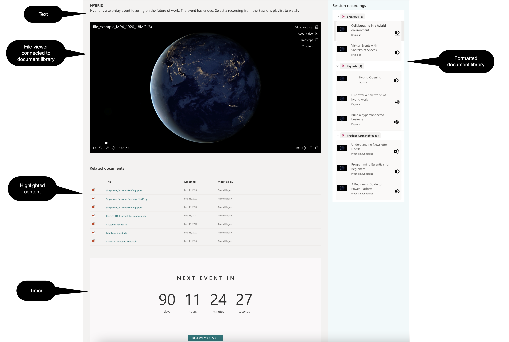

## The new Stream

The new stream is built on top of SharePoint and OneDrive. This means storing a video file is the same as storing a Word document or a PowerPoint file. This also means sharing, setting permissions, and adding comments on a video is the same as these other Office document types stored within SharePoint and OneDrive.
 
## Displaying on a SharePoint site

When videos are stored in SharePoint, they can be displayed on SharePoint pages using the file viewer, the highlighted content, and the Document library web parts. The Stream player controls are available too for video playback.
 
## Creating the playlist with the Document library and file viewer web parts

The document library exists at the same level as the default **Shared Documents** library on the site.
 


 
Video files are uploaded to the document library.


 
Additional columns can be created in the library, these additional columns provide rich information that can be displayed in the video portal. Rich metadata such as title, description, people, tools/topics covered, social sharing options like yammer buttons can compliment the experience.


 
When video files are uploaded and the metadata fields are filled in with
the information, the default **All Documents** view can look like this.
 


The default view or a new view can be created with all the columns included. The view can be edited to create grouping by topic, and then formatted using JSON. 
The groupprops element goves the group headers the formatting as shown. Each row when when formatted, looks like shown below. A thumbnail image, title and track info and a Yammer button that opens the connected conversation thread in Yammer.
 


To achieve this formatting, the view needs to be formatted using JSON.
 

 
The complete JSON is provided below.
 
```json
{
  "$schema": "https://developer.microsoft.com/json-schemas/sp/v2/row-formatting.schema.json",
  "schema": "https://developer.microsoft.com/json-schemas/sp/view-formatting.schema.json",
  "hideSelection": false,
  "hideListHeader": true,
  "groupProps": {
    "headerFormatter": {
      "elmType": "div",
      "style": {
        "flex-direction": "row",
        "margin": "-5px",
        "height": "25px"
      },
      "children": [
        {
          "elmType": "div",
          "attributes": {
            "class": "sp-field-borderAllRegular sp-css-borderColor-neutralSecondary"
          },
          "style": {
            "background-color": "#F3F2F1",
            "color": "#363636",
            "display": "inline-flex",
            "height": "25px",
            "border-radius": "5px",
            "padding-left": "8px",
            "padding-top": "5px"
          },
          "children": [
            {
              "elmType": "span",
              "attributes": {
                "iconName": "StreamLogo"
              },
              "style": {
                "padding-right": "6px",
                "padding-top": "2px",
                "color": "#C30052"
              }
            },
            {
              "elmType": "div",
              "style": {
                "display": "inline-flex",
                "padding-right": "9px"
              },
              "children": [
                {
                  "elmType": "div",
                  "txtContent": "=@group.fieldData",
                  "attributes": {
                    "title": "=@group.fieldData",
                    "class": "ms-fontWeight-bold"
                  },
                  "style": {
                    "padding-left": "5px"
                  }
                },
                {
                  "elmType": "div",
                  "style": {
                    "padding-left": "5px"
                  },
                  "attributes": {
                    "class": "ms-fontWeight-bold"
                  },
                  "txtContent": "='(' + @group.count + ')'"
                }
              ]
            }
          ]
        }
      ]
    }
  },
  "rowFormatter": {
    "elmType": "div",
    "style": {
      "display": "flex",
      "float": "left",
      "margin-left": "-25px",
      "padding": "5px",
      "width": "320px",
      "min-height": "90px",
      "justify-content": "space-between",
      "border-radius": "5px",
      "white-space": "normal",
      "overflow-wrap": "break-word"
    },
    "attributes": {
      "class": "sp-card-container ms-bgColor-neutralLighterAlt ms-bgColor-neutralLight--hover ms-fontColor-themePrimary--hover"
    },
    "children": [
      {
        "elmType": "div",
        "style": {
          "max-width": "50px",
          "max-height": "50px",
          "margin-right": "1px",
          "white-space": "normal",
          "overflow": "visible"
        },
        "children": [
          {
            "elmType": "img",
            "style": {
              "display": "block",
              "max-width": "50px"
            },
            "attributes": {
              "src": "@thumbnail.medium"
            }
          }
        ]
      },
      {
        "elmType": "div",
        "style": {
          "text-align": "left",
          "padding-right": "5px",
          "margin-left": "20px",
          "margin-right": "10px"
        },
        "children": [
          {
            "elmType": "div",
            "style": {
              "font-weight": "400",
              "font-size": "1rem",
              "white-space": "normal",
              "overflow": "visible",
              "word-wrap": "normal"
            },
            "txtContent": "[$Session]"
          },
          {
            "elmType": "div",
            "style": {
              "font-weight": "400",
              "font-size": "1em",
              "overflow": "visible",
              "max-width": "260px",
              "white-space": "normal",
              "padding-top": "5px",
              "padding-bottom": "15px"
            },
            "txtContent": "[$Track]"
          }
        ]
      },
      {
        "elmType": "div",
        "children": [
          {
            "elmType": "span",
            "style": {
              "height": "2rem",
              "width": "2rem",
              "font-size": "1em",
              "cursor": "pointer",
              "margin-top": "5px",
              "margin-right": "5px",
              "vertical-align": "text-bottom"
            }
          },
          {
            "elmType": "span",
            "children": [
              {
                "elmType": "span",
                "style": {
                  "height": "2rem",
                  "width": "2rem",
                  "font-size": "2em",
                  "cursor": "pointer",
                  "margin": "5px",
                  "padding-right": "5px",
                  "vertical-align": "text-bottom",
                  "display": "=if([$Yammer]=='','none','')"
                },
                "children": [
                  {
                    "elmType": "a",
                    "style": {
                      "cursor": "pointer"
                    },
                    "attributes": {
                      "class": "ms-fontColor-black ms-fontColor-gray--hover ms-fontColor-themePrimary--hover",
                      "iconName": "YammerLogo",
                      "href": "=[$Yammer]",
                      "target": "_blank",
                      "title": "Go to Yammer coversation"
                    }
                  }
                ]
              }
            ]
          }
        ]
      }
    ]
  }
}
```
 
The next step is then to embed this view in the SharePoint site page
using the Document library web part.
 

 
And choosing the library to be embedded. **Session recordings** is the
name of my library.
 


Editing the web part to set the correct view, hiding the command bar and **See all** buttons.

 


The next step is to add a File viewer web part on the SharePoint page.


Next connect it to the **Session recordings** web part, so that when a session recording is selected, the file viewer displays the video of the selected recording.
 


 
You can then add additional text, related materials using a highlighted content web part and finish things off.


 
Hope you found this useful. I would be interested to hear your thoughts and if you would use this and how you might enhance this.
