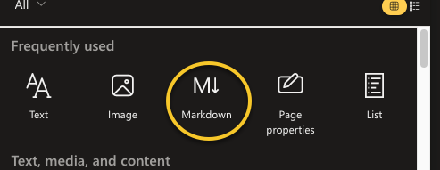
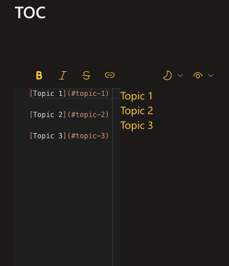
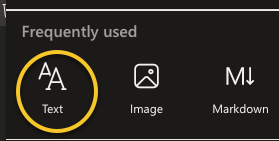
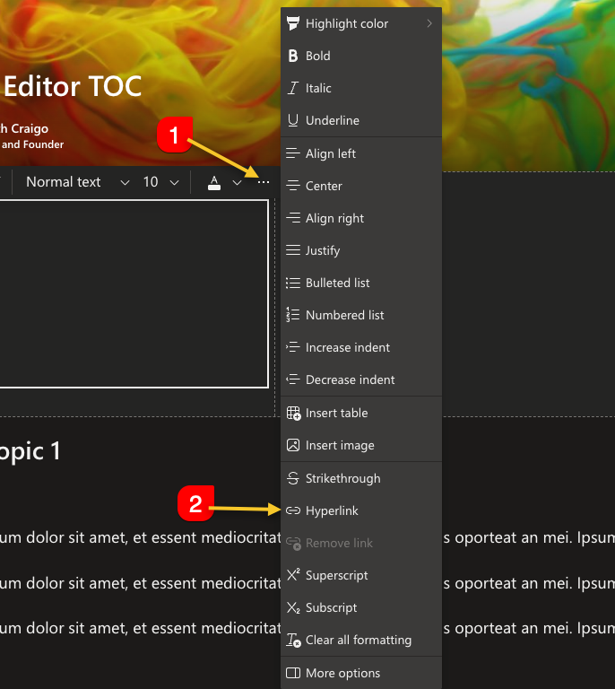
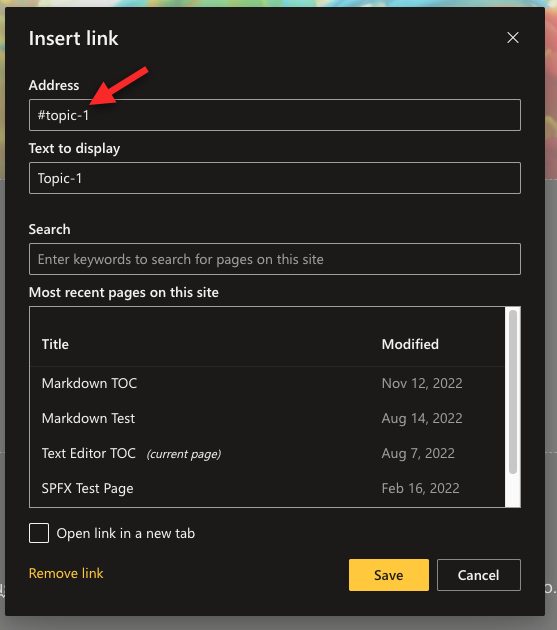
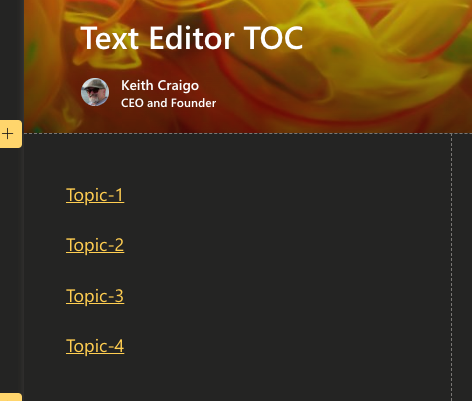

## Background

I find that the Modern SharePoint Page is a fantastic place for creating tutorials, articles, and even some ramblings to share with your co-workers.
With all the out of the box web parts you can, if you have the permissions to do so of course, create some great content to help others in your organization.

Others including Engineers in the IT department started showing interest in some of the technologies I was using to develop apps for my department. 
So I decided a few years ago to start putting a lot of my developer notes into the company wiki pages and then eventually decided a SharePoint Modern Page was a better platform. 

In this new modern page I started writing about developing with the PnP Library, Power Platform, React, Angular, SharePoint, some best practices & internal resources from the perspective of a worker who is not part of the IT organization who would normally develop the internal apps. Much of my experience was before the term "Citizen Developer" was coined, before then I would have been called a rogue programmer or something else.

This page has become somewhat long not quite a Novel but long enough. As time permits, I'll need to structure the topics into a more manageable and digestible fashion. In the meantime, I thought it would be a fun exercise and helpful to create a Table of Contents for this page. 

### Side Note

I have created some videos about creating a TOC on my personal YouTube - https://www.youtube.com/@WebDevByTheBay

## Create the TOC

I believe you could accomplish this by creating a custom web part with SPFx but implementing custom web parts in my organization is not that easy, so I will only cover the Text Editor web part & the Markdown Editor web part.

Copying the headers is an (optional) step for either the Text Editor web part or the Markdown Editor web part.

1. Right click each of the headers in your page, copy & paste each link into a text editor such as notepad or Notes if your on a MAC. 
Make sure your text editor does not add additional formatting.
 

2. Add the title in square brackets: `[Topic 1]`
3. Add the link in parenthesis: `(https://[Your Site URL].aspx#topic-1)`

Ex.

`- [Heading 1](REPLACE WITH HEADING LINK)`

`- [Heading 2](REPLACE WITH HEADING LINK)`

`- [Heading 3](REPLACE WITH HEADING LINK)`

Why I say copying the links is optional, 


For the link you only need the `<strong>#</strong>` symbol and heading i.e., `<strong>#topic-1</strong>`


You should now have something similar to 

 

An alternative is to use the Text Editor web part

 

Add a Hyperlink
 


For the link you only need the `<strong>#</strong>` symbol and heading i.e., `<strong>#topic-1</strong>`


 

You should now have something similar to,

 

To learn more about the Markdown language I suggest taking a look at

- [Microsoft 365 Community Blog Markdown reference](https://github.com/pnp/blog/wiki/Microsoft-365-Community-Blog-Markdown-reference)
- [MarkdownGuide.org Cheat Sheet](https://www.markdownguide.org/basic-syntax)

Hope this is useful!
