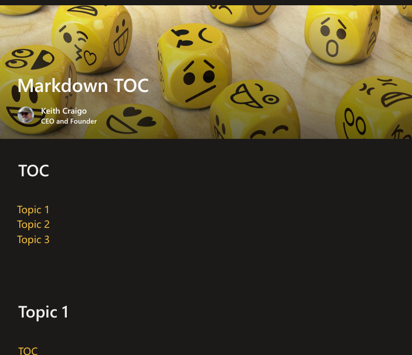

I find that the Modern SharePoint Page is a fantastic place for creating tutorials, articles, and even some ramblings to share with your co-workers.
With all the out of the box web parts you can, if you have the permissions to do so of course, create some great content to help others in your organization.

Others including Engineers in the IT department started showing interest in some of the technologies I was using to develop apps for my department. 
So I decided a few years ago to start putting a lot of my developer notes into the company wiki pages and then eventually decided a SharePoint Modern Page was a better platform. 

In this new modern page I cover subjects on developing with the PnP Library, Power Platform, React, Angular, SharePoint, some best practices & internal resources from the perspective of a worker who is not part of the IT organization who would normally develop the internal apps. 
Much of my experience was before the term "Citizen Developer" was coined, before then I would have been called a rogue programmer or something else.

This page has become somewhat of a Novel.  
As time permits, I will eventually parse this out by subject matter into a separate page for each subject. 
In the meantime, I thought it would be a fun exercise and helpful to create a Table of Contents for this page. 

I have created some videos on my personal YouTube - https://www.youtube.com/@WebDevByTheBay and my blog - https://www.kcraigo.com/. 
I did not go into great detail on my blog so I'll try and expand on creating a TOC in this post.

I believe you could accomplish this by creating a custom web part with SPFx but this is not easy to implement in my organization so I will only cover the Text Editor web part & the Markdown Editor web part.

Copying the headers is an (optional) step for either the Text Editor web part or the Markdown Editor web part.

1. Right click each of the headers in your page, copy & paste each link into a text editor such as notepad or Notes if your on a MAC. Make sure your text editor does not add additional formatting.

2. 
 

Add the title in square brackets: [Topic 1]
Add the link in parethesis: (https://[Your Site URL].aspx#topic-1)

Why I say copying the links is optional,
TIP: For the link you only need the # symbol and heading i.e., #topic-1

You should now have something similar to 
 

or

 

Add a Hyperlink
 

TIP: In the Address line, you only need the # symbol and the section heading i.e., #topic-1
 

You should now have something similar to,

 

Hope this is useful!