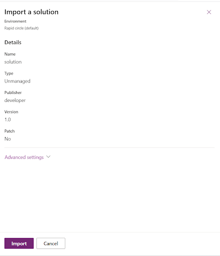

## Introduction

PCF or PowerApps Component Framework, is a way for developers to create their own special features or elements that can be added to Microsoft PowerApps.

PowerApps is a platform for building custom business applications. PCF lets developers build these extra features using web technologies, like HTML and JavaScript. These features can be things like unique buttons or data displays. PCF components can be used in different PowerApps applications, making it easier to add custom functions and make your apps even more powerful. It's like adding new tools to your app-building toolbox.

## Prerequisites

Before diving into PCF development with React, ensure you have the following prerequisites in place:

- **Power Platform Environment**: Access to a Power Platform environment, whether it's a trial or a licensed version.

- **Node.js and npm**: Node.js and npm (Node Package Manager) should be installed on your development machine. Download and install them from the official Node.js website.

- **Visual Studio Code**: We recommend using Visual Studio Code as your code editor. If you haven't already, download it from the official Visual Studio Code website.

- **PCF CLI**: To manage and create PCF projects, you'll need the PCF CLI. Install it using npm with the command: ```npm install -g powerapps-cli```

## Implementation

- Create a new folder for your PCF component project.
- Open your code editor and navigate to the project folder.
- In your terminal, run the following command to initialize a new PCF project:
  ```pac pcf init --name “Link” --namespace “Link” --template field --framework React```
- Then execute below command to install dependency, ```npm i```
- Let's now explore the structure of the project.

## Project structure

Here are the key files and configurations involved in a React PCF component:

**Component Code Files**:

- component.tsx: This is the main React component file where you define the component's behavior and appearance. It typically includes the component logic, rendering, and any event handling. This is the heart of your component.

- index.ts: This TypeScript file defines the component interface and the manifest used to describe the component to the Power Apps platform.

**Component Configuration Files**:

- controlmanifest.template.xml: This XML file contains metadata that describes your PCF component. It includes information like the component's name, description, properties, and custom control settings. This file is used for deployment and registering the component in Power Apps.

**Package Files**:

- package.json: This is a standard Node.js package configuration file. It includes dependencies, scripts, and other metadata about the project. You may use it to manage dependencies, scripts, and other settings for your PCF project.

- tsconfig.json: This TypeScript configuration file defines how TypeScript should compile your code. It specifies the target version of JavaScript, module resolution, and other compiler options.

## Execution

- To create a project, run the command ```npm run build```.
- To view the results, use the command ```npm start watch```. This will open a page in your web browser at localhost, port 8181.


## Packaging

- Create a new folder inside the sample component folder and name it as Solutions (or any name of your choice) using the command mkdir Solutions. Navigate into the directory using the command cd Solutions.

- Make a new project for your solutions with the "pac solution init" command. This project is where you gather all your code components into a zip file. You use this zip file to bring everything into Dataverse.

```pac solution init --publisher-name developer --publisher-prefix dev```


- Once you've created the new project, go to the Solutions folder to locate the example component you made. To make sure this component is included when you build your project, use the "pac solution add-reference" command. This reference tells the project which code components to use when it's being put together. You can add references to several components in a single project.

```pac solution add-reference --path c:\downloads\mysamplecomponent```


- To make a zip file from your project, first, go to the project folder. Then, use this command to build the project: "msbuild." This command also gets the extra stuff your project needs. You only need to use "/restore" the first time you build the project. After that, just use "msbuild" for every build.

```msbuild /t:build /restore```


## Deployment

- Open Power Apps Studio.
- Navigate to the solution.
- Choose "Import solution."
- Add the zip file located at "solution/bin/debug/solution.zip".



- Once the solution is successfully imported, click "Publish all customizations."
- Now, you can add the component to your application.

## Add component to canvas app

- Open Power Apps Studio.
- Start by either making a new canvas app or editing an existing one where you want to use the code component.
- In the left panel, click on "Add" (+) and then choose "Get more components."


- Click on the "Code" tab. Next, pick a component from the list, and then click on "Import."


- In the left panel, click the plus (+) sign, open the "Code components" section, and then choose the component to include it in the app.


## Output


## Conclusion
In this article, you've successfully crafted your initial PowerApps Component Framework (PCF) component with React. This guide has provided you with the know-how and expertise required to expand the capabilities of PowerApps by introducing custom components. Your potential for creating advanced PCF components tailored to your unique business requirements is boundless.

Happy PCF component building with React!

Sharing is caring!
