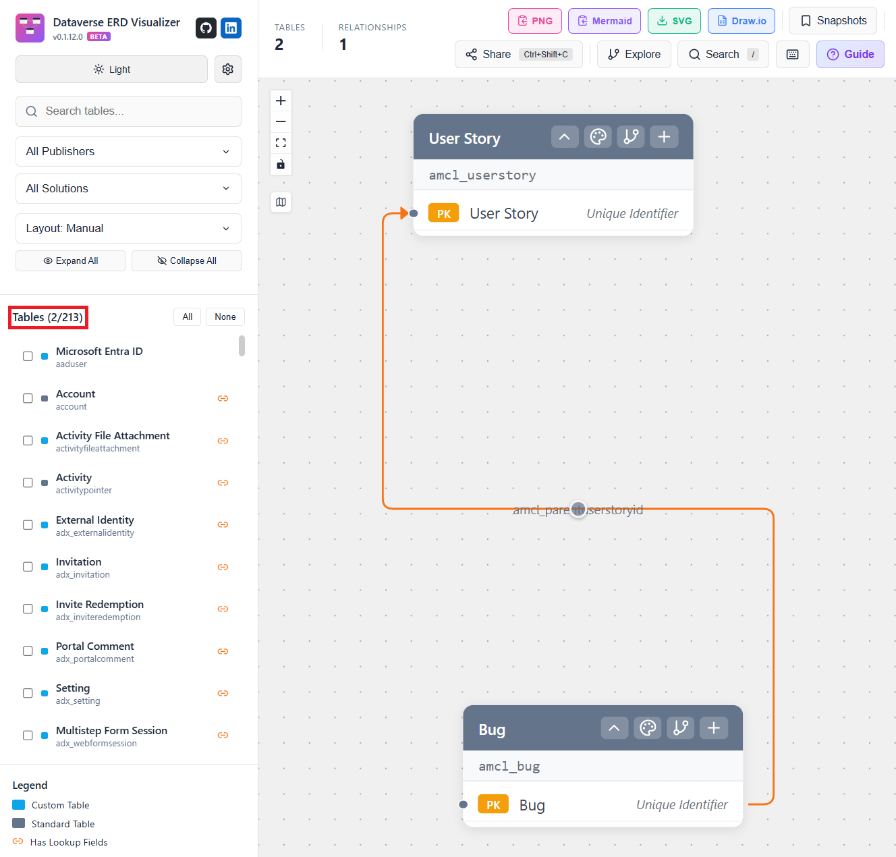
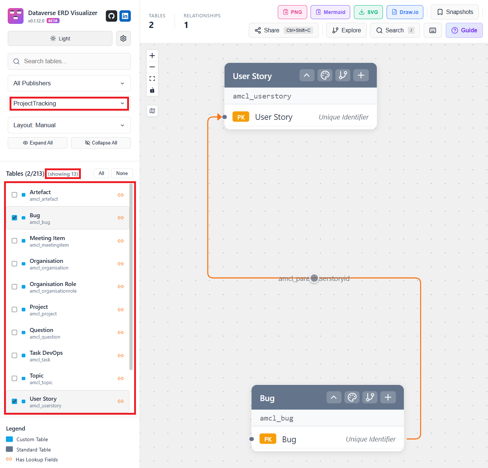
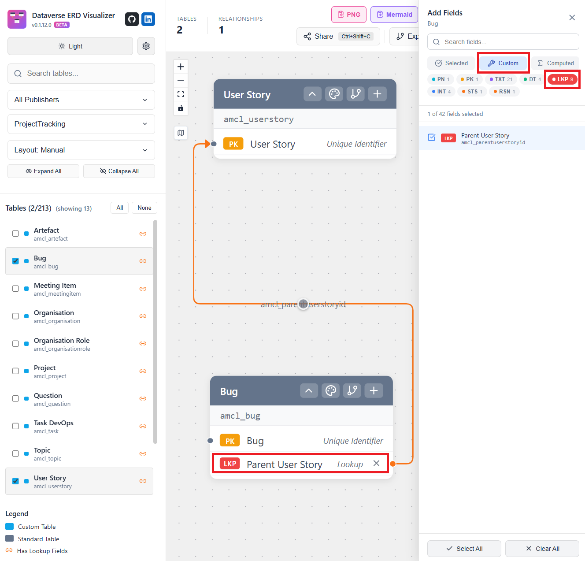
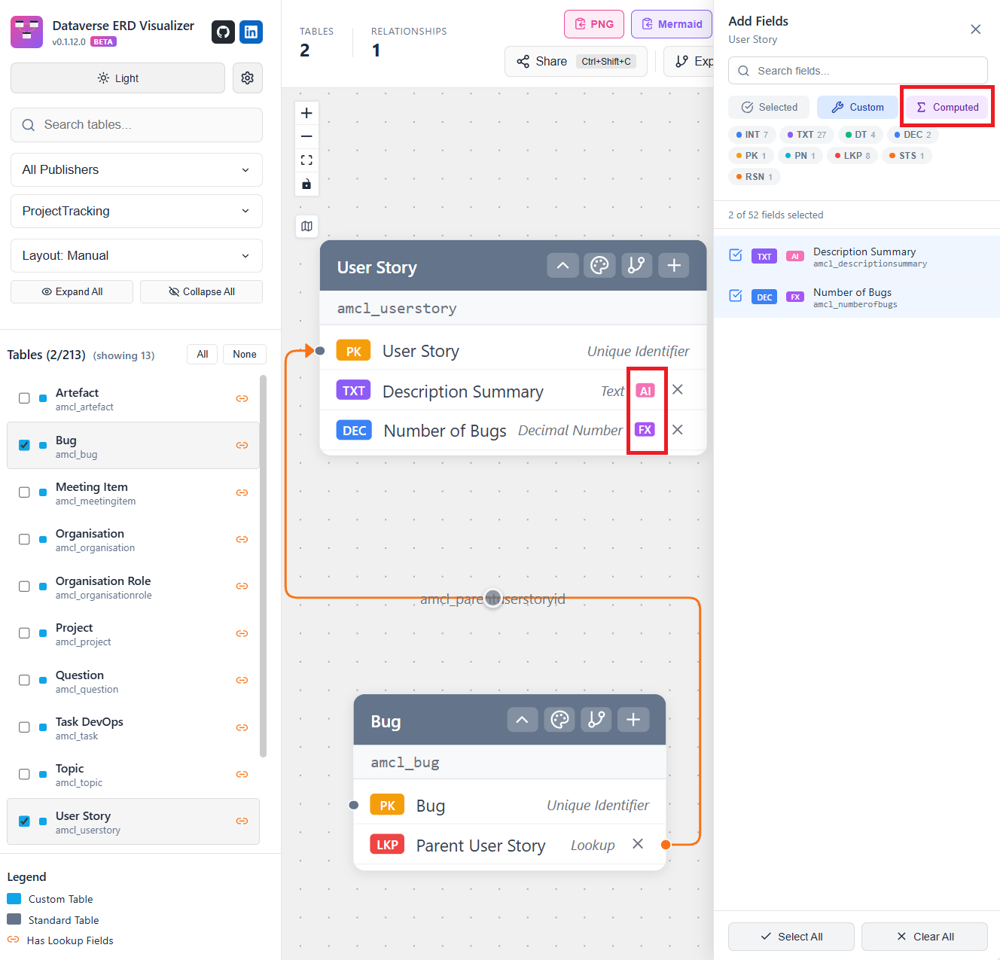
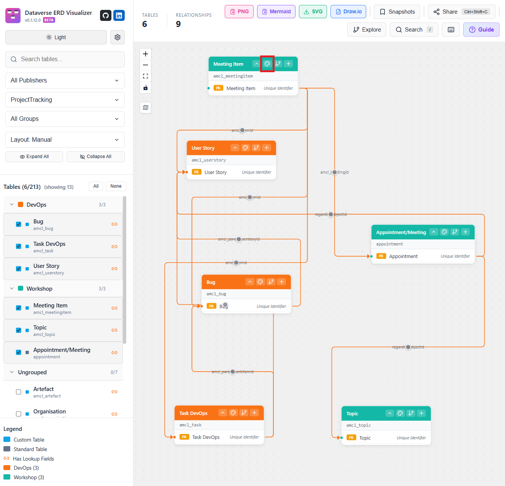
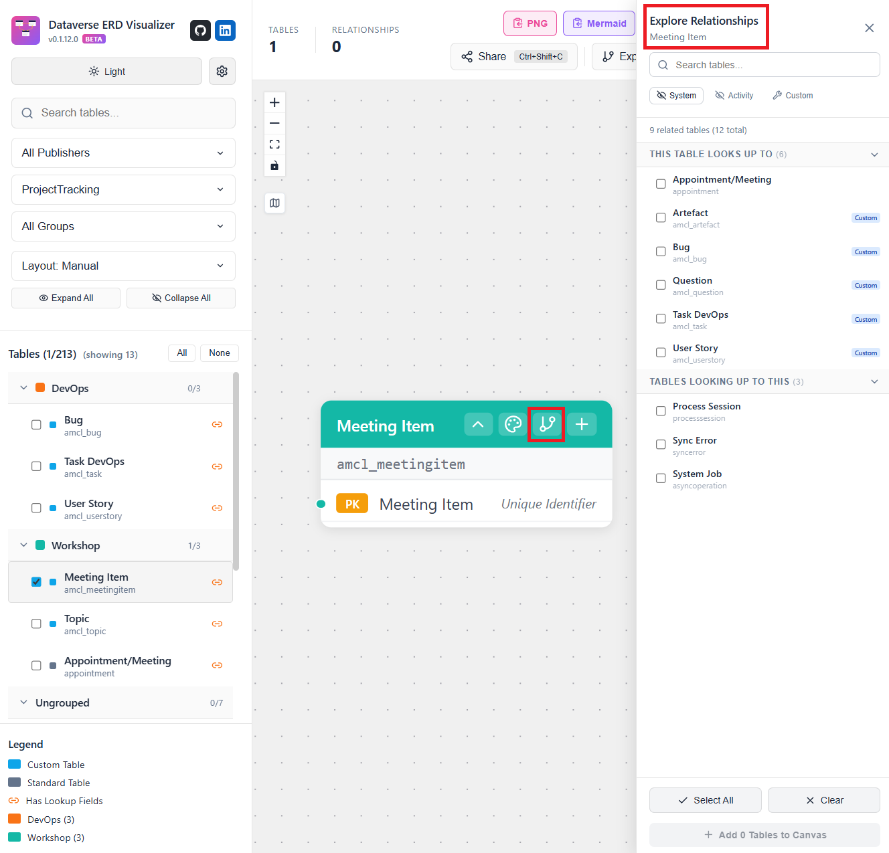
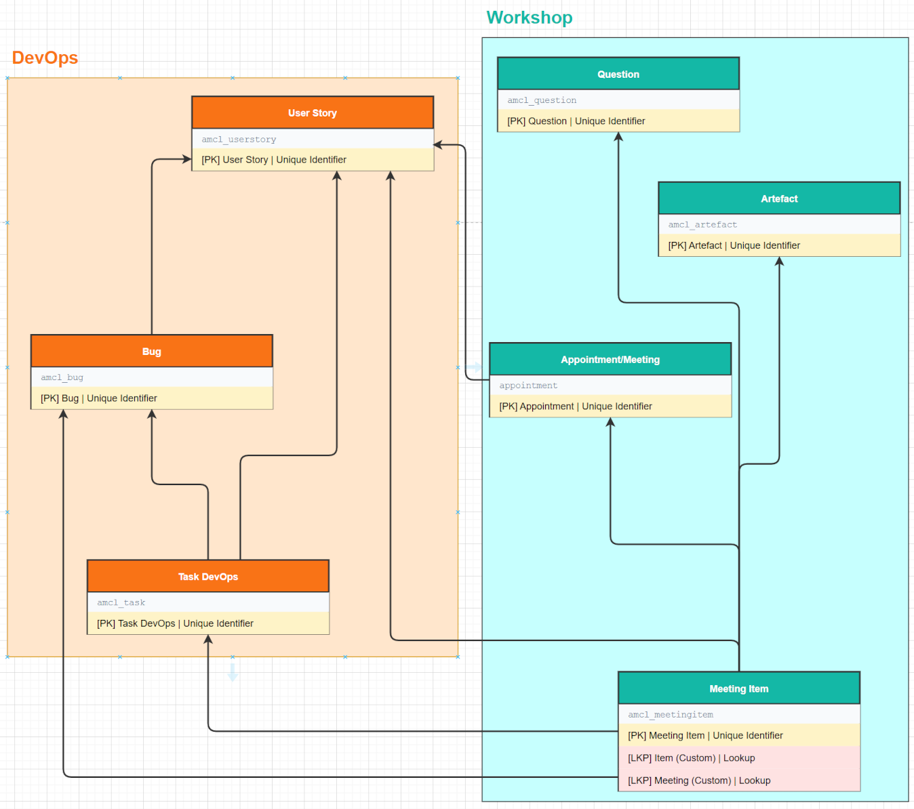
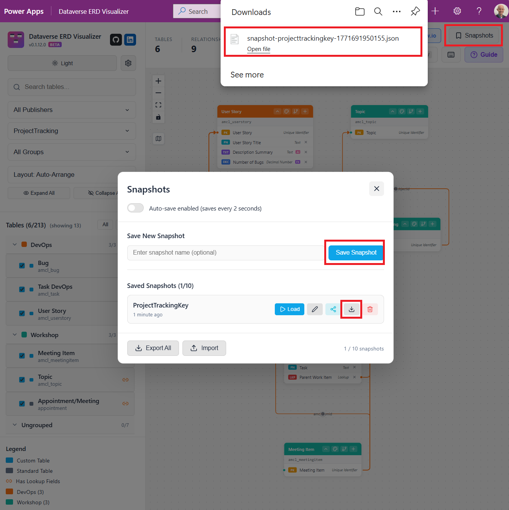

## TL;DR

[Dataverse ERD Visualizer](https://github.com/allandecastro/dataverse-erd-visualizer) is a brilliant new tool by [Allan De Castro](https://www.linkedin.com/in/allandecastro/) that I've been using since January.

If you work with Dataverse as a **Functional Consultant** or **Solution Architect**, this is (in my opinion) a must‑have.

Why I like it:
- ERDs are **in-context and WYSIWYG** — they reflect what’s actually in your environment
- Easy filtering by **solution, publisher, field type, AI, and Power Fx**
- Great **export options** (draw.io, Mermaid) for documentation
- You can **save, reload, and update** diagrams instead of starting from scratch

Below are my top 10 favourite features, using examples from a small demo system that tracks workshops and their resulting work items.

---

## 1. Create ERDs

This is kinda obvious, but the power of the Dataverse ERD Visualizer is that the ERDs are in-context and WYSIWYG. The visualizer is a solution in your environment (ideally Dev) and opens as an HTML web resource. This means it has access to all the tables and fields in your environment. In the example below, I've selected two out of the 213 tables in the environment.



---

## 2. Filter by Publisher or Solution

The tables can be filtered by publisher or by solution to narrow down the number of tables being viewed. I find this particularly helpful when there've been other partners working on the system previously, to explore the tables used by the different publishers and different solutions.



---

## 3. Select Fields by Type / Custom

There are often a number of key fields I want to add to tables in ERDs, but finding them in amongst other fields can be a challenge.

Selecting the ‘+’ in the table title bar brings up the field list, which you can then filter. So, for a lookup, selecting:

1. '+'
2. Custom
3. LKP (Lookup)



---

## 4. Filtering and Selecting AI and Power Fx Fields

I find it useful to be able to list AI and Power Fx fields, and the field list can be filtered for these too (as well as calculated and roll-up fields).



---

## 5. Colour Code Tables

With larger ERDs with multiple tables, it's helpful to be able to colour tables to group them.



In my solution, there are tables that represent DevOps work items, and other tables that represent workshops and their agenda items. Selecting the palette control on the table shape allows the table to be given a colour.

---

## 6. Exploring Relationships

As I mentioned earlier, when I'm working with systems where there're a number of different solutions, or particularly when other companies have been involved previously, it's helpful to be able to explore the relationships between the tables.



The connections control on the table shape displays all tables connected to it, including n:n relationships.

---

## 7. Export - to draw.io

One of my main reasons for producing an ERD is for documentation, and the tool provides a number of export options, including draw.io, which then allows further editing and annotation of the ERD.



---

## 8. Export to Mermaid and beyond

Exporting to Mermaid gives the benefit of being able to use the Mermaid ERD diagram in, say, a DevOps Wiki, but because Mermaid uses a JSON-based syntax, it also opens the door to other uses, such as extracting all the Power Fx fields.

```json
    amcl_bug {
        string amcl_bug
        uuid amcl_bugid PK
        string amcl_parentuserstoryid
    }
    amcl_task {
        string amcl_parentworkitemid
        string amcl_task
        uuid amcl_taskid PK
    }
    amcl_userstory {
        string amcl_descriptionsummary AI
        decimal amcl_numberofbugs Fx
        uuid amcl_userstoryid PK
        string amcl_userstorytitle
    }
```

---

## 9. Save / Reload / Update

One issue I’ve often hit with XrmToolBox ERD tools is that if I produce an ERD and then later want to add another table or relationship into the ERD, I have to start from scratch with creating, exporting, and editing a new diagram (or add the new elements manually). The Visualizer allows diagrams to be saved and reloaded to edit, which gives you much more flexibility when the model changes.



---

## 10. Bonus Features

I've highlighted my favourites, but there are lots of other features that make this so useful:

- Light/dark mode
- An extensive Guide
- Auto-layout - with 4 different layout options
- and others

---

The Visualizer can be downloaded and installed from the [Dataverse ERD Visualize GitHub repository](https://github.com/allandecastro/dataverse-erd-visualizer).
