## Introduction

Data retention policy is one of the most important concept in modern app development. According to Cybersecurity Ventures data storage is projected to exceed 200 zettabytes by 2025 worldwide. This is a huge challenge for all of us. We cannot store our data infinitely in our storages anymore, but we must be proactive and learn how to manage them effectively. In this post I would like to share with you how we can implement long term data retention in Power Platform by using Retention Policy. 

## Benefits of data retention policy
1. Improved app performance - less data, better app load time and user experience.
2. Less costs of data storage - removing or archiving (usually those data are compressed) unnecessary data significantly impacts the total cost of maintained infrastructure.
3. Compliance with legal regulations - each country/region has their own rules how to deal with stored data, e.g. GDPR in EU.
4. Increased data quality - keeping historical data which are not in use any more decrease quality. Usually, this data has a lot of mistakes which were not captured due to incomplete app validation. This situation requires from everyone increased attention when working with data.
1. Better security - in case of any kind of cyberattack or accidental data leakage, damage is limited to minimum due to fact that part of data is already retained.

## Dataverse long term retention overview
- Data is copied from production Dataverse tables to Dataverse long term retention (Dataverse managed data lake), not removed automatically from tenat.
- Long-term retained data can be only removed programmatically via SDK for .NET or Web API.
- Dataverse long term retention compress stored data, saving on average, 50% less database capacity.
- No additional storage purchases is required.
- Data are not moved outside Dataverse.
- It can takes 72 to 96 hours to finish all actions.
- Initial status is "Pending Reconciliation". When process is done policy shows status "Completed".
- Managed Dataverse environment is required to create policy.
- Retention Policy can't be stopped.
- All processes are run in background (during off hours) to avoid performance impact.
- There is no possibility to revert completed changes.
- Dataverse retention policy is solution aware.
- System administrator role is requiered to create new policy.
- Policy can be run once, daily, weekly, monthly or yearly.

## Use case description
IT Director of fictional company "XYZ" requested to improve ticketing tool performance. App is working slower than usual. During the tool analysis experts decided that the number of registered requests is impacting overall tool performance. On the list there are requests opened by requestor, but automatically closed due to lack of response (from end user) on questions asked by IT specialist. After a discusion with Data Privacy Office it was aggred that data should be retain for audit purposes. Developers decided to create a Dataverse policy which removes those requests from the ticket table based on request status "no reply from requestor; after SLA". To keep process effective data should be deleted on daily basis.

## Step by step implementation

#### Assumptions
User knows:
- what is Power Platform solution and how to work with it,
- basics about Dataverse tables design.

#### 1. Go to ticket table settings
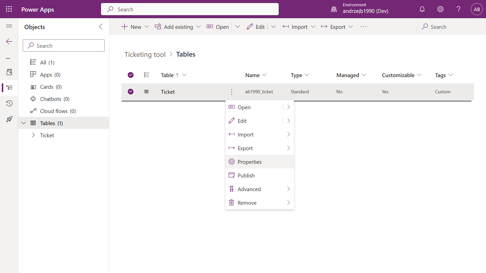

#### 2. In advanced options section select <u>Enable long term retention</u> option
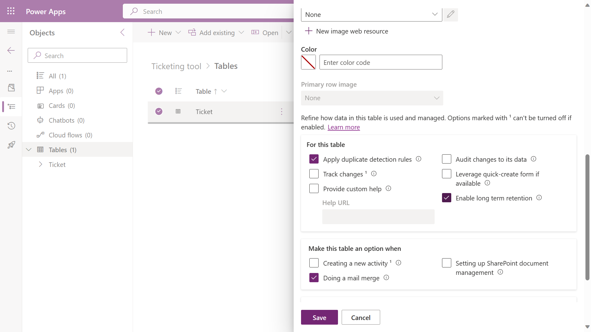

Long term retention makes automatic changes in:
- <b>Solution:</b> Five standard tables (Activity, Attachment, Connection, Queue Item and Sync Error) are added.
- <b>Table with enabled retention:</b> Column (msft_DataState) describing record retention status is created.

#### 3. Next go to table views and create new view

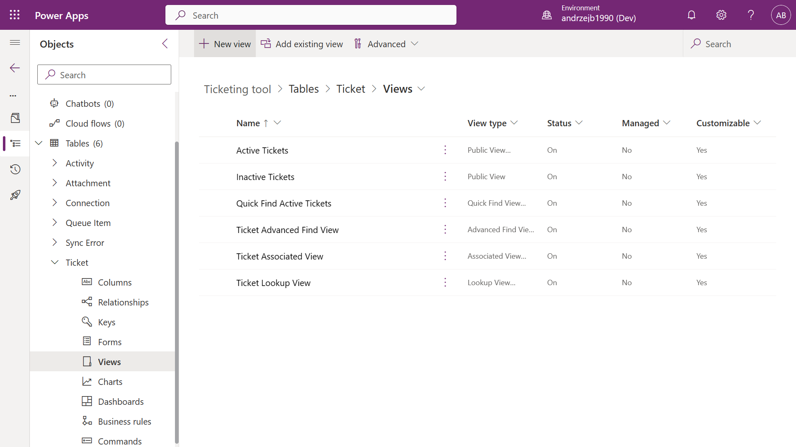

#### 4. Add name and description of new view  

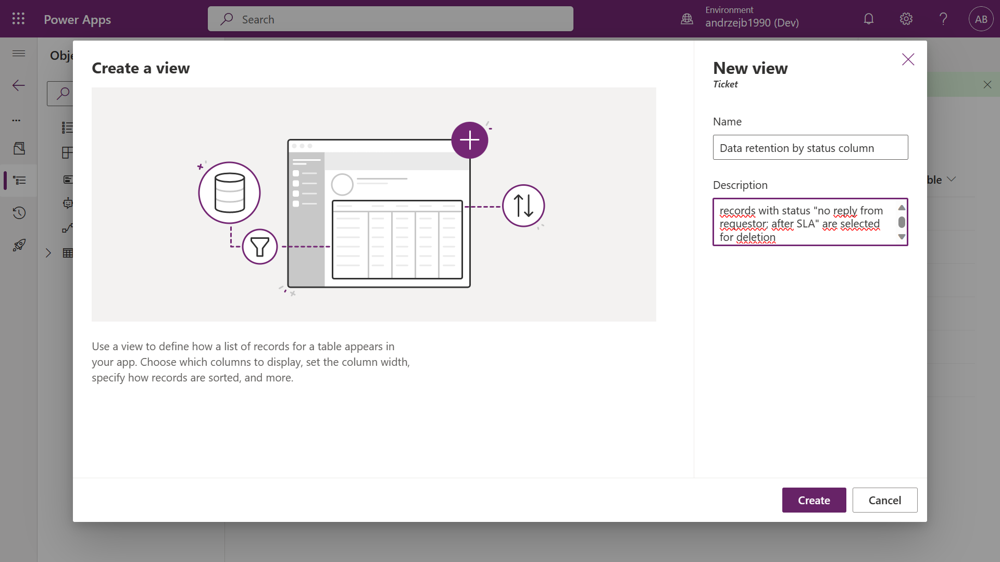

#### 5. Remove unnecessary columns, add status, filter by "no reply from requestor; after SLA" and publish view.

This is the most important part of the process. This step determined what rows are going to be processed in the table where policy is implemented. Views allow to add filters and limit number of displayed records. In later stage these criteria are used by policy to indicate what row should be retained.

In case of more complex logic it is recommended to create model-driven app based on table and check exactly what rows are selected for deletion!

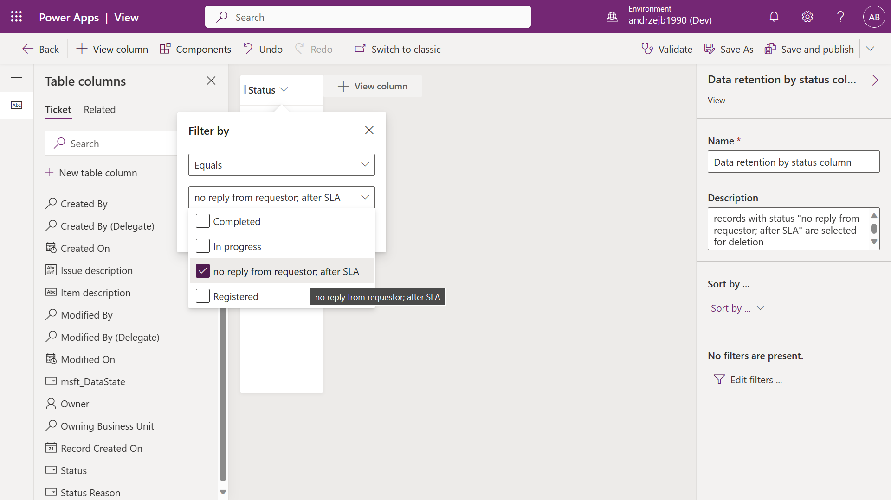

#### 6. In left navigation select Retention Policies

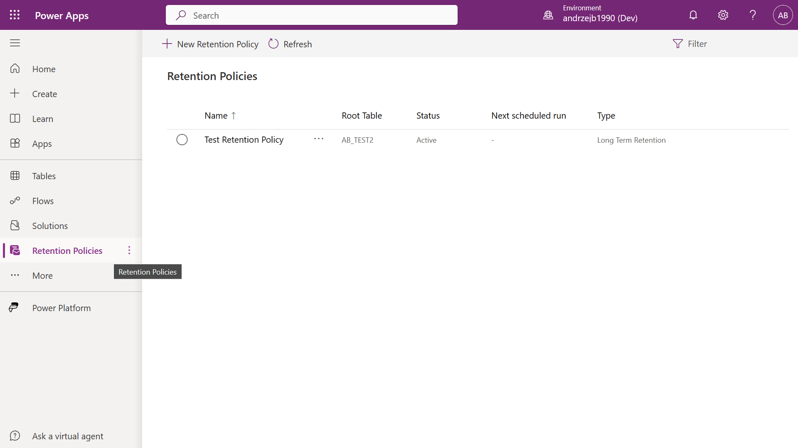

#### 7. Add new Retention Policy and click save
- Table: Ticket
- Name: Ticket table retention policy by status
- Criteria: Data retention by status column (view created in point 4)
- Schedule - Start date: 11/03/2023 07:51 PM
- Frequency: daily

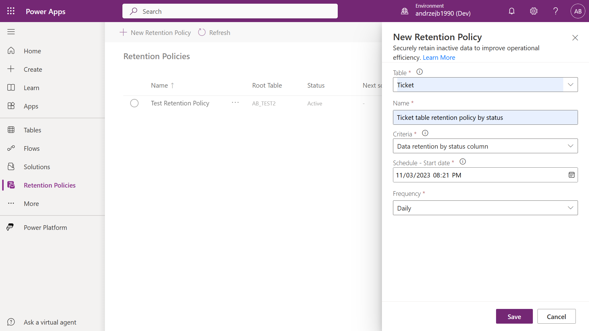

Now Retention Policy is up and runing!

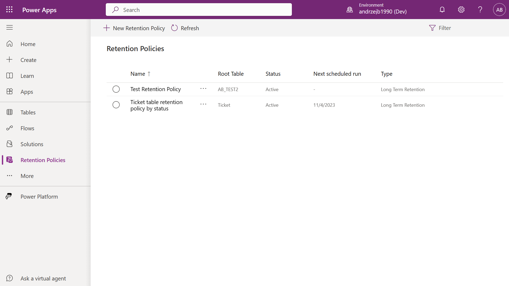

## How to add Retention Policy to your solution

Adding policy is not necessary step to create fully up and running tool, however using solutions is sign of a good design practices, especially in case of working with different environment. In a long term using solution gives a lot of benefits.
 
To add created policy to solution follow these steps:
- find <b>RetentionConfig</b> item on the list (add existing -> more -> other -> RetentionConfig),
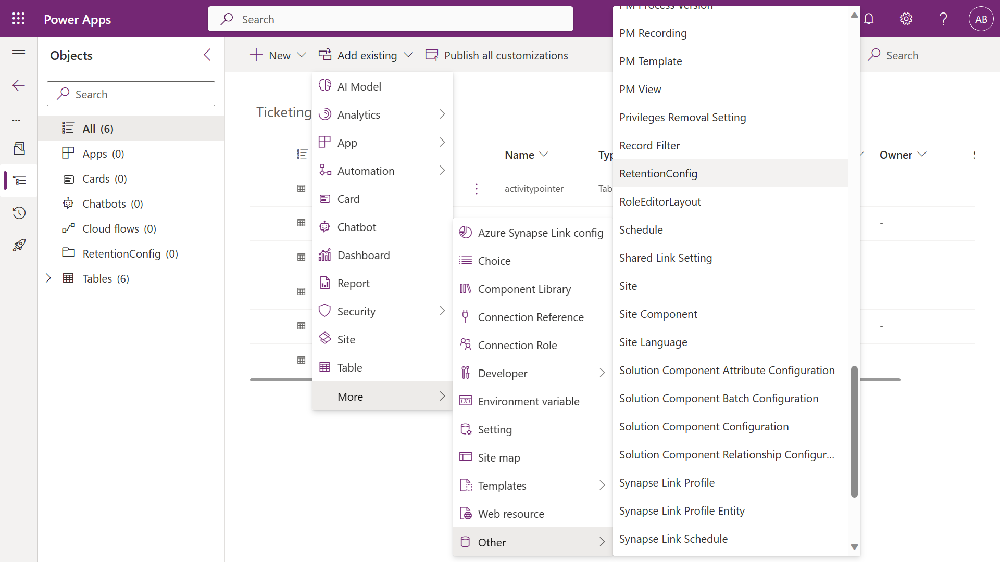
- select policy from the list and press add.
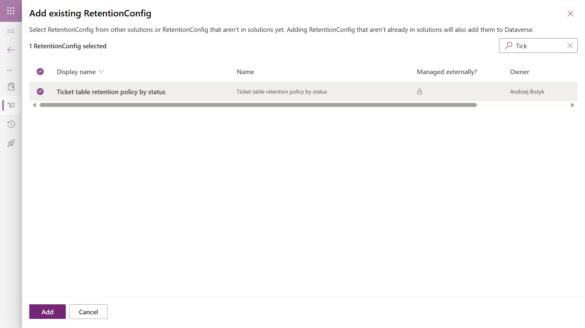

## How to check policy status

Implementing policy usually doesn't end work with Dataverse long term retention. Regulatories, admins or single user needs information what is going on on daily basis with data. Fortunately, Power Platform provides very user friendly interface to check it.

First possible option is investigating policy logs. Each policy run is captured by the system and display such information as status, number of archived items and when policy was completed.
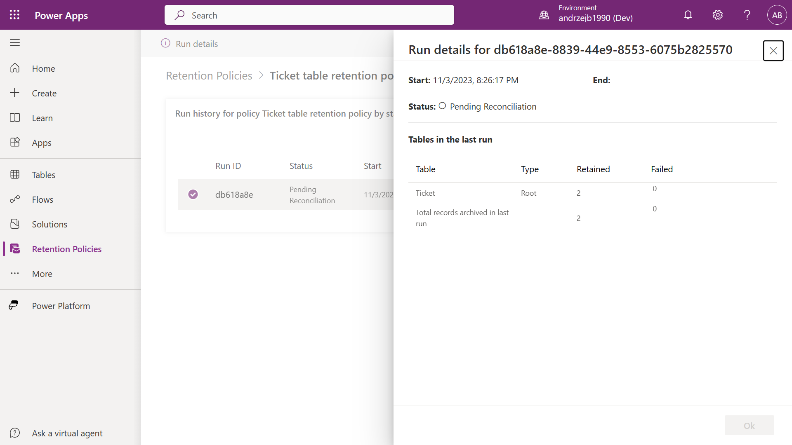

There is also second possible option which requires to work with msft_DataStatus column in table where policy is implemented. Each record selected for retention has status "Retain".
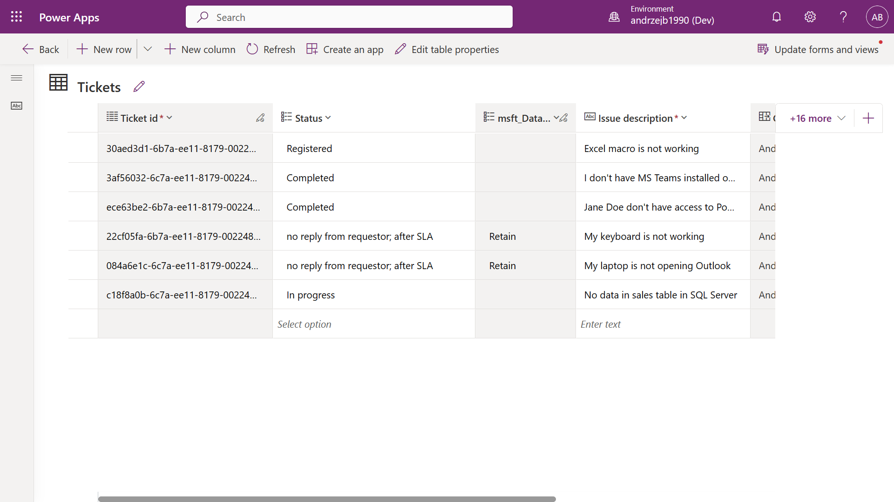

## How to access retained data

Currently we have three options to get access to retained data:
- Advanced Find (recommended).
- Cloud flow.
- Dataverse OData APIs.

Advanced Find in model-drive app is the fastest way to interact with data and it gives a lot of filtering options. It will be enough for most of data related actions. Only thing needed is to select Change to retained data in edit filter view. Rest functionalities remain the same.

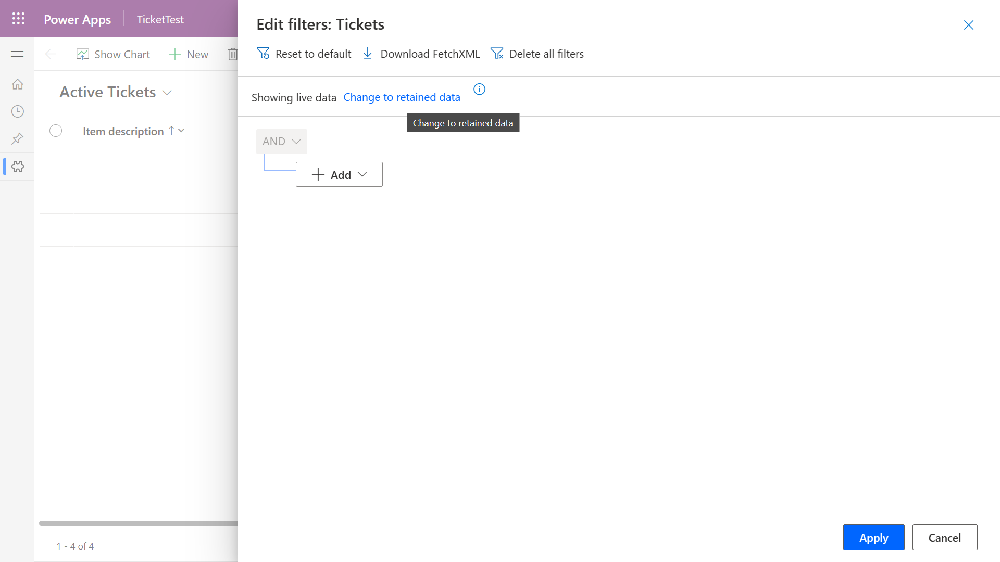

## What if long term retention is not for me? 

Sometimes happens that some functionalities doesn't match our requirements and we have to figure it out how to do it differently. It is fine.

Power Platform got you covered. There are many possibilities e.g., Power Automate flows (very flexible and remove data permanently), bulk data deletion or some custom canvas app responsible for deleting data, triggered by user. If this is not enough, you can always use Dataverse Web APIs to write your own mechanism. Power Platform is a platform of possibilities.

## Summarry
These days, we treat data as something obvious. The word "data" is used on many occasions. Our duty as a developer, architect or analyst is to take care of this data. Think how to optimize our storages, how to protect data and how to help our company perform better. No matter what tool or approach we pick to manage them, data is the key to all our successes.

#### Sources

<https://cybersecurityventures.com/the-world-will-store-200-zettabytes-of-data-by-2025/#:~:text=Cybersecurity%20Ventures%20predicts%20that%20the%20total%20amount%20of,25%20percent%20stored%20in%20the%20cloud%20in%202015.>
<https://learn.microsoft.com/en-us/power-platform/admin/delete-bulk-records>
<https://learn.microsoft.com/en-us/power-apps/maker/data-platform/data-retention-overview>
<https://learn.microsoft.com/en-us/power-apps/maker/data-platform/data-retention-set>
<https://learn.microsoft.com/en-us/power-apps/maker/data-platform/data-retention-manage>
<https://learn.microsoft.com/en-us/power-apps/maker/data-platform/data-retention-view>
<https://learn.microsoft.com/en-us/power-apps/maker/data-platform/data-retention-faq>

