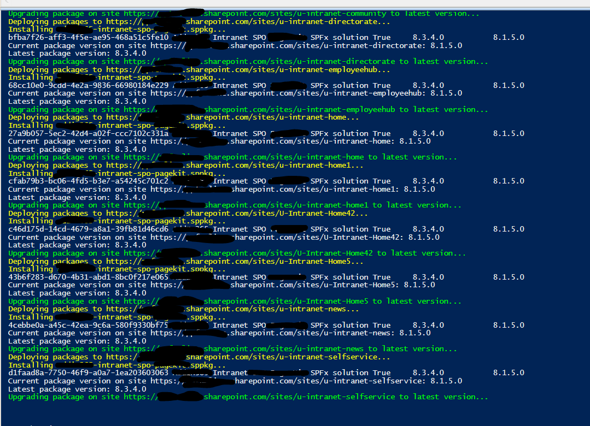

## Deploying and Installing SharePoint Framework (SPFx) solutions using PnP PowerShell to Hub Site and Associated Sites

[SharePoint Framework] (https://aka.ms/spfx) (SPFx) is an extensibility model for Microsoft 365. It provides a set of tools and libraries that developers can use to create client-side web parts, extensions, and other customizations.

In this article, we will explain the PowerShell code that can be used to deploy and install SPFx packages to a hub site and associated sites. There is no "hub site app catalog" at the time of writing the current blog post. Instead, each site collection in SharePoint Online can have its own app catalog, or the tenant can have a tenant-level app catalog. One scenerio to use the script is to deploy or update SPFx solution(s) across all intranet sites associated with a hub site.

## Pre-requisites

Before we begin, make sure you have the following pre-requisites in place:

- SharePoint Administrator rights
- Office 365 tenant
- Hub site and associated sites
- SPFx package files in a folder accessible to the PowerShell script
- PowerShell PnP module installed

## PowerShell Code Explanation

```powershell
$adminCenterURL=https://tenant-admin.sharepoint.com
$dateTime = (Get-Date).toString("dd-MM-yyyy")
$invocation = (Get-Variable MyInvocation).Value
$directorypath = Split-Path $invocation.MyCommand.Path
$fileName = "\IntranetUpgradeSPFx-" + $dateTime + ".csv"
$hubSiteUrl = "https://tenant.sharepoint.com/sites/u-intranet"
$OutPutView = $directorypath + $fileName
$sppkgFolder = "./packages"

cd $PSScriptRoot
$packageFiles = Get-ChildItem $sppkgFolder
```

This section of the code sets some variables that will be used later. The $AdminCenterURL variable is the URL of the SharePoint Online admin center. The $dateTime variable is a formatted date string that will be used in the output file name. The $directorypath variable is the directory path of the current script. The $fileName variable is the name of the output file that will be created. The $hubSiteUrl variable is the URL of the hub site where the SPFx packages will be deployed. The $OutPutView variable is the full path of the output file that will be created. The $sppkgFolder variable is the path to the folder where the SPFx packages are stored. Finally, the Get-ChildItem cmdlet is used to get a list of all the files in the $sppkgFolder folder.

In order to use this script successfully, you will need to have the necessary permissions to create app catalogs and deploy SPFx packages. You will also need to update the variables in the script to reflect your specific environment, including the URL of the SharePoint Online admin center, the URL of the hub site, and the file path to the SPFx packages that you want to deploy.

Once you have updated the variables in the script, you can run it from a PowerShell console or from a PowerShell script editor like Visual Studio Code. The script will iterate through all site collections associated with the hub site, create app catalogs if necessary, and deploy the SPFx packages.

It is worth noting that the script assumes that all site collections associated with the hub site should have the same set of SPFx packages deployed. If you need to deploy different sets of packages to different site collections, you will need to modify the script accordingly.


```powershell
Connect-PnPOnline $adminCenterURL -Interactive
```

This line connects to the SharePoint Online admin center using the Connect-PnPOnline cmdlet. The -Interactive parameter specifies that the user should be prompted for their credentials.

```powershell
$ViewCollection = @()
```

This line initializes an empty array that will be used to store the results of the script.

```powershell
$HubSiteID = (Get-PnPTenantSite $hubSiteUrl).HubSiteId
#Get all site collections associated with the hub site
Get-PnPTenantSite -Detailed | select url | ForEach-Object {
  $Site = Get-PnPTenantSite $_.url
  If($Site.HubSiteId -eq $HubSiteId){
    Connect-PnPOnline -Url $Site.url -Interactive

    Write-Host ("Deploying packages to {0}..." -f $Site.url) -ForegroundColor Yellow

      foreach($package in $packageFiles){
        $ExportVw = New-Object PSObject
        $ExportVw | Add-Member -MemberType NoteProperty -name "Site URL" -value $Site.url
        $packageName = $package.PSChildName
        Write-Host ("Installing {0}..." -f $packageName) -ForegroundColor Yellow
         $ExportVw | Add-Member -MemberType NoteProperty -name "Package Name" -value $packageName
         #ensure app catalog
          if(!(Get-PnPSiteCollectionAppCatalog -CurrentSite)){
            Write-Host ("Creating site collection app catalog in {0}..." -f $Site.url) -ForegroundColor Yellow
            Add-PnPSiteCollectionAppCatalog
          }
         while(!(Get-PnPSiteCollectionAppCatalog -CurrentSite)){
            Start-Sleep -Seconds 20
         }
         #deploy sppkg
         Add-pnpapp -Path ("{0}/{1}" -f $sppkgFolder , $package.PSChildName) -Scope Site -Overwrite -Publish

         Start-Sleep -Seconds 5

        #Find Name of app from installed package
        $RestMethodUrl = '/_api/web/lists/getbytitle(''Apps%20for%20SharePoint'')/items?$select=Title,LinkFilename'
        $apps = (Invoke-PnPSPRestMethod -Url $RestMethodUrl -Method Get).Value
        $appTitle = ($apps | where-object {$_.LinkFilename -eq $packageName} | select Title).Title
        # Get the current version of the SPFx package
        $currentPackage = Get-PnPApp -Identity $appTitle -Scope Site
        Write-Host "Current package version on site $($site.Url): $($currentPackage.InstalledVersion)"

        #Install App to the Site if not already installed
        $web = Get-PnPWeb -Includes AppTiles
        $app = $web.AppTiles  |  where-object {$_.Title -eq $currentPackage.Title }
        if(!$app){
            Install-PnPApp -Identity $currentPackage.Id -Scope Site
            Start-Sleep -Seconds 5
        }
        # Get the latest version of the SPFx package
        Write-Host "Latest package version: $($currentPackage.AppCatalogVersion)"

        # Update the package to the latest version
        if ($currentPackage.InstalledVersion -ne $currentPackage.AppCatalogVersion) {
            Write-Host "Upgrading package on site $($site.Url) to latest version..." -ForegroundColor Green
            Update-PnPApp -Identity $currentPackage.Id -Scope site
            $currentPackage = Get-PnPApp -Identity $appTitle -Scope Site
            $ExportVw | Add-Member -MemberType NoteProperty -name "Package Version" -value $currentPackage.AppCatalogVersion
            $ViewCollection += $ExportVw
        } else {
            Write-Host "Package already up-to-date on site $($site.Url)."
        }
    }
  }
}

#Export the result Array to CSV file
$ViewCollection | Export-CSV $OutPutView -Force -NoTypeInformation
Disconnect-PnPOnline
```

Here's how the above snippet works:

1. Get the hub site ID using the `Get-PnPTenantSite` cmdlet.
2. Get all site collections associated with the hub site using the `Get-PnPTenantSite` cmdlet.
3. For each site collection, check if it's associated with the hub site using the site's `HubSiteId` property.
4. Connect to the site using `Connect-PnPOnline`.
5. Check if the site collection app catalog exists. If it doesn't, create it using `Add-PnPSiteCollectionAppCatalog`.
6. Deploy the SPFx package using `Add-pnpapp`.
7. Check if the package is already installed on the site using `Get-PnPApp`.
8. If the package is not installed, install it using `Install-PnPApp`.
9. If a newer version of the package is available, update the package using `Update-PnPApp`.
10. Export the site collection URL, package name, and package version to a CSV file for a record of what's updated

## Notes

The code does not handle admin consent to app permissions. Global administrator is required to grant admin consent to app permissions.


