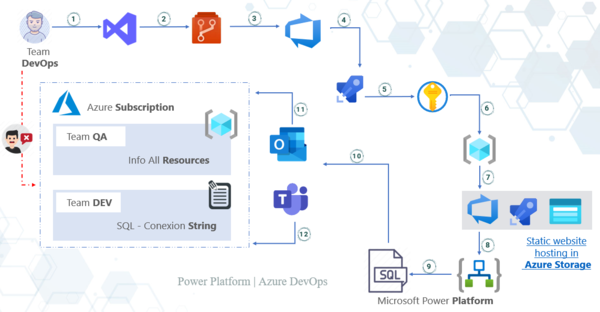
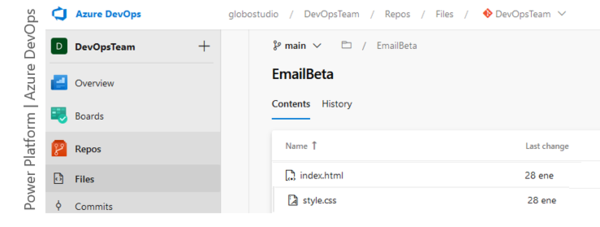
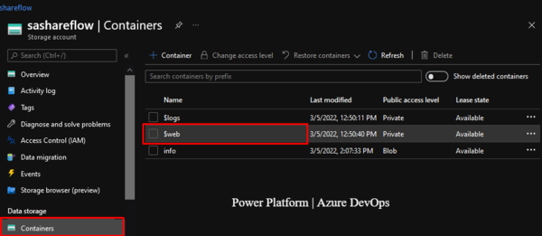
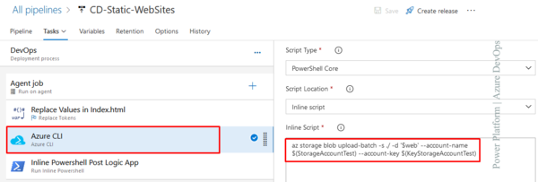
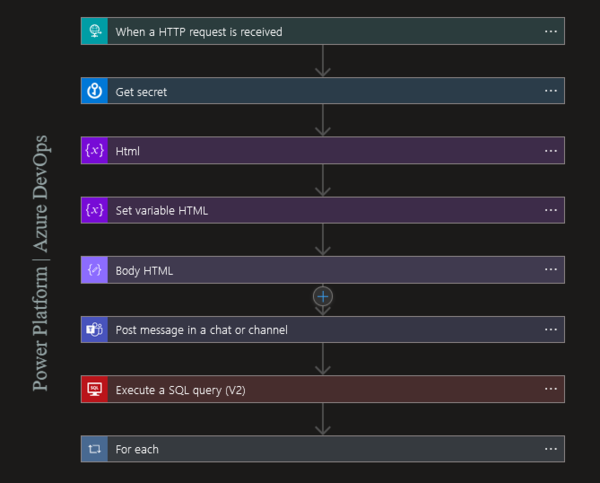
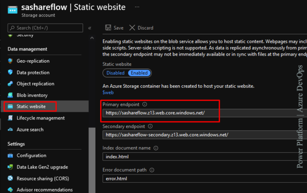
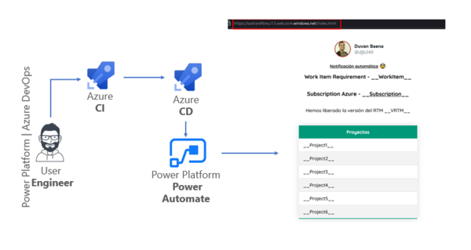

## How to combine Azure Static Websites and Power Automate as an enterprise internal communication strategy?

What is a static websites? Static websites refer to websites that can be statically loaded and served from a predefined set of files such as HTML, CSS, and JavaScript hosted in Azure Storage. 

Static websites can be powerful with the use of client-side JavaScript. You can create a website and host it in Azure Blob Storage.

If there is a need to communicate constantly to other people, you have several options:

* Send multiple communications according to the number of times you want to communicate something new.

* Have a website, where updated information is publicly found and redirect people to that website.

## Have a website, where updated information is publicly found and redirect people to that website.

We can have a repository of files to be exposed publicly.

An example would be the images that are required when building a corporate message and share them via outlook and / or Microsoft team to all team members.

If you use public Internet URLs to make use of images and the service where these images are hosted changes, the messages will be affected and you will not be able to control those changes, because you are not the one who manages that service.

For this reason you can configure a storage account and within a Static Websites, so you have all the management of your own resources.

We will make use of premium Key Vault connectors, SQL Server and standard connectors (HTTP, Office 365 Outlook).

## Why does this Process?

Imagine that the team has a responsibility to communicate information of great interest to people within various teams.

One way to reach all the recipients of the information would be through Microsoft Team chat. why not Outlook?

In the case of a Sysadmin / IT Support Engineer / SRE / DevOps or any other role of this nature, it is most likely that you have 24/7 processes reporting through Outlook

The information you want to transmit according to the corporate image can be done automatically through Outlook, such as messages or adaptive cards in a channel chat or directly to a user in Microsoft Team.

## What will we do in this process?

We will use a series of steps to achieve the goal of combining a static site, power platform and azure DevOps, starting like this.

The v2 general-purpose storage account provides a unique namespace for Azure Storage data that is accessible from anywhere in the world using HTTP or HTTPS. Storage account data is durable and highly available, secure and scalable at scale.

Host a static website in a Blog Storage

An excellent alternative to static websites and is also suitable in cases where a web server is not required to render content using html, CSS and JavaScript files.

Power Platform will create an automatic process to notify different users using Outlook and Microsoft Team.

CI/CD Process

We will make use of Microsoft services in Azure DevOps and through automatic code pipelines, compile the code base and release it to a static website.

## How does this process work?

* We are making use of the entire suite of Microsoft tools for this reason I propose you to make use of 
* Azure services through Azure DevOps there through a team content at the organization level in a repository
* we will host the files that will be main actors in the automation
 
 

 To enable static website hosting, select the default file name and optionally provide a path to a custom 404 page. If a blob storage container named $web does not already exist in the account, one will be created. Add the site files to that container

 

 ***Replace Tokens:*** Task responsible for replacing the values in the html file located in the $web container of the Storage Account.

 ***Azure CLI:*** Task responsible for executing an AzCli command-line statement that affects the Storage Account in container $web

 ***Run Inline Powershell:***Task responsible for executing an AzCli command-line statement that affects the Storage Account in container $web

***$()*** = This is a pattern in azure DevOps to define the use of variables which will store values and are located in the variables release tab..

 

 ***Action / When a HTTP request is received:*** It has a public URL that can be accessed via https requests

 ***Action / Get secret:*** Responsible for obtaining the secrets of the Azure Key Values

 What is Key Vault? It is a cloud service for storing secrets and accessing them securely.

 ***{X} variable type components:*** In charge of storing the syntax of the basic structure of Html5, in the tag  `href=""` we will make use of the public URL generated from the Storage Account according to the necessary file.

 ***{X} variable type components:*** Responsible for publishing a personalized message to a Microsoft Team channel.

 ***Action / Execute a SQL query (V2):*** Responsible for publishing a personalized message to a Microsoft Team channel.

 ***Component Type For each:*** In charge of receiving the result of the previous action and evaluating the recipients to send the email.

 

 It's time to give a single click and detonate the whole process automatically shared in Image No. 1, make sure you know the Primary endpoint where the static website will be publicly accessed.

Now with the URL clear, you can access the index file.html and in a browser it will load a static website using to share information with other people.

