## 🗒️ Intro

If you are an SPFx developer, you might already be familiar with some of the tooling and approaches that help you out in SPFx development. Most SPFx developers might have started their SPFx development journey with the Yeoman generator, which is the official approach mentioned in Microsoft documentation. That is a totally fine approach, but if you really want to boost your productivity, then you might need to find something more powerful right?

This blog comprehensively explains and boosts your knowledge practically showing how you can use the different toolings available for SPFx development.

I’ll walk-through various approaches for:

- **Setting up your local development environment**
- **Scaffolding project**
- **Managing SPFx solutions in SharePoint Online**

Each approach, whether it's through the command line, the SPFx Toolkit in VS Code, or GitHub Copilot Chat, has its own strengths and trade-offs. Let’s explore them and help you select the right tool for your workflow.

## Setting up your local development environment

Let’s explore in action how each of the tooling options facilitates setting up the local environment for SPFx development.

### 1. CLI for Microsoft 365

With CLI for Microsoft 365, you can manage your Microsoft 365 tenant and SharePoint Framework projects on any platform. No matter if you are on Windows, macOS or Linux, using Bash, Cmder or PowerShell, using the CLI for Microsoft 365 you can configure Microsoft 365, manage SharePoint Framework projects and build automation scripts.

Before working with CLI for Microsoft 365, make sure you have installed it using the following npm script:

`npm i -g @pnp/cli-microsoft365`

After installing it, you need to set it up to start using it. Follow the [CLI for Microsoft 365 documentation](https://pnp.github.io/cli-microsoft365/#getting-started) and complete the setup. Just like what we performed with the other approaches above, CLI for Microsoft 365 offers a command that verifies whether your local environment meets the requirements to work with SharePoint Framework.

Open Command Prompt and start typing:

`m365 spfx doctor`

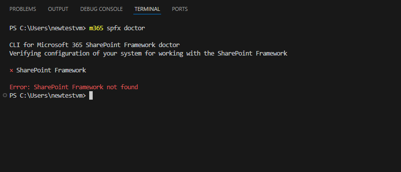
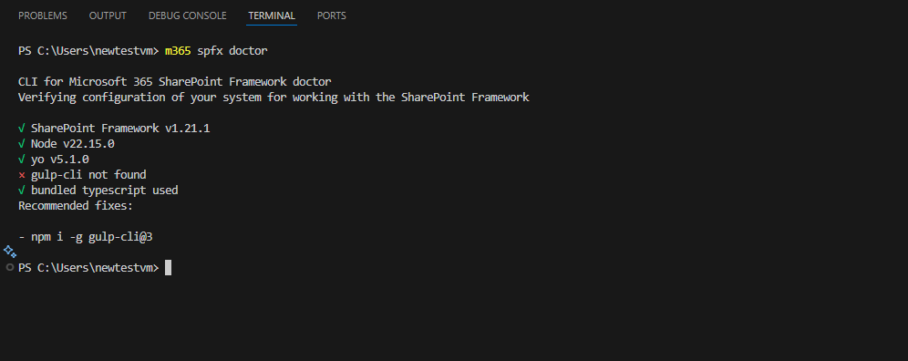
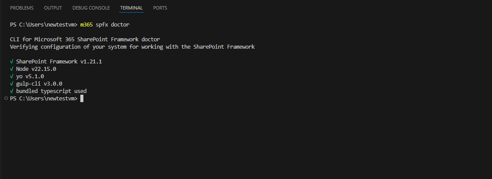

This command helps you verify if your environment meets all prerequisites for building solutions using a particular version of the SharePoint Framework.

If you are not inside any SPFx project, the command will try to determine the SharePoint Framework version based on the SharePoint Framework Yeoman generator that you have installed either in the current directory or globally.

### 2. SPFx Toolkit

Lets start with how the local development environment can be set using SPFx Toolkit. To get started with the SharePoint Framework Toolkit, you need to download the extension either from Visual Studio Code itself or from the Visual Studio Marketplace.

a. Action Pane Options

Once it is installed, you will be able to see the SPFx Toolkit icon in the side pane of Visual Studio Code. Clicking on the icon will display the prebuilt actions available in the SPFx Toolkit extension. While we will not delve into each action in detail, let us examine the one most essential for setting up your local environment.

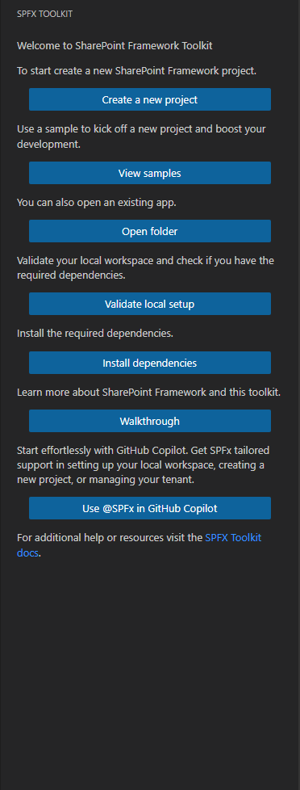

Lets focus on following actions:

- Validate local setup: Validates the local setup and checks whether all the required dependencies for working with SPFx are available.
  If Node.js is not installed, this action will display a message indicating that you need to install the Node.js version required by the latest SPFx specifications. The message also includes links to the supported LTS version of Node.js, and if you prefer using NVM or NVS, relevant links are provided in the dialog as well.

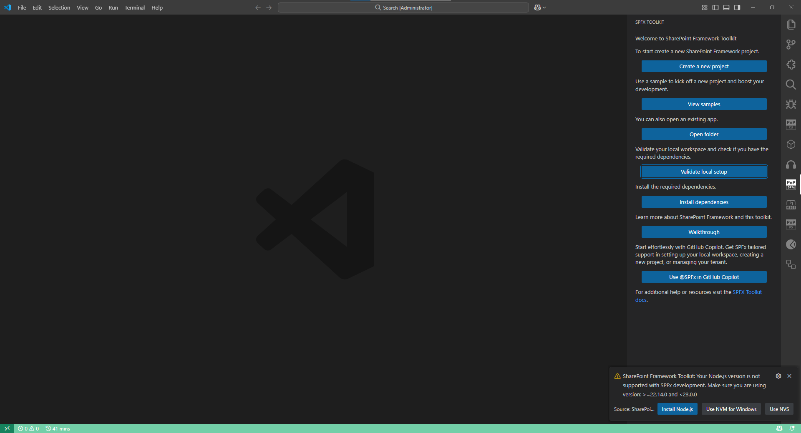

- Install Dependencies: If the validation using "Validate local setup" shows ‘Failed validating local setup’, then use this action. It runs an npm installation script to install all the necessary npm modules for SPFx development.

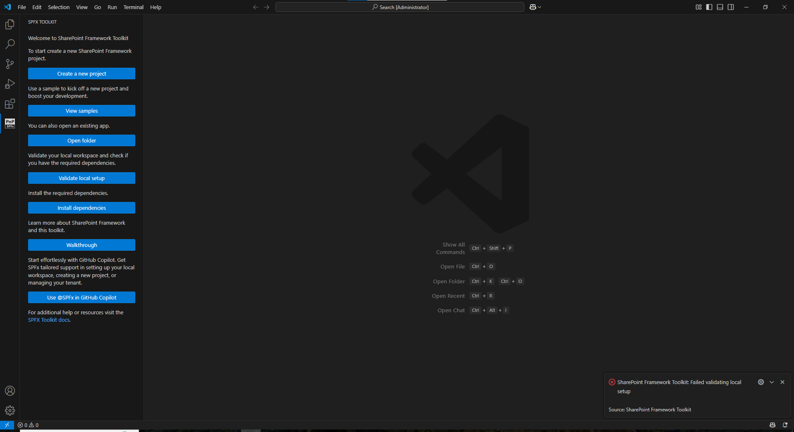
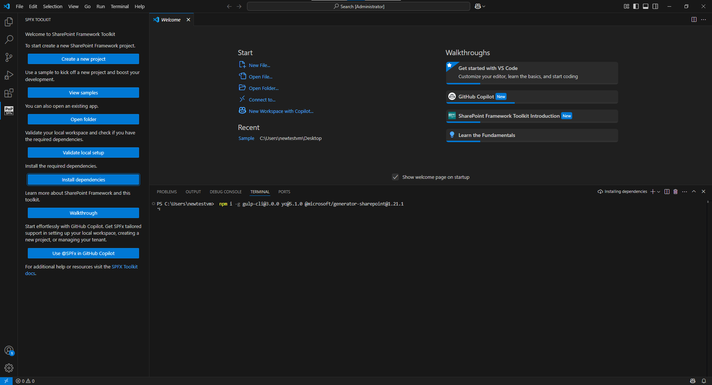

### 3. SPFx Toolkit - **@spfx/setup** command

Another way to set up your local environment is by using the @spfx Copilot Chat participant’s `/setup` command. This command is specifically designed for configuring your local environment.

Click on the Copilot icon in VS Code and start typing `@spfx /setup` command.

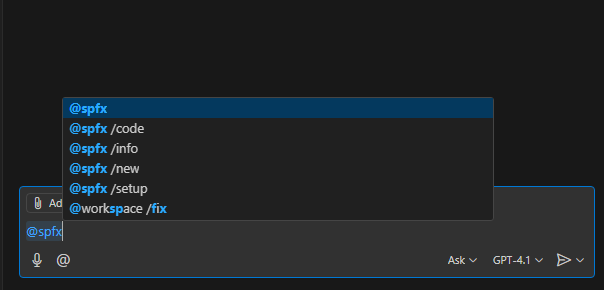

Let’s ask for help in setting up the local environment, as this provides clear steps on which Node.js version to install and what dependencies are required to get started with SPFx development.

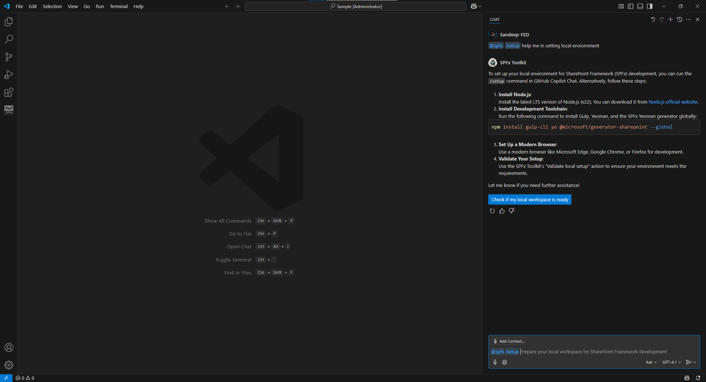

## Project Scaffolding: Starting new project

As we’ve covered the different approaches to setting up the local environment for SPFx development, let’s now move on to project scaffolding approaches using the following toolings:

### 1. Yeoman SharePoint Generator

As per standard, most developers might be using Microsoft documentation for scaffolding a project using the Yeoman generator, there is nothing wrong with that. If you are new to SharePoint, it is always recommended to read the documentation and get used to the commands. Normally, we run `yo @microsoft/sharepoint` in the command line prompt to generate the scaffolding. After running this command, you will see a CLI with questions that you need to fill in and select. Based on what you want to build, select from the options.

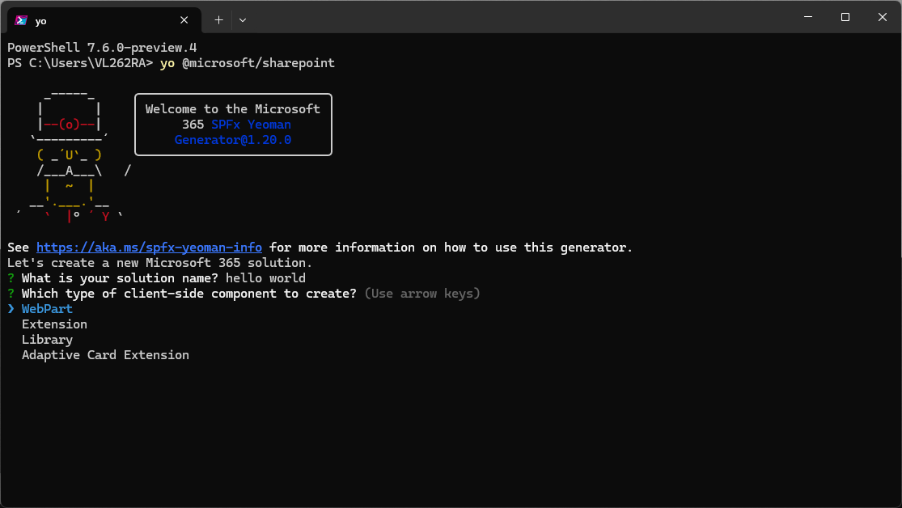

More likely, if you are running an SPFx project for the first time, you will encounter the gulp error:

"Unable to trust the self-signed development certificate."

To resolve this, you need to follow the documentation, where you’ll be instructed to run:

`gulp trust-dev-cert`

### 2. SPFx Toolkit

When it comes to scaffolding a new project or working with existing samples,*SPFx Toolkit offers more flexibility to developers, as it provides a GUI and built-in access to samples in the solution gallery, ideal for most developers, right inside your favorite code editor: VS Code. Let's see it in action.

#### a) Creating a new project - Scaffolding Form:

Clicking on **"Create a New Project"** from the side pane of the SPFx Toolkit extension opens a scaffolding form.

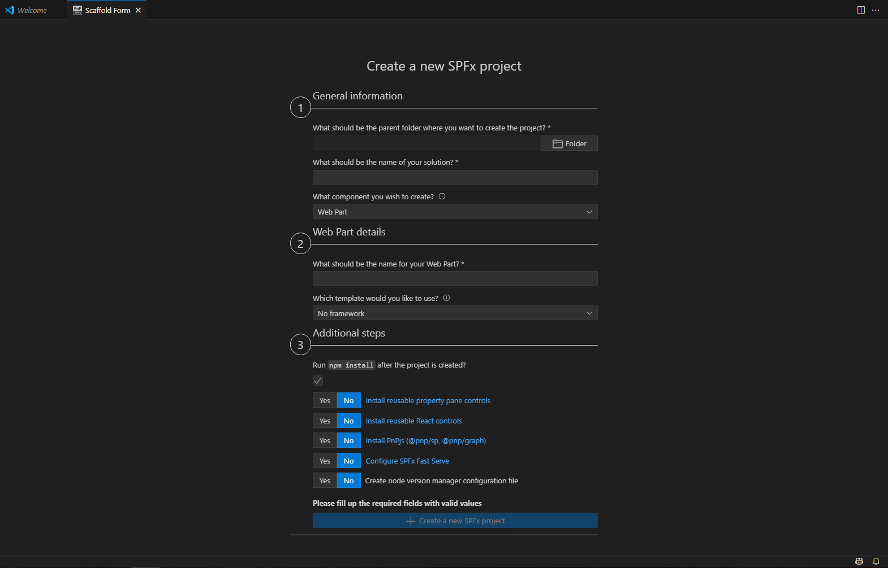

Once you are in the scaffolding form, you can start creating SPFx projects based on your requirements.

You know what else SPFx Toolkit offers? It provides "Additional steps" that give developers more control over which dependencies to install after the project scaffolding.

And there are two more powerful capabilities:

- Configure SPFx Fast Serve: You no longer need to configure Fast Serve manually. Once you check the "Configure SPFx Fast Serve" option, as shown in the screenshot above, the configuration is automatically set up for you.
- Creates an NVM (Node Version Manager) configuration file: If you're working with NVM or NVS, this file will be detected and used accordingly.

#### b) SPFx Toolkit - View Samples Actions

There are scenarios where developers not only start by creating new SPFx projects, but also want to work with existing samples from the Solution Gallery created by the Microsoft 365 and Power Platform community.

SPFx Toolkit comes with built-in access to the samples gallery, right inside the extension. Developers can explore these samples and extend their features based on project needs.

Because there are plenty of real-world use cases already available in the samples gallery, created by other developers, this becomes a great starting point for learning, prototyping, or accelerating development.

To access the Sample Gallery, click on the **"View Samples"** action from the side pane of the SPFx Toolkit extension. This opens a new tab where you can filter SPFx components by type or SPFx version.

#### c) SPFx Toolkit - @spfx /new command

As we saw in the previous two capabilities of SPFx Toolkit, let’s now explore what we can do with the @spfx Copilot Chat participant using the `/new` command. Click on the **Copilot** icon to use the `/new` command.

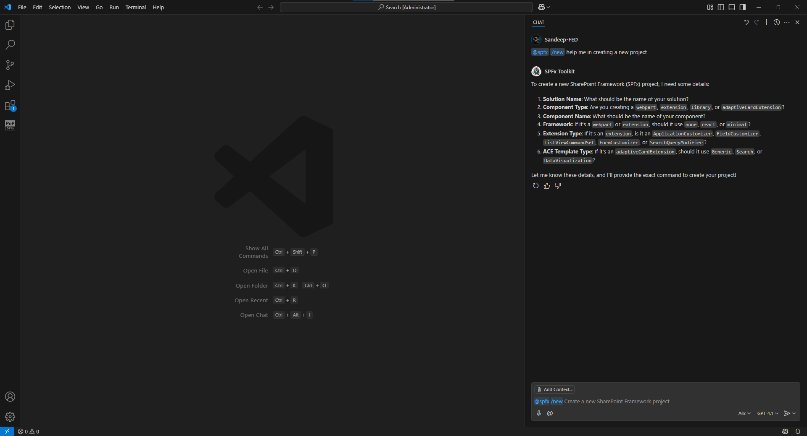

The `/new` command creates projects by interpreting the natural language you provide and constructing the Yeoman command with the help of AI. In the screenshot above, you can see the AI asking a few questions. Let’s answer those questions and observe the response below.

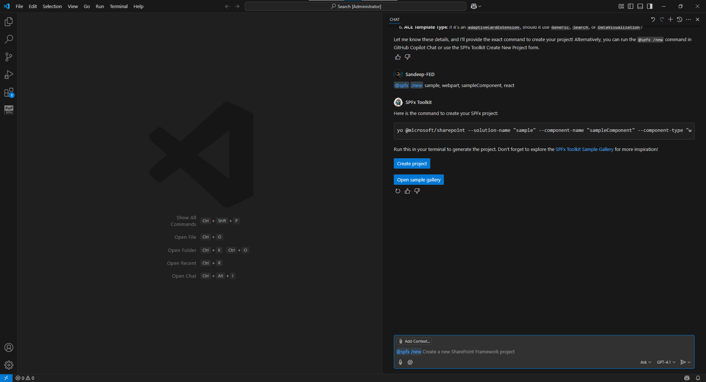

In the AI’s response, you’ll see that the LLM constructs a Yeoman script that creates the SPFx component based on your inputs. You can then click **"Create Project"** to scaffold it.

And in case you don’t want to create a new project, you can select the **"Open Sample Gallery"** action, which opens the sample gallery right inside VS Code.

## Manage SPFx Solutions in SharePoint Online

As we’ve seen how different toolings help developers in setting up the local environment and scaffolding SPFx projects, now let’s explore how these toolings assist in managing SPFx solutions in SharePoint Online. Let’s begin with CLI for Microsoft 365, and later we’ll dive into the capabilities of the SPFx Toolkit.

### CLI for Microsoft 365

For managing SPFx solutions in the App Catalog, CLI for Microsoft 365 offers a wide variety of commands, not only for SPFx apps but also for many other Microsoft 365 operations. Let’s look at a few key commands in detail:

- spo app add – Allows developers to upload SPFx apps to the tenant-wide App Catalog or site collection level.
- spo app deploy – After uploading an app to the app catalog, this command is used to deploy it. You’ll need to specify the app’s ID or name, along with the App Catalog URL and scope.
- spo app get – Useful for retrieving metadata of uploaded apps, such as Entra permissions, CDN locations, and more.
- spo app install – Enables developers to install SPFx apps into specified SharePoint sites.

🔗 Check out the full [CLI for Microsoft 365 documentation](https://pnp.github.io/cli-microsoft365/cmd/docs) for more commands

As we’ve seen, CLI for Microsoft 365 is a powerful tool for managing SPFx apps. But its capabilities go far beyond that, it includes a wide range of commands for managing your entire Microsoft 365 environment.

### SPFx Toolkit Manage Capabilities

We’ve seen that SPFx Toolkit is a complete package, offering all essential features in one place. Now, let’s explore its potential for managing SPFx apps using the "Manage App Catalog Details" feature and the SPFx Chat Participant with the `/info` command.

#### 1. App Catalog Details View:

Let us explore all the options available for managing SPFx apps using the SPFx Toolkit.

If you select the **App Catalog Details** view, you will be able to see a bunch of subsections, including:

1. Tenant-wide Extensions: Shows a list of extensions that are deployed across the entire tenant.
2. Tenant App catalog: A list of apps, including web parts and extensions, deployed in the tenant for various sites.
3. Site App Catalogs: A list of apps that are deployed under site collection app catalogs is displayed. It also provides the ability to create and remove site collection app catalogs.

- To create new app catalogs at the site level, hover over **Site App Catalogs** and click on the **+ (plus)** icon. Provide the relative URL of the site and confirm to create a new site collection app catalog.
  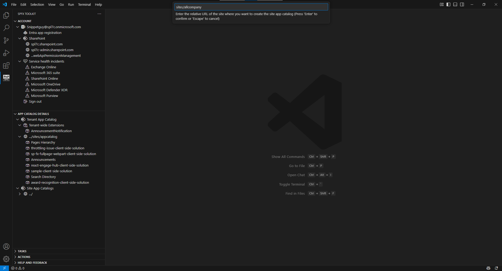
  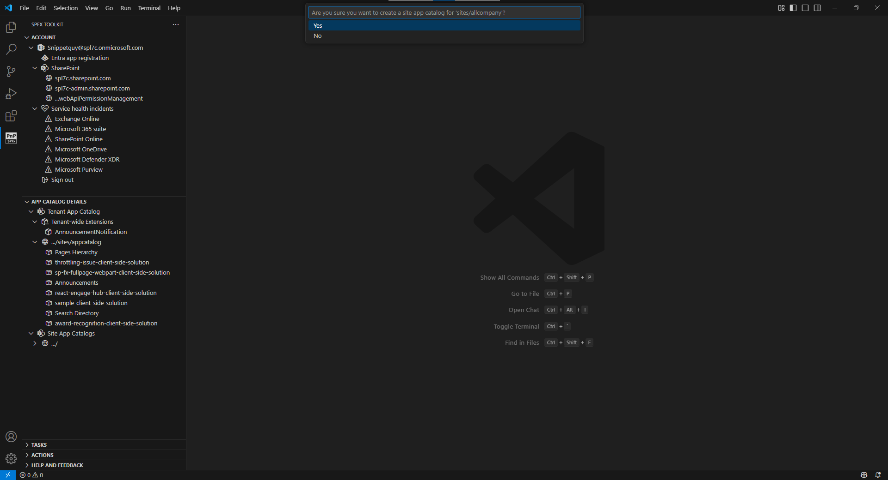

- Similarly, to remove any site collection app catalog, hover over the app catalogs under **Site App Catalogs** and click on the **delete** icon, which will delete them.
  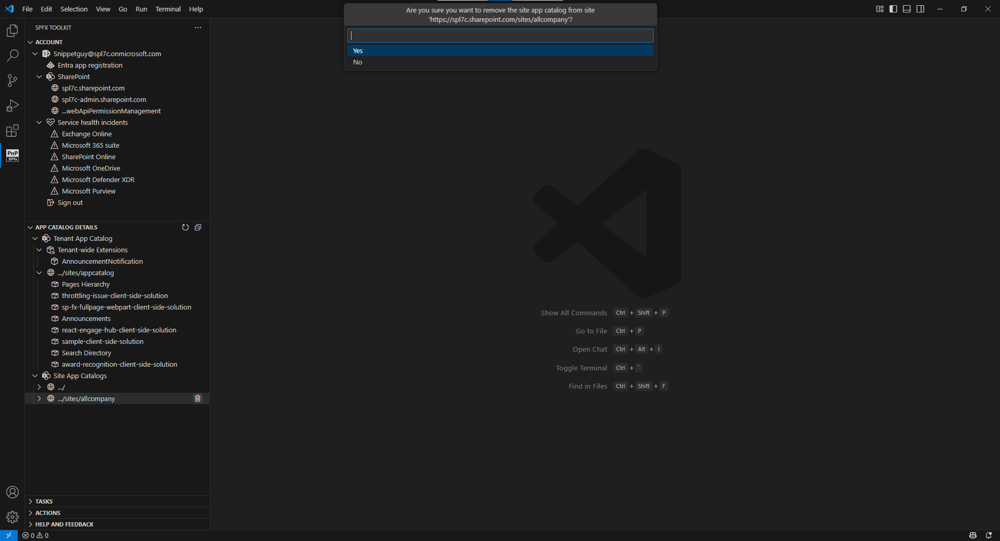

When it comes to managing individual apps, SPFx Toolkit provides more flexibility to the developers; you don't need to switch between apps, all operations can be done right from your favorite code editor.

Just as we saw what CLI for Microsoft 365 offers for managing apps, similarly, SPFx Toolkit offers a similar set of options but in your code editor itself.

1. Deploy & Retract: The Deploy and Retract commands are used for managing app availability. Deploy makes the app available for installation, whereas Retract reverts the deployed app to a disabled state, preventing users from installing it on sites.
2. Remove: The remove action helps you to completely removes the app from app catalog site.
3. Enable & Disable: The Enable action makes the app available to your site, allowing users to add the app from the SharePoint Store, whereas Disable removes the app from the SharePoint Store, preventing users from adding it to the site.
4. Install & Uninstall: Once the app is deployed to the app catalog, you might want to use it on one or more sites.

   Using the Install action, you can install the app by simply passing the site URL, whereas the Uninstall action removes the app from your site in case you no longer need it.

5. Upgrade: The Upgrade action is used to upgrade the app in the selected site collection when you have already pushed an update to the existing package in the app catalog.

   When you deploy an updated version of the existing package, the app in the site collection does not upgrade automatically; so this action performs the upgrade for you.

Let's move on to the AI-powered chat participant /manage command.

If you want to get to know more about the manage capabilities of SPFx Toolkit check out this blog post: [Understanding SharePoint Framework Toolkit Management Capabilities](https://pnp.github.io/blog/post/spfx-toolkit-manage-capabilities/)

#### 2. SPFx Chat Participant - /info command & Language model tools

1. /info command: This command is used to retrieve informations from your SharePoint tenant. In the recent update of SPFx Toolkit v4.8.0 /manage is now renamed to /info for making better better reflect its purpose. lets see it in action.

   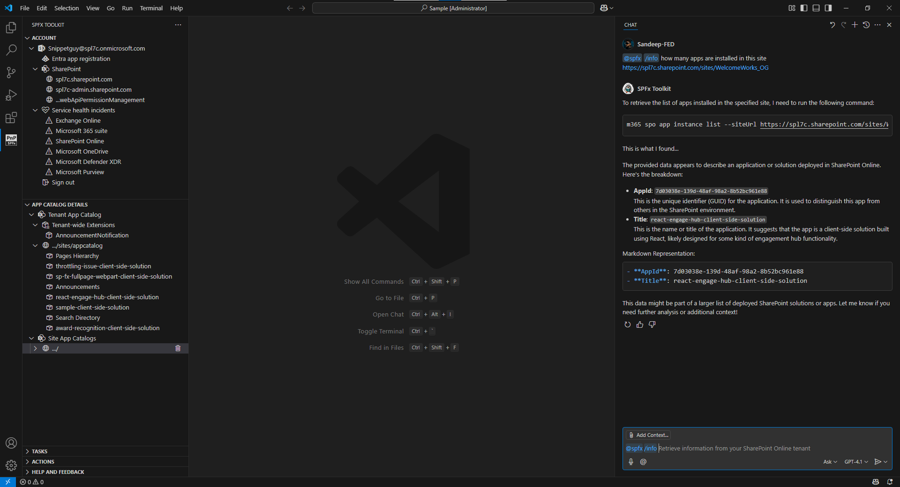

1. Language Model Tools:

With the power of GitHub Copilot’s Agentic mode, with the v4.8.0 update of SPFx Toolkit we can run tools which perform following set of tasks. Open GitHub Chat and switch mode to Agent then select the tools from the command pane. Lets perform two operations with the help of SharePoint Framework Toolkit Tools.

Let's start creating a new SharePoint communication site right from VS Code. For example, look at the screenshot below. Here, I'm asking the following query to the LLM to create a SharePoint site. It asks a few questions and constructs our inputs in JSON and passes them to the LLM, which results in creating a new site.

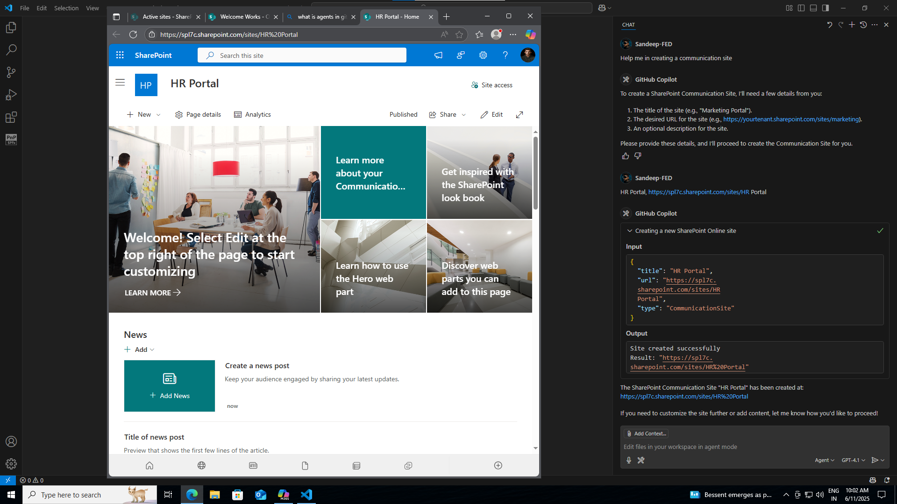

Similarly, let's perform another operation that is, to remove the SharePoint site. Look at the screenshot below, where I'm asking the agent to remove the site from my tenant.

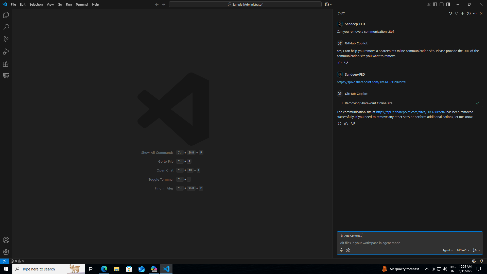

The SPFX Toolkit tools not only provide these two operations; the following is a list of operations offered by the tool to perform various tasks. How cool is that, right?

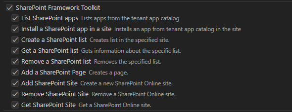

## 🎯 Wrap up

When it comes to setting up the dev environment, creating or working with existing projects, and managing SPFx apps, it's no longer the same with the SharePoint Framework Toolkit. It removes all the hurdles we had and keeps all the necessary go-tos in one place.

And you know what’s even better? The use of GitHub Copilot adds more power and support to developers.

Now it’s your turn to decide, which plate are you on? 🍽️

Start exploring SPFx Toolkit and get ready for the evolution! 🔄✨

## 🔗 Resources

- [Download SharePoint Framework Toolkit at VS Code Marketplace](https://marketplace.visualstudio.com/items?itemName=m365pnp.viva-connections-toolkit)
- [SharePoint Framework Toolkit GitHub repo](https://github.com/pnp/vscode-viva)
- [Microsoft 365 & Power Platform Community](https://pnp.github.io/#home)
- [Join the Microsoft 365 & Power Platform Community Discord Server](https://discord.gg/YtYrav2VGW)
- [Wiki](https://github.com/pnp/vscode-viva/wiki)
- [Join the Microsoft 365 Developer Program](https://developer.microsoft.com/en-us/microsoft-365/dev-program)
- [CLI for Microsoft 365](https://pnp.github.io/cli-microsoft365/)
- [Sample Solution Gallery](https://adoption.microsoft.com/en-us/sample-solution-gallery/)
