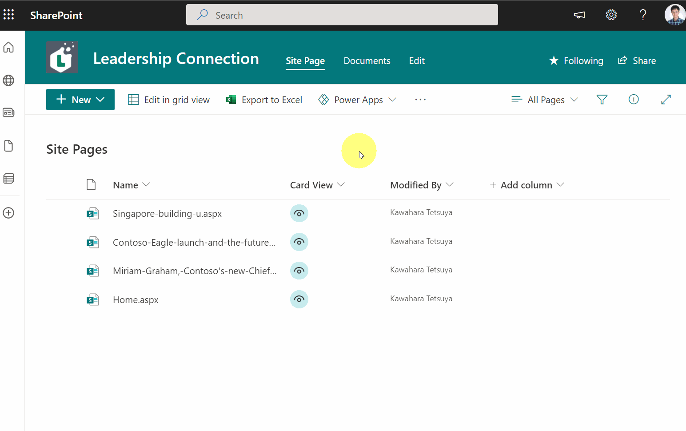
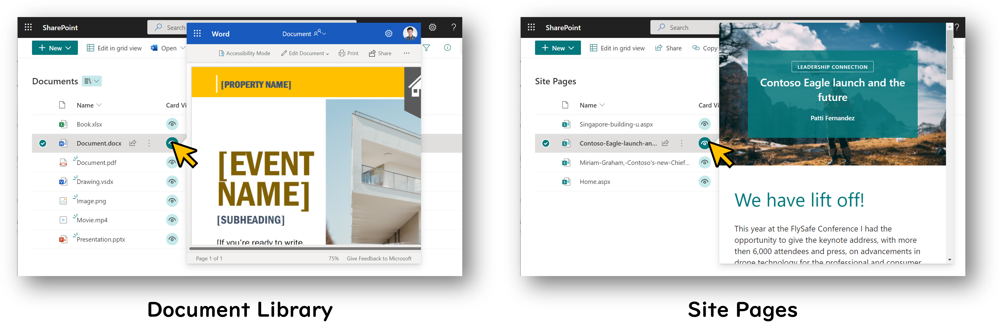
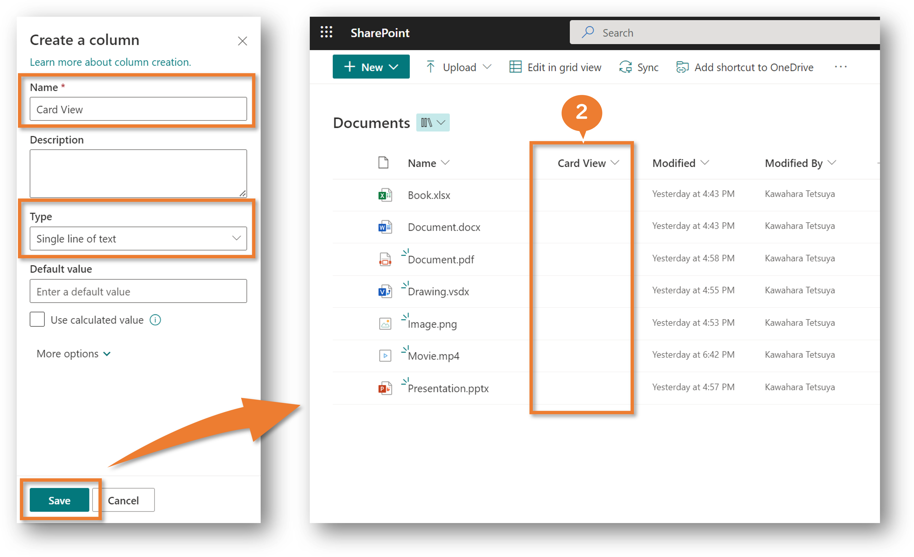
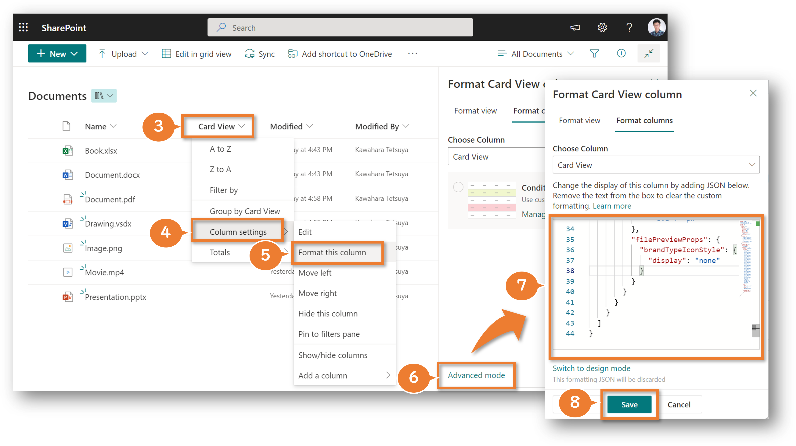

In List Formatting, `filepreview` can be set to `elmType`. Then, by setting the URL of the file or thumbnail image to its `src` attribute, the set image or file can be previewed.

So I got the idea from [Hubert Lam's tweet](https://twitter.com/z3019494/status/1526424899060846597) and used this `filepreview` to create a column format that displays files on a custom card for quick and easy file viewing. With this column format, you can view files without having to transition between screens.



It is possible to display and view files in the document library as well as pages in the site pages in the card.



Below are the instructions for applying this file viewing card.

## How to apply file viewing card

1. Open site pages or document library
2. Create a column of any name and type



3. Click on the column header of the created column
4. Hover **Column Settings**
5. Click **Format this column**
6. Click **Advance mode**
7. Paste the JSON from the following into the text box
8. Click **Save**



``` json
{
  "$schema": "https://developer.microsoft.com/json-schemas/sp/v2/column-formatting.schema.json",
  "elmType": "div",
  "children": [
    {
      "elmType": "div",
      "style": {
        "border-radius": "50%",
        "cursor": "pointer",
        "font-size": "15px",
        "width": "27px",
        "height": "27px",
        "display": "flex",
        "justify-content": "center",
        "align-items": "center",
        "font-weight": "bold"
      },
      "attributes": {
        "class": "ms-bgColor-themeLighter ms-bgColor-themePrimary--hover ms-fontColor-neutralPrimary ms-fontColor-white--hover",
        "iconName": "View"
      },
      "customCardProps": {
        "openOnEvent": "click",
        "directionalHint": "rightCenter",
        "isBeakVisible": true,
        "formatter": {
          "elmType": "filepreview",
          "attributes": {
            "src": "=if([$File_x0020_Type] == 'docx' || [$File_x0020_Type] == 'dotx' || [$File_x0020_Type] == 'dotm' || [$File_x0020_Type] == 'docm' || [$File_x0020_Type] == 'docb' || [$File_x0020_Type] == 'pptx' || [$File_x0020_Type] == 'pptm' || [$File_x0020_Type] == 'potx' || [$File_x0020_Type] == 'potm' || [$File_x0020_Type] == 'ppam' || [$File_x0020_Type] == 'ppsx' || [$File_x0020_Type] == 'ppsm' || [$File_x0020_Type] == 'sldx' || [$File_x0020_Type] == 'sldm' || [$File_x0020_Type] == 'vsdx' || [$File_x0020_Type] == 'xlsx' || [$File_x0020_Type] == 'xlsm' || [$File_x0020_Type] == 'xltx' || [$File_x0020_Type] == 'xltm', @currentWeb +'/_layouts/15/WopiFrame.aspx?sourcedoc=' + [$FileRef] + '&action=view' , [$FileRef])"
          },
          "style": {
            "width": "= @window.innerWidth * 0.5 + 'px'",
            "height": "= @window.innerHeight * 0.8 + 'px'"
          },
          "filePreviewProps": {
            "brandTypeIconStyle": {
              "display": "none"
            }
          }
        }
      }
    }
  ]
}
```

The above procedure completes the application of the file viewing card.

## Additional notes

- Some file types may not be supported for display.

## Additional references

- [Use view formatting to customize SharePoint](https://docs.microsoft.com/sharepoint/dev/declarative-customization/view-formatting)
- [Formatting syntax reference](https://docs.microsoft.com/en-us/sharepoint/dev/declarative-customization/formatting-syntax-reference)