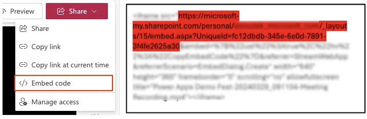
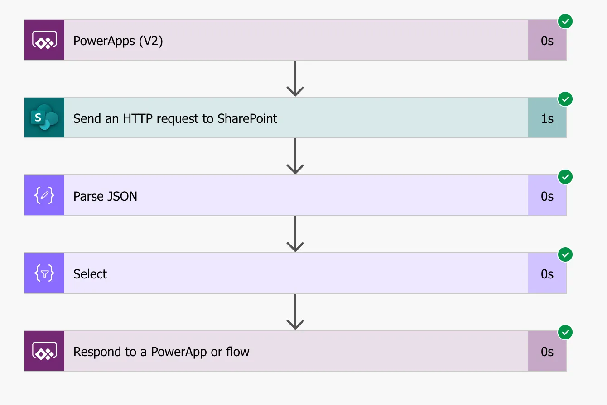
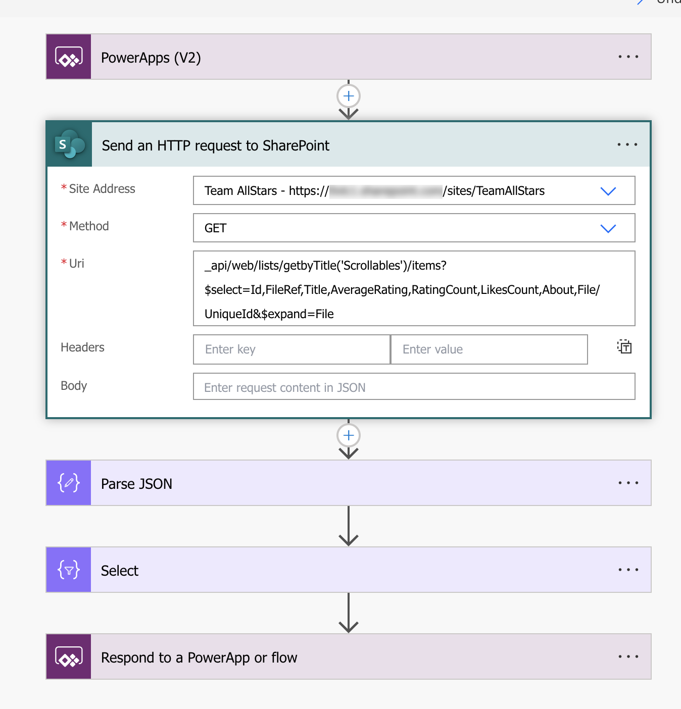
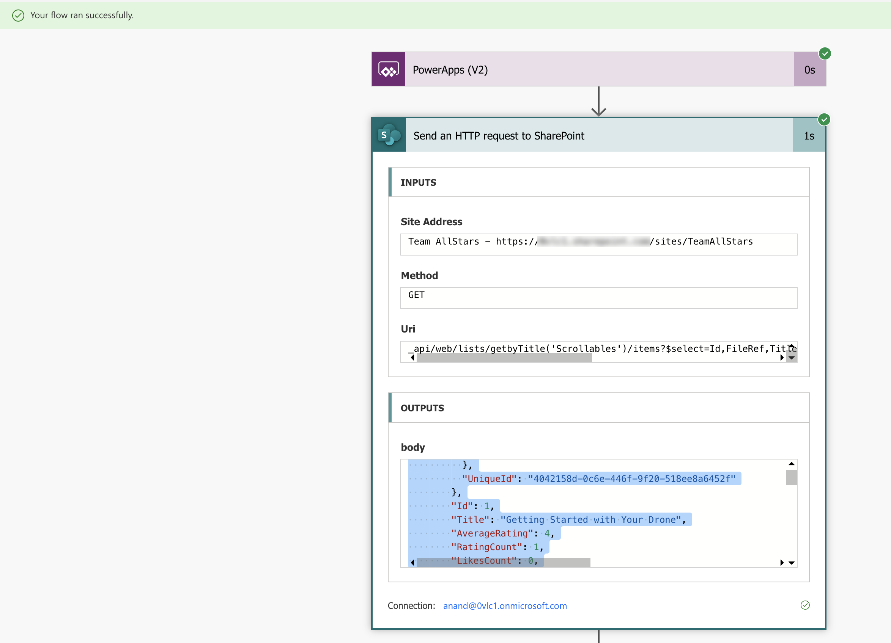
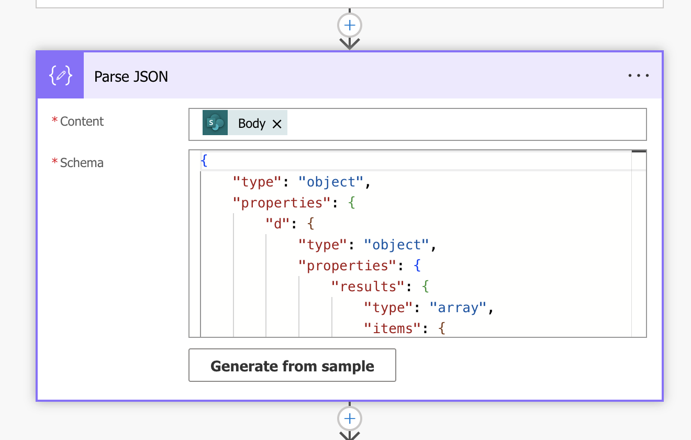
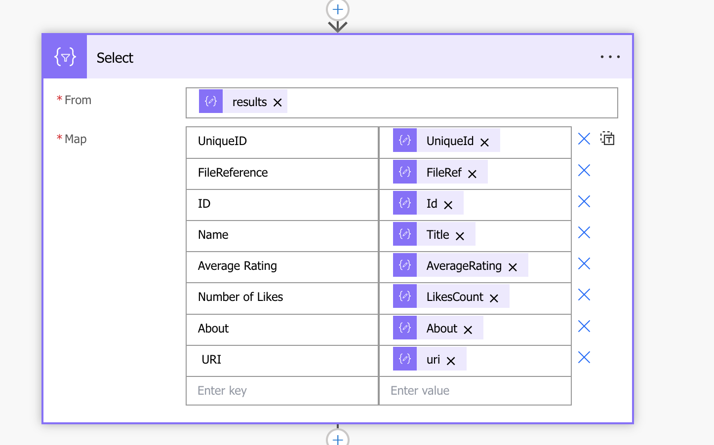
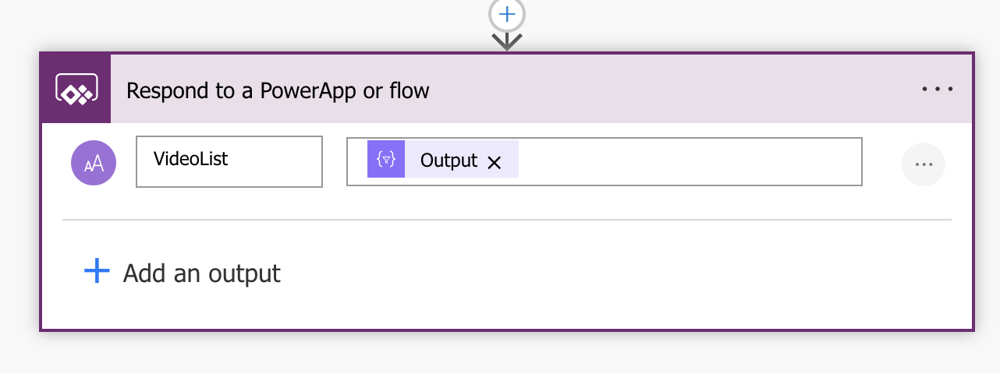
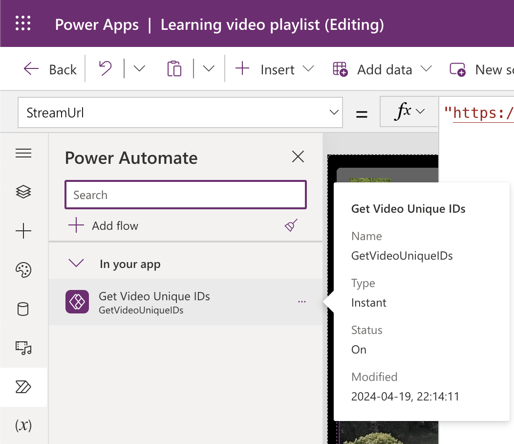
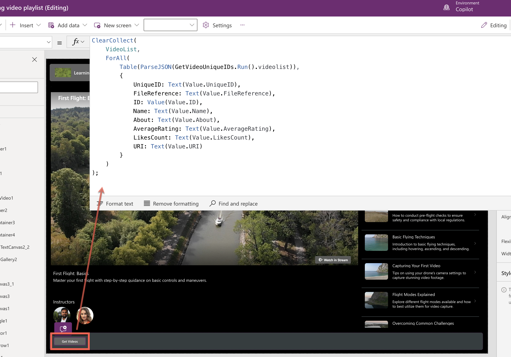
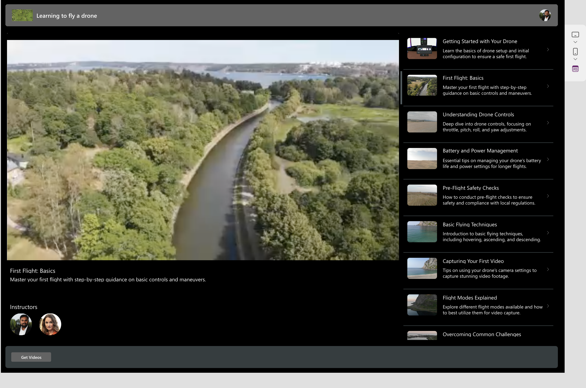

The new Stream control in Power Apps lets you embed Microsoft Stream (on SharePoint) videos directly in your canvas app. To add a Steam video in your canvas app, you will need the embed URL of the video.

But what if you need to display a playlist of videos from SharePoint in your PowerApp and let the stream player dynamically play a video in the list that a user selected?

The Unique ID and the URL needed for the new Stream control is not available in the SharePoint connector so that means the standard connector is not useful for that.

Thankfully, you can resolve this with Power Automate.

## Power Automate flow

Assuming you have a SharePoint document library or list for your videos, create a flow in Power Automate using the PowerApps trigger.

 
Send an HTTP request to SharePoint to fetch the Unique ID besides other metadata needed for the playlist.

Test-run the flow to verify the desired results in the outputs of the HTTP action. Copy the JSON from the Outputs.

Parse the JSON from the body of the HTTP action. Use the copied JSON to generate the schema from a sample.

With a select data operation step, build the data table that will then be used by the PowerApp to display the list of videos from SharePoint.

Use the Respond to PowerApp action to send the results from the Select action to the PowerApp.

The next step is to connect to this flow from the PowerApp and call the flow to execute either by using a button or the OnStart property of the app.

In your PowerApp, connect the flow.

Add a button and in the OnSelect property add the PowerFx code shown below.

This code calls the connected Flow that returns a list of videos in JSON format, and parses this JSON into a table, iterates over this table to extract and convert necessary fields, and finally, store all these records in the VideoList collection.

Display the results in the collection using a Gallery called VideoGallery.

Add a Stream control and set its StreamUrl property as shown below.

“https://<yoursite>.com/sites/TeamAllStars/_layouts/15/embed.aspx?UniqueId=” & VideoGallery.Selected.UniqueID

Now, when selecting a video item from the gallery the Stream control can dynamically play the selected video.

Hope you find this post useful.

Hopefully, in the future Microsoft will enable the standard SharePoint connector to support Unique ID of Stream videos.
