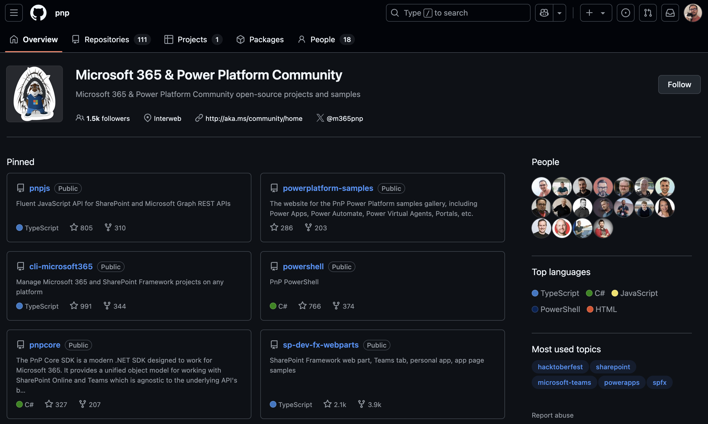
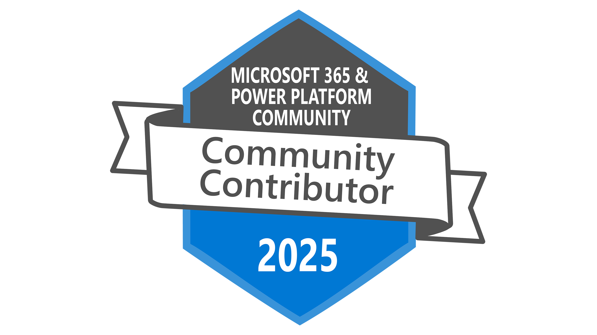

From time to time, I need to upload things to GitHub—whether it's because I need to for work or because I created a piece of content that I want to share with others (so they can improve it and take it to levels that I can't on my own). The only issue is that I am just terrible at it.

  
*There it is. The community holy grail of M365. All at your fingertips.*

## So.... do you also suck at GitHub as much as I do?

I use GitHub so infrequently that every time I need it, I have to scramble through my old notes to remind myself how it all works. If you are often finding yourself lost in the myriad of terms — *fork*, *pull*, *branch* — and often wonder if this is all a foreign language or if you are straight up being pranked, then I have the right solution for you.

With this idea in mind, I dusted off my git skills and I attended the [**M365 & Power Platform Samples Contributor Session**](https://aka.ms/sharingiscaring/samplescontributor) today, and let me tell you, it was exactly the refresh I needed. No gatekeeping, no assumptions about what you already know, and absolutely no “you should already know this” energy. Just real, hands-on help from a community that genuinely wants to see you succeed. *And yes, this was my second time attending it. No shame to admit I needed a refresher.*

This session is part of the [**Sharing is Caring**](https://aka.ms/sharing-is-caring) initiative, a community-driven effort designed to help people just like us contribute to the Microsoft 365 and Power Platform ecosystem. Whether you're into building SPFx solutions, crafting Power Apps, formatting SharePoint lists like a wizard, or creating PCF controls that make your UI shine, this session has your back.

As highlighted *several times* by the super handsome hosts [David Warner](https://warner.digital/) and [Hugo Bernier](https://tahoeninja.blog/), this session is a **safe space**. You don’t get recorded, and no one will make fun of you for not knowing (or not remembering) how to fork a repository, *even after being taught how to do it over 10 times like I have*. Let's be honest, we've all been there.

## Did I mention Credly badges?

By attending this session, you’re not just sitting through another tutorial—you’re actively unlocking the knowledge, tools, and support you need to go from “totally lost” to “GitHub contributor.” Here's what you’ll walk away with (and yes, it’s worth it):

- A full walkthrough of what types of contributions are welcome  
- Step-by-step guidance on how to navigate GitHub (yes, even the terrifying parts)  
- A live, judgment-free zone where all questions are welcome  
- By the end? You’ll have actually published your first contribution to GitHub  
- **And if you like badges**, you will also leave the session with a shiny new Community Contributor badge on [Credly](https://www.credly.com/badges/a58802eb-39b1-4a6f-9c57-37febeb9eb77/public_url). Don’t believe me? [Here’s the link to mine](https://www.credly.com/badges/a58802eb-39b1-4a6f-9c57-37febeb9eb77/public_url). Go ahead, click it. It sparkles.

And can we take another moment to appreciate how *ridiculously* handsome the hosts are? It’s honestly distracting. In a good way.

This isn’t just for developers. You don’t need to be some kind of GitHub ninja or even know what `npm install` does. If you’ve created something that helped you or your organization in Microsoft 365 or Power Platform, chances are it could help someone else too. And now you’ll know how to share it.

## Ready to explore (or contribute to) community samples?

Once you get the hang of it—which, let’s be honest, means you’ll be at least 10 times better at this than me—you can dive into the full gallery of Microsoft 365 & Power Platform community samples. From SPFx solutions to Flow templates, it’s all there waiting for you:

> [https://aka.ms/community/samples](https://aka.ms/community/samples)

### Final thought:

If you’ve ever felt intimidated by GitHub or unsure how to start contributing, this is your sign to stop hesitating, because if I did it, so can you. You’ll be guided every step of the way, surrounded by people who actually *want* to help you succeed. And yes—on top of being ridiculously helpful, the hosts are also charming, supportive, and almost unfairly handsome. Honestly, it’s kind of their superpower.
