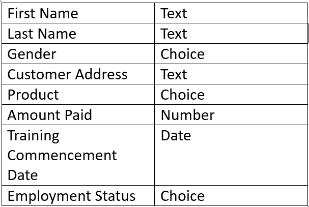
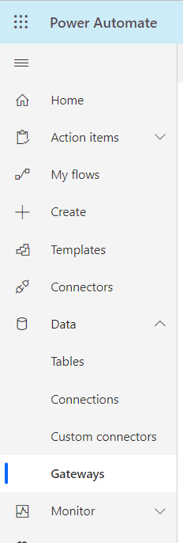
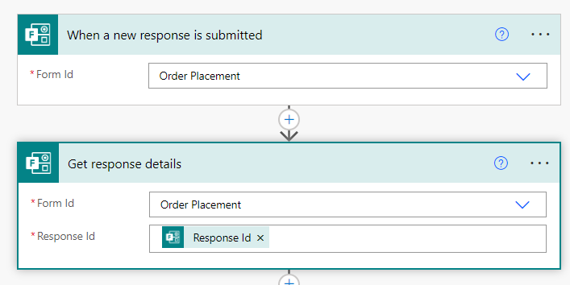
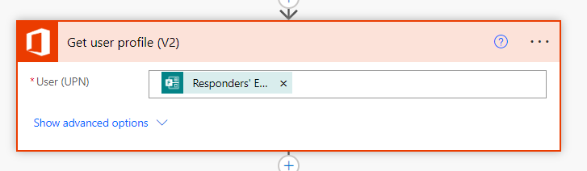
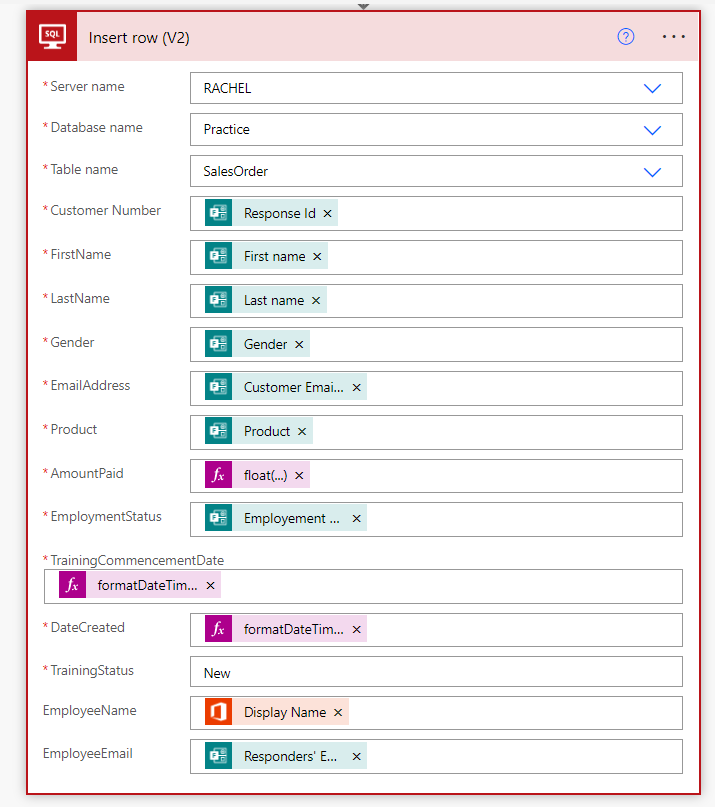
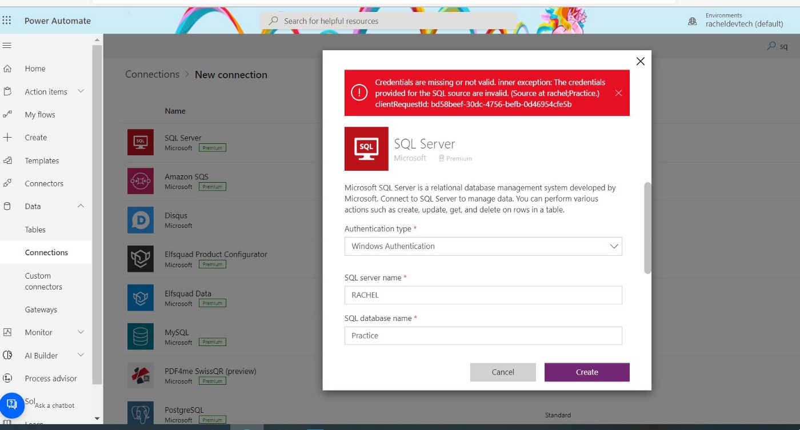

This Step in this blog shows you how to Update a row in [Microsoft SQL Server Management Studio](https://learn.microsoft.com/sql/ssms/sql-server-management-studio-ssms?view=sql-server-ver16) from the response of a [Microsoft Forms](https://www.microsoft.com/microsoft-365/online-surveys-polls-quizzes) using Power Automate

## Technologies Used

* [Microsoft Form](https://www.microsoft.com/microsoft-365/online-surveys-polls-quizzes) is used to easily create surveys and polls to collect customer feedback, measure employee satisfaction, and organize team events.

* [SQL Server Management Studio](https://learn.microsoft.com/sql/ssms/sql-server-management-studio-ssms?view=sql-server-ver16) (SSMS) is an integrated environment for managing any SQL infrastructure.

* The on-premises [Data Gateway](https://learn.microsoft.com/power-automate/gateway-reference) acts as a bridge to provide quick and secure data transfer between on-premises data (data that isn’t in the cloud) and several Microsoft cloud services.

* [Microsoft Power Automate](https://flow.microsoft.com) is a tool that helps users create workflows between desired applications to synchronize files, get notifications, and collect data.

##  The Process

### Step 1

* Create a Database in Microsoft SQL Server Management Studio
* Create a Table

```

SELECT TOP (1000) [ID]

,[Customer Number]

,[FirstName]

,[LastName]

,[Gender]

,[EmailAddress]

,[Product]

,[AmountPaid]

,[EmploymentStatus]

,[TrainingCommencementDate]

,[DateCreated]

,[TrainingStatus]

,[EmployeeName]

,[EmployeeEmail]

FROM [Practice].[dbo].[SalesOrder]

```

### Step 2

Create a Microsoft Form



### Step 3

Install Data Gateway in Power Automate



On the left-hand side of your screen, click on the drop-down **Data** and Select **Gateway**

### Step 4

Create an [automated cloud flow](https://learn.microsoft.com/power-automate/flow-types)



* The Trigger for the flow is **When a new response is submitted**
* Add the action **Get response details** to the flow

### Step 5

* Add the action **Get user profile** to the flow


To the User(UPN), add the dynamic contents **Responders Email** from the Microsoft Form.

### Step 6

* Add the action **Insert Row for SQL Server**



* Make a connection to the SQL Server



* Add the Authentication type, if you are using Windows Authentication, for the Password use your Laptop Password.
* Add the Server name
* Add the SQL Database name
* Add the Username

NB: To get the Server name and Username you can get it from SSMS.

After the connection, add this to the action, Insert row

* Add the Server name
* Add the Database name
* Add the Table name

Then the action will reveal the rows in your Table

Thank you for Reading!😉

If you have any question feel free to reach out to me on [Linkedln](https://www.linkedin.com/in/rachelirabor/) and [Twitter](https://twitter.com/Richie4love)
