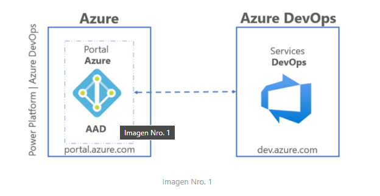
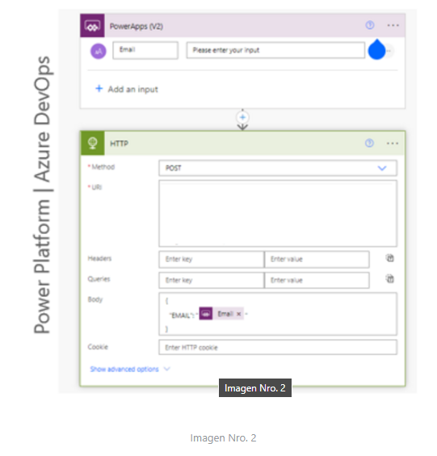
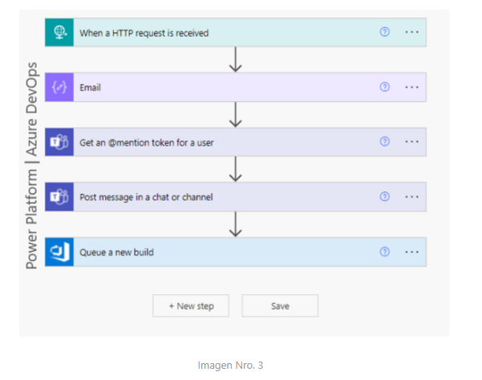
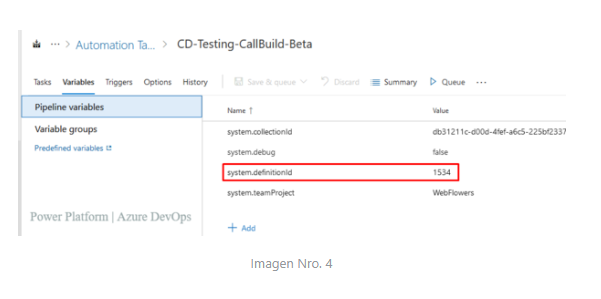
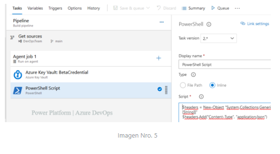
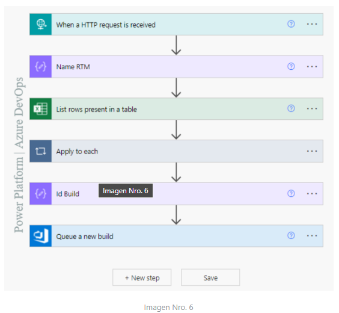

## Ejecutar Pipelines Azure DevOps por usuarios no invitados a los proyectos desde Power Platform

Ejecutar Pipelines Azure DevOps por usuarios no invitados a los proyectos desde Power Platform

**Build** - Es la etapa donde la aplicación será compilada y no borrará ningún archivo binario existente, reemplazará ensamblados actualizando la carpeta bin

**Release** - Es la etapa donde se libera el código desde el repositorio existente

**Deploy** - Es la etapa donde el código es desplegado a diferentes entornos

## ¿Por qué este Proceso?

Imagina que a nivel del tenant existe cierta cantidad de usuarios, pero a nivel de organización en un proyecto de Azure DevOps ni existe la misma cantidad o por la naturaleza del rol, se considera necesario que algunos usuarios no accedan a los pipelines de CI / CD a nivel de los servicios de DevOps.

Para lograr esto, haremos uso de la variable System.DefinitionId a nivel de Build.

A través de un botón en Power App, enviaremos como parámetro mediante el evento OnSelect, el email del usuario quien ejecute la acción.

`Invoke_Build_Beta.Run(User (). Email)
And
Notify ("Mensaje de alerta", NotificationType.Information,8000)`

Ahora una vez ejecutada la acción desde power Apps, en el conector HTTP hará una petición POST a la URL pública de un segundo conector en el detonador when a http request is received y como cuerpo del mensaje se enviará un objeto JSON el cual contiene un email.

En la sección URI de la imagen Nro. 2, está apuntando a la URL pública de un nuevo conector, para la descripción de este contenido se omitió el valor.

Ahora haremos el llamado al conector when a http request is received el cual recibirá el valor en formato JSON, donde estará relacionado un email

Comparto un ejemplo del objeto JSON a enviar

`{
  "EMAIL": "duvan.baena@dominio.com"
}`

Importante, una vez recibido el JSON debemos extraer únicamente los caracteres que forman el email, recuerda que existen direcciones de correo electrónico con mayor o menor cantidad de caracteres, para esto podemos hacer uso de las funciones de expresiones de flujo de trabajo para Azure Logic Apps y Power Automate

`substring(string(triggerBody()), add(indexOf(string(triggerBody()), ':'), 2), sub(lastIndexOf(substring(string(triggerBody()), add(indexOf(string(triggerBody()), ':'), 2)), '}'), 1))`

El resultado obtenido una vez aplicada la función es ***duvan.baena@dominio.com***

Ahora el objeto de tipo compose tiene un valor que representa una dirección de correo electrónico, así: duvan.baena@dominio.com

Este mismo output anterior, será usado en los otros dos (02) conectores Get an @mention token for a user y Post message in a chat or channel, los cuales requieren un email valido a nivel de tenant para ser usando en la mención a través de un mensaje a un canal de Microsoft Team desde Power Automate.

Asi mismo, haremos uso del conector premium Queue a new build, el cual requiere de una conexión previa.
Acá tenemos una pregunta. ¿Cómo generar conexión a un conector para un usuario que no existe como invitado en Azure DevOps?

La respuesta es no se puede, una forma alterna sería generar citada conexión por un usuario con permisos es a través de (email y pass) en el conector, allí seleccionamos la Organización, el proyecto y el Build Definition Id, estos valores existen a nivel de azure DevOps.

Al inicio de este blog, hablamos del. ¿Por qué este proceso?

El objetivo de hoy es conocer una nueva forma de ejecutar procesos de CI / CD por un usuario con permisos limitados en Azure DevOps desde Power Platform.

¿Qué es build definition Id? En la variable ***system.definitionId*** es una variable a nivel de agente de compilación responsable de Identificar la canalización de compilación a nivel interno de la herramienta de los servicios de DevOps.

Hasta acá, desde Power Platform hemos logrado ejecutar un único build a nivel de los servicios de azure, es común usar diferentes build para cumplir con ciertos procesos.

Hoy ejecutaremos una canalización automática de código de forma dinámica.

Este perfil de CD tiene un origen el cual apunta a una rama dentro de un repositorio de código.

Igualmente, tiene la tarea ***Azure Key Vault*** es encargada de recuperar el valor del secreto almacenado en un Key Value de Azure.

Así mismo, tiene una tarea ***PowerShell*** responsable de ejecutar una petición POST a una URL pública de otro conector ***when a http request is received*** y enviarle en el body de la petición un valor de tipo string.

Emplearemos un objeto de tipo compose identificado como Name RTM donde igualmente aplicaremos una función de expresión flujo de trabajo, para obtener únicamente el valor deseado.

`concat('V',string(substring(string(triggerBody()), add(int(indexOf(string(triggerBody()),'v')),1),6)))`

el body que viajó en la petición post una vez aplicada la expresión se obtendrá un valor formado, así ***V220401***

El cual será una variable local a nivel de build en Azure DevOps.

Ahora hablemos un poco de la definición de variables: Al definir la misma variable en varios lugares con el mismo nombre, gana la variable con ámbito local. Por lo tanto, una variable definida en el nivel de trabajo puede invalidar un conjunto de variables en el nivel de fase.

Ahora regresemos a la Imagen Nro. 4 allí en las variables existente del perfil haremos uso de dos (02) a nivel de ámbito local

* Variable Local RTM V220401
* Variable Local system.definitionId 1534

Pero el objetivo continúa siendo, desde Power Platform ejecutar un build de acuerdo con los valores cambiantes de las variables locales (RTM y system.definitionId)

## ¿Cómo lograr eso?

Haciendo uso del conector List rows present in a table donde seleccionaremos una tabla de excel previamente creada con dos (02) columnas (Name, Id).

Las columnas contendrán el nombre de la variable RTM la cual corresponde a un patrón definido y el campo Id un número de cuatro (4) dígitos con el cual se identifican los build previamente existentes en Azure DevOps.

En el campo del conector Filter Query haremos la búsqueda por la columna Name eq ‘Outputs del compose Name RTM

De esta forma solo traerá uno solo resultado en formato array

Pero ahora del array deberemos extraer el resultado en una variable de tipo Int de cuatro (04) dígitos.

la acción ***Apply to each*** en este caso es de uso obligatorio debido que del excel podemos extraer uno o varios registros.

A nivel interno de Apply to each creamos un nuevo componente de tipo compose donde obtendremos el valor del campo ID. ! El dato requerido ¡

Luego creamos un nuevo compose identificado ***Id Build*** el cual se le aplica una expresión, buscando obtener el resultado de la variable interna del apply to each en formato Int de cuatro (4) dígitos correspondientes a la variable system.definitionId del build a ejecutar.

`int(substring(string(outputs('IdBuildBeta')), 2, 4))`

Ahora haremos uso del conector ***Queue a new build*** el cual tendrá una conexión con un usuario con permisos para lista los campos (Organization Name, Project Name y Build Definition Id)

En el campo Definition Id, haremos el llamado al compose identificado como ***Id Build***

Otro parámetro, podría ser el identificado como Source Branch, allí podemos hacer un llamado al nivel de anidamiento del branch desde donde deseamos obtener el código fuente.

$/Main/QA/Feature_Login/ compose Name RTM
