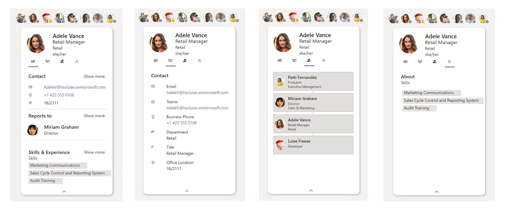
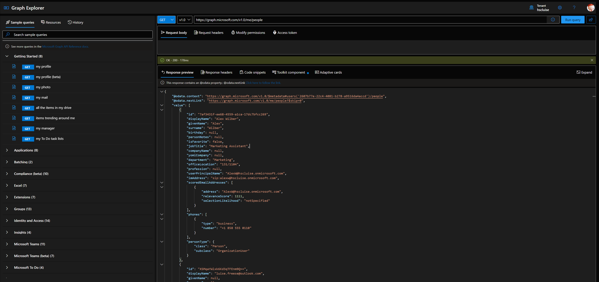
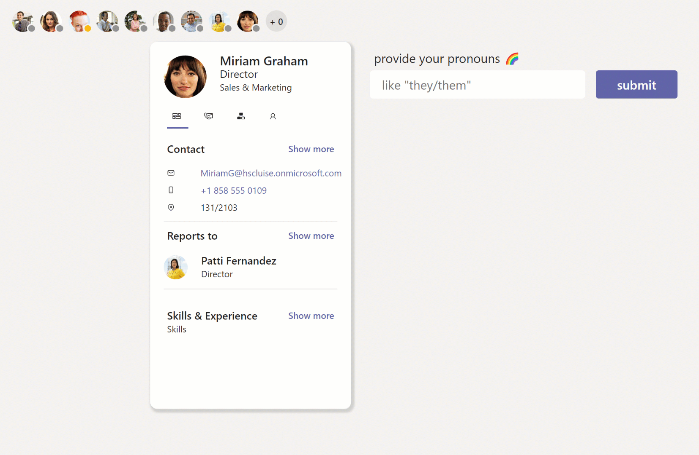

## tl;dr

If you want a a queryable extension experience for objects in Azure AD, you can achieve that by first creating the extension definition and then associate that new extension to an object. You can now GET and PATCH the new extension via your applications ins the same tenant and even expose the new extension with a custom connector to Power Platform.

## Use case

I wanted to build a Microsoft Graph toolkit lookalike person card, but noticed, that there is an attribute missing, that I'd love to include: *pronouns*. Turned out, that even in 2022, pronouns are not available by default in the user object in Azure Active Directory and my aim was to not just have pronouns of *some* people in *one* application, but expose the pronouns to *any* application in the tenant.



## Create a directory extension definition

To create a directory extension definition, we need to send a POST request to `https://graph.microsoft.com/v1.0/applications/<app object id>/extensionProperties`, which means, that we need to register an app for that.

### Register an application in Azure AD

You can register an app either in the Azure Portal or with this one-line-command in [CLI for Microsoft 365](https://pnp.github.io/cli-microsoft365):

`m365 aad app add --name 'GraphConnector-App'  --withSecret --apisApplication 'https://graph.microsoft.com/Directory.ReadWrite.All' --grantAdminConsent`

### Use Graph Explorer to create the extension

Now we can log ino [Graph Explorer](https://aka.ms/ge) and do a `POST` to

`https://graph.microsoft.com/v1.0/applications/<app object id>/extensionProperties`

while replacing the `<app object id>` (not the app id!) with your app object id.

The body of the request is:

```json
{
    "name": "pronouns",
    "dataType": "String",
    "targetObjects": [
        "User"
    ]
}
```

This means, that we want to create an extension called `pronouns` and associate this with the user object.

As a response, we will get something like

```JSON
{
    "@odata.context": "https://graph.microsoft.com/v1.0/$metadata#applications('4e3dbc8f-ca32-41b4-825a-346215d7d20f')/extensionProperties/$entity",
    "id": "53645e93-9bad-4cfa-938c-eebaaa84d89f",
    "deletedDateTime": null,
    "appDisplayName": "GraphConnector",
    "dataType": "String",
    "isSyncedFromOnPremises": false,
    "name": "extension_8ceab131804c47278376509101e201c3_userPronouns",
    "targetObjects": [
        "User"
    ]
}
```

You can see, that we have a new property **name** with a value `extension_8ceab131804c47278376509101e201c3_userPronouns`

This new property can now be used from any application in your tenant

This value always follows the pattern `extension_{appId-without-hyphens}_{extensionProperty-name}`

Make a note of this value somewhere.

### Patch a user with the new property

Now we can use a PATCH to `https://graph.microsoft.com/v1.0/users/{userId}`

with a body

`{"extension_8ceab131804c47278376509101e201c3_userPronouns": "she/they"}`

### Check if the new property is in place

Of course we want to check if it worked, so we will do a GET to `https://graph.microsoft.com/v1.0/users/{userId}?$select=displayName, extension_8ceab131804c47278376509101e201c3_userPronouns`

It is required to select the new property in the GET request, otherwise it won't be returned.



## Create a custom connector for Power Platform

Now that we created the extension and know how to patch and get data, we can build a custom connector so we can expose the functionality in Power Platform.

### GET request

You can follow steps [create the custom connector](https://www.m365princess.com/blogs/microsoft-graph-people-picker-power-apps/#create-the-custom-connector), but instead of adding a **GetPeople** action, add a **GetUsers** action:

1. Select **Definition**
2. Select **New action**
3. Type in `GetUsers` as **Summary**, **Description**, and **Operation ID**
4. Under **Request**, select **Import from sample**
5. Select `GET` as **Verb**
6. Type `https://graph.microsoft.com/v1.0/users/{userid}$select=displayName, extension_8ceab131804c47278376509101e201c3_userPronouns` as **URL** (remember, it's the same URL we used in Graph explorer, please replace the extension property)
7. Select **Import**
8. Under **Response**, select **Add default response**
9. Paste in the response you got from Graph Explorer in the **Body** field
10. Select **Import**
11. Select **Update Connector**
12. Select **Test**
13. Select **New Connection**
14. Select **Create** - you will annoyingly be redirected to the connections overview - go back to your custom connector
15. Select **Test operation** - you should receive a HTTP response `200`
16. Select **Close**

### PATCH request

For the PATCH request, add another action to your custom connector:

1. Select **Definition**
2. Select **New action**
3. Type in `PatchPronouns` as **Summary**, **Description**, and **Operation ID**
4. Under **Request**, select **Import from sample**
5. Select `PATCH` as **Verb**
6. Type `https://graph.microsoft.com/v1.0/users/{userid}` as **URL** (remember, it's the same URL we used in Graph explorer, please replace the extension property )
7. Type in the **Body**

```json
{
"extension_8ceab131804c47278376509101e201c3_userPronouns": "she/they"
}
```

8. Select **Import**
9. Under **Response**, select **Add default response**
10. Paste in the response you got from Graph Explorer in the **Body** field
11. Select **Import**
12. Select **Update Connector**
13. Select **Test**
14. Select **New Connection**
15. Select **Create** - you will annoyingly be redirected to the connections overview - go back to your custom connector
16. Select **Test operation** - you should receive a HTTP response `204`
17. Select **Close**

We can then set the **Text** of a text label to

`GraphConnector.GetUser(<userId>,{'$select':"displayName, extension_8ceab131804c47278376509101e201c3_userPronouns"}).extension_8ceab131804c47278376509101e201c3_userPronouns` to display the pronouns of a certain user and set the **OnSelect** of a button to

`GraphConnector.PatchPronouns(<userId>,{extension_8ceab131804c47278376509101e201c3_userPronouns:"she/they")`

## Back to my app idea...

Following [my idea to re-create Microsoft Graph toolkit components as Power Apps canvas components](https://www.m365princess.com/blogs/microsoft-graph-people-picker-power-apps) I did a more inclusive person card component - with pronouns.



## Feedback and whats's next

What do you think? Which custom fields would you like to expose? [Let me know on twitter](https://twitter.com/LuiseFreese/status/1602214905716903941) or in the comments below :-)
