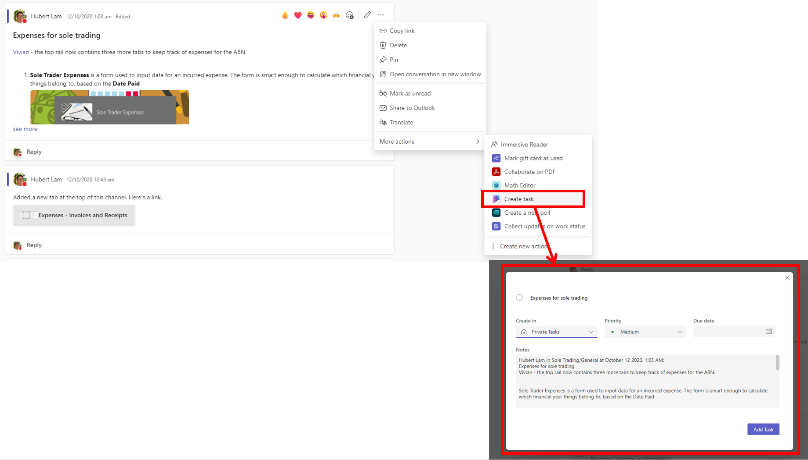
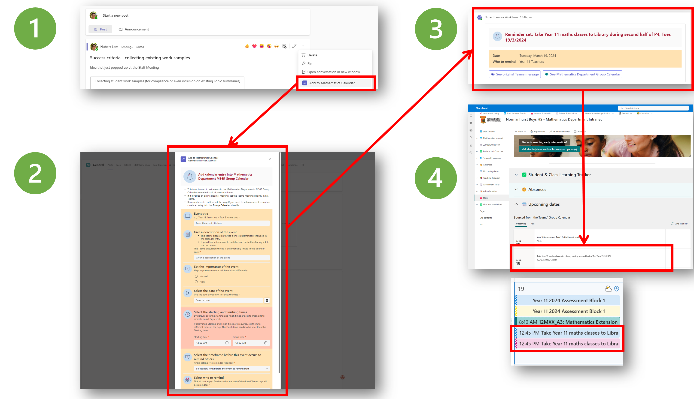
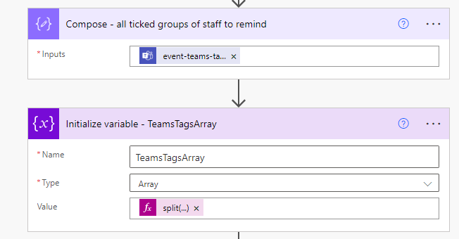

---
# this is the title
title: "Send calendar reminders to particular Teams messages by utilising adaptive cards and the M365 Group Calendar"
# this is the publishing date of your article, usually this should match "now"
date: 2024-03-20T08:40:00+11:00
# This is your name
author: "Hubert Lam"
# This is your GitHub name
githubname: z3019494
# Don't change
categories: ["Community post"]
# Link to the thumbnail image for the post
images:
- images/ReminderAC.png
# don't change
tags: []
# don't change
type: "regular"
---


# Rationale
Microsoft Teams is fantastic for teamwork, but it still has its shortcomings especially when it comes to setting reminders. 

## Planner: Create a task, but the due date doesn't pop up on the calendar
As of writing, the context menu on every Teams Channel message provides a **Create task** button:


However, by design the Planner task practically does not pop up until 2 days before the set due date. In fact, Planner can be quite unhelpful as it keeps generating additional emailed reminders. Hardly a good solution when some of us are suffering from email overload.

## Sending out a calendar event? Power Automate's built in "Create an event (V4)" action is limited too.
The best solution so far is to utilise a user's calendar, which will pop up "in your face". 

However, the limitations of Power Automate's **Create an event (V4)** action is quite troublesome - without some sophisticated discovery of the initiating user's default calendar ID, it's not a flow that can be used by any member of the Team. We want every team member to be able to generate these reminders for the rest of the team.


# Solution
The following Power Automate flow will:
* Allow _all_ users (and not just one user) of the team to execute and preset a reminder.
* Uses the Team's **M365 Group Calendar** to send out an event that isn't an online meeting.
  - An optional reminder time can be set (similar to usual Outlook calendar events) and pop up on team member's calendar reminders
* Allow the event to appear in locations where the Group Calendar events can be viewed, whether it be in Outlook or the SharePoint modern webpart.



Note that this solution does not utilise just a plain SharePoint list (with a Calendar view tacked on) or the more special Event list. 

## Create a new flow based on "For a selected Teams message"
We'll start by creating a new **Instant cloud flow**, which uses the **For a selected message (V2)** trigger.


An example of the adaptive card which this trigger is based on:

```json
{
    "$schema": "http://adaptivecards.io/schemas/adaptive-card.json",
    "type": "AdaptiveCard",
    "version": "1.3",
    "msteams": {
        "width": "Full"
    },
    "body": [
        {
            "type": "Container",
            "style": "emphasis",
            "items": [
                {
                    "type": "ColumnSet",
                    "columns": [
                        {
                            "type": "Column",
                            "width": "75px",
                            "items": [
                                {
                                    "type": "Image",
                                    "width": "75px",
                                    "url": "https://<URL>/Alert_2.png"
                                }
                            ]
                        },
                        {
                            "type": "Column",
                            "width": "stretch",
                            "items": [
                                {
                                    "type": "TextBlock",
                                    "wrap": true,
                                    "size": "Large",
                                    "weight": "Bolder",
                                    "color": "Attention",
                                    "text": "**Add calendar entry into Mathematics Department M365 Group Calendar**"
                                }
                            ],
                            "verticalContentAlignment": "Center"
                        }
                    ]
                }
            ]
        },
        {
            "type": "TextBlock",
            "text": "- This form is used to set events in the Mathematics Department's M365 Group Calendar to remind staff of particular items.\n- If it involves an online (Teams) meeting, set the Teams meeting directly in MS Teams.\n- Recurrent events can't be set this way. If you need to set a recurrent reminder, create an entry into the **Group Calendar** directly.",
            "wrap": true
        },
        {
            "type": "Container",
            "style": "warning",
            "items": [
                {
                    "type": "ColumnSet",
                    "columns": [
                        {
                            "type": "Column",
                            "width": "50px",
                            "items": [
                                {
                                    "type": "Image",
                                    "url": "https://<URL>/Menu_Top.png"
                                }
                            ]
                        },
                        {
                            "type": "Column",
                            "width": "stretch",
                            "items": [
                                {
                                    "type": "TextBlock",
                                    "text": "Event title",
                                    "wrap": true,
                                    "weight": "Bolder",
                                    "size": "Large"
                                },
                                {
                                    "type": "Input.Text",
                                    "spacing": "None",
                                    "isRequired": true,
                                    "id": "event-title",
                                    "errorMessage": "Give a description of an event, or provide a link to the document to be filled out",
                                    "label": "e.g. Year 12 Assessment Task 3 letters due",
                                    "placeholder": "Enter the event title here"
                                }
                            ],
                            "verticalContentAlignment": "Center"
                        }
                    ]
                },
                {
                    "type": "ColumnSet",
                    "columns": [
                        {
                            "type": "Column",
                            "width": "50px",
                            "items": [
                                {
                                    "type": "Image",
                                    "url": "https://<URL>/Document_Detail.png"
                                }
                            ]
                        },
                        {
                            "type": "Column",
                            "width": "stretch",
                            "items": [
                                {
                                    "type": "TextBlock",
                                    "text": "Give a description of the event",
                                    "wrap": true,
                                    "weight": "Bolder",
                                    "size": "Large"
                                },
                                {
                                    "type": "TextBlock",
                                    "text": "- This Teams discussion thread's link is automatically included in the calendar entry. \n- If you'd like a document to be filled out, paste the sharing link to the document ",
                                    "wrap": true,
                                    "spacing": "None"
                                },
                                {
                                    "type": "Input.Text",
                                    "spacing": "None",
                                    "isRequired": true,
                                    "id": "event-description",
                                    "placeholder": "Given a description of the event",
                                    "errorMessage": "Please enter an event title",
                                    "label": "The Teams discussion thread is automatically linked in the calendar entry"
                                }
                            ],
                            "verticalContentAlignment": "Center"
                        }
                    ],
                    "separator": true,
                    "spacing": "ExtraLarge"
                },
                {
                    "type": "ColumnSet",
                    "columns": [
                        {
                            "type": "Column",
                            "width": "50px",
                            "items": [
                                {
                                    "type": "Image",
                                    "url": "https://<URL>/Speech_Alert.png"
                                }
                            ]
                        },
                        {
                            "type": "Column",
                            "width": "stretch",
                            "items": [
                                {
                                    "type": "TextBlock",
                                    "text": "Set the importance of the event",
                                    "wrap": true,
                                    "weight": "Bolder",
                                    "size": "Large"
                                },
                                {
                                    "type": "Input.ChoiceSet",
                                    "choices": [
                                        {
                                            "title": "Normal",
                                            "value": "normal"
                                        },
                                        {
                                            "title": "High",
                                            "value": "high"
                                        }
                                    ],
                                    "placeholder": "Select the importance of the calendar event",
                                    "isRequired": true,
                                    "id": "event-importance",
                                    "style": "expanded",
                                    "spacing": "None",
                                    "errorMessage": "Set the importance of the calendar reminder",
                                    "label": "High importance events will be marked differently"
                                }
                            ],
                            "verticalContentAlignment": "Center"
                        }
                    ],
                    "separator": true,
                    "spacing": "ExtraLarge"
                },
                {
                    "type": "ColumnSet",
                    "columns": [
                        {
                            "type": "Column",
                            "width": "50px",
                            "items": [
                                {
                                    "type": "Image",
                                    "url": "https://<URL>/Play.png"
                                }
                            ]
                        },
                        {
                            "type": "Column",
                            "width": "stretch",
                            "items": [
                                {
                                    "type": "TextBlock",
                                    "text": "Select the date of the event",
                                    "wrap": true,
                                    "weight": "Bolder",
                                    "size": "Large"
                                },
                                {
                                    "type": "Input.Date",
                                    "spacing": "None",
                                    "isRequired": true,
                                    "errorMessage": "Please select the date of the event",
                                    "id": "event-date",
                                    "label": "Use the date dropdown to select the date"
                                }
                            ],
                            "verticalContentAlignment": "Center"
                        }
                    ],
                    "separator": true,
                    "spacing": "ExtraLarge"
                },
                {
                    "type": "ColumnSet",
                    "columns": [
                        {
                            "type": "Column",
                            "width": "50px",
                            "items": [
                                {
                                    "type": "Image",
                                    "url": "https://<URL>/Reverse_Time.png"
                                }
                            ]
                        },
                        {
                            "type": "Column",
                            "width": "stretch",
                            "items": [
                                {
                                    "type": "TextBlock",
                                    "text": "Select the starting and finishing times",
                                    "wrap": true,
                                    "weight": "Bolder",
                                    "size": "Large"
                                },
                                {
                                    "type": "TextBlock",
                                    "text": "By default, both the starting and finish times are set to midnight to indicate an All Day event. \n\nIf alternative Starting and Finish times are required, set them to different times of the day. The Finish time needs to be later than the Starting time.",
                                    "wrap": true,
                                    "spacing": "None"
                                },
                                {
                                    "type": "ColumnSet",
                                    "columns": [
                                        {
                                            "type": "Column",
                                            "width": "stretch",
                                            "items": [
                                                {
                                                    "type": "Input.Time",
                                                    "spacing": "None",
                                                    "id": "event-start-time",
                                                    "label": "Starting time",
                                                    "errorMessage": "Enter a starting time for the calendar reminder",
                                                    "value": "00:00",
                                                    "isRequired": true
                                                }
                                            ]
                                        },
                                        {
                                            "type": "Column",
                                            "width": "stretch",
                                            "items": [
                                                {
                                                    "type": "Input.Time",
                                                    "id": "event-finish-time",
                                                    "label": "Finish time",
                                                    "errorMessage": "Enter a finish time for the calendar reminder",
                                                    "value": "00:00",
                                                    "isRequired": true
                                                }
                                            ]
                                        }
                                    ],
                                    "spacing": "Large"
                                }
                            ]
                        }
                    ],
                    "separator": true,
                    "spacing": "ExtraLarge",
                    "id": "event-start-finish-time-block",
                    "style": "attention",
                    "bleed": true
                },
                {
                    "type": "ColumnSet",
                    "columns": [
                        {
                            "type": "Column",
                            "width": "50px",
                            "items": [
                                {
                                    "type": "Image",
                                    "url": "https://<URL>/Speech_Alert.png"
                                }
                            ]
                        },
                        {
                            "type": "Column",
                            "width": "stretch",
                            "items": [
                                {
                                    "type": "TextBlock",
                                    "text": "Select the timeframe before this event occurs to remind others",
                                    "wrap": true,
                                    "weight": "Bolder",
                                    "size": "Large"
                                },
                                {
                                    "type": "Input.ChoiceSet",
                                    "choices": [
                                        {
                                            "title": "15 min before",
                                            "value": "remind-15"
                                        },
                                        {
                                            "title": "1 hour before",
                                            "value": "remind-60"
                                        },
                                        {
                                            "title": "3 hours before",
                                            "value": "remind-180"
                                        },
                                        {
                                            "title": "1 day before",
                                            "value": "remind-1-day"
                                        },
                                        {
                                            "title": "3 days before",
                                            "value": "remind-3-day"
                                        },
                                        {
                                            "title": "1 week before",
                                            "value": "remind-1-week"
                                        },
                                        {
                                            "title": "No reminder required",
                                            "value": "remind-none"
                                        }
                                    ],
                                    "placeholder": "Select how long before the event to remind staff",
                                    "isRequired": true,
                                    "id": "event-reminder",
                                    "spacing": "None",
                                    "errorMessage": "Select the timeframe when Executive Staff should be reminded",
                                    "label": "Avoid setting \"No reminder required\""
                                }
                            ],
                            "verticalContentAlignment": "Center"
                        }
                    ],
                    "separator": true,
                    "spacing": "ExtraLarge"
                },
                {
                    "type": "ColumnSet",
                    "columns": [
                        {
                            "type": "Column",
                            "width": "50px",
                            "items": [
                                {
                                    "type": "Image",
                                    "url": "https://<URL>/class-light.png"
                                }
                            ]
                        },
                        {
                            "type": "Column",
                            "width": "stretch",
                            "items": [
                                {
                                    "type": "TextBlock",
                                    "text": "Select who to remind",
                                    "wrap": true,
                                    "weight": "Bolder",
                                    "size": "Large"
                                },
                                {
                                    "type": "Input.ChoiceSet",
                                    "choices": [
                                        {
                                            "title": "2024 Teaching Staff",
                                            "value": "2024 Teaching Staff"
                                        },
                                        {
                                            "title": "Year 7 Teachers",
                                            "value": "Year 7 Teachers"
                                        },
                                        {
                                            "title": "Year 8 Teachers",
                                            "value": "Year 8 Teachers"
                                        },
                                        {
                                            "title": "Year 9 Teachers",
                                            "value": "Year 9 Teachers"
                                        },
                                        {
                                            "title": "Year 10 Teachers",
                                            "value": "Year 10 Teachers"
                                        },
                                        {
                                            "title": "Year 11 Teachers",
                                            "value": "Year 11 Teachers"
                                        },
                                        {
                                            "title": "Year 11 Adv Teachers",
                                            "value": "Year 11 Adv Teachers"
                                        },
                                        {
                                            "title": "Year 11 X1 Teachers",
                                            "value": "Year 11 X1 Teachers"
                                        },
                                        {
                                            "title": "Year 12 Teachers",
                                            "value": "Year 12 Teachers"
                                        },
                                        {
                                            "title": "Year 12 Adv/X1 Teachers",
                                            "value": "Year 12 Adv/X1 Teachers"
                                        },
                                        {
                                            "title": "Year 12 X1/X2 Teachers",
                                            "value": "Year 12 X1/X2 Teachers"
                                        },
                                        {
                                            "title": "Year 12 X2 Teachers",
                                            "value": "Year 12 X2 Teachers"
                                        },
                                        {
                                            "title": "Mathematics (local PDP) Teachers",
                                            "value": "Mathematics (local PDP) Teachers"
                                        }
                                    ],
                                    "placeholder": "Select the groups of staff to remind",
                                    "isRequired": true,
                                    "id": "event-teams-tags",
                                    "spacing": "None",
                                    "errorMessage": "Select at least one group of staff to remind",
                                    "label": "Tick all that apply. Teachers who are part of the ticked Teams tags will be reminded.",
                                    "isMultiSelect": true
                                }
                            ],
                            "verticalContentAlignment": "Center"
                        }
                    ],
                    "separator": true,
                    "spacing": "ExtraLarge"
                }
            ]
        }
    ]
}
```

A few notes about this card:
* It emulates the fields which any user will have to fill out in order to create an Outlook calendar event. Those fields are:
  - Event title
  - Give a description of the event
  - Set the importance of the event
  - Select the date of the event
  - Select the starting and finishing times
  - Select the timeframe before this event occurs to remind others
* Fields which Outlook doesn't have, but this card possesses in order to take advantage of Teams feature(s)
  - Select who to remind (multi-select field, this looks up the @mention tags that are created for that team and only reminds those people)


## Constructing the flow
The flow will require some **Compose** actions and a stack of variables to handle the dates and times as strings.

| **Variable name** | **Variable type** |  **What it does** | 
|--|--|--|
| `StartTime` | String | Holds the start time as a string. If it's an All Day event, it will be overwritten with `event-dateT00:00:00.000000` |
| `FinishTime` | String | As above, but for the finishing time. For All Day events, the `addDays` Power Automate function is used to add one day to the `StartTime` | 
| `TeamsTagArray` | Array | Holds the Teams @mention tag names to lookup | 

### TeamsTagArray
The `TeamsTagArray` variable's value is set with the expression `split(outputs('Compose_-_all_ticked_groups_of_staff_to_remind'),',')` . This splits the existing "array" of comma separated values passed on from the adaptive card.


Later, an Apply to Each loop will run through this array to fetch all of the @mention tag IDs within the Team. The loop will:


* Filter out all of the non-current tags
* Get the current tag ID (`Compose - current Team tag`)
* List the members for the current tag
* Loop through all of the members and fetch their email addresses, place it into the `TeamsTagMembers` array variable
* Append an additional JSON object to the `AllReminderEmails` array variable (ready for placement into as a recipient in the calendar event)


Finally, there may be duplicate team members if there are multiple groups of people selected to remind. The `Join` action will take the union of the `AllReminderEmails` variable with itself to remove duplicates, and then join the remaining de-duplicated output with a comma and space:
```union(variables('AllReminderEmails'),variables('AllReminderEmails'))```


### Send Group Event (scope)
The next major step is to create an event in the Group Calendar that belongs to the Team. The default Power Automate action does not allow that event to be "sent" to other recipients, so the **Send HTTP Request** action is needed.

In short, the actions in this scope will:
* Get the `Team ID` which the flow was triggered from
* Get the details of the M365 Group from the `Team ID` by using a filter on the groups that the user owns/belongs to
* Filters the list of the M365 Groups obtained, so that only the one relevant to the Team is left
* Fetch the Group Email address (so that the "organiser" of the event if the M365 Group)
  - Also fetch the Group Name (as a display name)
* Send the HTTP Request


#### Send HTTP Request (V2) - M365 Groups edition
The `URI` to use is the following:
```https://graph.microsoft.com/v1.0/groups/@{outputs('Compose_-_Group_ID')}/events```

The body:
```json
{
    "reminderMinutesBeforeStart": @{variables('MinuteBeforeToRemind')},
    "isReminderOn": true,
    "hasAttachments": false,
"showAs": "tentative",
    "subject": "@{triggerBody()?['cardOutputs']?['event-title']}",
    "importance": "@{triggerBody()?['cardOutputs']?['event-importance']}",
    "sensitivity": "normal",
    "isAllDay": @{variables('AllDayEvent')},
    "isCancelled": false,
"body": {
        "contentType": "html",
        "content": "@{replace(replace(variables('MessageBody'),'"','\"'),decodeUriComponent('%0A'),'\n')}"
    },
    "start": {
        "dateTime": "@{if(equals(outputs('Compose_-_Original_Start_Time'), outputs('Compose_-_Original_Finish_Time')), variables('StartTime'), body('Convert_time_zone_-_StartTime_to_Group_Calendar'))}",
        "timeZone": "AUS Eastern Standard Time"
    },
    "end": {
        "dateTime": "@{if(equals(outputs('Compose_-_Original_Start_Time'), outputs('Compose_-_Original_Finish_Time')), variables('FinishTime'), body('Convert_time_zone_-_FinishTime_to_Group_Calendar'))}",
        "timeZone": "AUS Eastern Standard Time"
    },
    "location": {
        "displayName": "",
        "locationType": "default",
        "uniqueIdType": "unknown",
        "address": {},
        "coordinates": {}
    },
    "locations": [],
    "recurrence": null,
    "attendees": [
@{body('Join_-_All_exec_emails')}
    ],
    "organizer": {
        "emailAddress": {
            "name": "@{outputs('Compose_-_Group_Name')}",
            "address": "@{outputs('Compose_-_Group_Email')}"
        }
    }
}
```


  

### The final adaptive card

Once the Group Calendar entry is created, it will also wriggle itself on to the selected tag members' mailboxes :) An adaptive card is then posted as a reply to the same thread to indicate a reminder has been set:
```json
{
    "$schema": "http://adaptivecards.io/schemas/adaptive-card.json",
    "type": "AdaptiveCard",
    "version": "1.4",
    "msteams": {
        "width": "Full"
    },
    "body": [
        {
            "type": "Container",
            "style": "emphasis",
            "items": [
                {
                    "type": "ColumnSet",
                    "columns": [
                        {
                            "type": "Column",
                            "width": "40px",
                            "items": [
                                {
                                    "type": "Image",
                                    "width": "50px",
                                    "url": "https://<URL>/Alert_2.png"
                                }
                            ]
                        },
                        {
                            "type": "Column",
                            "width": "stretch",
                            "items": [
                                {
                                    "type": "TextBlock",
                                    "wrap": true,
                                    "size": "Large",
                                    "weight": "Bolder",
                                    "color": "Attention",
                                    "text": "**Reminder set: @{triggerBody()?['cardOutputs']?['event-title']}**"
                                }
                            ],
                            "verticalContentAlignment": "Center"
                        }
                    ]
                }
            ]
        },
        {
            "type": "Container",
            "style": "warning",
            "items": [
                {
                    "type": "FactSet",
                    "facts": [
                        {
                            "title": "Date",
                            "value": "@{body('Convert_time_zone_-_event_date')}"
                        },
                        {
                            "title": "Who to remind",
                            "value": "@{body('Join_-_Teams_tag_names')}"
                        }
                    ]
                }
            ]
        },
        {
            "type": "ActionSet",
            "actions": [
                {
                    "type": "Action.OpenUrl",
                    "title": "See original Teams message",
                    "iconUrl": "<URL>/teams.png",
                    "url": "@{triggerBody()?['teamsFlowRunContext']?['messagePayload']?['linkToMessage']}"
                },
                {
                    "type": "Action.OpenUrl",
                    "title": "See Mathematics Department Group Calendar",
                    "iconUrl": "https://<URL>/sharepoint.png",
                    "url": "https://<url_to_sharepoint_intranet</a>"
                }
            ]
        }
    ]
}
```


## Accompanying video
https://www.youtube.com/watch?v=7VngNR3tv3k


# Conclusion
The Mathematics Department at Normanhurst Boys High School, Sydney, NSW, Australia has been using this user triggered flow for the past 18 months, and every time someone has set a calendar reminder in this way, it has saved them time from going to their mailbox, then selecting recipients, and then letting the Team know a new calendar entry has been created.

Nobody so far, has forgotten the item that they were meant to have been reminded of, given the broad number of ways that M365 Group Calendar entries make themselves appear:
* On a user's mailbox
* Pop up as a reminder at the specified time period prior to the event
* On a SharePoint Modern Group Calendar webpart.
