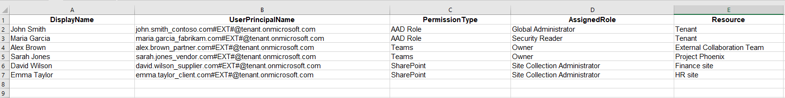

## Introduction

Microsoft 365 makes collaborating with external users easy, but understanding what those guest users can actually do is often much harder. A guest invited for a short-term project may still be a Team owner, SharePoint site collection administrator, or even hold a Microsoft Entra ID directory role months after their work has finished.

While Microsoft 365 provides excellent governance capabilities, there isn't a built-in report that brings these permission types together in a single view. I wanted a simple, repeatable way to answer one practical question:

**Which guest users currently have privileged access that deserves a closer look?**

That's what led to this PowerShell script.

## The Problem

Guest accounts are a normal part of most Microsoft 365 environments. They're created to support collaboration with partners, suppliers, consultants, and customers, often with permissions that are entirely appropriate at the time.

The challenge comes later. As projects finish and responsibilities change, guest users can retain permissions that are no longer required. Reviewing that access often means checking multiple administration portals and manually combining the results, making regular governance reviews more time-consuming than they need to be.

Rather than replacing Microsoft's governance tools, I wanted a quick way to identify guest users who hold administrative or ownership permissions across several core Microsoft 365 services.

## How the Solution Came About

The first version of the script simply reported guest users assigned Microsoft Entra ID directory roles. It answered part of the question, but it quickly became clear that many significant permissions exist outside of directory roles.

The script was expanded to include Microsoft Teams ownership and SharePoint site collection administrators, producing a single report that highlights guest users with elevated access across multiple Microsoft 365 services.

Screenshot of Sample CSV output:

The full script is available on GitHub here:

**[https://pnp.github.io/script-samples/spo-get-entra-id-guest-users-with-elevated-permissions-m365/README.html?tabs=pnpps](https://pnp.github.io/script-samples/spo-get-entra-id-guest-users-with-elevated-permissions-m365/README.html?tabs=pnpps)**

## Scope and Prerequisites

The current version focuses on three permission areas that commonly grant broad administrative or ownership capabilities:

- Microsoft Entra ID directory roles
- Microsoft Teams ownership
- SharePoint site collection administrators

It doesn't attempt to enumerate every possible permission path within Microsoft 365. Areas such as Exchange permissions, Azure RBAC, Microsoft 365 Group ownership, and granular SharePoint permissions are outside the current scope but could be added in future versions.

To run the script, you'll need the appropriate administrative permissions along with the required PowerShell modules for Microsoft Graph, Microsoft Teams, and SharePoint Online.

## What the Script Does

The script checks guest users across the supported services and identifies those who hold elevated permissions.

The results are exported to a CSV containing:

- Display Name
- User Principal Name
- Permission Type
- Assigned Role
- Resource

This provides a straightforward report that can support governance reviews, access audits, permission clean-up, and security investigations.

Screenshot of Sample CSV output:

## A Practical Example

One scenario where this proved useful was during a routine access review. The report identified a guest consultant who was still listed as the owner of a Microsoft Team several months after the project had ended.

The access had been completely appropriate when it was granted, but it had simply never been removed. Without a consolidated report, permissions like these can easily be overlooked because they're spread across different Microsoft 365 administration interfaces.

## Business Impact

The biggest benefit of this approach is reducing the effort required to review guest access.

Instead of moving between Microsoft Entra, Microsoft Teams, and SharePoint administration portals, administrators can generate a single report showing guest users with administrative or ownership permissions. This makes it easier to validate whether access is still required and identify permissions that should be removed.

The report can support:

- Regular access reviews
- Governance reporting
- Security investigations
- Permission clean-up exercises

Potential metrics you could capture include:

- Number of guest accounts reviewed
- Elevated permissions identified
- Time saved compared to manual reviews

For me, the real value is being able to quickly answer a question that comes up during many Microsoft 365 governance reviews:

**Who outside the organisation currently has significant access?**

## Future Improvements

There are plenty of ways this could be extended, including:

- Microsoft 365 Group ownership
- SharePoint permissions beyond site collection administrators
- Azure RBAC role assignments
- Guest sign-in activity and account age
- Risk scoring based on permission level
- HTML or Power BI reporting

The current version intentionally focuses on a small number of high-value permission types, but there are many other areas that could be incorporated over time.

## Community Discussion

How are you reviewing guest permissions in your Microsoft 365 environment?

Do you include additional permission types in your reviews, or have you built your own automation to simplify the process?

I'd be interested to hear how others are approaching guest access governance.
