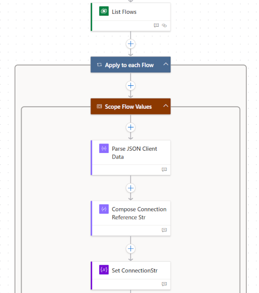
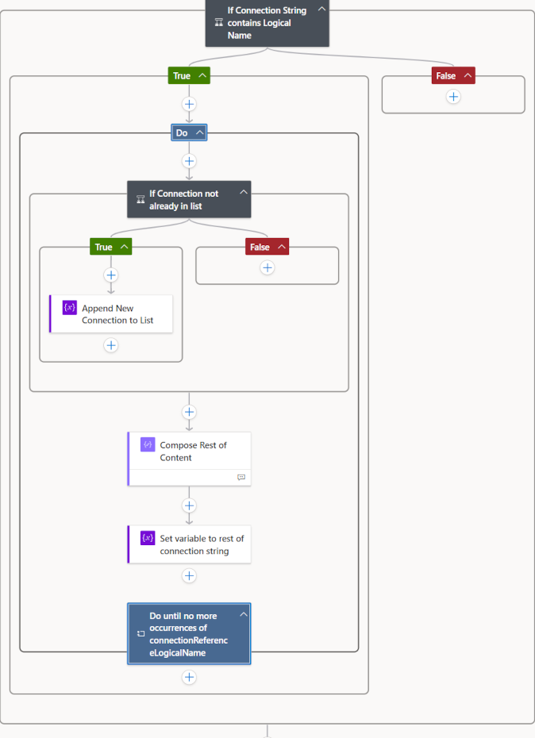
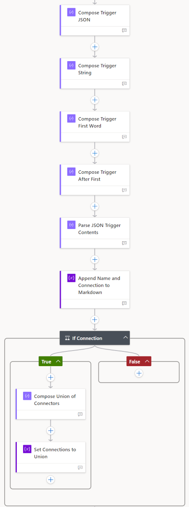
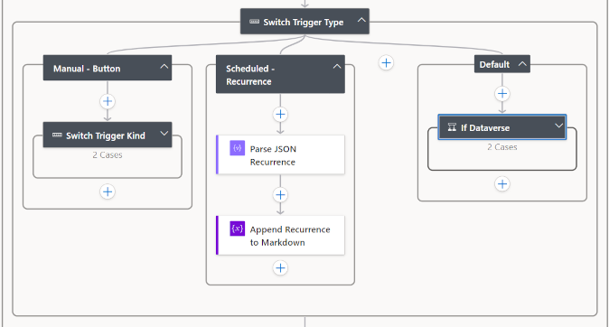
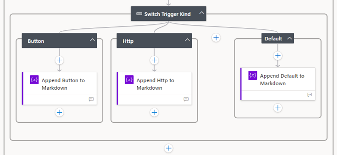

## TL;DR

Would it be helpful to have a list of all the flows in your environment and some basic details? Do you want to know which flow sends an email with a specific title?

This two-part blog series will guide you through using low-code Power Automate cloud flows to analyse the flows in your environment and answer these questions. In the first part, we’ll explore the characteristics of flows, such as triggers and connectors. In the second part, we’ll identify all flows that result in emails being sent and list the email titles.

---

## Contents

- [TL;DR](#tldr)
- [Contents](#contents)
- [Flows as Dataverse Processes](#flows-as-dataverse-processes)
- [Flow Schema](#flow-schema)
  - [Top-level Schema](#top-level-schema)
  - [Connection References](#connection-references)
  - [Triggers](#triggers)
  - [Further Trigger Details](#further-trigger-details)
- [Taking it Further](#taking-it-further)
- [Download the Flow Solution](#download-the-flow-solution)

---

## Flows as Dataverse Processes

Flows are stored in Dataverse in the **process (workflow) table**, just like business rules and business process flows. Whilst some information on flows are available using Power Automate Management connector, it is relatively limited and details such as the triggers aren't available.

The schema for processes, concentrating on the columns relevant to flows that are available via FetchXML in a flow, is:

|Column|Description|
|--|--|
|Category|The category of the process. 0 for Workflows, 2 for Business Rules, 5 for Modern Flow (Cloud Flow).|
|Client Data|The business logic of the process in text format. For flows, this is JSON stored as a text string.|
|Description|The description of the process entered by the authors.|
|Name|The name of the process.|
|Scope|The scope of the process: User, Business Unit, Parent: Child Business Units, or Organization.|
|Status Reason|The status of the process: Draft, Activated, or Suspended.|
|WorkflowId|The unique identifier of the process, which is consistent across environments when deployed.|
|WorkflowIdUnique|The unique identifier of the process in the current environment, which can be used in a URL to open the flow in the editor.|

Flow steps are stored in the Client Data column as 'stringified' JSON. This string contains the JSON without any new lines and with ‘\’ characters around any invalid characters. Here are the first few characters of the Client Data for a flow:

```text
"{\"properties\":{\"connectionReferences\":{\"shared_sharepointonline\":{\"runtimeSource\":\"embedded\",...
```

## Flow Schema

To enable the flow to work with the contents of the Client Data, it's natural to parse the text and convert it into a JSON object.

Microsoft's schema for flows is https://schema.management.azure.com/providers/Microsoft.Logic/schemas/2016-06-01/workflowdefinition.json#. However, this schema defines the patterns that flows must conform to and includes the flexibility for connectors to add their own triggers and actions.  The JSON schema used for flow `parse JSON` steps, on the other hand, needs to have a fixed format.

### Top-level Schema

Instead of using the complete Microsoft JSON schema, we can use just the top-level schema with the detailed lower-level contents remaining as strings rather than structured JSON objects:

``` JSON
{
  "definition": {
    "type": "object",
    "properties": {
      "$schema": {
        "type": "string"
      },
      "contentVersion": {
        "type": "string"
      },
      "parameters": {
        "type": "object",
        "properties": {
          "$connections": {
            "type": "object",
            "properties": {
              "defaultValue": {
                "type": "object",
                "properties": {}
              },
              "type": {
                "type": "string"
              }
            }
          }
        }
      },
      "triggers": {
        "type": "object",
        "properties": {
          "defaultValue": {
            "type": "object",
            "properties": {}
          },
          "type": {
            "type": "string"
          }
        }
      },
      "actions": {
        "type": "object",
        "properties": {
          "defaultValue": {
            "type": "object",
            "properties": {}
          },
          "type": {
            "type": "string"
          }
        }
      }
    }
  },
  "templateName": {
    "type": "string"
  },
  "type": "object",
  "properties": {
    "properties": {
      "type": "object",
      "properties": {
        "connectionReferences": {
          "type": "object"
        }
      }
    }
  }
}
```

This can then be used to extract a range of information through a flow step such the **Parse JSON Client Data** in the image below, with:

```shell
items('Apply_to_each_Flow')?['clientdata']
```

This flow step converts the top level of the flow Client Data to a JSON object that can be used to extract the details we want to include in the summary.

### Connection References

The first area we'll look at are the Connection References. These can be extracted from the parsed Client Data using the following flow steps:



The final step in the above, **Set ConnectionStr**, is as follows (see `connectionReferences` in the JSON above):

```shell
body('Parse_JSON_Client_Data')?['properties']?['connectionReferences']
```

The variable set in **Set ConnectionStr** - `varConnectionStr` - then contains a string such as:

```text
{"shared_sharepointonline":{"runtimeSource":"embedded","connection":  
{"connectionReferenceLogicalName":"soln_sharedsharepointonline_34ba4"},"api":{"  
name":"shared_sharepointonline"}},  
"shared_sharepointonline_1":{"runtimeSource":"embedded","connection":  
{"connectionReferenceLogicalName":"soln_sharedsharepointonline_6ae5e"},"api":{"  
name":"shared_sharepointonline"}}}
```

We need to extract the string(s) after <span style = "color:red">connectionReferenceLogicalName":"</span> through to <span style = "color:purple">"},"api"</span>:

&emsp;{"shared_sharepointonline":{"runtimeSource":"embedded","connection":  
&emsp;{"<span style="color:red">connectionReferenceLogicalName</span>":"<span style="color:black">**soln_sharedsharepointonline_34ba4**</span><span style = "color:purple">"},"api":{"</span>  
&emsp;name":"shared_sharepointonline"}},  
&emsp;"shared_sharepointonline_1":{"runtimeSource":"embedded","connection":  
&emsp;{"<span style = "color:red">connectionReferenceLogicalName</span>":"<span style = "color:black">**soln_sharedsharepointonline_6ae5e**</span><span style = "color:purple">"},"api":{"</span>  
&emsp;name":"shared_sharepointonline"}}}

To do this, we need to use a text expression to extract the string with the connection reference name:

<span style = "color:blue">substring(  
&emsp;<span style = "color:green">variables('varConnectionStr')</span>,  
&emsp;<span style = "color:orange">add(33,  
&emsp;&emsp;<span style = "color:turquoise">indexOf(<span style = "color:green">variables('varConnectionStr')</span>,'<span style = "color:red">connectionReferenceLogicalName</span>')</span>)</span>,  
&emsp;<span style = "color:magenta">sub(<span style = "color:turquoise">indexOf(<span style = "color:green">variables('varConnectionStr')</span>,'<span style = "color:purple">"},"api"</span>')</span>,  
&emsp;&emsp;<span style = "color:orange">add(33,  
&emsp;&emsp;&emsp;<span style = "color:turquoise">indexOf(<span style = "color:green">variables('varConnectionStr')</span>,'<span style = "color:red">connectionReferenceLogicalName</span>')</span>)</span>)</span>)</span>

<!--
substring(  
&emsp;variables('varConnectionStr'),  
&emsp;add(33,  
&emsp;&emsp;indexOf(variables('varConnectionStr'),'connectionReferenceLogicalName')),  
&emsp;sub(indexOf(variables('varConnectionStr'),'"},"api"'),  
&emsp;&emsp;add(33,  
&emsp;&emsp;&emsp;indexOfvariables('varConnectionStr'),'connectionReferenceLogicalName'))))
-->

Adding comments into this:

<span style = "color:blue">substring( &emsp;&emsp;<span style = "color:black">// return a section of the string, in this case, the name of the  
&emsp;&emsp;&emsp;&emsp;&emsp;&emsp;&emsp;// connection reference</span>  
&emsp;<span style = "color:green">variables('varConnectionStr')</span>,&emsp; <span style = "color:black">// the full string we want to pull the section from</span>  
&emsp;<span style = "color:orange">add(33, &emsp;&emsp;<span style = "color:black">// the starting point of the string we want,  
&emsp;&emsp;&emsp;&emsp;&emsp;&emsp;&emsp;// adding 33, the length of 'connectionReferenceLogicalName":"'</span>  
&emsp;&emsp;<span style = "color:turquoise">indexOf(<span style = "color:green">variables('varConnectionStr')</span>,'<span style = "color:red">connectionReferenceLogicalName</span>')</span>)</span>, &emsp;<span style = "color:black">  
&emsp;&emsp;&emsp;&emsp;&emsp;&emsp;&emsp;//  position of the initial character of the first occurance of  
&emsp;&emsp;&emsp;&emsp;&emsp;&emsp;&emsp;// 'connectionReferenceLogicalName' in the full string</span>  
&emsp;<span style = "color:magenta">sub(<span style = "color:turquoise">indexOf(<span style = "color:green">variables('varConnectionStr')</span>,'<span style = "color:purple">"},"api"</span>')</span>, &emsp;<span style = "color:black">// length of return string  
&emsp;&emsp;&emsp;&emsp;&emsp;&emsp;&emsp;// = subtract from the position of "},"api",  
&emsp;&emsp;&emsp;&emsp;&emsp;&emsp;&emsp;// the starting point of the string we want</span>  
&emsp;&emsp;<span style = "color:orange">add(33,  
&emsp;&emsp;&emsp;<span style = "color:turquoise">indexOf(<span style = "color:green">variables('varConnectionStr')</span>,'<span style = "color:red">connectionReferenceLogicalName</span>')</span>)</span>)</span>)</span>

This will extract the first connection reference name.

To extract all the connection references, we need a Do Until loop:



**If Connection String contains Logical Name**: this condition is needed to shortcut the Do Until if there are no connection references. The variable is `varConnectionStr`.

**Do**:

- **If Connection not already in list**: this condition checks whether the connection reference is already in the list found so far. The substring expression is the one above.

  - **Append New Connection to List**: this add the Connection to an array variable.

- **Compose Rest of Content** and **Set variable to rest of connection string**: updates `varConnectionStr` to the text after the latest Connection Reference

**Until**: there are no Connection References in the remaining string

The Do Until loop extracts all the connection references in the JSON into an array variable.

********

### Triggers

To extract the trigger details, we need to perform a combination of text operations and JSON parsing. The following are the steps involved (although in general [Compose steps are discouraged](https://dev.to/wyattdave/power-automate-using-compose-the-right-way-4o14), the complexity of the string manipulation made this necessary):



Where:

**Compose Trigger JSON** extracts the Trigger part of the JSON as an object:

```shell
body('Parse_JSON_Client_Data')?['properties']?['definition']?['triggers']
```

**Compose Trigger String** converts the trigger to a string:

```shell
string(outputs('Compose_Trigger_JSON'))
```

**Compose Trigger First Word** extracts the first word from the trigger body - the name of the trigger step:

```shell
substring(outputs('Compose_Trigger_String'),
  add(indexOf(outputs('Compose_Trigger_String'),'\"'),1),
    sub(nthIndexOf(outputs('Compose_Trigger_String'),'\"',2),
      add(indexOf(outputs('Compose_Trigger_String'),'\"'),1))
)
```

**Compose Trigger After First** is used to extract valid JSON from a string by removing the starting and ending parts of the string:

```Shell
substring(outputs('Compose_Trigger_String'),
  add(nthIndexOf(outputs('Compose_Trigger_String'),'\"',2),2),
    sub(length(outputs('Compose_Trigger_String')),
      add(nthIndexOf(outputs('Compose_Trigger_String'),'\"',2),3))
)
```

**Parse JSON Trigger Contents** then parses this into a JSON object that can be used in the subsequent steps:

```shell
outputs('Compose_Trigger_After_First')
```

The parse uses the schema that provides the properties needed for the Markdown content:

```JSON
{
    "type": "object",
    "properties": {
        "metadata": {
            "type": "object",
            "properties": {
                "operationMetadataId": {
                    "type": "string"
                }
            }
        },
        "type": {
            "type": "string"
        },
        "kind": {
            "type": "string"
        }
    }
}
```

`type` and `kind` are used in the flow's type-specific steps later in the process - see [Further Trigger Details](#further-trigger-details).

**Append Name and Connection to Markdown** appends the string contents to the vMarkdownStr variable, including converting the connections used from an array into text separated by commas:

```shell
join(variables('varConnectionsThisFlow'),', ')
```

An example of the outputs are:

```Text
## Parse Flows to Markdown

|Setting|Value|
|--|--|
|Scope|Organization|
|Run As|Calling User|
|Owner|Alex McLachlan|
|Status|Activated|
|Connection(s)|amcl_DataverseAMcL|
```

Which gives a level 2 heading with the name of the flow and a table with the details:

|Setting|Value|
|--|--|
|Scope|Organization|
|Run As|Calling User|
|Owner|Alex McLachlan|
|Status|Activated|
|Connection(s)|amcl_DataverseAMcL|

The connections for the current flow are then added to the array of connections in the **If Connection** steps.

### Further Trigger Details

Further information can be extracted from the trigger, but varies with the different `type` of the flow - instant, scheduled, and automated - and the `kind`, such as `button` and `http`.



**Switch Trigger Kind** expands to:



The different types have different schema structures. For example, the scheduled (recurrence) flow has schema which includes `frequency`, `interval` and `startTime`:

```JSON
{
    "type": "object",
    "properties": {
        "recurrence": {
            "type": "object",
            "properties": {
                "frequency": {
                    "type": "string"
                },
                "interval": {
                    "type": "integer"
                },
                "startTime": {
                    "type": "string"
                }
            }
        },
        "metadata": {
            "type": "object",
            "properties": {
                "operationMetadataId": {
                    "type": "string"
                }
            }
        },
        "type": {
            "type": "string"
        }
    }
}
```

Separating these different types enables different information to be extracted for the different trigger types, such as whether the instant/button flow could be a child flow because it has a response step:

|Setting|Value|
|--|--|
|Type|Instant/Button - Child Flow (has Response step)|

For automated flows, information about the table and filter can be included:

|Setting|Value|
|--|--|
|Type|Automated (OpenApiConnectionWebhook)|
|Filter Name|Case Decision is being Appealed|
|Table Name|incident|
|Filtering Columns|statuscode|
|Filter Expression|(statuscode eq 700000029) or (statuscode eq 700000032)|

And for scheduled flows, details of the schedule:

|Setting|Value|
|--|--|
|Type|Scheduled (Recurrence)|
|Frequency|Month|
|Interval|1|
|Start Time|2023-04-01T03:00:00Z|

---

## Taking it Further

In addition to listing information about the flows, the following types of advice can be included:

- If the flow lacks a description
- If there are no filtering columns
- If the deprecated Dataverse connector is being used

---

## Download the Flow Solution

You can find the solution with the flow on GitHub at https://github.com/alex-mcla/ProcessDocumentationFlow. The final step in the flow is a Compose step that retrieves the Markdown contents, which can be pasted into a Markdown file, such as an Azure Wiki page.

The solution is unmanaged, allowing you to customise it to your needs, especially if you want to extract additional information or cover additional trigger types. If you encounter any issues, have comments, or suggestions for improvement, please raise an issue on GitHub."
