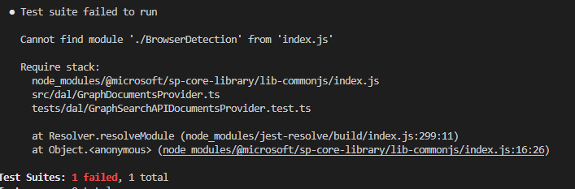

## Introduction and base concepts

Contrary to popular belief I don't think unit testing is easy. To be honest, unit testing in SharePoint world is even more difficult than any other.
Going even further - unit testing SPFx is extremely challenging. If You have ever tried to write unit tests in Your SPFx project I'm sure You can share my opinion.
The constant stream of enigmatic exceptions can successfully discourage from pursuing the concept all together.

There are some great resources on the topic online, but the problem with them is that they outdate quite quickly. Moreover SPFx changes each version which requires You to understand how the unit tests are working to be able to correctly maintain them.

### Isolation

The most important thing we have to bear in mind is that SPFx was never meant to run on node but in the browser. This renders to be quite a problem as we want to run our tests using node with isolation. By extension, we have to assume, **we won't be able to run any SPFx code during our unit tests**. This might be an issue but let's remember unit tests by definition should be executed in isolation and it is a common practice to avoid testing 3rd party code (which in our case is SPFx).

In this article we will not discuss unit testing React components. As component testing is quite a topic on it's own I would like to address it in a separate post. This means we will focus here only on testing our business logic and data manipulation.

### Test first or test after

In general I highly recommend writing Your tests before You write Your code. This will allow You to notice false positives (especially important in async tests). I will try to show You techniques You can use to obtain mock data before running Your code in actual environment and mock specific aspects of SPFx context. Also I think it's easier to introduce unit tests to existing solution by adding new, testable features, rather then refactoring existing ones. Having said that, TDD is difficult and nuanced technique so writing tests after the code is very often valid option (especially during exploratory development).

### ACEs and extensions

The sample I'm going to showcase here is based on a SPFx Web Part, however the same concept applies to every other SPFx extensibility point.

### Sample itself

I will follow a sample I created some time ago. It's a simple web part showing some documents based on MS Graph API Search. [Repo](https://github.com/mgwojciech/unit-test-samples/tree/main/doc-card)

## Unit testing with jest

Jest is most popular unit testing framework for javascript. It's flexible, robust and fast. I think it's a best solution we can pick.

### Initial setup
To install it and other dependencies we are going to need, let's open a terminal in our SPFx project location and run

```
npm i -D @types/jest @types/chai chai identity-obj-proxy jest ts-jest
```

With this command we will add jest and types for jest (our unit testing framework), chai and types form chai (assertion library), identity-obj-proxy - great helper method to simplify mocking and ts-jest - typescript helper library for jest.

Now we can define jest minimal configuration in our `package.json` file

``` JSON
    ...,
    "jest": {
        "transform": {
            "^.+\\.(ts|tsx)$": "ts-jest"
        },
        "testRegex": "(/__tests__/.*|(\\.|/)(test|spec))\\.(ts?|tsx?)$",
        "moduleFileExtensions": [
            "ts",
            "tsx",
            "js",
            "json"
        ],
        "moduleNameMapper": {
            "\\.(css|scss)$": "identity-obj-proxy",
        }
    }
  ...
```

What is happening here is

 * Transforming ts and tsx files using ts-jest - effectively we add support for typescript in our unit tests
 * testRegex - we basically define what files we will consider as a unit test file
 * moduleFileExtensions - we define what files are considered modules in our solution. I would consider it optional, unless You are using some .js files in the solution. The order matters so we want to give typescript files priority over javascript files and jest defaults to js over ts.
 * moduleNameMapper - module names we want to stub. This will be the most important configuration entry for us as it's the easiest way to "ignore" SPFx dependencies. Here we just say we don't want to deal with css nor scss files in our tests, so every time they are requested just return requested object name.

 ### Class we will test

 As I mentioned before in this post we will focus only on data access layer and data manipulation, so what we want to test is if our class to call MS Graph API will correctly construct the search query and map returned object to our document.

 #### Mock and Test

 Let's start by building and testing the query. The easiest way to do that is to use [Graph explorer](https://developer.microsoft.com/en-us/graph/graph-explorer). Here we can fine tune our query and get the response we expect from the endpoint.
 Once we are ready I recommend replacing Your tenant name with test, so You won't leak any information about Your tenant. Let's say we want to have a class called GraphDocumentsProvider. Now let's write out test class.

 ```
 ///<reference types="jest" />

import { assert } from "chai";
import { GraphDocumentsProvider } from "../../src/dal/GraphDocumentsProvider";

describe("GraphSearchAPIDocumentsProvider", () => {
    ...
})
 ```

 Now let's consider what our class will depend on. Easiest and most common way to consume MS Graph API in SPFx is msGraphClient. As I mentioned before, implementation provided by MS in @microsoft/sp-http module will not work. We have to assume this will work correctly at runtime as this class is provided by MS and already tested by them, so want we want to do is mock msGraphClient with something we control. In our case all we need to do is mock Graph post request to search api. Let's do that.

 ```
        test("should map graph result", async () => {
        let graphClient = {
            api: () => ({
                post: () => Promise.resolve({
                    "@odata.context": "https://graph.microsoft.com/v1.0/$metadata#Collection(microsoft.graph.searchResponse)",
                    "value": [
                        {
                            "searchTerms": [
                                "1"
                            ],
                            "hitsContainers": [
                                {
                                    "total": 69,
                                    "moreResultsAvailable": true,
                                    "hits": [
                                        {
                                            "hitId": "C98242A9-9339-4858-A455-B37232D9C8E9",
                                            "rank": 1,
                                            "summary": "Name Age Sex Race Doe, John 20 Male White Doe, Jane 30 Female Black Doe, Jack 40 Male Asian Name Age Sex Race Doe, John 20 Male White Doe, Jane 30 Female Black Doe, Jack 40 Male<ddd/>",
                                            "resource": {
                                                "@odata.type": "#microsoft.graph.listItem",
                                                "id": "C98242A9-9339-4858-A455-B37232D9C8E9",
                                                "fields": {
                                                    "id": "AAAAAIkiHflS_vFHuOAAQXIIxBoHANNh6pZbjHZPr2k17NOLnogAAAAAAWMAANNh6pZbjHZPr2k17NOLnogAAcMKe5wAAA2",
                                                    "contentclass": "STS_ListItem_DocumentLibrary",
                                                    "title": "Test excel",
                                                    "path": "https://test.sharepoint.com/sites/dev/Deals/Test/Test excel.xlsx"
                                                }
                                            }
                                        },
                                        {
                                            "hitId": "B1FD20A8-92AD-4F98-A69F-56879E4C06ED",
                                            "rank": 2,
                                            "summary": "Header 1 Header 2 Cell 11 Cell12 Cell 21 Cell 22<ddd/>1 0 {B1FD20A8-92AD<ddd/>",
                                            "resource": {
                                                "@odata.type": "#microsoft.graph.listItem",
                                                "id": "B1FD20A8-92AD-4F98-A69F-56879E4C06ED",
                                                "fields": {
                                                    "id": "AAAAAIkiHflS_vFHuOAAQXIIxBoHANNh6pZbjHZPr2k17NOLnogAAAAAAWMAANNh6pZbjHZPr2k17NOLnogAAAAAgWMAAA2",
                                                    "contentclass": "STS_ListItem_DocumentLibrary",
                                                    "title": "1",
                                                    "path": "https://test.sharepoint.com/sites/dev/Shared Documents/test.xlsx"
                                                }
                                            }
                                        }
                                    ]
                                }
                            ]
                        }
                    ]
                })
            })
        }

        const expectedResult = [{
            id: "C98242A9-9339-4858-A455-B37232D9C8E9",
            title: "Test excel",
            url: "https://test.sharepoint.com/sites/dev/Deals/Test/Test excel.xlsx"
        }, {
            id: "B1FD20A8-92AD-4F98-A69F-56879E4C06ED",
            title: "1",
            url: "https://test.sharepoint.com/sites/dev/Shared Documents/test.xlsx"
        }];

        let dataProvider = new GraphDocumentsProvider(graphClient as any);

        let data = await dataProvider.getDocuments();

        assert.deepEqual(data, expectedResult);
 ```

 Note Your data can be different.

#### Class implementation

 Now that we have our test let's go ahead and implement our class.

 ```
 export class GraphDocumentsProvider implements IDocumentsProvider {

    constructor(protected msGraphClient: MSGraphClient) {

    }
    public async getDocuments(): Promise<IDocument[]> {
        try {
            let searchResult = await this.msGraphClient.api("https://graph.microsoft.com/v1.0/search/query").post({
                "requests": [
                    {
                        "entityTypes": [
                            "listItem"
                        ],
                        "query": {
                            "queryString": "IsDocument:1 -*.aspx -.mht"
                        },
                        "from": 0,
                        "size": 5,
                        "fields": [
                            "id",
                            "name",
                            "contentclass",
                            "title",
                            "path"
                        ]
                    }
                ]
            });
            if (searchResult.value[0]) {
                return searchResult.value[0].hitsContainers[0].hits.map(hit => ({
                    id: hit.resource.id,
                    title: hit.resource.fields.title,
                    url: hit.resource.fields.path
                }));
            }
        }
        catch (err) {
            Log.error("GraphDocumentsProvider.getDocuments", err);
            throw err;
        }
    }
}
 ```

### First run

 Now we can run our test running npx jest. There is an exception though

 

 This will be a common issue during our testing. What is happening here is jest is trying to load the sp-core-library dependency at runtime however jest can load only commonjs dependencies. In this particular case the underlying problem is that MS does not include commonjs versions of their libraries in npm, which means the requested modules are physically not there.

> Starting SPFx 1.13 I've noticed there are some SPFx libraries with commonjs version. In most cases I would still recommend mocking them in tests for better control.

In our class we use sp-core-library for logging, so let's define a test suite level mock for it, to avoid loading the actual dependency.

 ```
var logCallback: (name, error) => void;
jest.mock("@microsoft/sp-core-library", () => ({
    Log: {
        error: (name, err) => logCallback && logCallback(name, err)
    }
}))

describe("GraphSearchAPIDocumentsProvider", () => {
    ...
    });

 ```

Now running npx jest will run our test.
In the repository You will find two more tests in that test suite. One to validate the query to MS Graph API and one to validate error handling. At this time I see no reason to give them more focus as they should be self explanatory now.

##Outro

In my experience, the biggest issue was always going through the "Cannot find module" exception. In the future it's possible You will encounter the same message from different packages (@microsoft/sp-http for example). Should You run into it in Your code base, just remember You can always mock or simply stub it.

If You have any more questions about unit testing SPFx don't hesitate to reach out to me.

Please let me know if You would like to see more on this topic.

Thank You for reading and have a great day!
