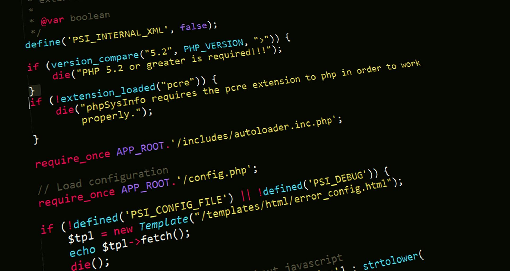

In the Microsoft 365 and PnP developer community, we’ve always relied heavily on **snippets**—whether it’s a handy PnP PowerShell script, a JSON formatting example for lists, or boilerplate for SPFx web parts. Snippets are fast, reliable, and easy to reuse.  

But today, there’s a new player in town: **GitHub Copilot**, an AI assistant that suggests code in real time as you type. Instead of searching GitHub or docs for that perfect snippet, Copilot tries to write it for you on the fly.  

So which approach works best? Let’s compare.

---

## Traditional Snippets: Tried and True

Snippets are **pre-written, reusable pieces of code**—often shared in community repos, documentation, or even private libraries within teams.  

**Why developers love them:**  
- ✅ **Reliable** – they’ve been tested and validated by the community or your team.  
- ✅ **Shareable** – easy to document, publish, and distribute.  
- ✅ **Great for standards** – everyone uses the same approved pattern.  

**Where snippets fall short:**  
- ❌ They’re **static** – not tailored to your current project.  
- ❌ You often need to **search, copy, and adapt**.  
- ❌ They may not cover **edge cases** you’re facing.  

For example, if you need a PowerShell script to add a site collection app catalog, the [PnP community samples](https://pnp.github.io/) already have it. But if you need something more custom—like chaining it with a Teams provisioning workflow—you’ll probably end up piecing together multiple snippets.

---

## GitHub Copilot: AI on the Fly

GitHub Copilot takes a different approach. Instead of browsing for a snippet, you type a comment like:

\`\`\`javascript
// Create a new SharePoint list with columns for Title, Status, and DueDate
\`\`\`

…and Copilot generates a draft function right in your editor.

**Why developers love it:**  
- ✅ **Context-aware** – it reads your file, project, and even frameworks you’re using.  
- ✅ **Fast** – you stay in flow, no need to leave your IDE.  
- ✅ **Exploratory** – it suggests APIs or patterns you might not know.  

**But there are catches:**  
- ❌ **Not always accurate** – sometimes it “hallucinates” APIs that don’t exist.  
- ❌ **May introduce anti-patterns** if you trust it blindly.  
- ❌ **Governance is harder** – hard to enforce coding standards if every dev gets a different suggestion.  

Used well, Copilot feels like pair-programming with someone who’s read all of GitHub—but you still need to review their work.

---

## Side-by-Side Comparison

| **Aspect**             | **Traditional Snippets**                  | **GitHub Copilot**                 |  
|-------------------------|-------------------------------------------|-------------------------------------|  
| Reliability             | High – community validated                | Variable – requires review          |  
| Speed                   | Slower – search, copy, adapt              | Faster – inline suggestions         |  
| Context Awareness       | None – generic code                       | High – adapts to your project       |  
| Learning Value          | High – you study complete examples        | Medium – good for exploration       |  
| Governance & Standards  | Easy – curated repos, reviews             | Harder – needs strong guidelines    |  

---

## Best of Both Worlds

The truth is, this isn’t an **either/or** choice. The most effective workflow combines both approaches:

1. **Prototype with Copilot** → Let AI give you a first draft.  
2. **Validate with snippets** → Cross-check against PnP samples or docs.  
3. **Finalize and standardize** → Save the best result as a new snippet for your team.  

That way, you benefit from **Copilot’s speed** and **snippets’ reliability**.

---

## Conclusion

GitHub Copilot isn’t here to replace snippets—it’s here to **augment them**. Snippets remain the foundation for reliable, governed solutions in the PnP ecosystem. Copilot accelerates experimentation and helps fill the gaps.  

Together, they create a powerful developer experience: AI for speed, community for trust.  

👉 How do you use Copilot vs. snippets in your workflow? Share your experiences with the PnP community—we’d love to learn from you!  
