SharePoint's built-in list forms are fine for simple data entry, but they fall apart the moment you need conditional logic, calculated fields, or multi-step workflows. InfoPath has been deprecated for years. Power Apps works, but requires additional licensing that many organizations aren't ready to absorb — especially when you just need better forms on a SharePoint list.

I wanted something that lived entirely within SharePoint, required zero extra licenses, and let non-developers build sophisticated forms through a visual interface. So I built one as an SPFx web part.

This article walks through the architecture of [FormsFX](https://forms.wolffcreative.com), the key technical challenges I solved along the way, and the patterns that might be useful in your own SPFx projects.

## Architecture at a glance

The solution has two modes packed into a single web part. In **edit mode**, site owners drag and drop fields, configure rules, and design their form layout. In **display mode**, end users fill out and submit forms. Both modes render from the same underlying data structure.

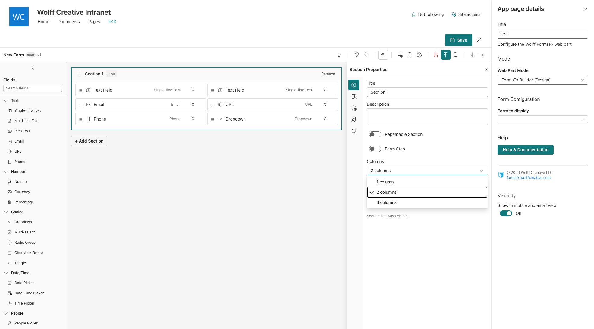

The web part operates in three modes, selectable from the property pane:

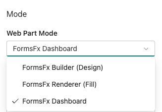

The data flow is straightforward:

```
Builder UI  →  Form Definition (JSON)  →  SharePoint List  →  Renderer UI
                                                              ↓
                                                         Submissions → SP List
```

Form definitions are stored as JSON in a SharePoint list called `FormDefinitions`. When a user submits a form, the renderer auto-provisions a submissions list based on the form's field schema using PnPjs and writes the response there.

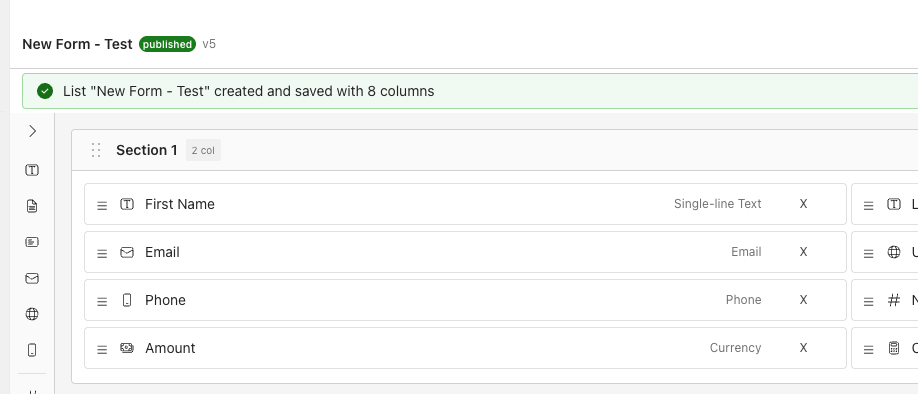

### Tech stack choices

| Layer | Choice | Why |
|-------|--------|-----|
| Framework | SPFx 1.22 (Heft toolchain) | Native SharePoint integration, no extra infrastructure |
| UI | React 17 + Fluent UI v9 | SPFx constraint on React version, Fluent for native look and feel |
| Form state | React Hook Form + Zod | Performant uncontrolled inputs, schema-based validation |
| Drag and drop | dnd-kit | Lightweight, accessible, works well inside SPFx shadow DOM |
| Data access | PnPjs v4 | Type-safe SharePoint REST and Graph API calls |

React Hook Form was a critical choice. With forms that can have 50+ fields across multiple sections, controlled components with `useState` per field cause noticeable lag. React Hook Form uses uncontrolled inputs with refs, so re-renders only happen where values actually change.

### Multi-column layouts

The builder supports 1, 2, and 3-column section layouts. Fields flow left-to-right and can be reordered across columns with drag-and-drop.

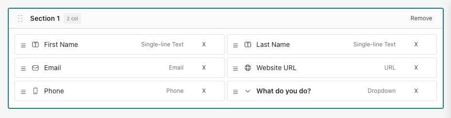

## The rules engine

The rules engine is the heart of the system. It enables form authors to create dynamic behavior without writing code — things like showing a "Notes" field only when the status is "Active", or making an approval field required when the request amount exceeds a threshold.

### Rule model

Each rule consists of three parts: a **trigger** that determines when the rule fires, **condition groups** that define the logic, and **actions** that describe what happens.

```typescript
interface IRule {
  id: string;
  name: string;
  enabled: boolean;
  trigger: 'fieldChange' | 'formLoad' | 'beforeSubmit';
  conditionLogic: 'and' | 'or';  // top-level group logic
  conditionGroups: IConditionGroup[];
  actions: IRuleAction[];
}
```

Condition groups support nested AND/OR logic. A rule might say: show the discount field if (quantity > 10 **AND** customer is verified) **OR** (customer type equals "VIP"). The top-level `conditionLogic` combines groups, while each group's internal `logic` combines its conditions.

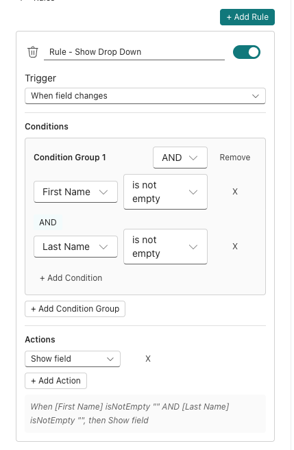

Actions include `show`, `hide`, `setRequired`, `clearRequired`, `setValue`, `setOptions`, `validate`, `setReadOnly`, and `clearReadOnly` — covering the most common dynamic form behaviors.

### Dependency ordering with topological sort

Here's where things get interesting. When rules reference other rule-affected fields, evaluation order matters. If Rule A sets a field's value and Rule B uses that field in a condition, Rule A must run first.

The engine builds a dependency graph and applies **Kahn's algorithm** (topological sort) to determine the correct order:

```
1. Scan all rules and calculated fields for dependencies
2. Build a directed graph: field A depends on field B
3. Find all fields with zero dependencies (no incoming edges)
4. Process them first, then remove their edges
5. Repeat until all fields are ordered
```

This handles cascading dependencies automatically. A chain like "Department determines Manager options, Manager selection determines Approval Limit" evaluates in the right sequence every time.

### Immutable state output

Rather than imperatively manipulating form fields, the engine produces an immutable `FieldStatesMap` — a plain object mapping each field ID to its computed state:

```typescript
type FieldStatesMap = Record<string, {
  visible: boolean;
  required: boolean;
  readOnly: boolean;
  options?: { key: string; text: string }[];
  calculatedValue?: string | number | boolean;
}>;
```

React components simply read from this map. If `fieldStates['notes'].visible` is `false`, the field doesn't render. This makes the system predictable, testable, and easy to debug.

## Safe formula evaluation

Form authors can create calculated fields with formulas like `{price} * {quantity} * 1.1` or `IF({score} > 80, "Pass", "Fail")`. The engine needs to evaluate these safely.

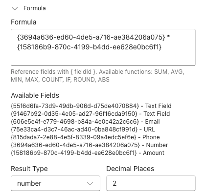

Using `eval()` is out of the question — it's a security risk, and SharePoint's Content Security Policy may block it entirely. Instead, I implemented the **shunting-yard algorithm**, originally described by Dijkstra, which converts infix expressions to postfix notation and evaluates them with a simple stack.

The formula engine:

1. **Resolves field references** — replaces `{fieldId}` tokens with actual form values
2. **Tokenizes** the expression into numbers, operators, functions, and parentheses
3. **Applies operator precedence** — multiplication and division before addition and subtraction
4. **Evaluates** using an output stack, returning a numeric or string result

Ten built-in functions cover common scenarios: `SUM`, `AVG`, `MIN`, `MAX`, `COUNT`, `ABS`, `ROUND`, `FLOOR`, `CEIL`, and `IF`. String concatenation uses the `&` operator, following the Excel convention that SharePoint users are familiar with.

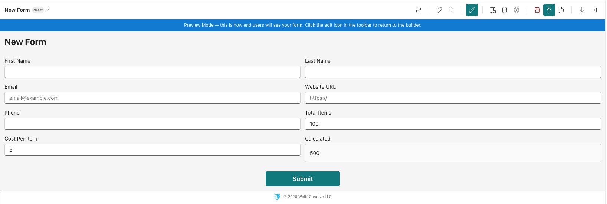

The engine returns `#ERROR` for invalid expressions rather than throwing — so a misconfigured formula doesn't crash the entire form.

## Dynamic validation with React Hook Form and Zod

Validation in a rules-driven form is tricky. A field might be optional by default but become required when a rule fires. The validation schema needs to react to the current rules engine output.

The solution: **regenerate the Zod schema on every validation pass** using the current `FieldStatesMap`.

```
Form values change
  → Rules engine evaluates (debounced 50ms)
  → FieldStatesMap updated
  → User blurs a field or submits
  → Zod schema generated from current field states
  → Validation runs against the dynamic schema
```

If the rules engine says a field is required, the generated Zod schema includes `.min(1, "Required")` for that field. If the field is hidden, it's excluded from validation entirely. This keeps rules and validation perfectly synchronized without manual wiring.

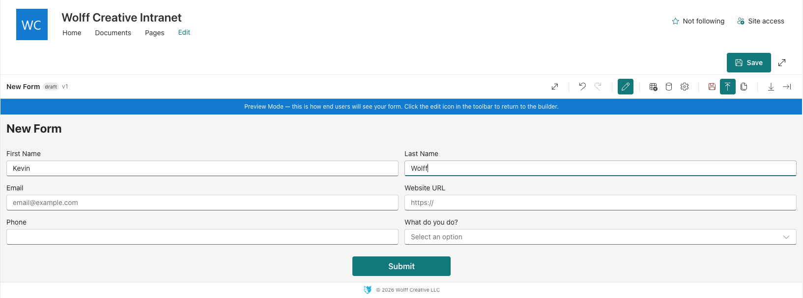

The 50ms debounce on rules evaluation prevents excessive processing during rapid typing while staying responsive enough that users see field visibility changes almost immediately.

## Beyond the basics

The rules engine and formula evaluator are the architectural core, but a production form builder needs much more. Here are some of the other capabilities that rounded out the solution:

**Drag-and-drop builder** — Form authors arrange fields and sections visually using dnd-kit. Fields can be reordered within sections, and sections themselves can be rearranged. The builder produces the JSON form definition that the renderer consumes.

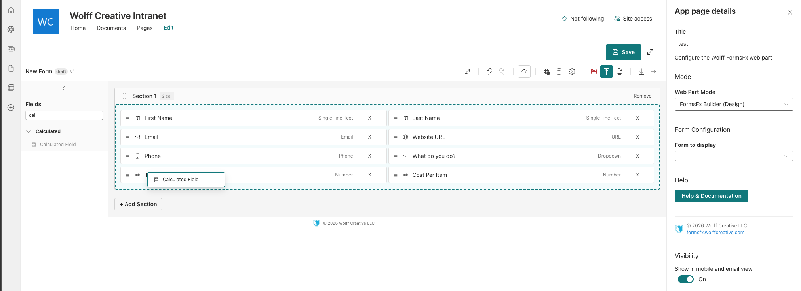

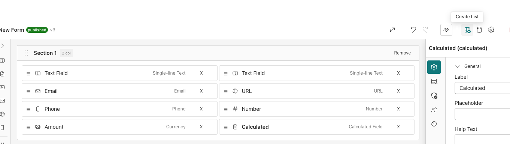

**Data sources** — Forms can connect to external SharePoint lists for dropdown options, cascading filters, and data lookups.

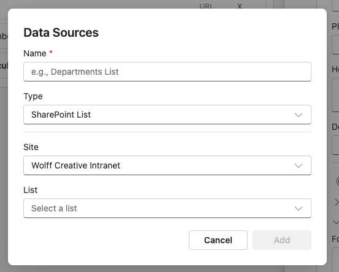

**Offline submission queue** — If a user loses connectivity while submitting, the form queues the submission in browser storage and automatically retries when the connection is restored. This is especially useful for field workers on tablets.

**Cross-field validation** — Beyond single-field rules, the system supports validation that spans multiple fields using Zod's `superRefine`. For example: "End date must be after start date" or "At least one phone number field must be filled."

**Import and export** — Form definitions can be exported as JSON and imported into other sites. This lets teams share form templates across site collections without rebuilding from scratch.

**Submission workflow** — Submissions follow a status lifecycle: Draft, Submitted, Approved, and Rejected. Role-based permissions control who can approve or reject, and status changes are tracked in an audit log.

**Submissions dashboard** — Form owners can view all submissions in a searchable, sortable table with column selection, date filters, and bulk actions.

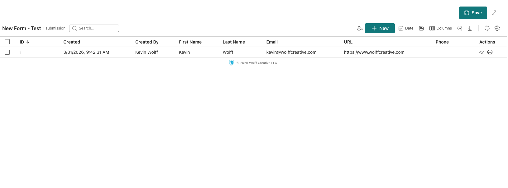

**View and print** — Individual submissions can be viewed in a read-only dialog and printed or saved as PDF.

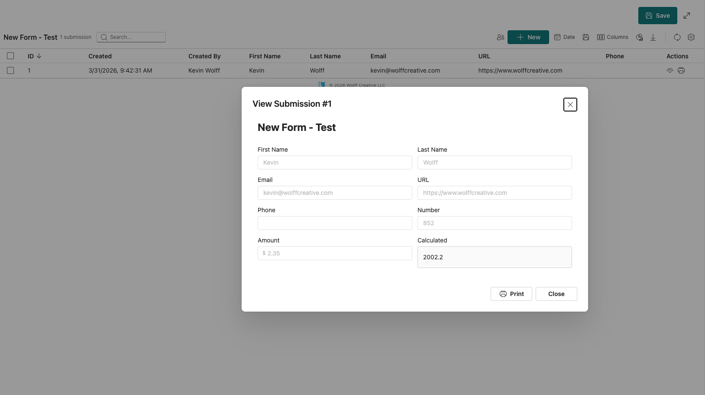

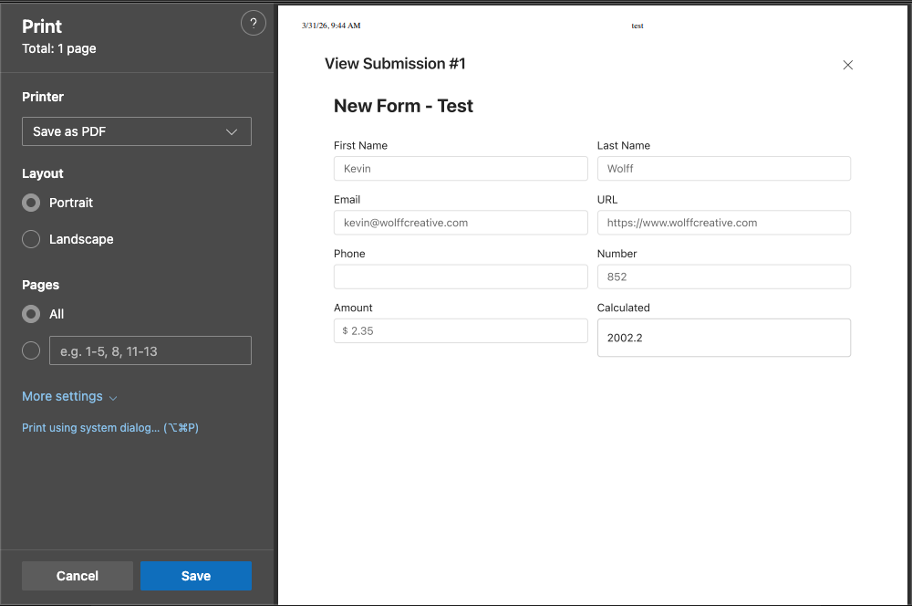

## Lessons learned along the way

**Fluent UI v9 portals in SPFx require extra work.** Components like Tooltip, Dropdown listboxes, and Dialog mount their portals on `document.body`, which sits outside the FluentProvider's DOM tree. The theme CSS variables don't cascade there. The fix: inject the Fluent theme tokens as CSS custom properties on the `:root` element via a `<style>` tag so portals inherit the correct theme regardless of where they mount.

**SharePoint throttles aggressively.** Any production SPFx solution that makes multiple REST calls needs retry logic with exponential backoff. I wrapped all PnPjs calls in a retry utility that handles 429 and 503 responses, which eliminated the intermittent failures that plagued early testing.

**Test everything.** The project has 372 tests across 16 suites covering the rules engine, formula engine, dependency graph, schema generation, and key UI components. The rules engine alone has dozens of edge cases — nested condition groups, circular dependencies, rules that fire on form load vs. field change — and automated tests caught regressions that manual testing would have missed.

## Try it out

FormsFX is available as an SPFx solution package (.sppkg) that you install through the SharePoint app catalog — no Azure infrastructure, no extra licenses, no Power Platform dependencies.

The **free tier** includes 10 fields, 2 sections, and 3 forms — enough to evaluate whether it fits your needs. **Pro** and **Enterprise** tiers unlock unlimited forms, URL prefill, webhooks, and more.

You can download the package and learn more at [forms.wolffcreative.com](https://forms.wolffcreative.com).

If you have questions about the architecture or want to discuss the patterns covered in this article, feel free to reach out on [LinkedIn](https://www.linkedin.com/in/wkwolff/) or through the contact form on the site.
