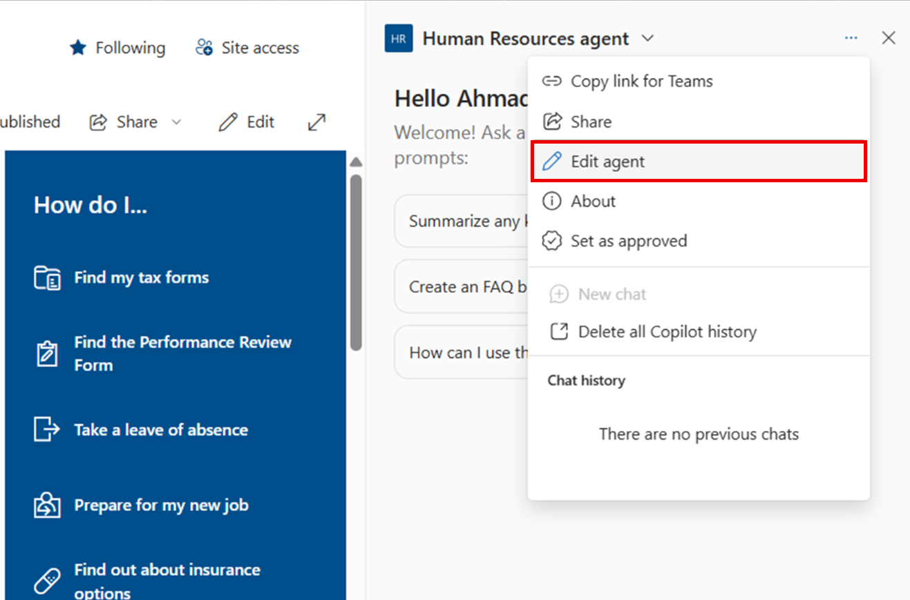
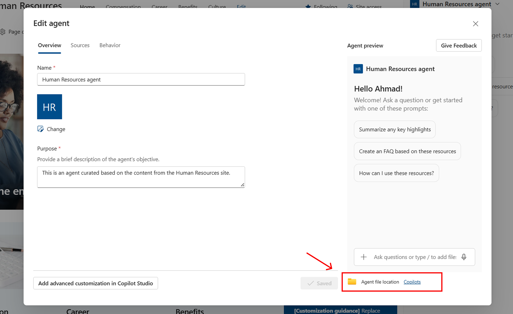
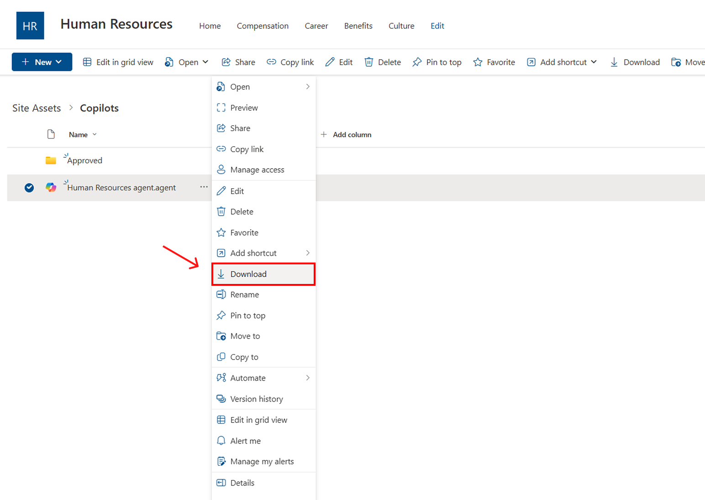
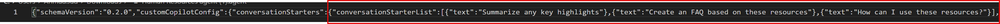
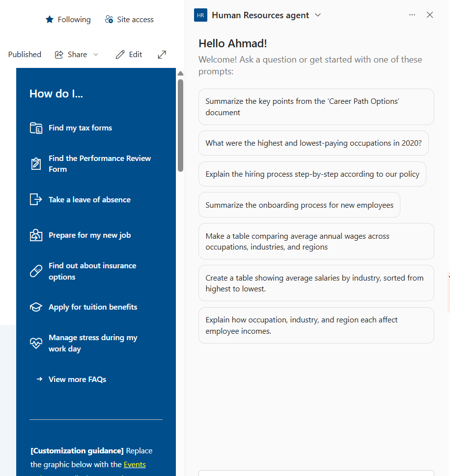

If you’ve been using or experimenting with **SharePoint Copilot Agents**, you’ve probably run into a frustrating limitation: you can only set **three starter prompts**.

Three prompts might be fine for a simple use case, but if you want your agent to guide users through multiple workflows, roles, or topics, it can feel *very* limiting..

In this post, we’ll explore **why this cap exists** and share **practical workarounds** that let you give users richer guidance — all without breaking Microsoft’s rules.

### **Why Starter Prompts Matter**

Starter prompts are the clickable suggestions that appear the moment someone opens a Copilot Agent in SharePoint. They’re far more than decorative placeholders. Well-crafted prompts can:

* Encourage first-time users to try the agent.
    
* Demonstrate the agent’s range and capabilities.
    
* Reduce “blank screen” hesitation by showing people where to start.
    


### **The Current Limitation**

it also means:

* Complex agents require tough choices about which prompts to show.
    
* Many great ideas never make the cut.
    
* New users might miss out on valuable features hidden behind the scenes.
    

### The Workaround: Step-by-Step

Here’s how to go beyond three prompts while keeping the UI clean and functional.

### Step 1 – Edit the Agent in the UI

Open your SharePoint site, go to your Copilot agent panel, click the **three-dot menu** in the top right, and select **Edit agent**.

This brings you to the edit view, where you can rename your agent, update its description, or change the icon.



### Step 2 – Access the Copilot File Location

In the **edit view**, click the **folder icon** next to **Agent file location**.  
This opens the SharePoint document library location where your Copilot’s `.agent` file is stored.

From there, you can **take ownership** of the file if necessary and prepare to download it for editing.



### Step 3 – Download the Agent File

Inside your SharePoint document library, navigate to:  
`Site Assets > Copilots`

Locate your `.agent` file, open the menu, and select **Download**. This file contains the configuration for your agent.



### Step 4 – Edit the .agent File to Add More Prompts

Open the `.agent` file in a text editor (such as VS Code).  
Look for the section that starts with:



By default, you’ll see three prompt objects like this:

```json

"conversationStarters": {
  "conversationStarterList": [
    { "text": "Summarize any key highlights" },
    { "text": "Create an FAQ based on these resources" },
    { "text": "How can I use these resources?" }
  ]
}
```

Add more prompt objects following the same format:

```json
"conversationStarters": {
  "conversationStarterList": [
    { "text": "Summarize the key points from the ‘Career Path Options’ document" },
    { "text": "What were the highest and lowest-paying occupations in 2020?" },
    { "text": "Explain the hiring process step-by-step according to our policy" },
    { "text": "Summarize the onboarding process for new employees" },
    { "text": "Make a table comparing average annual wages across occupations, industries, and regions" },
    { "text": "Create a table showing average salaries by industry, sorted from highest to lowest." },
    { "text": "Explain how occupation, industry, and region each affect employee incomes." }
  ]
}
```

Save your changes.

### Step 5 – Re-upload the Agent File

Go back to your SharePoint library, upload the edited `.agent` file, and overwrite the original.

Once updated, refresh your site. Your Copilot panel will now display **all the prompts you’ve added**—no more arbitrary three-prompt limit.



### A Few Caveats

* This is not an official feature — future Microsoft updates could change it.
    
* Effectiveness depends on whether users read the welcome message.
    

### Recommendations for Using This Solution

1. Document the JSON Changes – Keep a clear record of manual edits and store a backup of the original .agent file.
    
2. Version Control – Enable file version history in SharePoint so you can roll back if needed.
    
3. Test Across Scenarios – Confirm the prompts display correctly for all user roles.
    
4. Prioritize Prompts – Keep the most-used or high-impact actions at the top of the list.
    
5. Educate Users – Let people know they can type questions in addition to clicking prompts.
    

### Concerns to Be Aware Of

* Not Officially Supported – Microsoft updates may overwrite or block this change.
    
* Potential UI Clutter – Too many prompts can overwhelm users.
    
* Maintenance Overhead – You may need to reapply changes if the .agent file is regenerated.
    
* Security & Access – Only trusted admins should handle file edits.
    

---

Final Thoughts If your Copilot handles more than a handful of use cases, this quick change in the .agent file can massively improve its usefulness. With more prompts, you guide your users better, reduce typing, and speed up common workflows — all while keeping things organized.
