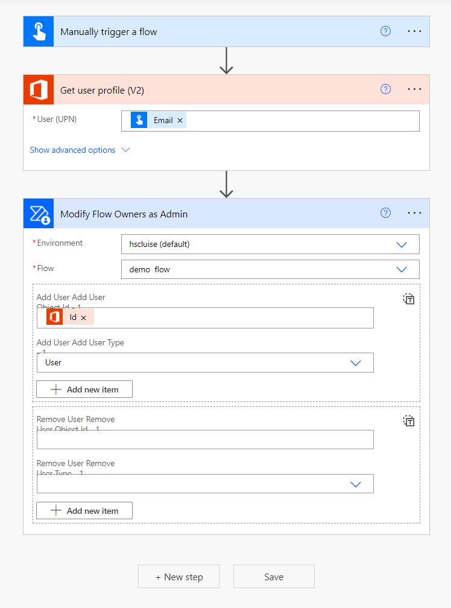
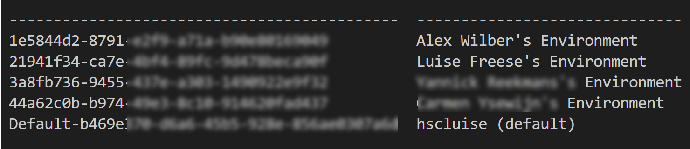
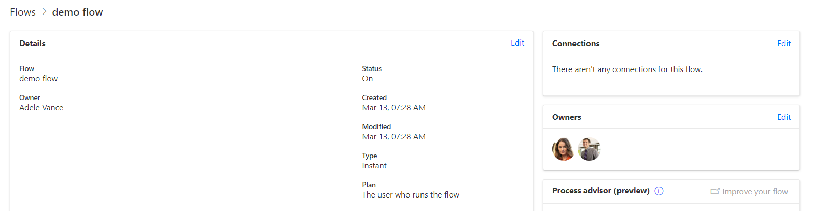

## tl;dr

Using CLI Microsoft 365 you can easily add and remove owners of a flow.

## Use Case

Let's say, someone in your organization created a super cool Power Automate flow, but over time, this flow needs to be adjusted. Unfortunately, this super cool person is either on a long leave, doesn't feel responsible anymore for that super cool flow after a nice promotion or left the organization. Too bad, that they were the only owner of that flow!

## How to solve this

### Power Automate

Of course there are many paths that lead to Rome: You could create a Power Automate flow to remove/add owners

which comes with the disadvantage, that you now need to manage this flow as well.

### CLI for Microsoft 365

There is some really cool way though to manage owners of Power Automate flows: CLI Microsoft 365! I blogged about this awesome tool already quite a lot:

* [Get started with CLI Microsoft 365 for Power Platform people](https://www.m365princess.com/blogs/cli-microsoft-365-power-platform/)
* [How to add Azure AD directory extensions](https://www.m365princess.com/blogs/azure-ad-directory-extensions/)
* [5 commands to try in CLI for Microsoft 365 to fall in love with it](https://www.m365princess.com/blogs/2021-03-11-5-commands-to-try-in-cli-for-microsoft-365-to-fall-in-love-with-it/)
* [How to get started with CLI Microsoft 365 and Adaptive Cards](https://www.m365princess.com/blogs/2021-02-17-how-to-get-started-with-cli-microsoft-365-and-adaptive-cards/)

In their latest release [v6.4.0.(beta)](https://pnp.github.io/cli-microsoft365/about/release-notes/#v640-beta) they introduced 3 new commands for Power Automate:

* `flow owner add`
* `flow owner list`
* `flow owner remove`

which massively help with those typical _Ooops we locked ourselves out of this crucial flow_ situations.

To benefit from these new commands, you need to first install the beta version with `npm i -g @pnp/cli-microsoft365@next`. After that is completed, have a look at the docs to see which information you will need to provide to [add or remove an owner](https://pnp.github.io/cli-microsoft365/cmd/flow/owner/owner-ensure):

* `environmentName`
* `flowName`

To get these, we can again leverage the Power of CLI for Microsoft 365 with the command: `m365 flow environment list -o text` - which gives us a nice uncluttered overview on the environments:

Now let's list the flows with

`m365 flow list --environmentName Default-b469xxxx-xxxx-xxxx-xxxx-xxxxxxxxxxx --asAdmin -o text` so that we get the `flowName`

With these 2 properties `environmentName` and `flowName` we will now feed the `m365 flow owner add` or `m365 flow owner remove` command:

`m365 flow owner add -e Default-b469xxxx-xxxx-xxxx-xxxx-xxxxxxxxxxx -f xxxxxxxx-xxxx-xxxx-xxxx-f7621ad284de --userName "alexw@myDomain.onmicrosoft.com" --roleName CanEdit --asAdmin`

and/or

`m365 flow owner remove --userName adelev@myDomain.onmicrosoft.com -e Default-b469xxxx-xxxx-xxxx-xxxx-xxxxxxxxxxx -f Default-b469xxxx-xxxx-xxxx-xxxx-xxxxxxxxxxx --asAdmin`

you can check the result with

`m365 flow owner list --environmentName Default-b469e370-d6a6-45b5-928e-856ae0307a6d -f e6a2fbef-910a-4d53-ae8b-f7621ad284de  --asAdmin -o text`

or - if you assigned yourself as a new owner - even see it in the UI at [make.powerautomate.com](https://make.powerautomate.com):

## Some thoughts on governance

Well, some admonishing index finger ideas:

Please ensure proper governance for Power Platform - mission critical processes shouldn't run in the context of a user who can always leave the organization. At least make sure, you have a 2nd owner to those flows - with CLI Microsoft 365, you can even automate this.

## What's next?

Well, as I love how CLI MIcrosoft 365 also enables us to manage Power Platform as well, I would be super interested in adding/removing owners from Power Apps as well?
