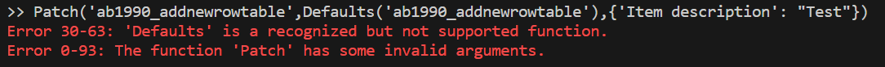

## What is pac power-fx :grey_question:

[Pac power-fx](https://learn.microsoft.com/en-us/power-platform/developer/cli/reference/power-fx) is command-line interface (CLI) allowing to work with Dataverse data by using Power Fx low-code programming language. Supports [one hundred thirty-four functions](https://learn.microsoft.com/en-us/power-platform/developer/cli/reference/power-fx#help) known from Power Apps development.

Commands can be executed by using:
- pac power-fx repl - to run instructions one by one from command line directly,
- pac power-fx run - to run scripts.


## How to install library and configure connection :computer:

:one: [Install CLI using Power Platform Tools for Visual Studio Code](https://learn.microsoft.com/en-us/power-platform/developer/cli/introduction#install-using-power-platform-tools-for-visual-studio-code),<br>:two: Run [pac auth create -env](https://learn.microsoft.com/en-us/power-platform/developer/cli/reference/auth#environment-create) command to create and store authentication profile on the computer:
```
pac auth create -env "org********.crm4.dynamics.com"
```
:three: Create folder with .txt file,<Br>:four: Write your instructions in .txt file,<Br>:five: In terminal [change directory (cd)](https://learn.microsoft.com/en-us/windows-server/administration/windows-commands/cd) to the one with script and run: 
```
pac power-fx run --file [NAME OF YOUR FILE].txt --echo
```

>Pac power-fx can be run also in PowerShell. All steps remain the same, except of installing Power Platform tools for Visual Studio Code in first step - [Power Platform CLI for Windows](https://learn.microsoft.com/en-us/power-platform/developer/cli/introduction#install-power-platform-cli-for-windows) should be installed instead.
## Adding new record to table :clipboard:
Typically, when we work with Power Fx in Power Apps we have four options how we can submit new record:
- Patch,
- SubmitForm,
- Calling Power Automate workflow with parameters,
- Using custom connectors.

Patch function in pac power-fx is supported, but Defaults function is not delivered, which results in error when we run this command:



Next three options don't fit the CLI, however there is one way how we can do it.

To add new record we have to use <em>Collect</em> function:
```
Collect(
    [NAME OF THE TABLE],
    {
        [FIELD 1 NAME]:[FIELD 1 VALUE],
        [FIELD 2 NAME]:[FIELD 2 VALUE]
    }
)
```
Let's take a look, how most common data types behave, when we use pac power-fx.

<em>Single line of text and primary column</em>
```
Collect(
    'ab1990_addnewrowtable',
    {
        //primary column
        'Item description': "Test",
        'Single line of text_Text': "Test2",
        'Single line of text_Email': "fake_email@abc.onmicrosoft.com",
        'Single line of text_Phone number':"44-003-0455-45",
        'Single line of text_Rich text':"aaaa✨ b✨cc✨dddd eee✨ffff 🎄",
        'Single line of text_Text area': Concatenate("bbbb",Char(13),"aaaa")
    }
)
```
<em>Whole number, decimal, float, currency</em>
```
Collect(
    'ab1990_addnewrowtable',
    {
        'Whole number': 123,
        'Decimal': 5.34,
        'Float': 0.35465,
        'Currency_field': 34.556
    }
)
```
<em>Date and time, date</em>
```
Collect(
    'ab1990_addnewrowtable',
    {
        'Date and time': DateTime(2024,01,15,20,12,23),
        'Date': Date(2024,01,15)
    }
)
```
<em>Lookup</em>
```
Collect(
    'ab1990_addnewrowtable',
    {
         //Lookup by using primary column
        'Lookup_customer':LookUp('account','name'="A. Datum Corporation (sample)"),
        //Lookup by using record unique id to show GUID usage
        'Lookup_budget request table':LookUp('ab1990_budgetrequest','ab1990_budgetrequestid'=GUID("1bf12cd0-d292-ee11-be37-002248999338"))
    }
)
```
<em>Choice</em>
```
Collect(
    'ab1990_addnewrowtable',
    {
        'Choice_single selection': 'Choice_single selection (Add new row tables)'.A11,
        'Choice_multiple selection': ['Choice_multiple selection (Add new row tables)'.TT44,'Choice_multiple selection (Add new row tables)'.YY22]
    }
)
```

>Tips and Tricks #1: Due to the fact that text editor is not the most user friendly environment for writing lines of code, good practice is to write most of the code in Power Apps and copy it to .txt file.

>Tips and Tricks #2: Watch out for spaces in .txt file.

## Conclusion :notebook:
Pac power-fx open new doors in Dataverse data management, giving us another way how we can automate internal processes. Adding new records is just a scratch of possibilities and we can do much, much more. As of today, pac power-fx is on early stage of adaption and it requires time for being more mature and bug fixing, but definitely it is something which is worth to follow and have it on the list of Power Platform tools :smile:
